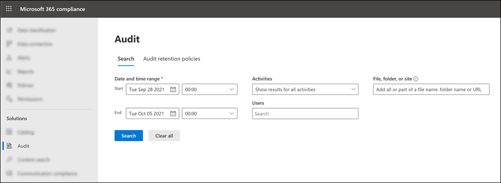
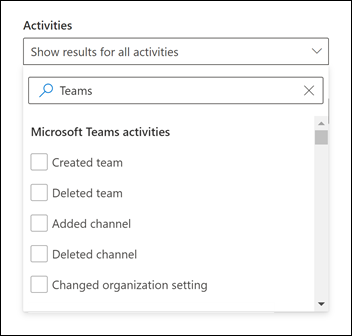
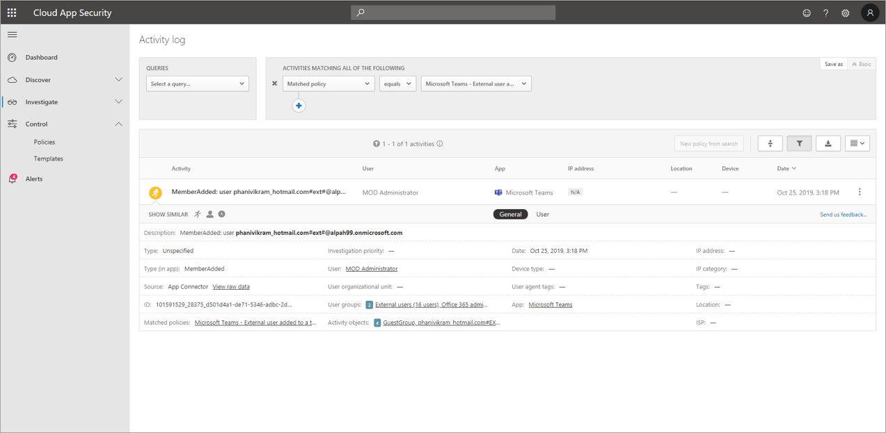
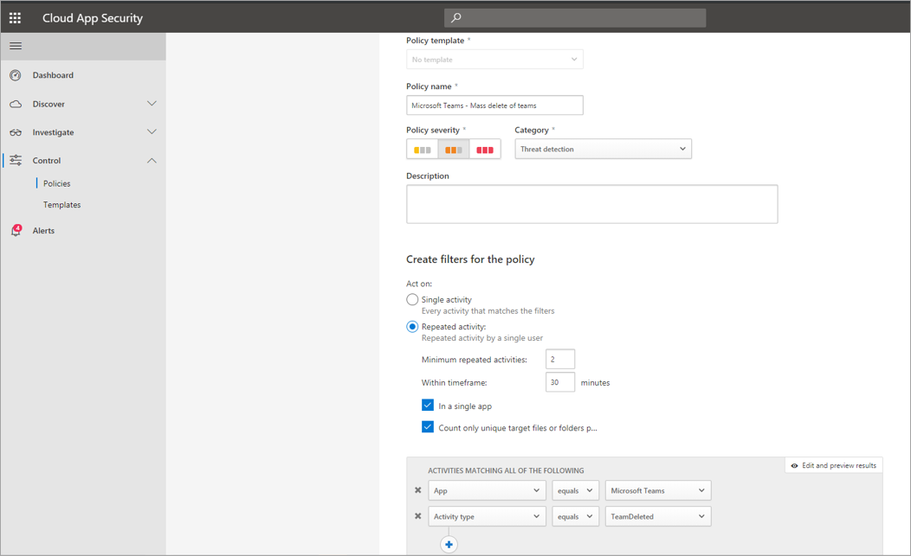
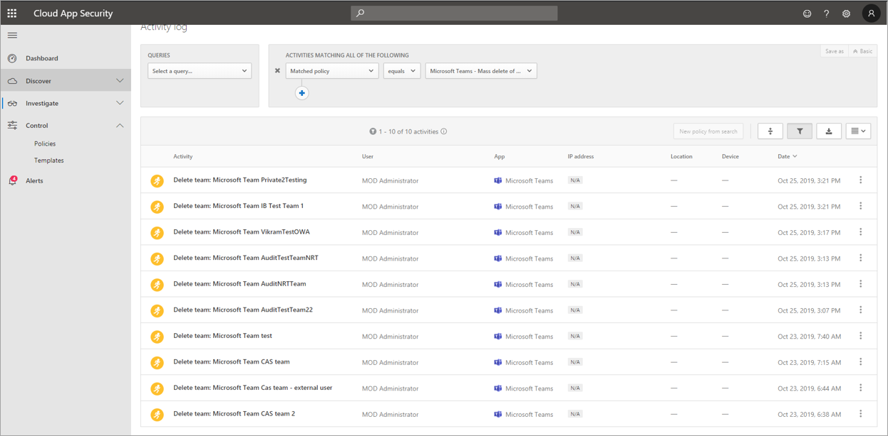
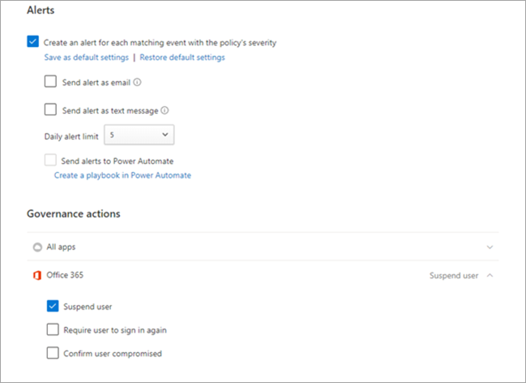

# Search the audit log for events in Microsoft Teams

> [!IMPORTANT]
> [!INCLUDE [new-teams-sfb-admin-center-notice](../includes/new-teams-sfb-admin-center-notice.md)]

The audit log can help you investigate specific activities across Microsoft 365 services. For Microsoft Teams, here are some of the activities that are audited:

- Team creation
- Team deletion
- Added channel
- Deleted channel
- Changed channel setting

For a complete list of Teams activities that are audited, see [Teams activities](#teams-activities) and [Shifts in Teams activities](#shifts-in-teams-activities).

> [!NOTE]
> Audit events from private channels are also logged as they are for teams and standard channels.

## Turn on auditing in Teams

Before you can look at audit data, you have to first turn on auditing in the Microsoft Purview compliance portal. For more information, see [Turn auditing on or off](turn-audit-log-search-on-or-off.md).

> [!IMPORTANT]
> Audit data is only available from the point at which you turned on auditing.

## Retrieve Teams data from the audit log

1. To retrieve audit logs for Teams activities, go to <https://compliance.microsoft.com> and select **Audit**.

2. On the **Search** page, filter the activities, dates, and users you want to audit.

3. Export your results to Excel for further analysis.

For step-by-step instructions, see [Search the audit log in the compliance portal](search-the-audit-log-in-security-and-compliance.md#search-the-audit-log).

> [!IMPORTANT]
> Audit data is only visible in the audit log if auditing is turned on.

The length of time that an audit record is retained and searchable in the audit log depends on your Microsoft 365 or Office 365 subscription, and specifically the type of license that's assigned to users. To learn more, see the [Security & Compliance Center service description](/office365/servicedescriptions/office-365-platform-service-description/office-365-securitycompliance-center).

## Tips for searching the audit log

Here are tips for searching for Teams activities in the audit log.

- You can select specific activities to search for by clicking the checkbox next to one or more activities. If an activity is selected, you can select it to cancel the selection. You can also use the search box to display the activities that contain the keyword that you type.

  

- To display events for activities run using cmdlets, select **Show results for all activities** in the **Activities** list. If you know the name of the operation for these activities, type it in the search box to display the activity, and then select it.

- To clear the current search criteria, select **Clear all**. The date range returns to the default of the last seven days.

- If 5,000 results are found, you can probably assume that there are more than 5,000 events that met the search criteria. You can refine the search criteria and rerun the search to return fewer results, or you can export all the search results by selecting **Export** > **Download all results**. For step-by-step instructions to export audit logs, see [Export the search results to a file](search-the-audit-log-in-security-and-compliance.md#step-3-export-the-search-results-to-a-file).

Check out [this video](https://www.youtube.com/embed/UBxaRySAxyE) for using audio log search. Join Ansuman Acharya, a program manager for Teams, as he demonstrates how to do an audit log search for Teams.

## Teams activities

Here's a list of all events that are logged for user and admin activities in Teams in the Microsoft 365 audit log. The table includes the friendly name that's displayed in the **Activities** column and the name of the corresponding operation that appears in the detailed information of an audit record and in the CSV file when you export the search results.

|**Friendly name**|**Operation**|**Description**|
|:----------------|:------------|:--------------|
|Added bot to team|BotAddedToTeam|A user adds a bot to a team.|
|Added channel|ChannelAdded|A user adds a channel to a team.|
|Added connector|ConnectorAdded|A user adds a connector to a channel.|
|Added details about Teams meeting 2|MeetingDetail|Teams added information about a meeting, including the start time, the end time, and the URL to join the meeting.|
|Added information about meeting participants 2|MeetingParticipantDetail|Teams added information about the participants of a meeting, including the user ID of each participant, the time a participant joined the meeting, and the time a participant left the meeting.|
|Added members|MemberAdded|A team owner adds members to a team, channel, or group chat.|
|Added tab|TabAdded|A user adds a tab to a channel.|
| Applied sensitivity label | SensitivityLabelApplied | A user or meeting organizer applied a sensitivity label to a Teams meeting. |
|Changed channel setting|ChannelSettingChanged|The ChannelSettingChanged operation is logged when the following activities are performed by a team member. For each of these activities, a description of the setting that was changed (shown in parentheses is displayed in the **Item** column in the audit log search results. <ul><li>Changes name of a team channel (**Channel name**)</li><li>Changes description of a team channel (**Channel description**)</li> </ul>|
|Changed organization setting|TeamsTenantSettingChanged|The TeamsTenantSettingChanged operation is logged when the following activities are performed by a global admin in the Microsoft 365 admin center. These activities affect org-wide Teams settings. To learn more, see [Manage Teams settings for your organization](/microsoftteams/enable-features-office-365).  For each of these activities, a description of the setting that was changed (shown in parentheses) is displayed in the **Item** column in the audit log search results.<ul><li>Enables or disables Teams for the organization (**Microsoft Teams**).</li><li>Enables or disables interoperability between Microsoft Teams and Skype for Business for the organization (**Skype for Business interoperability**).</li><li>Enables or disables the organizational chart view in Microsoft Teams clients (**Org chart view**).</li><li>Enables or disables the ability for team members to schedule private meetings (**Private meeting scheduling**).</li><li>Enables or disables the ability for team members to schedule channel meetings (**Channel meeting scheduling**).</li><li>Enables or disables video calling in Teams meetings (**Video for Skype meetings**).</li><li>Enables or disables screen sharing in Microsoft Teams meetups for the organization (**Screen sharing for Skype meetings**).</li><li>Enables or disables that ability to add animated images (called Giphys) to Teams conversations (**Animated images**).</li><li>Changes the content rating setting for the organization (**Content rating**). The content rating restricts the type of animated image that can be displayed in conversations.</li><li>Enables or disables the ability for team members to add customizable images (called custom memes) from the internet to team conversations (**Customizable images from the Internet**).</li><li>Enables or disables the ability for team members to add editable images (called stickers) to team conversations (**Editable images**).</li><li>Enables or disables that ability for team members to use bots in Microsoft Teams chats and channels (**Org-wide bots)**.</li><li>Enables specific bots for Microsoft Teams. This doesn't include the T-Bot, which is Teams help bot that's available when bots are enabled for the organization (**Individual bots**).</li><li>Enables or disables the ability for team members to add extensions or tabs (**Extensions or tabs**).</li><li>Enables or disables the side-loading of proprietary bots for Microsoft Teams (**Side loading of Bots**).</li><li>Enables or disables the ability for users to send email messages to a Microsoft Teams channel (**Channel email**).</li></ul>|
|Changed role of members in team|MemberRoleChanged|A team owner changes the role of members in a team. The following values indicate the role type assigned to the user.   **1** - Indicates the Member role. **2** -  Indicates the Owner role. **3** -  Indicates the Guest role.  The Members property also includes the name of your organization and the member's email address.|
|Changed team setting|TeamSettingChanged|The TeamSettingChanged operation is logged when the following activities are performed by a team owner. For each of these activities, a description of the setting that was changed (shown in parentheses) is displayed in the **Item** column in the audit log search results.<ul><li>Changes the access type for a team. Teams can be set as private or public (**Team access type**). When a team is private (the default setting), users can access the team only by invitation. When a team is public, it's discoverable by anyone.</li><li>Changes the information classification of a team (**Team classification**). For example, team data can be classified as high business impact, medium business impact, or low business impact.</li><li>Changes the name of a team (**Team name**).</li><li>Changes the team description (**Team description**).</li><li>Changes made to team settings. To access these settings,  a team owner can right-click a team, select **Manage team**, and then select the **Settings** tab. For these activities, the name of the setting that was changed is displayed in the **Item** column in the audit log search results.</li></ul>|
| Changed sensitivity label | SensitivityLabelChanged | A user changed a sensitivity label on a Teams meeting. |
|Created a chat 1,  2|ChatCreated|A Teams chat was created.|
|Created team|TeamCreated|A user creates a team.|
|Deleted a message 2|MessageDeleted|A message in a chat or channel was deleted.|
|Deleted all organization apps|DeletedAllOrganizationApps|Deleted all organization apps from the catalog.|
|Deleted app|AppDeletedFromCatalog|An app has been deleted from the catalog.|
|Deleted channel|ChannelDeleted|A user deletes a channel from a team.|
|Deleted team|TeamDeleted|A team owner deletes a team.|
|Edited a message with a URL link in Teams|MessageEditedHasLink|A user edits a message and adds a URL link to it in Teams.|
|Exported messages 1,  2|MessagesExported|Chat or channel messages were exported.|
|Failed to validate invitation to shared channel 3|FailedValidation|A user responds to an invitation to a shared channel but the invitation failed validation.|
|Fetched chat 1,  2|ChatRetrieved|A Microsoft Teams chat was retrieved.|
|Fetched all hosted content of a message1,  2|MessageHostedContentsListed|All hosted content in  a message, such as images or code snippets, was retrieved.|
|Installed app|AppInstalled|An app was installed.|
|Performed action on card|PerformedCardAction|A user took action on an adaptive card within a chat. Adaptive cards are typically used by bots to allow the rich display of information and interaction in chats.   **Note:** Only inline input actions on an adaptive card inside a chat will be available in the audit log. For example, when a user submits a poll response in a channel conversation on an adaptive card generated by a Poll bot. User actions such as "View result", which will open a dialog, or user actions inside dialogs won't be available in the audit log.|
|Posted a new message 1,  2|MessageSent|A new message was posted to a chat or channel.|
|Published app|AppPublishedToCatalog|An app was added to the catalog.|
|Read a message 1,  2|MessageRead|A message of a chat or channel was retrieved.|
|Read hosted content of a message 1,  2|MessageHostedContentRead|Hosted content in a message, such as an image or a code snippet, was retrieved.|
|Removed bot from team|BotRemovedFromTeam|A user removes a bot from a team.|
|Removed connector|ConnectorRemoved|A user removes a connector from a channel.|
|Removed members|MemberRemoved|A team owner removes members from a team, channel, or group chat.|
| Removed sensitivity label | SensitivityLabelRemoved | A user removed a sensitivity label from a Teams meeting. |
|Removed sharing of team channel 3|TerminatedSharing|A team or channel owner disabled sharing for a shared channel.|
|Restored sharing of team channel 3|SharingRestored|A team or channel owner re-enabled sharing for a shared channel.|
|Removed tab|TabRemoved|A user removes a tab from a channel.|
|Responded to invitation for shared channel 3|InviteeResponded|A user responded to a shared channel invitation.|
|Responded to invitee response to shared channel 3|ChannelOwnerResponded|A channel owner responded to a response from a user who responded to a shared channel invitation.|
|Retrieved messages 1,  2|MessagesListed|Messages from a chat or channel were retrieved.|
|Sent a message with a URL link in Teams|MessageCreatedHasLink|A user sends a message containing a URL link in Teams.|
|Sent change notification for message creation 1,  2|MessageCreatedNotification|A change notification was sent to notify a subscribed listener application of a new message.|
|Sent change notification for message deletion 1,  2|MessageDeletedNotification|A change notification was sent to notify a subscribed listener application of a deleted message.|
|Sent change notification for message update 1,  2|MessageUpdatedNotification|A change notification was sent to notify a subscribed listener application of an updated message.|
|Sent invitation for shared channel 3|InviteSent|A channel owner or member sends an invitation to a shared channel. Invitations to shared channels can be sent to people outside of your organization if the channel policy is configured to share the channel with external users.|
|Subscribed to message change notifications 1,  2|SubscribedToMessages|A subscription was created by a listener application to receive change notifications for messages.|
|Uninstalled app|AppUninstalled|An app was uninstalled.|
|Updated app|AppUpdatedInCatalog|An app was updated in the catalog.|
|Updated a chat 1,  2|ChatUpdated|A Teams chat was updated.|
|Updated a message 1,  2|MessageUpdated|A message of a chat or channel was updated.|
|Updated connector|ConnectorUpdated|A user modified a connector in a channel.|
|Updated tab|TabUpdated|A user modified a tab in a channel.|
|Upgraded app|AppUpgraded|An app was upgraded to its latest version in the catalog.|
|User signed in to Teams|TeamsSessionStarted|A user signs in to a Microsoft Teams client. This event doesn't capture token refresh activities.|
|Posted New Message 3,  4|MessageSent|A new message was posted to a chat or a channel. This event is a premium feature with licensing details to be defined.|

> [!NOTE]
> 1 An audit record for this event is only logged when the operation is performed by calling a Microsoft Graph API. If the operation is performed in the Teams client, an audit record will not be logged 2 This event is only available in Audit (Premium). That means users must be assigned the appropriate license before these events are logged in the audit log. For more information about activities only available in Audit (Premium), see [Audit (Premium) in Microsoft Purview](advanced-audit.md#advanced-audit-events). For Audit (Premium) licensing requirements, see [Auditing solutions in Microsoft 365](auditing-solutions-overview.md#licensing-requirements).   3 This event is in public preview.   4This event is generated for chat only if there are guests, federated and/or anonymous users.

## Shifts in Teams activities

**(in preview)**

If your organization is using the Shifts app in Teams, you can search the audit log for activities related to the Shifts app. Here's a list of all events that are logged for Shifts activities in Teams in the Microsoft 365 audit log.

|Friendly name|Operation|Description|
|---|---|---|
|Added scheduling group|ScheduleGroupAdded|A user successfully adds a new scheduling group to the schedule.|
|Edited scheduling group|ScheduleGroupEdited|A user successfully edits a scheduling group.|
|Deleted scheduling group|ScheduleGroupDeleted|A user successfully deletes a scheduling group from the schedule.|
|Withdrew schedule|ScheduleWithdrawn|A user successfully withdraws a published schedule.|
|Added shift|ShiftAdded|A user successfully adds a shift.|
|Edited shift|ShiftEdited|A user successfully edits a shift.|
|Deleted shift|ShiftDeleted|A user successfully deletes a shift.|
|Added time off|TimeOffAdded|A user successfully adds time off on the schedule.|
|Edited time off|TimeOffEdited|A user successfully edits time off.|
|Deleted time off|TimeOffDeleted|A user successfully deletes time off.|
|Added open shift|OpenShiftAdded|A user successfully adds an open shift to a scheduling group.|
|Edited open shift|OpenShiftEdited|A user successfully edits an open shift in a scheduling group.|
|Deleted open shift|OpenShiftDeleted|A user successfully deletes an open shift from a scheduling group.|
|Shared schedule|ScheduleShared|A user successfully shared a team schedule for a date range.|
|Clocked in using Time clock|ClockedIn|A user successfully clocks in using Time clock.|
|Clocked out using Time clock|ClockedOut|A user successfully clocks out using Time clock.|
|Started break using Time clock|BreakStarted|A user successfully starts a break during an active Time clock session.|
|Ended break using Time clock|BreakEnded|A user successfully ends a break during an active Time clock session.|
|Added Time clock entry|TimeClockEntryAdded|A user successfully adds a new manual Time clock entry on Time Sheet.|
|Edited Time clock entry|TimeClockEntryEdited|A user successfully edits a Time clock entry on Time Sheet.|
|Deleted Time clock entry|TimeClockEntryDeleted|A user successfully deletes a Time clock entry on Time Sheet.|
|Added shift request|RequestAdded|A user added a shift request.|
|Responded to shift request|RequestRespondedTo|A user responded to a shift request.|
|Canceled shift request|RequestCancelled|A user canceled a shift request.|
|Changed schedule setting|ScheduleSettingChanged|A user changes a setting in Shifts settings.|
|Added workforce integration|WorkforceIntegrationAdded|The Shifts app is integrated with a third-party system.|
|Accepted off shift message|OffShiftDialogAccepted|A user acknowledges the off-shift message to access Teams after shift hours.|

## Updates app in Teams activities

If your organization is using the Updates app in Teams, you can search the audit log for activities related to the Updates app. Here's a list of all events that are logged for Updates app activities in Teams in the Microsoft 365 audit log.

|Friendly name|Operation|Description|
|---|---|---|
|Create an update request|CreateUpdateRequest|A user successfully creates an update request.|
|Edit an update request|EditUpdateRequest|A user opens the request editing wizard and selects **Save** to confirm and save any changes, or enables or disables the update request directly.|
|Submit an update|SubmitUpdate|A user successfully submits an update.|
|View the details of one update|ViewUpdate|A user views the details of the update.|

## Office 365 Management Activity API

You can use the Office 365 Management Activity API to retrieve information about Teams events. To learn more about the  Management Activity API schema for Teams, see [Teams schema](/office/office-365-management-api/office-365-management-activity-api-schema#microsoft-teams-schema).

## Attribution in Teams audit logs

Membership changes to Teams (such as users added or deleted) made through Azure Active Directory (Azure AD), Microsoft 365 admin portal, or Microsoft 365 Groups Graph API will appear in Teams audit messages and in the General channel with an attribution to an existing owner of the team, and not to the actual initiator of the action. In these scenarios, consult Azure AD or [Microsoft 365 Group audit logs](search-the-audit-log-in-security-and-compliance.md) to see the relevant information.

## Use Defender for Cloud Apps to set activity policies

Using [Microsoft Defender for Cloud Apps](/cloud-app-security/what-is-cloud-app-security) integration, you can set [activity policies](/cloud-app-security/user-activity-policies) to enforce a wide range of automated processes using the app provider's APIs. These policies enable you to monitor specific activities carried out by various users, or follow unexpectedly high rates of one certain type of activity.

After you set an activity detection policy, it starts to generate alerts. Alerts are only generated on activities that occur after you create the policy. Here's some example scenarios for how you can use activity policies in Defender for Cloud Apps to monitor Teams activities.

### External user scenario

One scenario you might want to keep an eye on, from a business perspective, is the addition of external users to your Teams environment. If external users are enabled, monitoring their presence is a good idea.  You can use [Defender for Cloud Apps](/cloud-app-security/what-is-cloud-app-security) to identify potential threats.

The screenshot of this policy to monitor adding external users allows you to name the policy, set the severity according to your business needs, set it as (in this case) a single activity, and then establish the parameters that will specifically monitor only the addition of non-internal users, and limit this activity to Teams.

The results from this policy can be viewed in the activity log:

Here you can review matches to the policy you've set, and make any adjustments as needed, or export the results to use elsewhere.

### Mass delete scenario

As mentioned earlier, you can monitor deletion scenarios. It's possible to create a policy that would monitor mass deletion of Teams sites. In this example, an alert-based policy is set up to detect mass deletion of teams in a span of 30 minutes.

As the screenshot shows, you can set many different parameters for this policy to monitor Teams deletions, including severity, single or repeated action, and parameters limiting this to Teams and site deletion. This can be done independently of a template, or you may have a template created to base this policy on, depending on your organizational needs.

After you establish a policy that works for your business, you can review the results in the activity log as events are triggered:

You can filter down to the policy you've set to see the results of that policy. If the results you're getting in the activity log aren't satisfactory (maybe you're seeing lots of results, or nothing at all), this may help you to fine-tune the query to make it more relevant to what you need it to do.

### Alert and governance scenario

You can set alerts and send emails to admins and other users when an activity policy is triggered. You can set automated governance actions such as suspending a user or making a user to sign in again in an automated way. This example shows how a user account can be suspended when an activity policy is triggered and determines a user deleted two or more teams in 30 minutes.

## Use Defender for Cloud Apps to set anomaly detection policies

[Anomaly detection policies](/cloud-app-security/anomaly-detection-policy) in Defender for Cloud Apps provide out-of-the-box user and entity behavioral analytics (UEBA) and machine learning (ML) so that you can immediately run advanced threat detection across your cloud environment. Because they're automatically enabled, the new anomaly detection policies provide immediate results by providing immediate detections, targeting numerous behavioral anomalies across your users and the machines and devices connected to your network. Additionally, the new policies expose more data from the Defender for Cloud Apps detection engine, to help you speed up the investigation process and contain ongoing threats.

We're working to integrate Teams events into anomaly detection policies. For now, you can set up anomaly detection policies for other Office products and take action items on users who match those policies.

## Related articles

- [Search the audit log in the Microsoft Purview compliance portal](search-the-audit-log-in-security-and-compliance.md)
