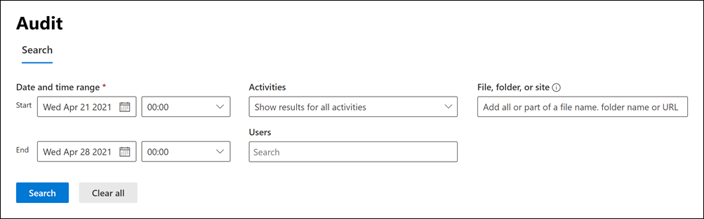
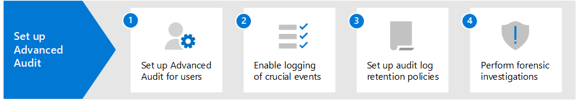

# Auditing solutions in Microsoft 365

Microsoft 365 auditing solutions provide an integrated solution to help organizations effectively respond to security events, forensic investigations, internal investigations, and compliance obligations. Thousands of user and admin operations performed in dozens of Microsoft 365 services and solutions are captured, recorded, and retained in your organization's unified audit log. Audit records for these events are searchable by security ops, IT admins, insider risk teams, and compliance and legal investigators in your organization. This capability provides visibility into the activities performed across your Microsoft 365 organization.

## Microsoft 365 auditing solutions

Microsoft 365 provides two auditing solutions: Basic Audit and Advanced Audit.

### Basic Audit

Basic Audit provides with you with the ability to log and search for audited activities and power your forensic, IT, compliance, and legal investigations.

- **Enabled by default**. Basic Audit is turned on by default for all organizations with the appropriate subscription. That means records for audited activities will be captured and searchable. The only setup that required is to assign the necessary permissions to access the audit log search tool (and the corresponding cmdlet) and make sure that user's are assigned the right license for Advanced Audit features.
- **Thousands of searchable audit events**. You can search for a wide-range of audited activities that occur is most of the Microsoft 365 services in your organization. For a partial list of the activities you can search for, see [Audited activities](search-the-audit-log-in-security-and-compliance.md#audited-activities). For a list of the services and features that support audited activities, see [Audit log record type](/office/office-365-management-api/office-365-management-activity-api-schema#auditlogrecordtype).
- **Audit search tool in the Microsoft 365 compliance center**. Use the Audit log search tool in the Microsoft 365 compliance center to search for audit records. You can search for specific activities, for activities performed by specific users, and activities that occurred with a date range. Here's a screenshot of the Audit search tool in the compliance center.

   

- **Search-UnifiedAuditLog cmdlet**. You can also use the **Search-UnifiedAuditLog** cmdlet in Exchange Online PowerShell (the underlying cmdlet for the search tool) to search for audit events or to use in a script. For more information, see:

  - [Search-UnifiedAuditLog cmdlet reference](/powershell/module/exchange/search-unifiedauditlog)
  - [Use a PowerShell script to search the audit log](audit-log-search-script.md)

- **Export audit records to a CSV file**. After running the Audit log search tool in the compliance center, you can export the audit records returned by the search to a CSV file. This lets you use Microsoft Excel sort and filter on different audit record properties. You can also use Excel Power Query transform functionality to split each property in the AuditData JSON object into its own column. This lets you effectively view and compare similar data for different events. For more information, see [Export, configure, and view audit log records](export-view-audit-log-records.md).

- **Access to audit logs via Office 365 Management Activity API**. A third method for accessing and retrieving audit records is to use the Office 365 Management Activity API. This lets organizations retain auditing data for longer periods than the default 90 days and lets them import their auditing data to a SIEM solution. For more information, see [Office 365 Management Activity API reference](/office/office-365-management-api/office-365-management-activity-api-reference).

- **90-day audit log retention**. When an audited activity is performed by a user or admin, an audit record is generated and stored in the audit log for your organization. In Basic Audit, records are retained for 90 days, which means you can search for activities that occurred within the past three months.

### Advanced Audit

Advanced Audit builds on the capabilities of Basic Audit by providing audit log retention policies, longer retention of audit records, high-value crucial events, and higher bandwidth access to the Office 365 Management Activity API.

- **Audit log retention policies**. You can create customized audit log retention policies to retain audit records for longer periods of time up to one year (and up to 10 years for users with required add-on license). You can create a policy to retain audit records based the service where the audited activities occur, specific audited activities, or the user who performs an audited activity.

- **Longer retention of audit records**. Exchange, SharePoint, and Azure Active Directory audit records are retained for one year by default. Audit records for all other activities are retained for 90 days by default, or you can use audit log retention policies to configure longer retention periods.

- **High-value, crucial events**. Audit records for crucial events can help your organization conduct forensic and compliance investigations by providing visibility to events such as when mail items were accessed, or when mail items were replied to and forwarded, or when and what a user searched for in Exchange Online and SharePoint Online. These crucial events can help you investigate possible breaches and determine the scope of compromise.

- **Higher bandwidth to the Office 365 Management Activity API**. Advanced Audit provides organizations with more bandwidth to access auditing logs through the Office 365 Management Activity API. Although all organizations (that have Basic Audit or Advanced Audit) are initially allocated a baseline of 2,000 requests per minute, this limit will dynamically increase depending on an organization's seat count and their licensing subscription. This results in organizations with Advanced Audit getting about twice the bandwidth as organizations with Basic Audit.

For more detailed information about Advanced Audit features, see [Advanced Audit in Microsoft 365](advanced-audit.md).

## Comparison of key capabilities

The following table compares the key capabilities available in Basic Audit and Advanced Audit. All Basic Audit functionality is included in Advanced Audit.

|Capability|Basic Audit|Advanced Audit|
|:------|:-------------|:-------------|
|Enabled by default|||
|Thousands of searchable audit events|||
|Audit search tool in the Microsoft 365 compliance center|||
|Search-UnifiedAuditLog cmdlet|||
|Export audit records to CSV file|||
|Access to audit logs via Office 365 Management Activity API 1|||
|90-day audit log retention|||
|1-year audit log retention|||
|10-year audit log retention 2|||
|Audit log retention policies|||
|High-value, crucial events|||
||||
> [!NOTE]
> 1 Advanced Audit includes higher bandwidth access to the Office 365 Management Activity API, which provides faster access to audit data. 2 In addition to the required licensing for Advanced Audit (described in the next section), a user must be assigned a 10-Year Audit Log Retention add on license to retain their audit records for 10 years.

## Licensing requirements

The following sections identify the licensing requirements for Basic Audit and Advanced Audit. Basic Audit functionality is included with Advanced Auditing.

### Basic Audit

- Microsoft 365 Enterprise E3 subscription
- Microsoft 365 Business Premium
- Microsoft 365 Education A3 subscription
- Microsoft 365 Government G3 subscription
- Microsoft 365 Government G1 subscription
- Office 365 Enterprise E3 subscription
- Office 365 Enterprise E1 subscription
- Office 365 Education A1 subscription
- Office 365 Education A3 subscription

### Advanced Audit

- Microsoft 365 Enterprise E5 subscription
- Microsoft 365 Enterprise E3 subscription + the Microsoft 365 E5 Compliance add-on
- Microsoft 365 Enterprise E3 subscription + the Microsoft 365 E5 eDiscovery and Audit add-on
- Microsoft 365 Education A5 subscription
- Microsoft 365 Education A3 subscription + the Microsoft 365 A5 Compliance add-on
- Microsoft 365 Education A3 subscription + the Microsoft 365 A5 eDiscovery and Audit add-on
- Microsoft 365 Government G5 subscription
- Microsoft 365 Government G5 subscription + the Microsoft 365 G5 Compliance add-on
- Microsoft 365 Government G5 subscription + the Microsoft 365 G5 eDiscovery and Audit add-on
- Office 365 Enterprise E5 subscription
- Office 365 Education A5 subscription
- Office 365 Enterprise E3 subscription + the Office 365 Advanced Compliance add-on (no longer available for new subscriptions)

## Set up Microsoft 365 auditing solutions

To get started using the auditing solutions in Microsoft 365, see the following setup guidance.

### Set up Basic Audit

The first step is to set up Basic Audit and then start running audit log searches.

1. Verify that your organization has a subscription that supports Basic Audit and if applicable, a subscription that supports Advanced Audit.

2. Assign permissions in Exchange Online to people in your organization who will use the audit log search tool in the Microsoft 365 compliance center or use the **Search-UnifiedAuditLog** cmdlet. Specifically, users must be assigned the View-Only Audit Logs or Audit Logs role in Exchange Online.

3. Search the audit log. After completing step 1 and step 2, users in your organization can use the audit log search tool (or corresponding cmdlet) to search for audited activities.

### Set up Advanced Audit

If your organization has a subscription that supports Advanced Audit, perform the following steps to set up and use the additional capabilities in Advanced Audit.

1. Set up Advanced Audit for users. This step consists of the following tasks:

   - Verifying that users are assigned the appropriate license or add-on license for Advanced Audit.
  
   - Turning on the Advanced Audit app/service plan must be for those users.
  
   - Enabling the auditing of crucial events and then turning on the Advanced Auditing app/service plan for those users.

2. Enable crucial events to be logged when users perform searches in Exchange Online and SharePoint Online.

3. Set up audit log retention policies. In additional to the default policy that retains Exchange, SharePoint, and Azure AD audit records for one year, you can create additional audit log retention policies to meet the requirements of your organization's security operations, IT, and compliance teams.

4. Search for crucial events and other activities when conducting forensic investigations. After completing step 1 and step 2, you can search the audit log for crucial events and other activities during forensic investigations of compromised accounts and other types of security or compliance investigations.

## Training

Training your security operations team, IT administrators, and compliance investigators team in Basic Audit and Advanced Audit can help your organization get started more quickly using auditing to help with your investigations. Microsoft 365 provides the following resource to help these users in your organization getting started with auditing: [Describe the audit capabilities in Microsoft 365](/learn/modules/describe-audit-capabilities-microsoft-365).
