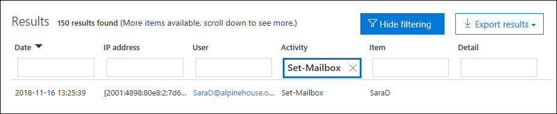
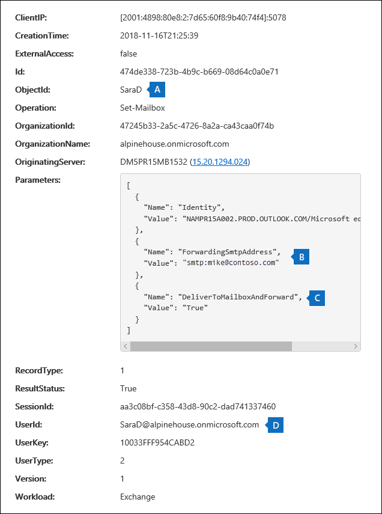
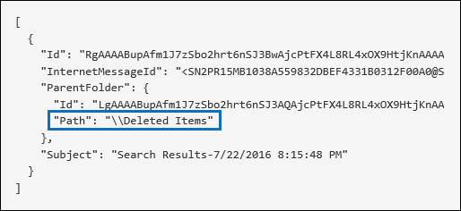
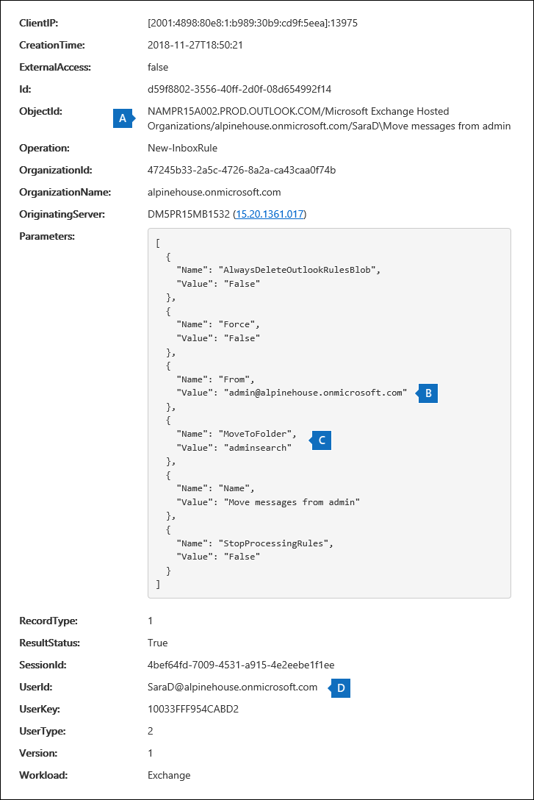
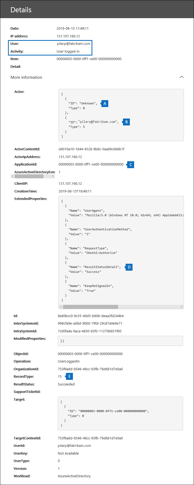
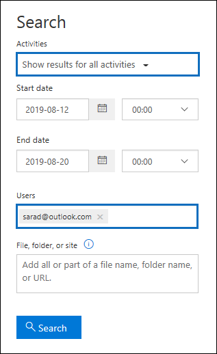

# Search the audit log to investigate common support issues

This article describes how to use the audit log search tool to help you investigate common support issues. This includes using the audit log to:

- Find the IP address of the computer used to access a compromised account
- Determine who set up email forwarding for a mailbox
- Determine if a user deleted email items in their mailbox
- Determine if a user created an inbox rule
- Investigate why there was a successful login by a user outside your organization
- Search for mailbox activities performed by users with non-E5 licenses
- Search for mailbox activities performed by delegate users

## Using the audit log search tool

Each of the troubleshooting scenarios described in this article is based on using the audit log search tool in the Security & Compliance Center. This section lists the permissions required to search the audit log and describes the steps to access and run audit log searches. Each scenario section explains how to configure an audit log search query and what to look for in the detailed information in the audit records that match the search criteria.

### Permissions required to use the audit log search tool

You must be assigned the View-Only Audit Logs or Audit Logs role in Exchange Online to search the audit log. By default, these roles are assigned to the Compliance Management and Organization Management role groups on the **Permissions** page in the Exchange admin center. Global administrators in Office 365 and Microsoft 365 are automatically added as members of the Organization Management role group in Exchange Online. For more information, see [Manage role groups in Exchange Online](/Exchange/permissions-exo/role-groups).

### Running audit log searches

This section describes the basics for creating and running audit log searches. Use these instructions as a starting point for each troubleshooting scenario in this article. For more detailed step-by-step instructions, see [Search the audit log](search-the-audit-log-in-security-and-compliance.md#step-1-run-an-audit-log-search).

1. Go to [https://protection.office.com/unifiedauditlog](https://protection.office.com/unifiedauditlog) and sign in using your work or school account.
    
    The **Audit log search** page is displayed. 
    
    
  
4. You can configure the following search criteria. Each troubleshooting scenario in this article recommends specific guidance for configuring these fields.
    
    a. **Activities:** Select the drop-down list to display the activities that you can search for. After you run the search, only the audit records for the selected activities are displayed. Selecting **Show results for all activities** displays results for all activities that meet the other search criteria. You'll also have to leave this field blank in some of the troubleshooting scenarios.
    
    b. **Start date** and **End date:** Select a date and time range to display the events that occurred within that period. The last seven days are selected by default. The date and time are presented in Coordinated Universal Time (UTC) format. The maximum date range that you can specify is 90 days.

    c. **Users:** Click in this box and then select one or more users to display search results for. Audit records for the selected activity performed by the users you select in this box are displayed in the list of results. Leave this box blank to return entries for all users (and service accounts) in your organization.
    
    d. **File, folder, or site:** Type some or all of a file or folder name to search for activity related to the file of folder that contains the specified keyword. You can also specify a URL of a file or folder. If you use a URL, be sure the type the full URL path or if you only type a portion of the URL, don't include any special characters or spaces. Leave this box blank to return entries for all files and folders in your organization. This field is left blank in all the troubleshooting scenarios in this article.
    
5. Select **Search** to run the search using your search criteria. 
    
    The search results are loaded, and after a few moments they're displayed under **Results** on the **Audit log search** page. Each of the sections in this article provides guidance about things to look for in the context of the specific troubleshooting scenario.

    For more information about viewing, filtering, or exporting audit log search results, see:

    - [View search results](search-the-audit-log-in-security-and-compliance.md#step-2-view-the-search-results)
    - [Filter search results](search-the-audit-log-in-security-and-compliance.md#step-3-filter-the-search-results)
    - [Export search results](search-the-audit-log-in-security-and-compliance.md#step-4-export-the-search-results-to-a-file)

## Find the IP address of the computer used to access a compromised account

The IP address corresponding to an activity performed by any user is included in most audit records. Information about the client used is also included in the audit record.

Here's how to configure an audit log search query for this scenario:

**Activities:** If relevant to your case, select a specific activity to search for. For troubleshooting compromised accounts, consider selecting the **User signed in to mailbox** activity under **Exchange mailbox activities**. This returns auditing records showing the IP address that was use when signing in to the mailbox. Otherwise, leave this field blank to return audit records for all activities. 

> [!TIP]
> Leaving this field blank will  return **UserLoggedIn** activities, which is an Azure Active Directory activity that indicates that someone has signed in to an user account. Use filtering in the search results to display the **UserLoggedIn** audit records.

**Start date** and **End date:** Select a date range that's applicable to your investigation.

**Users:** If you're investigating a compromised account, select the user whose account was compromised. This returns audit records for activities performed by that user account.

**File, folder, or site:** Leave this field blank.

After you run the search, the IP address for each activity is displayed in the **IP address** column in the search results. Select the record in the search results to view more detailed information on the flyout page.

## Determine who set up email forwarding for a mailbox

When email forwarding is configured for a mailbox, email messages that are sent to the mailbox are forwarded to another mailbox. Messages can be forwarded to users inside or outside of your organization. When email forwarding is set up on a mailbox, the underlying Exchange Online cmdlet that's used is **Set-Mailbox**.

Here's how to configure an audit log search query for this scenario:

**Activities:** Leave this field blank so that the search returns audit records for all activities. This is necessary to return any audit records related to the **Set-Mailbox** cmdlet.

**Start date** and **End date:** Select a date range that's applicable to your investigation.

**Users:** Unless you're investigating an email forwarding issue for a specific user, leave this field blank. This helps you identify if email forwarding was set up for any user.

**File, folder, or site:** Leave this field blank.

After you run the search, select **Filter results** on the search results page. In the box under **Activity** column header, type **Set-Mailbox** so that only audit records related to the **Set-Mailbox** cmdlet are displayed.



At this point, you have to look at the details of each audit record to determine if the activity is related to email forwarding. Select the audit record to display the **Details** flyout page, and then select **More information**. The following screenshot and descriptions highlight the information that indicates email forwarding was set on the mailbox.



a. In the **ObjectId** field, the alias of the mailbox that email forwarding was set on is displayed. This mailbox is also displayed on the **Item** column in the search results page.

b. In the **Parameters** field, The value *ForwardingSmtpAddress* indicates that email forwarding was set on the mailbox. In this example, mail is being forwarded to the email address mike@contoso.com, which is outside of the alpinehouse.onmicrosoft.com organization.

c. The *True* value for the *DeliverToMailboxAndForward* parameter indicates that a copy of the message is delivered to sarad@alpinehouse.onmicrosoft.com *and* is forwarded to the email address specified by the *ForwardingSmtpAddress* parameter, which in this example is mike@contoso.com. If the value for the *DeliverToMailboxAndForward* parameter is set to *False*, then email is only forwarded to the address specified by the *ForwardingSmtpAddress* parameter. It's not delivered to the mailbox specified in the **ObjectId** field.

d. The **UserId** field indicates the user who set email forwarding on the mailbox specified in the **ObjectId** field. This user is also displayed in the **User** column on the search results page. In this case, it seems that the owner of the mailbox set email forwarding on her mailbox.

If you determine that email forwarding shouldn't be set on the mailbox, you can remove it by running the following command in Exchange Online PowerShell:

```powershell
Set-Mailbox <mailbox alias> -ForwardingSmtpAddress $null 
```

For more information about the parameters related to email forwarding, see the [Set-Mailbox](/powershell/module/exchange/set-mailbox) article.

## Determine if a user deleted email items

Starting in January 2019, Microsoft is turning on mailbox audit logging by default for all Office 365 and Microsoft organizations. This means that certain actions performed by mailbox owners are automatically logged, and the corresponding mailbox audit records are available when you search for them in the mailbox audit log. Before mailbox auditing was turned on by default, you had to manually enable it for every user mailbox in your organization. 

The mailbox actions logged by default include the SoftDelete and HardDelete mailbox actions performed by mailbox owners. This means you can use the following steps to search the audit log for events related to deleted email items. For more information about mailbox auditing on by default, see [Manage mailbox auditing](enable-mailbox-auditing.md).

Here's how to configure an audit log search query for this scenario:

**Activities:** Under **Exchange mailbox activities**, select one or both of the following activities:

- **Deleted messages from Deleted Items folder:** This activity corresponds to the **SoftDelete** mailbox auditing action. This activity is also logged when a user permanently deletes an item by selecting it and pressing **Shift+Delete**. After an item is permanently deleted, the user can recover it until the deleted item retention period expires.

- **Purged messages from mailbox:** This activity corresponds to the **HardDelete** mailbox auditing action. This is logged when a user purges an item from the Recoverable Items folder. Admins can use the Content Search tool in the security and compliance center to search for and recover purged items until the deleted item retention period expires or longer if the user's mailbox is on hold.

**Start date** and **End date:** Select a date range that's applicable to your investigation.

**Users:** If you select a user in this field, the audit log search tool returns audit records for email items that were deleted (SoftDeleted or HardDeleted) by the user you specify. Sometimes the user who deletes an email might not be the mailbox owner.

**File, folder, or site:** Leave this field blank.

After you run the search, you can filter the search results to display the audit records for soft-deleted items or for hard-deleted items. Select the audit record to display the **Details** flyout page, and then select **More information**. Additional information about the deleted item, such as the subject line and the location of the item when it was deleted, is displayed in the **AffectedItems** field. The following screenshots show an example of the **AffectedItems** field from a soft-deleted item and a hard-deleted item.

**Example of AffectedItems field for soft-deleted item**



**Example of AffectedItems field for hard-deleted item**


### Recover deleted email items

Users can recover soft-deleted items if the deleted items retention period has not expired. In Exchange Online, the default deleted items retention period is 14 days, but admins can increase this setting to a maximum of 30 days. Point users to the [Recover deleted items or email in Outlook on the web](https://support.office.com/article/Recover-deleted-items-or-email-in-Outlook-Web-App-C3D8FC15-EEEF-4F1C-81DF-E27964B7EDD4) article for instructions on recovering deleted items.

As previously explained, admins may be able to recover hard-deleted items if the deleted item retention period hasn't expired or if the mailbox is on hold, in which case items are kept until the hold duration expires. When you run a content search, soft-deleted and hard-deleted items in the Recoverable Items folder are returned in the search results if they match the search query. For more information about running content searches, see [Content Search in Office 365](content-search.md).

> [!TIP]
> To search for deleted email items, search for all or part of the subject line that's displayed in the **AffectedItems** field in the audit record.

## Determine if a user created an inbox rule

When users create an inbox rule for their Exchange Online mailbox, a corresponding audit record is saved to the audit log. For more information about inbox rules, see:

- [Use inbox rules in Outlook on the web](https://support.office.com/article/use-inbox-rules-in-outlook-on-the-web-8400435c-f14e-4272-9004-1548bb1848f2)
- [Manage email messages in Outlook by using rules](https://support.office.com/article/Manage-email-messages-by-using-rules-C24F5DEA-9465-4DF4-AD17-A50704D66C59)

Here's how to configure an audit log search query for this scenario:

**Activities:** Under **Exchange mailbox activities**, select **New-InboxRule Create/modify/enable/disable inbox rule**.

**Start date** and **End date:** Select a date range that's applicable to your investigation.

**Users:** Unless you're investigating a specific user, leave this field blank. This helps you identify new inbox rules set up by any user.

**File, folder, or site:** Leave this field blank.

After you run the search, any audit records for this activity are displayed in the search results. Select an audit record to display the **Details** flyout page, and then select **More information**. Information about the inbox rule settings is displayed in the **Parameters** field. The following screenshot and descriptions highlight the information about inbox rules.



a. In the **ObjectId** field, the full name of the inbox rule is displayed. This name includes the alias of the user's mailbox (for example, SaraD) and the name of the inbox rule (for example, "Move messages from admin").

b. In the **Parameters** field, the condition of the inbox rule is displayed. In this example, the condition is specified by the *From* parameter. The value defined for the *From* parameter indicates that the inbox rule acts on email sent by admin@alpinehouse.onmicrosoft.com. For a complete list of the parameters that can be used to define conditions of inbox rules, see the [New-InboxRule](/powershell/module/exchange/new-inboxrule) article.

c. The *MoveToFolder* parameter specifies the action for the inbox rule. In this example, messages received from admin@alpinehouse.onmicrosoft.com are moved to the folder named *AdminSearch*. Also see the [New-InboxRule](/powershell/module/exchange/new-inboxrule) article for a complete list of parameters that can be used to define the action of an inbox rule.

d. The **UserId** field indicates the user who created the inbox rule specified in the **ObjectId** field. This user is also displayed in the **User** column on the search results page.

## Investigate why there was a successful login by a user outside your organization

When reviewing audit records in the audit log, you may see records that indicate an external user was authenticated by Azure Active Directory and successfully logged in to your organization. For example, an admin in contoso.onmicrosoft.com may see an audit record showing that a user from a different organization (for example, fabrikam.onmicrosoft.com) successfully logged into contoso.onmicrosoft.com. Similarly, you may see audit records that indicate users with a Microsoft Account (MSA), such as an Outlook.com or Live.com, successfully logged in to your organization. In these situations, the audited activity is **User logged In**. 

This behavior is by design. Azure Active Directory (Azure AD), the directory service, allows something called *pass-through authentication* when an external user tries to access a SharePoint site or a OneDrive location in your organization. When the external user tries to do this, they're prompted to enter their credentials. Azure AD uses the credentials to authenticate the user, meaning only Azure AD verifies that the user is who they say they are. The indication of the successful login in the audit record is the result of Azure AD authenticating the user. The successful login doesn't mean that the user was able to access any resources or perform any other actions in your organization. It only indicates that the user was authenticated by Azure AD. In order for a pass-through user to access SharePoint or OneDrive resources, a user in your organization would have to explicitly share a resource with the external user by sending them a sharing invitation or anonymous sharing link. 

> [!NOTE]
> Azure AD allows pass-through authentication only for *first-party applications*, such as SharePoint Online and OneDrive for Business. It isn't allowed for other third-party applications.

Here's an example and descriptions of relevant properties in an audit record for a **User logged In** event that is a result of pass-through authentication. Select the audit record to display the **Details** flyout page, and then select **More information**.



   a. This field indicates that the user who attempted to access a resource in your organization wasn't found in your organization's Azure AD.

   b. This field displays the UPN of the external user that attempted to access a resource in your organization. This user ID is also identified in the **User** and **UserId** properties in the audit record.

   c. The **ApplicationId** property identifies the application that triggered the logon request. The value of 00000003-0000-0ff1-ce00-000000000000 displayed in the ApplicationId property in this audit record indicates SharePoint Online. OneDrive for Business also has this same ApplicationId.

   d. This indicates that the pass-through authentication was successful. In other words, the user was successfully authenticated by Azure AD. 

   e. The **RecordType** value of **15** indicates that the audited activity (UserLoggedIn) is a  Secure Token Service (STS) logon event in Azure AD.

For more information about the other properties displayed in a UserLoggedIn audit record, see the Azure AD-related schema information in [Office 365 Management Activity API schema](/office/office-365-management-api/office-365-management-activity-api-schema#azure-active-directory-base-schema).

Here are two examples scenarios that would result in a successful **User logged in** audit activity because of pass-through authentication: 

  - A user with a Microsoft Account (such as SaraD@outlook.com) has tried to access a document in a OneDrive for Business account in fourthcoffee.onmicrosoft.com and there isn't a corresponding guest user account for SaraD@outlook.com in fourthcoffee.onmicrosoft.com.

  - A user with a Work or School account in an organization (such as pilarp@fabrikam.onmicrosoft.com) has tried to access a SharePoint site in contoso.onmicrosoft.com and there isn't a corresponding guest user account for pilarp@fabrikam.com in contoso.onmicrosoft.com.

### Tips for investigating successful logins resulting from pass-through authentication

- Search the audit log for activities performed by the external user identified in the **User logged in** audit record. Type the UPN for the external user in the **Users** box and use a date range if relevant to your scenario. For example, you can create a search using the following search criteria:

   

    In addition to the **User logged in** activities, other audit records may be returned, such ones that indicate a user in your organization shared resources with the external user and whether the external user accessed, modified, or downloaded a document that was shared with them.

- Search for SharePoint sharing activities that would indicate a file was shared with the external user identified by a **User logged in** audit record. For more information, see [Use sharing auditing in the audit log](use-sharing-auditing.md).

- Export the audit log search results that contain records relevant to your investigation so that you can use Excel to search for other activities related to the external user. For more information, see  [Export, configure, and view audit log records](export-view-audit-log-records.md).

## Search for mailbox activities performed by users with non-E5 licenses

Even when [mailbox auditing on by default](enable-mailbox-auditing.md) is turned on for your organization, you might notice that mailbox audit events for some users aren't found in audit log searches by using the compliance center, the **Search-UnifiedAuditLog** cmdlet, or the Office 365 Management Activity API. The reason for this is that mailbox audit events will be returned only for users with E5 licenses when you one of the previous methods to search the unified audit log.

To retrieve mailbox audit log records for non-E5 users, you can perform one of the following workarounds:

- Manually enable mailbox auditing on individual mailboxes (run the `Set-Mailbox -Identity <MailboxIdentity> -AuditEnabled $true` command in Exchange Online PowerShell). After you do this, search for mailbox audit activities by using the compliance center, the **Search-UnifiedAuditLog** cmdlet, or the Office 365 Management Activity API.
  
  > [!NOTE]
  > If mailbox auditing already appears to be enabled on the mailbox, but your searches return no results, change the value of the _AuditEnabled_ parameter to `$false` and then back to `$true`.
  
- Use the following cmdlets in Exchange Online PowerShell:

  - [Search-MailboxAuditLog](/powershell/module/exchange/search-mailboxauditlog) to search the mailbox audit log for specific users.

  - [New-MailboxAuditLogSearch](/powershell/module/exchange/new-mailboxauditlogsearch) to search the mailbox audit log for specific users and to have the results sent via email to specified recipients.

## Search for mailbox activities performed in a specific mailbox (including shared mailboxes)

When you use the **Users** dropdown list in the audit log search tool in the compliance center or the **Search-UnifiedAuditLog -UserIds** command in Exchange Online PowerShell, you can search for activities performed by a specific user. For mailbox audit activities, this type of search will search for activities performed by the specified user. It doesn't guarantee that all activities performed in the same mailbox are returned in the search results. For example, an audit log search won't return audit records for activities performed by a delegate user because searching for mailbox activities performed by a specific user will not return activities performed by a delegate user who's been assigned permissions to access another user's mailbox. (A delegate user is someone who's been assigned the SendAs, SendOnBehalf, or FullAccess mailbox permission to another user's mailbox.)

Also, using the **User** dropdown list in the audit log search tool or the **Search-UnifiedAuditLog -UserIds** will not return results for activities performed in a shared mailbox.

To search for the activities performed in a specific mailbox or to search for activities performed in a shared mailbox, use the following syntax when running the **Search-UnifiedAuditLog** cmdlet:

```powershell
Search-UnifiedAuditLog  -StartDate <date> -EndDate <date> -FreeText (Get-Mailbox <mailbox identity).ExchangeGuid
```

For example, the following command returns audit records for activities performed in the Contoso Compliance Team shared mailbox between August 2020 and October 2020:

```powershell
Search-UnifiedAuditLog  -StartDate 08/01/2020 -EndDate 10/31/2020 -FreeText (Get-Mailbox complianceteam@contoso.onmicrosoft.com).ExchangeGuid
```

Alternatively, you can use the **Search-MailboxAuditLog** cmdlet to search for audit records for activity performed in a specific mailbox. This includes searching for activities performed in a shared mailbox.

The following example returns mailbox audit log records for activities performed in the Contoso Compliance Team shared mailbox:

```powershell
Search-MailboxAuditLog -Identity complianceteam@contoso.onmicrosoft.com -StartDate 08/01/2020 -EndDate 10/31/2020 -ShowDetails
```

The following example returns mailbox audit log records for activities performed in the specified mailbox by delegate users:

```powershell
Search-MailboxAuditLog -Identity <mailbox identity> -StartDate <date> -EndDate <date> -LogonTypes Delegate -ShowDetails
```

You can also use the **New-MailboxAuditLogSearch** cmdlet to search the audit log for a specific mailbox and to have the results sent via email to specified recipients.