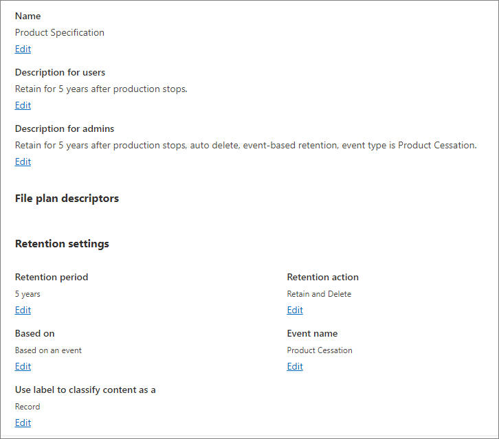
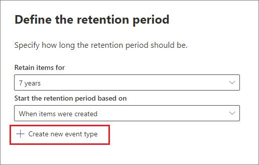
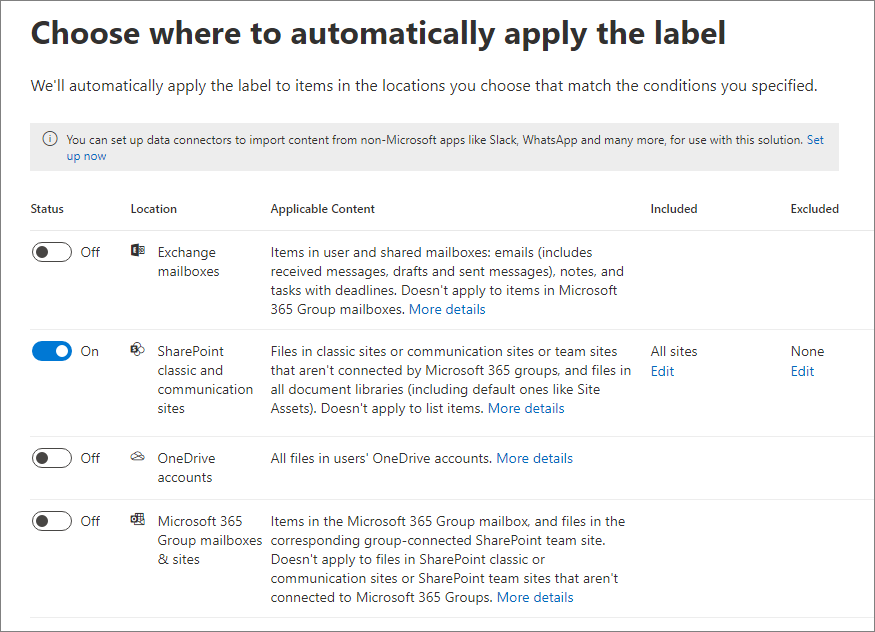
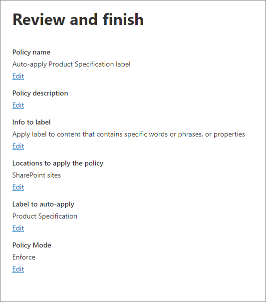

# Use retention labels to manage the lifecycle of documents stored in SharePoint

>*[Microsoft 365 licensing guidance for security & compliance](/office365/servicedescriptions/microsoft-365-service-descriptions/microsoft-365-tenantlevel-services-licensing-guidance/microsoft-365-security-compliance-licensing-guidance).*

This article describes how you can manage the lifecycle of documents that are stored in SharePoint by using automatically applied retention labels and event-based retention.

The auto-apply functionality uses SharePoint metadata for document classification. The example in this article is for product-related documents, but the same concepts can be used for other scenarios. For example, in the oil and gas industry, you could use it to manage the lifecycle of documents about physical assets such as oil platforms, well logs, or production licenses. In the financial services industry, you could manage bank account, mortgage, or insurance contract documents. In the public sector, you could manage construction permits or tax forms.

In this article, we'll look at the information architecture and definition of the retention labels. Then we'll classify documents by auto-applying the labels. And finally we'll generate the events that initiate the retention period.

[!INCLUDE [purview-preview](../includes/purview-preview.md)]

## Information architecture

Our scenario is a manufacturing company that uses SharePoint to store all the documents about the products that the company develops. These documents include product specifications, agreements with suppliers, and user manuals. When these documents are stored in SharePoint through Enterprise Content Management policies, document metadata is defined, which is used to classify them. Each document has the following metadata properties:

- **Doc Type** (such as product specification, agreement, or user manual)

- **Product Name**

- **Status** (draft or final)

This metadata forms a base content type called *Production Document* for all the documents.

> [!NOTE]
> The **Doc Type** and **Status** properties are used by retention policies later in this scenario to classify and auto-apply retention labels.

We might have several content types that represent different types of documents, but let's focus on the product documentation.

In this scenario, we use the Managed Metadata service and the Term Store to create a term set for *Doc Type* and another one for *Product Name*. For each term set, we create a term for each value. It would look like something like this in Term Store for your SharePoint organization:

*Content Type* can be created and published by using the [Content Type Hub](https://support.office.com/article/manage-content-type-publishing-06f39ac0-5576-4b68-abbc-82b68334889b). You can also create and publish a content type by using site provisioning tools, such as the [PnP provisioning framework](/sharepoint/dev/solution-guidance/pnp-provisioning-framework) or [site design JSON schema](/sharepoint/dev/declarative-customization/site-design-json-schema#define-a-new-content-type).

Each product has a dedicated SharePoint site that contains one document library that has the right content types enabled. All documents are stored in this document library.

> [!NOTE]
> Instead of having a SharePoint site per product, the manufacturing company in this scenario could use a Microsoft Team per product to support collaboration among members of the team, such as through persistent chat, and use the **Files** tab in Teams for document management. In this article we only focus on documents, so, we'll only use a site.

Here's a view of the document library for the Spinning Widget product:

Now that we have the basic information architecture in place for document management, let's look at the retention and disposal strategy for the documents that use the metadata and how we classify those documents.

## Retention and disposition

The manufacturing company's compliance and data governance policies dictate how data is preserved and disposed of. Product-related documents must be kept for as long as the product is manufactured and for a certain additional period. The additional period differs for product specifications, agreements, and user manuals. The following table indicates the retention and disposition requirements:

|   Document type            |   Retention                            |   Disposition                                |
| -------------------------- | -------------------------------------- | -------------------------------------------- |
| Product specifications      | 5 years after production stops  | Delete                                       |
| Product agreements          | 10 years after production stops | Review                                       |
| User manuals                | 5 years after production stops  | Delete                                       |
| All other types of documents | Don't actively retain  | Delete when document is older than 3 years    A document is considered older than 3 years if it hasn't been modified within the last 3 years. |

We use the Microsoft Purview compliance portal to create the following [retention labels](retention.md#retention-labels):

  - Product Specification

  - Product Agreement

  - User Manual

In this article, we only show how to create and auto-apply the Product Specification retention label. To implement the complete scenario, you would also create and auto-apply retention labels for the other two document types.

### Settings for the Product Specification retention label

Here's the [file plan](file-plan-manager.md) for the Product Specification retention label:

- **Name:** Product Specification

- **Description for users:** Retain for 5 years after production stops.

- **Description for admins:** Retain for 5 years after production stops, auto delete, event-based retention, event type is *Product Cessation*.

- **Retention action:** Retain and delete.

- **Retention duration:** 5 years (1,825 days).

- **Record label**: Configure the retention label to mark items as a [record](records-management.md#records), which means the labeled documents can't then be modified or deleted by users.

- **File plan descriptors:** For simplifying the scenario, no optional file descriptors are provided.

The following screenshot shows a summary of the label settings when you create the Product Specification retention label in the Microsoft Purview compliance portal. You can create the *Product Cessation* event type before you create the retention label, or during. See the procedure in the following section.

> [!NOTE]
> To avoid a 5-year wait for document deletion, set the retention duration to ***1 day*** if you're recreating this scenario in a test environment.

### Create an event type when you create a retention label

1. On the **Define the retention period** page of the Create retention label configuration, after **Start the retention period based on**, select **Create new event type**:

    

3. On the **Name your event type** page, enter **Product Cessation** and an optional description. Then select **Next**, **Submit**, and **Done**.

4. Back on the **Define the retention period** page, for **Start the retention period based on**, use the dropdown box to select the **Product Cessation** event type that you created.

5. On the **Choose what happens during the retention period** page, select **Mark items as a record**.

6. On the **Choose what happens after the retention period** page, keep the default of **Delete items automatically**.

6. On the **Review and finish** page, select **Create label**. On the next page when you see the options to publish the label, auto-apply the label, or just save the label: Select **Do Nothing**, and then select **Done**.

    > [!TIP]
    > For more detailed steps, see [Create a label whose retention period is based on an event](event-driven-retention.md#step-1-create-a-label-whose-retention-period-is-based-on-an-event).

Now let's look at how we'll auto-apply the retention label to product-specification content.

## Auto-apply retention labels to documents

We're going to use Keyword Query Language (KQL) to [auto-apply](apply-retention-labels-automatically.md) the retention labels that we created. KQL is the language that's used to build search queries. In KQL, you can search by using keywords or managed properties. For more information, see [Keyword Query Language (KQL) syntax reference](/sharepoint/dev/general-development/keyword-query-language-kql-syntax-reference).

Basically, we want to tell Microsoft 365 to "apply the **Product Specification** retention label to all documents that have a **Status** of **Final** and a **Doc Type** of **Product Specification**." Recall that **Status** and **Doc Type** are the site columns that we defined for the Product Documentation content type in the [Information architecture](#information-architecture) section. To do this, we need to configure the search schema.

When SharePoint indexes content, it automatically generates crawled properties for each site column. For this scenario, we're interested in the **Doc Type** and **Status** properties. We need documents in the library that are the right content type and have the site columns filled in for search to create the crawled properties.

In the <a href="https://go.microsoft.com/fwlink/?linkid=2185219" target="_blank">SharePoint admin center</a>, open the Search configuration, and select **Manage Search Schema** to view and configure the crawled properties.

If we type ***status*** in the **Crawled properties** box and select the green arrow, we should see a result like this:

The **ows\_\_Status** property (notice the double underscore) is the one that interests us. It maps to the **Status** property of the Production Document content type.

Now, if we type ***ows\_doc*** and select the green arrow, we should see something like this:

The **ows\_Doc\_x0020\_Type** property is the second property that interests us. It maps to the **Doc Type** property of the Production Document content type.

> [!TIP]
> To identify the name of a crawled property for this scenario, go to the document library that contains the production documents. Then go to the library settings. For **Columns**, select the name of the column (for example, **Status** or **Doc Type**) to open the site column page. The *Field* parameter in the URL for that page contains the name of the field. This field name, prefixed with "ows_", is the name of the crawled property. For example, the URL `https://tenantname.sharepoint.com/sites/SpinningWidget/_layouts/15/FldEdit.aspx?List=%7BC38C2F45-3BD6-4C3B-AA3B-EF5DF6B3D172%7D&Field=_Status` corresponds to the *ows\_\_Status* crawled property.

If the crawled properties you're looking for don't appear in the Manage Search Schema section in SharePoint admin center:

- Maybe the documents haven't been indexed. You can force a reindex of the library by going to **Document library settings** > **Advanced Settings**.

- If the document library is in a modern site, make sure that the SharePoint admin is also a site collection admin.

For more information about crawled and managed properties, see [Automatically created managed properties in SharePoint Server](/sharepoint/technical-reference/automatically-created-managed-properties-in-sharepoint).

### Map crawled properties to pre-defined managed properties

KQL can't use crawled properties in search queries. It has to use a managed property. In a typical search scenario, we create a managed property and map it to the crawled property that we need. However, for auto-applying retention labels, you can only specify pre-defined managed properties in KQL, not custom managed properties. There's a set of predefined managed properties in the system for string *RefinableString00* to *RefinableString199* that you can use. For a complete list, see [Default unused managed properties](/sharepoint/manage-search-schema#default-unused-managed-properties). These default managed properties are typically used for defining search refiners.

For the KQL query to automatically apply the correct retention label to product document content, we map the crawled properties **ows\_Doc\_x0020\_Type* and *ows\_\_Status** to two refinable managed properties. In our test environment for this scenario, **RefinableString00** and **RefinableString01** aren't being used. We determined this by looking at **Managed Properties** in **Manage Search Schema** in the <a href="https://go.microsoft.com/fwlink/?linkid=2185219" target="_blank">SharePoint admin center</a>.

Notice that the **Mapped Crawled Properties** column in the previous screenshot is empty.

To map the **ows\_Doc\_x0020\_Type** crawled property, follow these steps:

1. In the **Managed property** filter box, type ***RefinableString00*** and select the green arrow.

2. In the results list, select the **RefinableString00** link, and then scroll down to the **Mappings to crawled properties** section.

3. Select **Add a Mapping**, and then type ***ows\_Doc\_x0020\_Type*** in the **Search for a crawled property name** box in the **Crawled property selection** window. Select **Find**.

4. In the results list, select **ows\_Doc\_x0020\_Type** and then select **OK**.

   In the **Mapped Crawled Properties** section, you should see something similar to this screenshot:

   

5. Scroll to the bottom of the page and select **OK** to save the mapping.

Repeat these steps to map **RefinableString01** and **ows\_\_Status**.

Now you should have two managed properties mapped to the two crawled properties:

Let's verify that our setup is correct by running an enterprise search. In a browser, go to *https://\<your_tenant>.sharepoint.com/search*. In the search box, type ***RefinableString00:"Product Specification"*** and press enter. This search should return all documents that have a **Product Specification** of ***Doc Type***.

Now in the search box, type **RefinableString00:"Product Specification" AND RefinableString01:Final** and press enter. This should return all documents that have **Product Specification** of ***Doc Type*** and a **Status** of ***Final***.

### Create auto-apply label policies

Now that we've verified that the KQL query is working, let's create an auto-apply label policy that uses a KQL query to automatically apply the Product Specification retention label to the appropriate documents.

1. In the <a href="https://go.microsoft.com/fwlink/p/?linkid=2077149" target="_blank">Microsoft Purview compliance portal</a>, go to **Records management** > **Label policies** > **Auto-apply a label**.

2. In the Create auto-labeling policy configuration, on the **Name your auto-labeling policy** page, enter a name such as **Auto-apply Product Specification label**, and an optional description. Then select **Next**.

3. On the **Choose the type of content you want to apply this label to** page, select **Apply label to content that contains specific words or phrases, or properties**, and then select **Next**.

   

   This option lets us provide the same KQL search query that we tested in the previous section. The query returns all Product Specification documents that have a status of *Final*. When we use this same query in the auto-apply label policy, the Product Specification retention label will be automatically applied to all documents that match it.

4. On the **Apply label to content matching this query** page, type **RefinableString00:"Product Specification" AND RefinableString01:Final**, and then select **Next**.

   

5. On the **Choose the type of retention policy to create** page, select **Static**.

6. On the **Choose where to automatically apply the label** page, you select the content locations that you want to apply the policy to. For this scenario, we apply the policy only to **SharePoint classic and communication sites**. Toggle the status for **Exchange mailboxes**, **OneDrive accounts**, and **Microsoft 365 Group mailboxes & sites** to **Off**:

    

   > [!TIP]
   > Instead of applying the policy to all SharePoint sites, you can select **Edit** for the **Included** column, and add the URLs for specific SharePoint sites.

6. On the **Choose a label to auto-apply** page, select **Add label**.

7. From the list of retention labels, select **Product Specification**. Then select **Add** and **Next**.

8. On the **Decide whether to test or run your policy** page, keep the default of **Turn on policy**.

9. Review your settings:

    

9. Select **Submit** to create the auto-apply label policy.

   > [!NOTE]
   > It takes up to 7 days to automatically apply the Product Specification label to all documents that match the KQL search query.

### Verify that the retention label was automatically applied

After 7 days, use [activity explorer](data-classification-activity-explorer.md) in the Microsoft Purview compliance portal to verify that the auto-apply label policy that we created did automatically apply the retention labels to the product documents.

Also look at the properties of the documents in the Document Library. In the information panel, you can see that the retention label is applied to a selected document.

Because the retention labels were auto-applied to documents, those documents are protected from deletion because the retention label was configured to mark items as records. As an example of this protection, we get the following error message when we try to delete one of these documents:

## Generate the event that triggers the retention period

Now that the retention labels are applied, let's focus on the event that will indicate the end of production for a particular product. This event triggers the beginning of the retention period that's defined in the retention labels. For example, for product specification documents, the 5-year retention period begins when the "end of production" event is triggered.

You can manually create the event in the Microsoft Purview compliance portal by going to **Records Managements** > **Events**. You would choose the event type, set the correct asset IDs, and enter a date for the event. For more information, see [Start retention when an event occurs](event-driven-retention.md).

Or, you can automate this by using [Microsoft Graph Records Management APIs](/graph/api/resources/security-recordsmanagement-overview).

### More about asset IDs

As the [Start retention when an event occurs](event-driven-retention.md) article explains, it's important to understand the relationship between event types, retention labels, events, and asset IDs. The asset ID is simply a document property in SharePoint and OneDrive. It helps you identify the documents whose retention period will be triggered by the event. By default, SharePoint has an **Asset Id** property that you can use for event-driven retention:

As the following screenshot shows, the asset ID managed property is called **ComplianceAssetId**.

Instead of using the default **Asset Id** property as we do in this scenario, you can use any other property. But it's important to understand that if you don't specify an asset ID or keywords for an event, all the content that has a label of that event type will get its retention period triggered by the event.

### Using advanced search in SharePoint

In the previous screenshot, you can see that there's another managed property related to retention labels called **ComplianceTag** that's mapped to a crawled property. The **ComplianceAssetId** managed property is also mapped to a crawled property. This means that you can use these managed properties in advanced search to retrieve all documents that have been tagged with a retention label.
