# Manage the lifecycle of documents by auto-applying retention labels and using event-based retention

This article describes how you can manage the life cycle of product-related documents stored in SharePoint Online using Office 365 retention labels, and more specifically by auto-applying labels and configuring event-based retention. The auto-apply functionality leverages document classification that uses SharePoint metadata. The scenario in this article is based on product-related documents, but the same concepts could be used for other scenarios. For example, in the Oil and Gas industry, you could manage the life cycle of documents related to a physical asset such as oil platforms, well logs, or production licenses. In the financial services industry, you can manage documents related to bank accounts, mortgages, or insurance contracts. In the public sector, you can manage documents related to construction permits or tax forms.

Let's look at the scenario for this article. We'll look at the information architecture and the definition of the retention labels. Then we'll look at the classifying and auto-applying the labels, and finally at generating the events.

## Information architecture

The scenario for this article is based on a manufacturing company that uses Office 365 SharePoint Online to store all the documents related to the products developed. These documents include product specifications, agreements with suppliers, and user manuals. When storing these documents in SharePoint as part of the Enterprise Content Management policies, document metadata is defined and used to classify them. Each document has the following metadata properties:

- **Doc Type** (such as product specification, agreement, and user manual)

- **Product Name**

- **Status** (draft or final)

This metadata forms the base content type called **Production Document** for all documents.

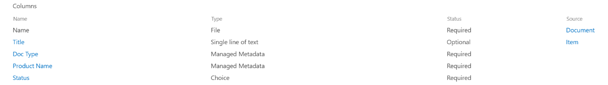

> [!NOTE]
> The **Doc Type** and **Status** properties are used by retention policies later in the scenario to classify and auto-apply retention labels.

We can have several content types that represent different types of documents, but let's focus on the Product Documentation.

We are using in this example the Managed Metadata services and the term store, creating a term set for **Doc Type**, and another one for **Product Name**. For each term set, we create a term for each value. It would look like something like this in Term store for your SharePoint organization:

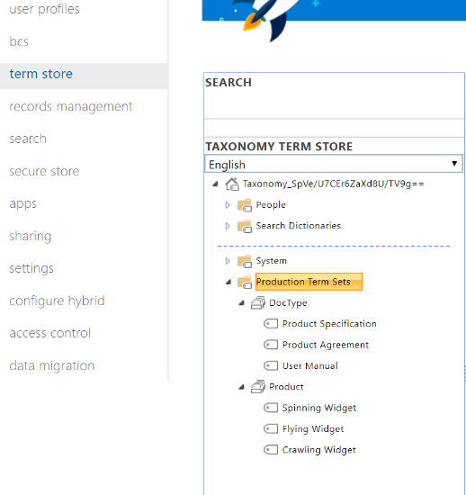

Content Type can be created and published using the [Content Type Hub](https://support.office.com/article/manage-content-type-publishing-06f39ac0-5576-4b68-abbc-82b68334889b). A content type can also be created and published using site provisioning tools such as the [PnP provisioning framework](https://docs.microsoft.com/sharepoint/dev/solution-guidance/pnp-provisioning-framework) or the [site design JSON schema](https://docs.microsoft.com/sharepoint/dev/declarative-customization/site-design-json-schema#define-a-new-content-type).

Each product has a dedicated SharePoint Online site that contains one document library, with the right content types enabled. All documents are stored in this document library.

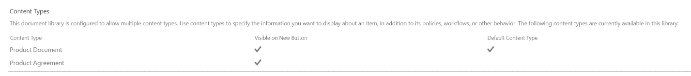

> [!NOTE]
> Instead of having a SharePoint Online site per product, the manufacturing company in this scenario could use a Microsoft Team per product that would support collaboration with members of the team, such as persistent chat and use the **Files** tab in the team for document management. In this article we only focus on documents, therefore we will only use a site.

Here's a view of the document library for the Spinning Widget product:

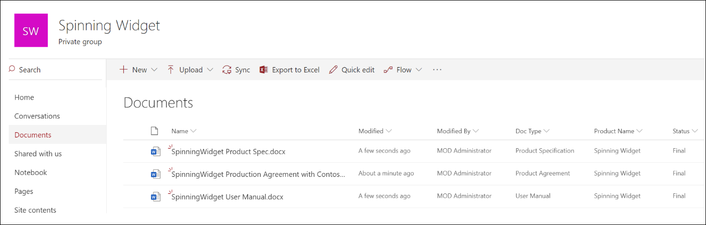

Now that we have the basic information architecture in place for document management, let's look at the retention and disposal strategy of the documents that use the metadata and classification of documents.

## Retention and disposition

The manufacturing company's compliance and data governance policies dictate the way data is preserved and disposed of. Product-related documents must be kept for as long as the product is manufactured, and for a certain period after that. This period is different for product specifications, agreements, and user manuals. The following table indicates the retention and disposition requirements:

| **Document type**          | **Retention**                          | **Disposition**                              |
| -------------------------- | -------------------------------------- | -------------------------------------------- |
| Product specification      | 5 years after cessation of production  | Delete                                       |
| Product agreement          | 10 years after cessation of production | Review                                       |
| User manual                | 5 years after cessation of production  | Delete                                       |
| All other types of documents | Don't actively retain other documents  | Delete when document is older than 3 years\*  |
|||

> [!NOTE]
> \* A document is considered older than 3 years if it hasn't been modified within the last 3 years.

Using the security and compliance center, we will create the following retention labels:

  - Product Specification

  - Product Agreement

  - User Manual

In this article, we only show how to create the Product Specification retention label. To implement the complete scenario, you would create retention labels for the other two document types.

### Settings for the Product Specification retention label

Here's the [file plan](file-plan-manager.md) for the Product Specification retention label: 

- **Name:** Product Specification

- **Description for admins:** Product Specification Label, retain for 5 years after cessation of production, auto delete, event-based retention, event type is Product Cessation.

- **Description for users:** Retain for 5 years after cessation of production.

- **Retention action:** Keep and delete

- **Retention duration:** 5 years (1825 days)

- **Record label**: Configure the retention label to classify content as a record

- **File plan descriptors:** (for simplifying the scenario, no file descriptors are provided)

The following screenshot shows the settings when you create the Product Specification [retention label](labels.md) in the security and compliance center. You can create the **Product Cessation** event type when you create the retention label. See the how-to steps below.

> [!NOTE]
> For the practical purposes and to avoid having to wait 5 years to see a document automatically deleted, set the retention duration to 1 day if you're recreating this scenario in your test environment.

### Create an event type when creating a retention label

For more detailed steps on creating event types, see 

1. In the **Retain or delete content based** on dropdown list, select **an event**.

2. Click **Choose an event type**.

   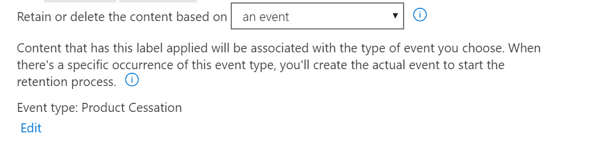

3. On the **Choose an event type** page, click **You can create new event types here**.

4. Create an event type named **Product Cessation**, give a description, and click **Finish** to create it. 

5. Back on the **Choose an event type** page, select the **Product Cessation** event type that you just created and then click **Add**.

Here's what the settings look like for the Product Specification retention label. Click **Create this label** to create it.

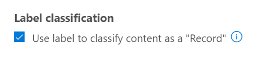

> [!TIP]
> For more detailed steps, see [Create a label whose retention period is based on an event](event-driven-retention.md#step-1-create-a-label-whose-retention-period-is-based-on-an-event).

Now that the retention label is created, let's look at auto-applying the retention label to product specification content.

## Classify content by auto-applying retention labels

We're going to [auto-apply](labels.md#applying-a-retention-label-automatically-based-on-conditions) the retention labels that we've created for this scenario by using Keyword Query Language (KQL). KQL is the language used to build search queries. In KQL, you can search by using keywords or managed properties. For more information about KQL, see <https://docs.microsoft.com/en-us/sharepoint/dev/general-development/keyword-query-language-kql-syntax-reference>

At a high level, we want to tell Office 365 to "apply the **Product Specification** retention label to all documents that have a **Status** of **Final** and a **Doc Type** of **Product Specification**. Recall that **Status** and **Doc Type** are the site columns we previously defined for Product Documentation content type in the [Information architecture](#information-architecture) section. To achieve this, we need to configure the search schema.

When SharePoint indexes content, it automatically generates crawled properties for each site column. For this scenario, we're interested in the **Doc Type** and **Status** properties. We need documents in the library using the right content type and have the site columns filled in, in order for search to create the crawled properties.

In the SharePoint admin center, we can open the Search configuration, and select **Manage Search Schema** to view and configure the crawled properties.

If we type **status** in the **Crawled properties** box, and click the green arrow, we should see a result like this:

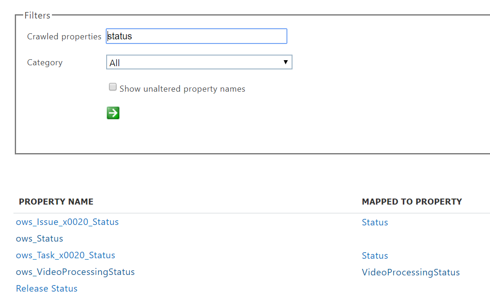

The property **ows\_\_Status** (notice the double underscore) is the one that interests us. This maps to the **Status** property of the Production Document content type.

Now if we type **ows\_doc** and click the green arrow we should see something like this:

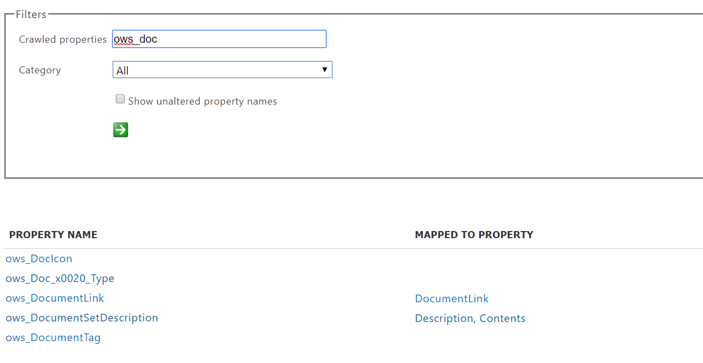

The property **ows\_Doc\_x0020\_Type** is the second property that interests us. This maps to the **Doc Type** property of the Production Document content type.

> [!TIP]
> To identify the name of a crawled property for this scenario, go the document library that contains the production documents and then go to the library settings. In the **Columns**, click the name of the column (for example, **Status** or **Doc Type**) to open the site column page. The **Field** parameter in the URL for that page contains the name of the field. This field name, prefixed with "ows_", is the name of the crawled property. For example, the URL `https://tenantname.sharepoint.com/sites/SpinningWidget/_layouts/15/FldEdit.aspx?List=%7BC38C2F45-3BD6-4C3B-AA3B-EF5DF6B3D172%7D&Field=_Status` corresponds to the **ows\_\_Status** crawled property.

If the crawled properties you're looking for don't appear in the Manage Search Schema section in the SharePoint admin center, it could be for one of the following reasons:

- The documents haven't been indexed. You can force a re-index of the library by going to Document library settings > Advanced Settings.

- If the document library is in a modern site, make sure that the SharePoint admin is also a site collection admin.

For more information about crawled and managed properties, see [Automatically created managed properties in SharePoint Server](https://docs.microsoft.com/sharepoint/technical-reference/automatically-created-managed-properties-in-sharepoint).

### Mapping crawled properties to pre-defined managed properties

KQL can't use crawled properties in search queries. It has to use a managed property. In a normal search scenario, we create a managed property and map it to the crawled property that we need. However, for auto-applying retention labels, KQL can only use a pre-defined managed properties and not custom managed properties. There is a set of predefined managed properties already created in the system for string RefinableString00 to RefinableString199 can be used. For a complete list, see [Default unused managed properties](https://docs.microsoft.com/sharepoint/manage-search-schema#default-unused-managed-properties). These default managed properties are normally used for defining search refiners.

For the KQL query to work and automatically apply the correct retention label to product document content, we'll map the crawled properties **ows\_Doc\_x0020\_Type** and **ows\_\_Status** to two refinable managed properties. In our test environment for this scenario, **RefinableString00** and **RefinableString01** aren't being used. We determined this by looking at **Managed Properties** in the **Manage Search Schema** in the SharePont admin center.

Notice that the **Mapped Crawled Properties** column in the previous screenshot is empty.

To map the **ows\_Doc\_x0020\_Type** crawled property, click the **RefinableString00** link, and then scroll down to the **Mappings to crawled properties** section.  Click **Add a Mapping** and type **ows\_Doc\_x0020\_Type** in the**Search for a crawled property name** box.  click Find and select the right result and click OK you should see something like this:

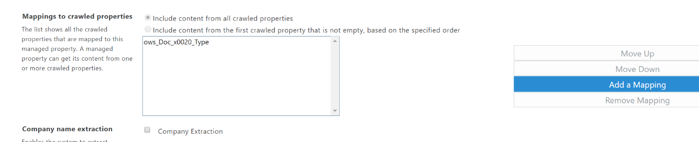

Scroll to the bottom of the page and click OK.

Repeat the same procedure for RefinableString01 and ows\_\_status.

You should have now the two managed properties mapped to the two crawled properties:

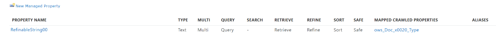

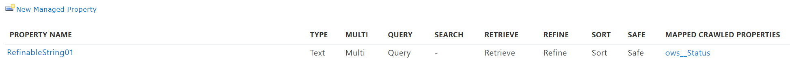

Let's verify that all is set correctly, by using the enterprise search. Navigate in a browser to <https://yourtenant.sharepoint.com/search>

In the search box type **RefinableString00:"Product Specification"** and press enter, this should return all documents that have Product Specification as Doc Type.

Now in the search box type **Refinablestring01:Final AND RefinableString00:"Product Specification"** and press enter, this should return all documents that have Product Specification as Doc Type and a status of final.

Now that we verified that the KQL query is correct let's create the auto-apply policies.

In the compliance center under classification and labels, select retention labels and then auto-apply a label

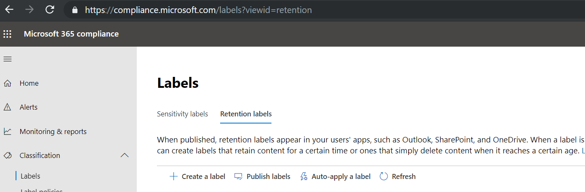

Choose **Product Specification** as the label to apply

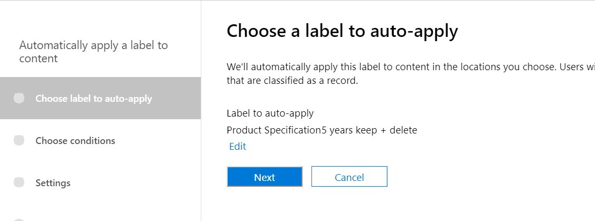

Click Next and select **Apply label to content that contains specific word or phrases**

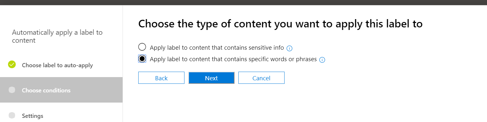

Click Next, in the query editor type the query we have been testing

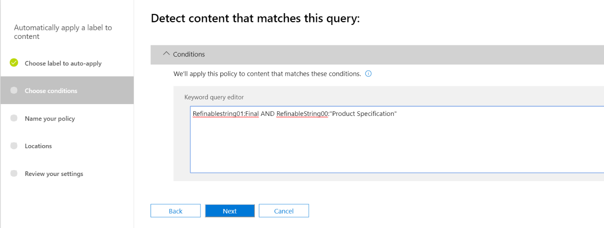

Click next, name your policy **Auto apply product specification label,** click next and select the location here you want this policy to apply to, here let's choose everything, click next, review your settings and click auto-apply.

It takes up to 7 days to automatically apply the label to all items that match your conditions.

In the Security and Compliance Center in the label activity explorer we can see that the policy has been automatically applied:

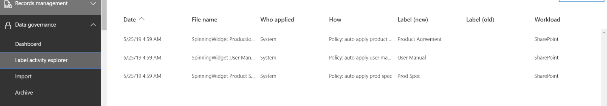

When we look at the properties of the document in the Document Library and the information panel, we can also see the label applied:

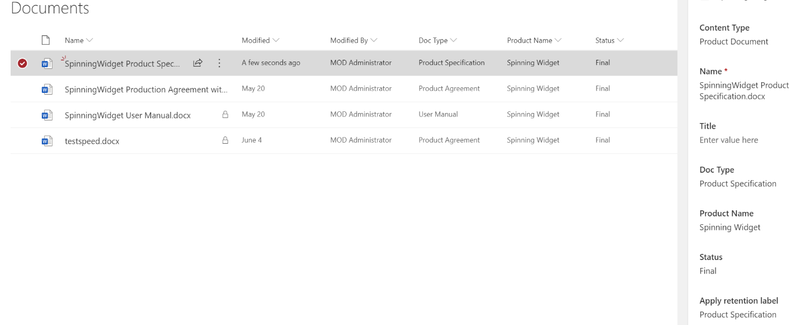

From now on the documents are protected by the retention label, for example, if we try to delete the user manual, we receive the following error message:

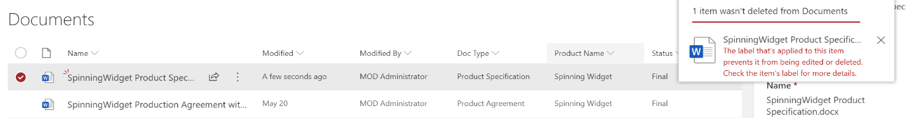

## Generate the events

Now that the retention labels were successfully automatically applied let's focus on the event that indicates the end of the production of a particular product, which will indicate how long the documents will be retained from that moment.

In the Security and Compliance Center under Records Managements > Events, you can create your event manually, by choosing the event type and setting the right Asset Id.

For more information about event-driven retention, see:

- [Overview of event-driven retention](event-driven-retention.md)

- [Automate event-driven retention](automate-event-driven-retention.md)

For our scenario, we will automatically generate the event from an external production system, in this case it is a simple SharePoint list that indicates if a product is in production or not. In a real-world scenario, it could any system that generates the event, such as an HR or CRM system.

Flow contains many ready-to-use interactions building block for Office 365 workloads such as Exchange, SharePoint, Teams, Dynamics 365, but also third parties such as Twitter, Box, Salesforce, Workdays, etc., making it easy to integrate with these systems.

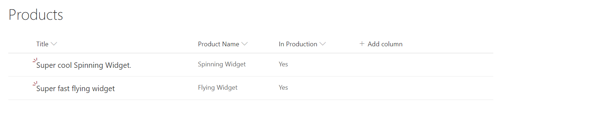

In the example above there are two products currently in production, when we set the “In Production” field to No, the Microsoft Flow associate with the list will trigger and generate the event.

This is the Microsoft Flow:

We will need the following information:

<table>
<thead>
<tr class="header">
<th>Method</th>
<th>POST</th>
<th></th>
</tr>
</thead>
<tbody>
<tr class="odd">
<td>URI</td>
<td><a href="https://ps.compliance.protection.outlook.com/psws/service.svc/ComplianceRetentionEvent">https://ps.compliance.protection.outlook.com/psws/service.svc/ComplianceRetentionEvent</a></td>
<td></td>
</tr>
<tr class="even">
<td>Headers</td>
<td>Content-Type</td>
<td>application/atom+xml</td>
</tr>
<tr class="odd">
<td>Body</td>
<td>
&lt;?xml version='1.0' encoding='utf-8' standalone='yes'?&gt;

&lt;entry xmlns:d='http://schemas.microsoft.com/ado/2007/08/dataservices' xmlns:m='http://schemas.microsoft.com/ado/2007/08/dataservices/metadata' xmlns='http://www.w3.org/2005/Atom'&gt;

&lt;category scheme='http://schemas.microsoft.com/ado/2007/08/dataservices/scheme' term='Exchange.ComplianceRetentionEvent' /&gt;

&lt;updated&gt;9/9/2017 10:50:00 PM&lt;/updated&gt;

&lt;content type='application/xml'&gt;

&lt;m:properties&gt;

&lt;d:Name&gt;Cessation Production @{triggerBody()?['Product_x0020_Name']?['Value']}&lt;/d:Name&gt;

&lt;d:EventType&gt;Product Cessation&lt;/d:EventType&gt;

&lt;d:SharePointAssetIdQuery&gt;ProductName:&quot;@{triggerBody()?['Product_x0020_Name']?['Value']}&quot;&lt;/d:SharePointAssetIdQuery&gt;

&lt;d:EventDateTime&gt;@{formatDateTime(utcNow(),'yyyy-MM-dd')}&lt;/d:EventDateTime&gt;

&lt;/m:properties&gt;

&lt;/content&gt;

&lt;/entry&gt;
</td>
<td></td>
</tr>
</tbody>
</table>

In the Body the following parameters are to be set:

<table>
<thead>
<tr class="header">
<th>Event Name</th>
<th>“Cessation Production xxx” where xxx is the product name (value)</th>
</tr>
</thead>
<tbody>
<tr class="odd">
<td>Event Type</td>
<td>As per definition earlier in this document which is: “Product Cessation”</td>
</tr>
<tr class="even">
<td>Asset Id</td>
<td>I will use the Product Name site column and not the AssetId one. I have create a Managed Property called “ProductName” that is mapped with the crawled property ows_Product_x0020_Name, I will use the following KQL query ‘ProductName:”xxx”' where xxx is the product name. 
</td>
</tr>
<tr class="odd">
<td>Event Date</td>
<td>current date: <strong>formatDateTime(utcNow()</strong>,'yyyy-MM-dd'<strong>)</strong></td>
</tr>
</tbody>
</table>

**Note**: By default, Office 365 allows to store an Asset Id as part of the retention label. If we manually apply an event-driven retention label to a document, SPO displays an Asset ID field:

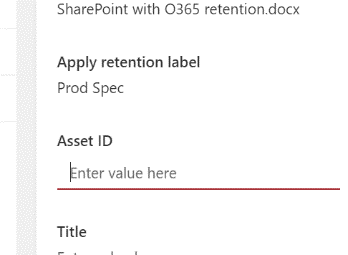

We can use this field to further specify the target documents when we create the event, we can also use any site column available, in the Flow above we used the site column Product Name. The trick is to make sure we have a managed property that can be used in KQL, in the sample above ProductName.

As shown in the screenshot below, the Asset Id managed property is called **ComplianceAssetId**.

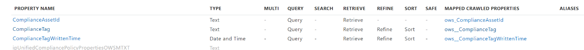

We can see also that the Retention Label managed property is called **ComplianceTag**. We can use these managed properties in the advanced search to retrieve all documents that have been tags with a label.

After the flow has run, we can see in the Security and Compliance Center under **Records Managements \> Events** that a new event has been created:

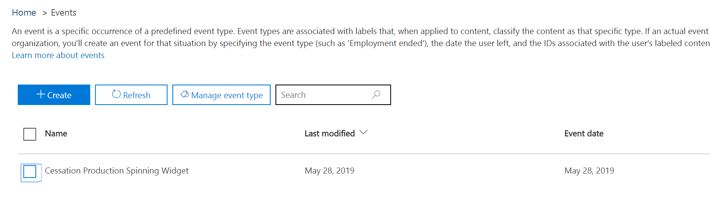

By selecting the event we can look at the details of the event, the event is created but has not been processed yet as shown in the event status section:

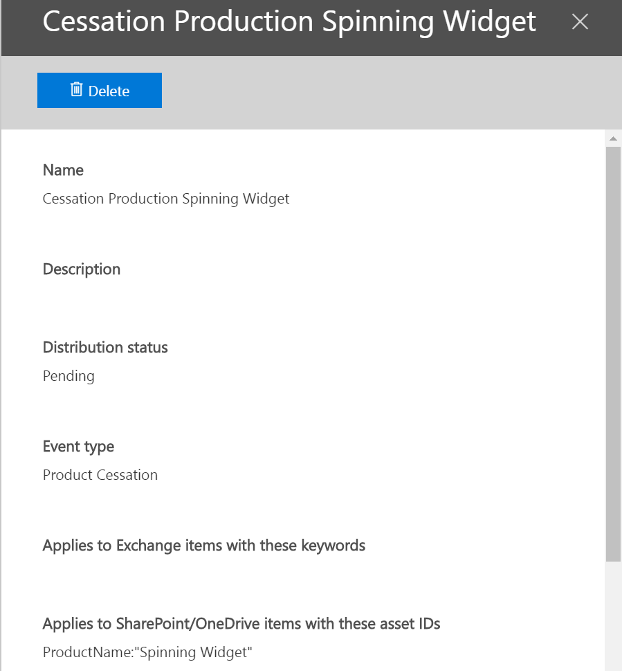

A bit later we can see that the event has been processed and that items have been processed:

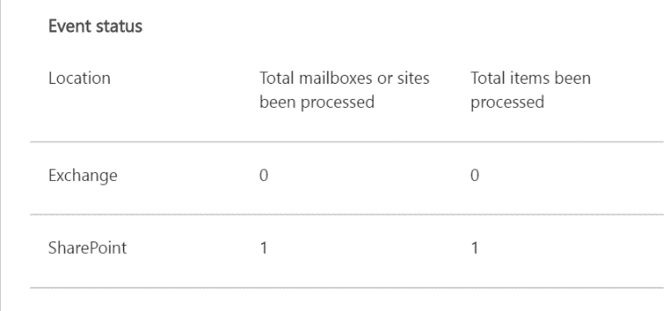
 
After the deletion job has run and we go back to the library, the document in question has been deleted.

## Summary

This concludes the scenario where we automatically applied the correct retention label based on a site column in SharePoint, and then used event-based retention and Microsoft Flow to automatically trigger retention based on external events.

## Credits

This scenario was authored by:

Frederic Lapierre Principal Consultant, Microsoft Services
