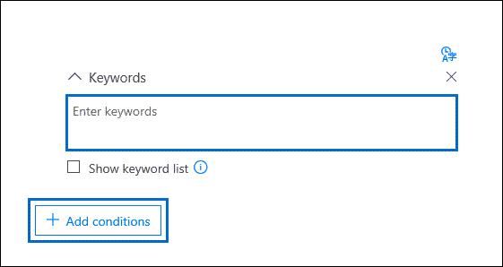
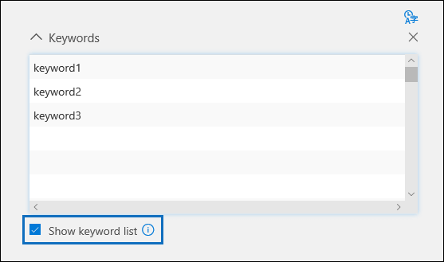

# Build search queries for collections in Advanced eDiscovery

When configuring the search query when creating a [collection](collections-overview.md) in an Advanced eDiscovery case, you can use keywords to find specific content and conditions to narrow the scope of the search to return items that are most relevant to your legal investigation.

## Keyword searches

Type a keyword query in the **Keywords** box in the search query. You can specify keywords, email message properties, such as sent and received dates, or document properties, such as file names or the date that a document was last changed. You can use more complex queries that use a Boolean operator, such as **AND**, **OR**, **NOT**, and **NEAR**. You can also search for sensitive information (such as social security numbers) in documents in SharePoint and OneDrive (not in email messages), or search for documents that have been shared externally. If you leave the **Keywords** box empty, all content located in the specified content locations is in the search results.

## Keyword list

Alternatively, you can select the **Show keyword list** check box and the type a keyword or keyword phrase in each row. The keywords in each row are connected by a logical operator (which is represented as *c:s* in the search query syntax) that is similar in functionality to the **OR** operator in the search query that's created. This means items that contain any keyword in any row are in the search results. You can add up to 180 rows in the keyword list in Advanced eDiscovery search queries.

Why use the keyword list? You can get statistics that show how many items match each keyword in the keyword list. This can help you quickly identify the keywords that are the most (and least) effective. You can also use a keyword phrase (surrounded by parentheses) in a row in the keywords list. For more information about search statistics, see [Search statistics](search-statistics-in-advanced-ediscovery.md).

## Conditions

You can add search conditions to narrow the scope of a search and return a more refined set of results. Each condition adds a clause to the search query that is created and run when you start the search. A condition is logically connected to the keyword query specified in the keyword box by a logical operator (which is represented as *c:c* in the search query syntax) that is similar in functionality to the **AND** operator. That means items have to satisfy both the keyword query and one or more conditions to be included in the search results. This is how conditions help to narrow your results. For a list and description of conditions that you can use in a search query, see the "Search conditions" section in [Keyword queries and search conditions](keyword-queries-and-search-conditions.md#search-conditions).
