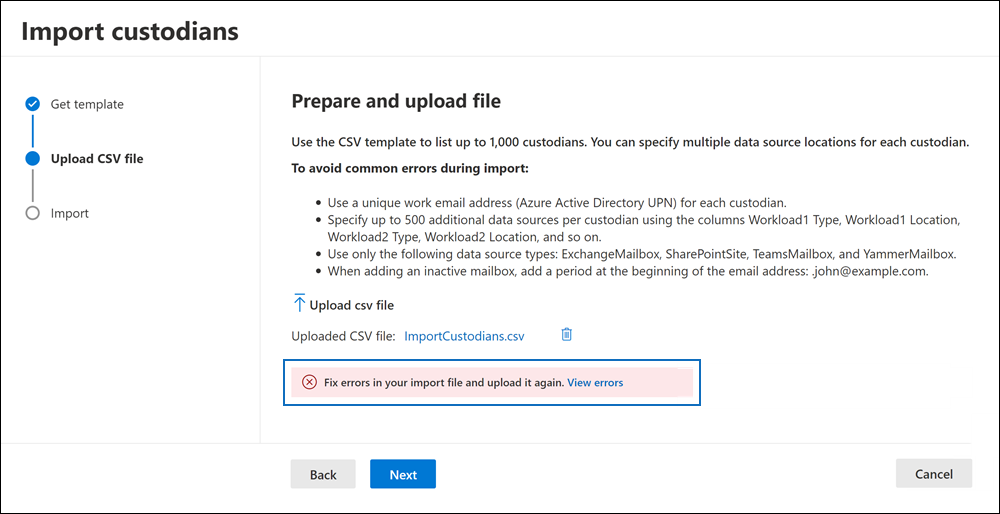

# Import custodians to an eDiscovery (Premium) case

For Microsoft Purview eDiscovery (Premium) cases that involve many custodians, you can import multiple custodians at once by using a CSV file that contains the information necessary to add them to a case. The import custodians tool will also validate the CSV file before the import job is created. This means you can fix any errors in the CSV file instead of having to wait until the import job is complete before learning there are errors that prevent a custodian from being added to the case.

## Before you import custodians

- You can import a maximum of 1,000 custodians (rows) per CSV file. Note that importing 1,000 custodians at the same time might result in timeout errors and some custodians might fail the import. To remediate this, repeat the import and the failed custodians should be imported. To avoid timeouts we recommend importing 200 custodians at a time.

- You can associate up to 500 data sources for each custodian.  

- You can only import custodians that are part of your organization's Azure Active Directory.

- Each custodian must have a unique email address.

- To import an inactive mailbox as a custodian or to associate an inactive mailbox with another custodian, add a "." prefix to the email address of the inactive mailbox (for example, .sarad@contoso.onmmicrosoft.com).

## Import custodians

1. Open the eDiscovery (Premium) case and select the **Data sources** tab.

2. Click **Add data source** > **Import custodians**.

3. On the **Get template** wizard page, click **Download the CSV template** to download a custodian template CSV file.

   

4. Add the custodial information to the CSV file and save it to your local computer. See the [Custodian CSV file](#custodian-csv-file) section for detailed information about the required properties in the CSV file.

5. After you've prepared the CSV file with the custodian information, go back to the **Data sources** tab, and click **Add data source** > **Import custodians** again.

6. On the **Upload CSV file** wizard page, click **Upload csv file** and then upload the CSV file that contains the custodian information.

   After you upload the CSV file, the import wizard validates the CSV file. If any validation errors exist, the wizard displays an error banner with a link to view the errors.

   

   The error information identifies the row and column of the cell that contains the error, and suggests a remediation action. You have to fix any validation error and then reupload the fixed CSV file. The CSV file must be successfully validated before you can create the import custodian job.

7. Once the CSV file has been successfully validated, click **Next** and then click **Import** to start the import job.

After you start the import job, eDiscovery (Premium) does the following things:

- Creates a job named **BulkAddCustodian** on the **Jobs** tab of the case.

- Performs Advanced indexing of all data sources for each custodian.

- Places all custodian data sources on hold (if the **Is OnHold** property in the CSV file is set to TRUE)

When the import custodian job is complete, the custodians and their associated data sources are added to the **Data sources** page of the case.

## Custodian CSV file

After you download the CSV custodian template, you can add custodians and their data sources in each row. Be sure not to change the column names in the header row. Use the workload type and workload location columns to associate other data sources to a custodian.

| Column name|Description|
|:------- |:------------------------------------------------------------|
|**Custodian contactEmail**     |The custodian's UPN email address. For example, sarad@contoso.onmicrosoft.com.           |
|**Exchange Enabled** | TRUE/FALSE value to include or not include the custodian's mailbox.      |
|**OneDrive Enabled** | TRUE/FALSE value to include or not include the custodian's OneDrive for Business account. |
|**Is OnHold**        | TRUE/FALSE value to indicate whether to place the custodian data sources on hold. 1     |
|**Workload1 Type**         |String value indicating the type of data source to associate with the custodian. Possible values include:  - ExchangeMailbox  - SharePointSite - TeamsMailbox2 - YammerMailbox2. The previous values for these workload types are case sensitive. The CSV file contains columns for three workload types and their corresponding workload locations. You can add a total of 500 workload types and locations.|
|**Workload1 Location**     | Depending on your workload type, this would be the location of the data source. For example, the email address for an Exchange mailbox or the URL for a SharePoint site. |
|||

> [!NOTE]
> 1 If you put more than 1,000 mailboxes or 100 sites on hold in a case, the system will automatically scale the eDiscovery hold as needed. This means the system automatically adds data locations to multiple hold policies, instead of adding them to a single policy. However, the limit of 10,000 case hold policies per organization still applies. For more information about hold limits, see [Limits in eDiscovery (Premium)](limits-ediscovery20.md#hold-limits).
 
> 2 When you include TeamsMailbox and YammerMailbox workloads in the CSV file, the group site (TeamSite and YammerSite) are automatically added by default. You don't need to specify TeamsSite and YammerSite separately in the CSV file.

Here's an example of a CSV file with custodian information:  

|Custodian contactEmail      | Exchange Enabled | OneDrive Enabled | Is OnHold | Workload1 Type | Workload1 Location             |
| ----------------- | ---------------- | ---------------- | --------- | -------------- | ------------------------------ |
|robinc@contoso.onmicrosoft.com | TRUE             | TRUE             | TRUE      | SharePointSite | https://contoso.sharepoint.com |
|pillarp@contoso.onmicrosoft.com | TRUE             | TRUE             | TRUE      | |  |
|.johnj@contoso.onmicrosoft.com|TRUE|TRUE|TRUE||
|sarad@contoso.onmicrosoft.com|TRUE|TRUE|TRUE|ExchangeMailbox|.saradavis@contoso.onmicrosoft.com
||||||

> [!NOTE]
> As previously explained, add a "." prefix to the UPN address of an  inactive mailbox to import an inactive mailbox as a custodian or to associate an inactive mailbox with another custodian.
