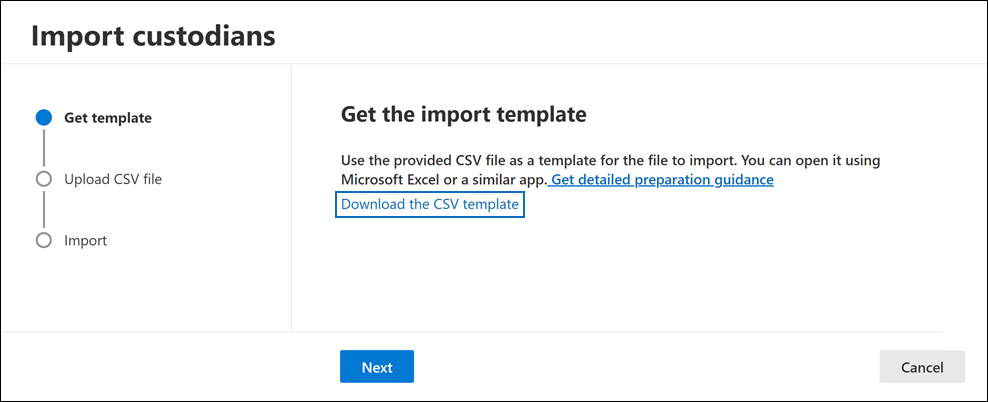

# Import custodians to an Advanced eDiscovery case

For Advanced eDiscovery cases that involve many custodians, you can import multiple custodians at once by using a CSV file that contains the information necessary to add them to a case.

## Import custodians

1. Open the Advanced eDiscovery case and select the **Data sources** tab.

2. Click **Add data source** > **Import custodians**.

3. On the **Import custodians** flyout page, click **Download a blank template** to download a custodian template CSV file.

   

4. Add the custodial information to the CSV file and save it to your local computer. See the [Custodian CSV file](#custodian-csv-file) section for information about the required properties in the CSV file.

5. After you've prepared the CSV file with the custodian information, go back to the **Data sources** tab, and click **Add data source** > **Import custodians** again.

6. On the **Import custodians** flyout page, click **Browse** and then upload the CSV file that contains the custodian information.

   After the CSV file is uploaded, a job named **BulkAddCustodian** is created and displayed on the **Jobs** tab. The job validates the custodians and their associated data sources and then adds them to the **Data sources** page of the case.

## Custodian CSV file

After you download the CSV custodian template, you can add custodians and their data source in each row. Be sure not to change the column names in the header row. Use the workload type and workload location columns to associate other data sources to a custodian.

| Column name|Description|
|:------- |:------------------------------------------------------------|
|**Custodian contactEmail**     |The custodian's UPN email address. For example, sarad@contoso.onmicrosoft.com.           |
|**Exchange Enabled** | TRUE/FALSE value to include or not include the custodian's mailbox.      |
|**OneDrive Enabled** | TRUE/FALSE value to include or not included the custodian's OneDrive for Business account. |
|**Is OnHold**        | TRUE/FALSE value to indicate whether to place the custodian data sources on hold. 1     |
|**Workload1 Type**         |String value indicating the type of data source to associate with the custodian. Possible values include:  - ExchangeMailbox  - SharePointSite - TeamsMailbox - TeamsSite  - YammerMailbox - YammerSite |
|**Workload1 Location**     | Depending on your workload type, this would be the location of the data source. For example, the email address for an Exchange mailbox or the URL for a SharePoint site. |
|||

> [!NOTE]
> 1 You can place a maximum of 1,000 mailboxes and 100 sites on hold by using the custodian import process and CSV file. You can use this process to add more than 1,000 custodians to a case, but the hold limits still apply. For more information about hold limits, see [Limits in Advanced eDiscovery](limits-ediscovery20.md#hold-limits).

Here's an example of a CSV file with custodian information:  

|Custodian contactEmail      | Exchange Enabled | OneDrive Enabled | Is OnHold | Workload1 Type | Workload1 Location             |
| ----------------- | ---------------- | ---------------- | --------- | -------------- | ------------------------------ |
|robinc@onmicrosoft.contoso.com | TRUE             | TRUE             | TRUE      | SharePointSite | https://contoso.sharepoint.com |
|pillarp@onmicrosoft.contoso.com | TRUE             | TRUE             | TRUE      | |  |
||||||

## Custodian and data source validation

After you upload the custodian CSV file, Advanced eDiscovery does the following things:

1. Validates the custodians and their data sources.

2. Indexes all data sources for each custodian and places them on hold (if the **Is OnHold** property in the CSV file is set to TRUE).

### Custodian validation

Currently, we only support importing custodians that are included in your organization's Azure Active Directory (Azure AD).

The custodian import tool finds and validates custodians using the UPN value in the **Custodian contactEmail** column in the CSV file. Custodians that are validated are automatically added to the case and listed on the **Data sources** tab of the case. If a custodian can't be validated, they are listed in the error log for the BulkAddCustodian job that is listed on the **Jobs** tab in the case. Unvalidated custodians are not added to the case or listed on the **Data sources** tab.

### Data source validation

After custodians are validated and added to the case, each primary mailbox and OneDrive account that's associated with a custodian is added.

However, if any of the other data sources (such as SharePoint sites, Microsoft Teams, Microsoft 365 Groups, or Yammer groups) associated with a custodian can't be found, none of them are assigned to the custodian and the value **Not validated** is displayed in the **Status** column next to the custodian on the **Data sources** tab.

To add validated data sources for a custodian:

1. On the **Data sources** tab, select a custodian that contains data sources that aren't validated.

2. On the custodian flyout page, scroll to the **Custodial locations** section to view both validated and unvalidated data sources that are associated with custodian.

3. Click **Edit** at the top of the flyout page to remove invalid data sources or add new ones.

4. After you remove unvalidated data sources or add a new one, the value **Active** is displayed in **Status** column for the custodian on the **Data sources** tab. To add sources that previously appeared to be invalid, follow the remediation steps below to manually add them to a custodian.

### Remediating invalid data sources

To manually add and associate a data source that was previously invalid:

1. On the **Data sources** tab, select a custodian to manually add and associate a data source that was previously invalid.

2. Click **Edit** at the top of the flyout page to associate mailboxes, sites, Teams, or Yammer groups to the custodian. Do this by clicking **Edit** next to the appropriate data location type.

3. Click **Next** to display the **Hold settings** page and configure the hold setting for the data sources you added.

4. Click **Next** to display the **Review custodians** page, and then click **Submit** to save your changes.
