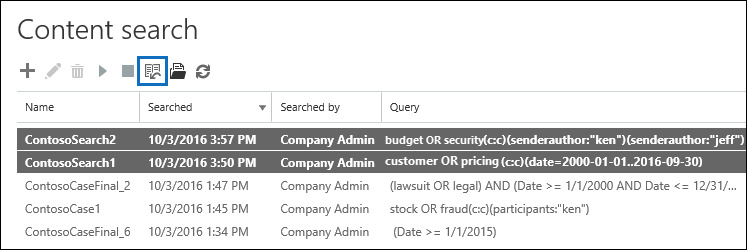

# Bulk edit Content Searches

You can use the Bulk Search Editor in the Content Search tool to edit multiple searches at the same time. Using this tool lets you quickly change the query and content locations for one or more searches. Then you can rerun the searches and get new estimated search results for the revised searches. The editor also lets you copy and paste queries and content locations from a Microsoft Excel file or text file. This means you can use the Search Statistics tool to view the statistics of one or more searches, export the statistics to a CSV file, where you can edit the queries and content locations in Excel. Then you use the Bulk Search Editor to add the revised queries and content locations to the searches. After you've revised one or more searches, you can restart them and get new estimated search results.
  
For more information about using the Search Statistics tool, see [View keyword statistics for Content Search results](view-keyword-statistics-for-content-search.md).
  
## Use the Bulk Search Editor to change queries

1. Go to [https://protection.office.com](https://protection.office.com), and then select **Search** \> **Content search**.
    
2. In the list of searches, select one or more searches, and then select **Bulk Search Editor** .
    
    
  
    The following information is displayed on the **Queries** page of the Bulk Search Editor. 
    
    
  
    a. The **Search** column displays the name of the Content Search. As previously stated, you can edit the query for multiple searches. 
    
    b. The **Query** column displays the query for the Content Search listed in the **Search** column. If the query was created using the keyword list feature, the keywords are separated by the text ** `(c:s)`**. This indicates that the keywords are connected by the **OR** operator. Additionally, if the query includes conditions, the keywords and the conditions are separated by the text ** `(c:c)`**. This indicates that the keywords (or keyword phases) are connected to the conditions by the **AND** operator. For example, in the previous screenshot the for search ContosoSearch1, the KQL query that is equivalent to  `customer (c:s) pricing(c:c)(date=2000-01-01..2016-09-30)` would be  `(customer OR pricing) AND (date=2002-01-01..2016-09-30)`.
    
3. To edit a query, select in the cell of the query that you want to change and doing one of the following things. The cell is bordered by a blue box when you select it.
    
   - Type the new query in the cell. You can't edit a portion of the query. You have to type the entire query.
    
      Or
    
    - Paste a new query in the cell. This assumes that you've copied the query text from a file, such as a text file or an Excel file.
    
4. After you've edited one or more queries on the **Queries** page, select **Save**.
    
    The revised query is displayed in the **Query** column for the selected search. 
    
5. Select **Close** to close the Bulk Search Editor. 
    
6. On the **Content search** page, select the search that you edited, and select **Start** search to restart the search using the revised query. 
    
Here are some tips for editing queries using the Bulk Search Editor:
  
- Copy the existing query (by using **Ctrl C** ) to a text file. Edit the query in the text file, and then copy the revised query and paste it (using **Ctrl V** ) back into the cell on the **Queries** page. 
    
- You can also copy queries from other applications (such as Microsoft Word or Microsoft Excel). However, you might inadvertently add unsupported characters to a query using the Bulk Search Editor. The best way to prevent unsupported characters is to just type the query in a cell on the **Queries** page. Or you can copy a query from Word or Excel and then paste it to file in a plain text editor, such as Microsoft Notepad. Then save the text file and select **ANSI** in the **Encoding** drop-down list. This removes any formatting and unsupported characters. Then you can copy and paste the query from the text file to the **Queries** page. 
    
  
## Use the Bulk Search Editor to change content locations

1. In the Bulk Search Editor for one or more selected searches, select **Enable bulk location editor**, and then select the **Locations** link that is displayed on the page. 
    
    The following information is displayed on the **Locations** page of the Bulk Search Editor. 
    
    
  
    a. **Mailboxes to search** This section displays a column for each selected Content Search and a row for each mailbox that's included in the search. A check mark indicates that the mailbox is included in the search. You can add mailboxes to a search by typing the email address of the mailbox in a blank row and then selecting the check box for the Content Search that you want to add it to. Or you can remove a mailbox from a search by clearing the check box.
    
    b. **SharePoint sites to search** This section displays a row for each SharePoint and OneDrive site that's included in each selected Content Search. A check mark indicates that the site is included in the search. You can add sites to a search by typing the URL for the site in a blank row and then selecting the check box for the Content Search that you want to add it to. Or you can remove a site from a search by clearing the check box.
    
    c. **Other search options** This section indicates whether unindexed items and public folders are included in the search. To include them, make sure the check box is selected. To remove them, clear the check box.
    
2. After you've edited one or more of the sections on the **Locations** page, select **Save**.
    
    The revised content locations are displayed in the appropriate section for the selected searches.
    
3. Select **Close** to close the Bulk Search Editor. 
    
4. On the **Content search** page, select the search that you edited, and select **Start** search to restart the search using the revised content locations. 
    
Here are some tips for editing content locations using the Bulk Search Editor:
  
- You can edit Content Searches to search all mailboxes or sites in the organization by typing **All** in a blank row in the **Mailboxes to search** or **SharePoint sites to search** section and then selecting the check box. 
    
- You can add multiple content locations to one or more searches by copying multiple rows from a text file or an Excel file and then pasting them in a section on the **Locations** page. After you add new locations, be sure to select the check box for each search that you want add the location to. 
    
    > [!TIP]
    > To generate a list of email addresses for all the users in your organization, run the PowerShell command in Step 2 in [Step 2: Generate a list of users](search-the-mailbox-and-onedrive-for-business-for-a-list-of-users.md#step-2-generate-a-list-of-users). Or follow the steps in [Get a list of all user OneDrive URLs in your organization](/onedrive/list-onedrive-urls) to generate a list of all OneDrive for Business sites in your organization. Note that you'll have to append the URL for your organization's MySite domain (for example, https://contoso-my.sharepoint.com) to the OneDrive for Business sites that's created by the script. After you have list of email addresses or OneDrive for Business sites, you can copy and paste them to the **Locations** page in the Bulk Search Editor. 
  
- After you select **Save** to save changes in Bulk Search Editor, the email address for mailboxes that you added to a search will be validated. If the email address doesn't exist, an error message is displayed saying the mailbox can't be located. URLs for sites aren't validated. 
