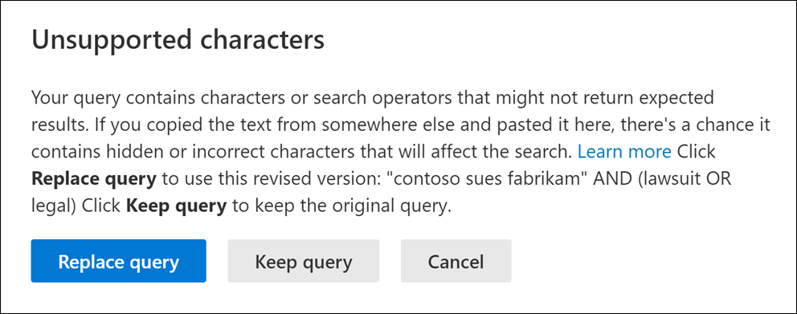

# Check your search query for errors
  
Here's a list of the unsupported characters that we check for in search queries for Content search and Core eDiscovery. Unsupported characters are often hidden, and they typically cause a search error or return unintended results.
  
- **Smart quotation marks** - Smart single and double quotation marks (also called curly quotes) aren't supported. Only straight quotation marks can be used in a search query. 

- **Non-printable and control characters** - Non-printable and control characters don't represent a written symbol, such as an alpha-numeric character. Examples of non-printable and control characters include characters that format text or separate lines of text. 

- **Left-to-right and right-to-left marks** - These marks are control characters used to indicate text direction for left-to-right languages (such as English and Spanish) and right-to-left languages (such as Arabic and Hebrew).

- **Lowercase Boolean operators** - If you use a Boolean operator, such as **AND**, **OR**, and **NOT** in a search query, it must be uppercase. When we check a query for typos, the query syntax will often indicate that a Boolean operator is being used even though lowercase operators might be used; for example,  `(WordA or WordB) and (WordC or WordD)`.

## What happens if a query has an unsupported character?

If unsupported characters are found in your query, a warning message is displayed that says unsupported characters were found and suggests an alternative. You then have the option keep the original query or replace it with the suggested revised query.

Here's an example of the warning message that's displayed after you click **Check query for typos** for the search query in the previous screenshot. Note the original query used smart quotes and lowercase Boolean operators.
  

  
## How to prevent unsupported characters in your search queries

Unsupported characters are typically added to a query when you copy the query or parts of the query from other applications (such as Microsoft Word or Microsoft Excel) and paste them in the keyword box on the query page of a Content Search. The best way to prevent unsupported characters is to just type the query in the keyword box. Or you can copy a query from Word or Excel, and then paste it in a plain text editor, such as Microsoft Notepad. Save the text file and select **ANSI** in the **Encoding** drop-down list. This will remove any formatting and unsupported characters. Then you can copy and paste the query from the text file to the keyword query box.
