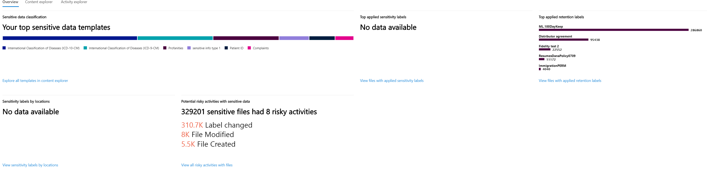

# Creating a trainable classifier (preview)

Use trainable classifiers when one of the out of the box classifiers won't meet your needs. A Microsoft 365 classifier is a tool you can train to recognize various types of content by giving it samples to look at. Training the classifier involves first giving it samples that are human picked and positively match the category, then after it has processed those, testing it predictions by giving it a mix of positive and negative samples. 

To learn more about the different types of classifiers, see [Getting started with trainable classifiers (Preview)](classifier-getting-started-with.md)

## Seed content

When you want a trainable classifier to independently and accurately identify an item as being in particular category of content, you first have to present it with many samples of the type of content that are in the category. This feeding of samples to the trainable classifier is known as *seeding*. Seed content is selected by a human and is already judged to represent the category of content. 

> [!TIP]
> You need to have at least 50 positive samples and as many as 500. The trainable classifier will process up to the 500 most recent created samples (by file created date/time stamp). The more samples you provide, the more accurate the predictions the classifier will make.

## Testing content

Once the trainable classifier has processed enough positive samples to build a prediction model, you need to further train it to distinguish between a positive match and a negative match. You do this by feeding it another, hopefully larger, set of human picked content that consists of samples that should fall into the category and samples that won't. Once it processes those, you will manually go through the results and verify the correct and incorrect responses. The trainable classifier uses this feedback to improve its prediction model. 

> [!TIP]
> For best results, have 10,000 items in your test sample set with an even distribution of positive and negative matches.

## How to create a trainable classifier

1. Collect between 50-500 seed content items. These must be samples that strongly represent the type of content you want the trainable classifier to positively identify as being in the classification category. See, [Default crawled file name extensions and parsed file types in SharePoint Server](https://docs.microsoft.com/en-us/sharepoint/technical-reference/default-crawled-file-name-extensions-and-parsed-file-types) for the supported file types.

> [!IMPORTANT]
> The sample items must not be encrypted and they must be in English.

2. Place the seed content in a SharePoint Online folder that is dedicated to holding *the seed content only*. Make note of the site url and folder. 
> [!TIP]
> If you create a new site and folder for your seed data, allow at least an hour for that location to be indexed before creating the trainable classifier that will use that seed data.

3. Sign in to Microsoft 365 compliance center with compliance admin or security admin role access and open [Microsoft 365 compliance center](https://compliance.microsoft.com/dataclassification?viewid=overview) or [Microsoft 365 security center](https://security.microsoft.com/dataclassification?viewid=overview) > **Classification** > **Data Classification**

4. Choose the **Trainable classifiers** tab.

5. Choose **Create trainable classifier**.

6. Fill in appropriate values for the `Name`, and `Description` fields of the category of items you want this trainable classifier to identify.

7. Enter the exact URL and folder for the seed content site from step 2. Choose `Add`.

8. Review the settings and choose `Create trainable classifier`.

9. Wait 24 hours for the trainable classifier to process the seed data and build a prediction model. The classifier status will be `In progress` while it processes the seed data. When the classifier is finished processing the seed data, the status will change to `never tested`

10. 

<!-- o	Explain what seed material is and the goal of seeding
o	Gather seed material in either an SPO folder or EXO mailbox
o	Run training
o	Gather test materials in either an SPO folder or EXO mailbox
o	Run test
o	Review and evaluate test results
o	Achieve stability
o	Publish (BE REALLY SURE B/C ONCE PUBLISHED, NO UPDATING)
o	Use Classifier classified content for auto-apply labels
o	See Also
	Retention labels
	Retention policies
	Sensitivity labels
	Sensitive information types
	Other methods of classification
•	KQL
•	Manual
•	EDM
•	Doc fingerprinting
	Methods of applying labels -->

