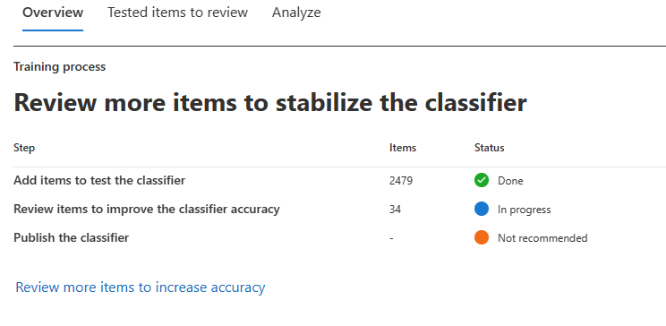

# Get started with trainable classifiers (preview)

A Microsoft 365 trainable classifier is a tool you can train to recognize various types of content by giving it samples to look at. Once trained, you can use it to identify item for application of Office sensitivity labels, Communications compliance policies, and retention label policies.

Creating a custom trainable classifier first involves giving it samples that are human picked and positively match the category. Then, after it has processed those, you test the classifiers ability to predict by giving it a mix of positive and negative samples. This article shows you how to create and train a custom classifier and how to improve the performance of custom trainable classifiers and pre-trained classifiers over their lifetime through retraining.

To learn more about the different types of classifiers, see [Learn about trainable classifiers (preview)](classifier-learn-about.md).

## Prerequisites

### Licensing requirements

Classifiers are a Microsoft 365 E5, or E5 Compliance feature. You must have one of these subscriptions to make use of them.

### Permissions

To access classifiers in the UI: 

- the Global admin needs to opt in for the tenant to create custom classifiers
- the Compliance admin role or Compliance Data Administrator is required to train a classifier

You'll need accounts with these permissions to use classifiers in these scenarios:

- Retention label policy scenario: Record Management and Retention Management roles 
- Sensitivity label policy scenario: Security Administrator, Compliance Administrator, Compliance Data Administrator
- Communication compliance policy scenario: Insider Risk Management Admin, Supervisory Review Administrator 

## Prepare for a custom trainable classifier 

It's helpful to understand what's involved in creating a custom trainable classifier before you dive in. 

### Timeline

This timeline reflects a sample deployment of trainable classifiers.

> [!TIP]
> Opt-in is required the first time for trainable classifiers. It takes twelve days for Microsoft 365 to complete a baseline evaluation of your organizations content. Contact your global administrator to kick off the opt-in process.

### Overall workflow

To understand more about the overall workflow of creating custom trainable classifiers, see [Process flow for creating customer trainable classifiers](classifier-learn-about.md#process-flow-for-creating-custom-classifiers)

### Seed content

When you want a trainable classifier to independently and accurately identify an item as being in particular category of content, you first have to present it with many samples of the type of content that are in the category. This feeding of samples to the trainable classifier is known as *seeding*. Seed content is selected by a human and is judged to represent the category of content.

> [!TIP]
> You need to have at least 50 positive samples and as many as 500. The trainable classifier will process up to the 500 most recent created samples (by file created date/time stamp). The more samples you provide, the more accurate the predictions the classifier will make.

### Testing content

Once the trainable classifier has processed enough positive samples to build a prediction model, you need to test the predictions it makes to see if the classifier can correctly distinguish between items that match the category and items that don't. You do this by feeding it another, hopefully larger, set of human picked content that consists of samples that should fall into the category and samples that won't. Once it processes those, you manually go through the results and verify whether each prediction is correct, incorrect, or you aren't sure. The trainable classifier uses this feedback to improve its prediction model.

> [!TIP]
> For best results, have at least 200 items in your test sample set with an even distribution of positive and negative matches.

## How to create a trainable classifier

1. Collect between 50-500 seed content items. These must be only samples that strongly represent the type of content you want the trainable classifier to positively identify as being in the classification category. See, [Default crawled file name extensions and parsed file types in SharePoint Server](https://docs.microsoft.com/sharepoint/technical-reference/default-crawled-file-name-extensions-and-parsed-file-types) for the supported file types.

> [!IMPORTANT]
> The seed and test sample items must not be encrypted and they must be in English.

> [!IMPORTANT]
> Make sure the items in your seed set are **strong** examples of the category. The trainable classifier initially builds its model based on what you seed it with. The classifier assumes all seed samples are strong positives and has no way of knowing if a sample is a weak or negative match to the category.

2. Place the seed content in a SharePoint Online folder that is dedicated to holding *the seed content only*. Make note of the site, library, and folder URL.

> [!TIP]
> If you create a new site and folder for your seed data, allow at least an hour for that location to be indexed before creating the trainable classifier that will use that seed data.

3. Sign in to Microsoft 365 compliance center with compliance admin or security admin role access and open **Microsoft 365 compliance center** or **Microsoft 365 security center** > **Data classification**

4. Choose the **Trainable classifiers** tab.

5. Choose **Create trainable classifier**.

6. Fill in appropriate values for the `Name`, and `Description` fields of the category of items you want this trainable classifier to identify.

7. Pick the SharePoint Online site, library, and folder URL for the seed content site from step 2. Choose `Add`.

8. Review the settings and choose `Create trainable classifier`.

9. Within 24 hours the trainable classifier will process the seed data and build a prediction model. The classifier status is `In progress` while it processes the seed data. When the classifier is finished processing the seed data, the status changes to `Need test items`.

10. You can now view the details page by choosing the classifier.

11. Collect at least 200 test content items (10,000 max) for best results. These should be a mix of items that are strong positives, strong negatives and some that are a little less obvious in their nature. See, [Default crawled file name extensions and parsed file types in SharePoint Server](https://docs.microsoft.com/sharepoint/technical-reference/default-crawled-file-name-extensions-and-parsed-file-types) for the supported file types.

> [!IMPORTANT]
> The sample items must not be encrypted and they must be in English.

12. Place the test content in a SharePoint Online folder that is dedicated to holding *the test content only*. Make note of the SharePoint Online site, library, and folder URL.

> [!TIP]
> If you create a new site and folder for your test data, allow at least an hour for that location to be indexed before creating the trainable classifier that will use that seed data.

13. Choose `Add items to test`.

14. Pick the SharePoint Online site, library, and folder URL for the test content site from step 12. Choose `Add`.

15. Finish the wizard by choosing `Done`. Your trainable classifier will take up to an hour to process the test files.

16. When the trainable classifier is done processing your test files, the status on the details page will change to `Ready to review`. If you need to increase the test sample size, choose `Add items to test` and allow the trainable classifier to process the additional items.

17. Choose `Tested items to review` tab to review items.

18. Microsoft 365 will present 30 items at a time. Review them and in the `We predict this item is "Relevant". Do you agree?` box choose either `Yes` or `No` or `Not sure, skip to next item`. Model accuracy is automatically updated after every 30 items.

19. Review *at least* 200 items. Once the accuracy score has stabilized, the **publish** option will become available and the classifier status will say `Ready to use`.

20. Publish the classifier.

21. Once published your classifier will be available as a condition in [Office auto-labeling with sensitivity labels](apply-sensitivity-label-automatically.md), [auto-apply retention label policy based on a condition](apply-retention-labels-automatically.md#configuring-conditions-for-auto-apply-retention-labels) and in [Communication compliance](communication-compliance.md).

## Retraining classifiers used in Communication compliance policies (preview)

> [!IMPORTANT]
> You provide feedback in the compliance solution that is using the classifier as a condition. For this preview, the retraining feedback loop is being rolled out in communication compliance first. **If you don't have a communications compliance policy that uses a classifier as a condition, stop here.**

As you use your classifiers, you may want to increase the accuracy of the classifications that they are making. You can do this by evaluating the items it has identified as being a match or not a match. After you make 30 such evaluations for a classifier it takes that feedback and automatically retrains itself.

To understand more about the overall workflow of retraining a classifier, see [Process flow for retraining a classifier](classifier-learn-about.md#retraining-classifiers).

> [!NOTE]
> A classifier must already be published and in use before it can be retrained.

### How to re-train a classifier in communication compliance policies (preview)

1. Open the Communication compliance policy that uses a classifier as a condition and choose one of the identified items from the **Pending** list.
2. Choose the elipsis and **Provide detailed feedback**.
3. In the **Detailed feedback** pane, if the item is a true positive, choose, **Match**.  If the item is a false positive, that is it was incorrectly included in the category, choose **Not a match**.
4. If there is another classifier that would be more appropriate for the item you can choose it from the **Suggest other trainable classifiers** list for evaluation by that other classifier.

> [!TIP]
> You can provide feedback on multiple items simultaneously by choosing them all and then choosing **Provide detailed feedback** in the command bar.

5. Choose **Send feeedback** to send your evaluation of match, not a match, and suggest other trainable classifiers to the classifiers. When you have provided 30 instances of feedback to a classifier, it will automatically start retraining. Retraining can take from 1-4 hours. Classifiers can only be retrained twice per day.

> [!IMPORTANT]
> This information goes to the classifier in your tenant, **it does not go back to Microsoft**.

6.  Open the Data classification page in the **Microsoft 365 compliance center** or **Microsoft 365 security center** > **Classification** > **Data Classification**.
7. Open **Trainable classifiers (preview)**.
8. The classifier that was used in your Communications compliance policy will appear under the **Re-training** heading.

GET SCREENSHOT OF RE-TRAINING SCREEN

9. Once retraining completes, choose the classifier to open the side by side comparison view.

GET SCREENSHOT OF SxS COMPARISON SCREEN

10. Review the prediction comparisons of the retrained and currently published versions of the classifier.
11. If you satisfied with the results of the retraining, choose **Re-publish**.
12. If you are not satisfied with the results of the retraining, you can either choose to provide additional feedback on classified items to the classifier in the Communications compliance interface and start another retraining cycle or do nothing in which case the currently published version of the classifier will continue to be used. 

## Retraining classifiers through content explorer (preview)

> [!IMPORTANT]
> At this preview, you can retrain classifiers that you've used in DLP policies that target Exchange locations only. You cannot retrain classifiers used in DLP policies that target any other locations.  provide feedback in the compliance solution that is using the classifier as a condition. For this preview, the retraining feedback loop is being rolled out in communication compliance first. **If you don't have a communications compliance policy that uses a classifier as a condition, stop here.**

## See also

- [Learn about trainable classifiers (preview)](classifier-learn-about.md)
- [Default crawled file name extensions and parsed file types in SharePoint Server](https://docs.microsoft.com/sharepoint/technical-reference/default-crawled-file-name-extensions-and-parsed-file-types)
