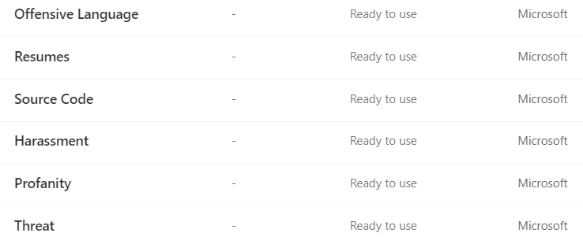
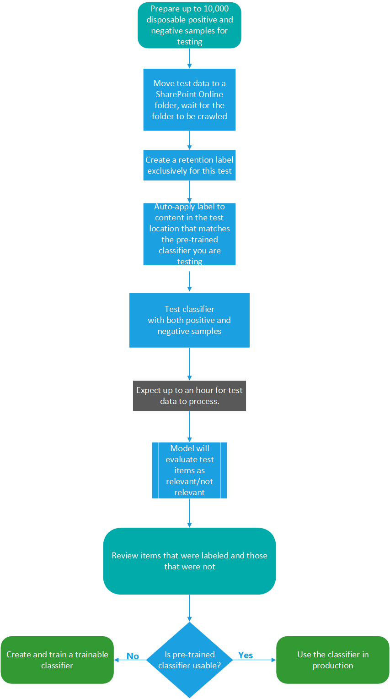
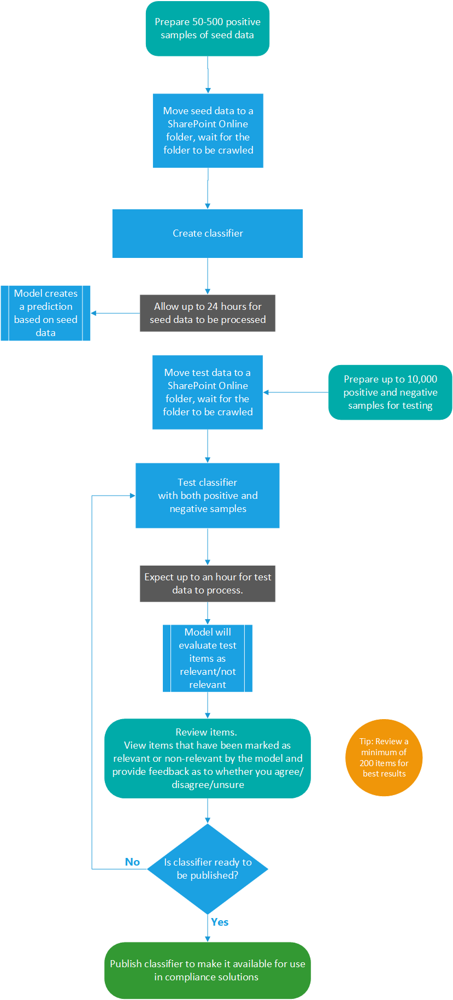

# Getting started with trainable classifiers

Classifying content and then labeling it so it can be protected and handled properly is the starting place for the information protection discipline. Microsoft 365 has three ways to classify content:

1. **Manually** - This requires human judgement and action. An admin may either use the pre-existing labels and sensitive information types or create their own and the publish them. Users and admins apply them to content as they encounter it. You can then protect the content and manage its disposition.
2. **Automated pattern matching** - This category of classification mechanisms includes, finding content by keywords, or metadata values (keyword query language), using previously identified patterns of sensitive information like social security, credit card or bank account numbers [(sensitive information types)](what-the-sensitive-information-types-look-for.md). Recognizing an item because it is a variation on a template [(document finger printing)](document-fingerprinting.md) or using the presence of exact strings [(exact data match)](create-custom-sensitive-information-types-with-exact-data-match-based-classification.md). Labels can then be automatically applied which then makes the content available for use in [data loss prevention (DLP)](data-loss-prevention-policies.md) and [retention policies](retention-policies.md).
3. **Trainable classifiers** - This classification method is particularly well suited to content that, by it's nature, isn't predisposed to being easily identified by either the manual or automated pattern matching methods. This method of classification is more about training a classifier to identify what an item is, not by elements that are in the item (pattern matching) but by examples of the type of items. A classifier learns how to identify a type of content by looking a hundreds of examples of the type of content you are interested in classifying. You start by feeding it examples that are definitely in the category, then once it processes those, you test it by giving it a mix of both matching and non-matching examples. The classifier then makes predictions as to whether or not any given item falls into the category you are building. You then confirm it's results, sorting out the positives, negatives and false positives and false negatives to help increase the accuracy of it's predictions. When you publish the trained classifier, it sorts through items in locations, like SharePoint Online, and classifies the content. The trainable classifier is then available as a condition for auto-apply retention label policy workflow.

> [!IMPORTANT]
> Trainable classifiers only work with items that are in english.

## Types of trainable classifiers

Getting a trainable classifier to a publishable state requires a time investment to train it. To help you get started using classifiers, Microsoft 365 comes with a few pre-trained classifiers.

> [!NOTE]
> Before you use pre-trained classifiers in your classification and labeling workflow, you should test it against a sample of your organizations content that you feel fits the category to verify that its classification predictions meet your expectations.

### Pre-trained classifiers

Microsoft 365 comes with six pre-trained classifiers:

- Offensive Language: detects items which contain sentiment associated with profanities, slurs, and disguised expressions
- Resumes: detects items which are textual accounts of an applicant's personal, educational, professional qualifications, work experience and other personally identifying information
- SourceCode: detects items which contain a set of instructions and statements written in widely used computer programming languages.
- Harassment: detects items with a specific category of offensive language related to offensive conduct targeting one or multiple individuals regarding race, color, religion, national origin, gender, sexual orientation, age, disability and genetic information.
- Profanity: detects items with a specific category of offensive language that contains swear words or vulgar language
- Threat: detects items with a specific category of offensive language related to threat to commit violence or do physical harm/damage to a person/property

These appear in the **Microsoft 365 compliance center** > **Data classification (preview)** > **Trainable classifiers** view with the status of `Ready to use`.

#### Process flow for using pre-trained classifiers

Pre-trained classifiers don't need to be trained, but you do need to confirm that they will identify the types of content that you need them to before you use them in compliance solutions. Testing a pre-trained classifier follows this flow.

### Trainable classifiers

When the pre-trained classifiers don't meet your needs, you can create and train your own classifiers. There is significantly more work involved with creating your own, but they'll be much better tailored to your organizations needs. For more detail on how to use a pre-trained classifier, see [Using a pre-trained classifier](classifier-using-a-pre-trained-classifier.md)

#### Process flow for creating trainable classifiers

Creating and publishing a trainable classifier for use in compliance solutions such as retention policies and communication supervision follows this flow. For more detail on creating a trainable classifier see, [Creating a trainable classifier](classifier-creating-a-custom-classifier.md)

## See also

- [retention labels](labels.md)
- [retention policies](retention-policies.md)
- [data loss prevention (DLP)](data-loss-prevention-policies.md)
- [sensitivity labels](sensitivity-labels.md)
- [sensitive information types](what-the-sensitive-information-types-look-for.md)
- [document finger printing](document-fingerprinting.md)
- [exact data match](create-custom-sensitive-information-types-with-exact-data-match-based-classification.md)
