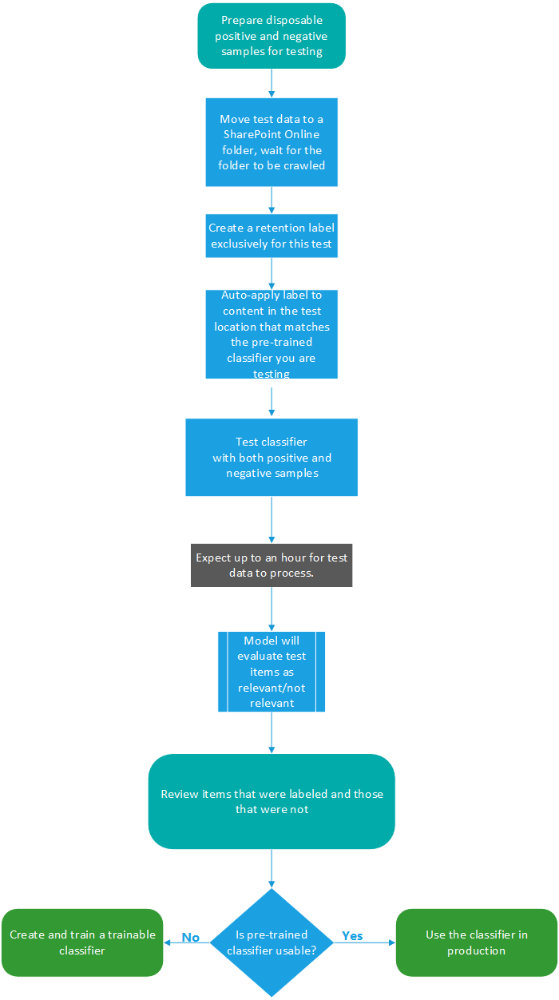

# Getting started with trainable classifiers (preview)

Classifying and labeling content so it can be protected and handled properly is the starting place for the information protection discipline. Microsoft 365 has three ways to classify content.

## Manually

This method requires human judgment and action. An admin may either use the pre-existing labels and sensitive information types or create their own and then publish them. Users and admins apply them to content as they encounter it. You can then protect the content and manage its disposition.

## Automated pattern matching

This category of classification mechanisms includes finding content by:

- Keywords or metadata values (keyword query language).
- Using previously identified patterns of sensitive information like social security, credit card or bank account numbers [(Sensitive information type entity definitions)](sensitive-information-type-entity-definitions.md).
- Recognizing an item because it's a variation on a template [(document finger printing)](document-fingerprinting.md).
- Using the presence of exact strings [(exact data match)](create-custom-sensitive-information-types-with-exact-data-match-based-classification.md).

Sensitivity and retention labels can then be automatically applied to make the content available for use in [data loss prevention (DLP)](data-loss-prevention-policies.md) and [retention policies](retention-policies.md).

## Trainable classifiers

This classification method is particularly well suited to content that isn't easily identified by either the manual or automated pattern matching methods. This method of classification is more about training a classifier to identify an item based on what the item is, not by elements that are in the item (pattern matching). A classifier learns how to identify a type of content by looking at hundreds of examples of the content you're interested in classifying. You start by feeding it examples that are definitely in the category. Once it processes those, you test it by giving it a mix of both matching and non-matching examples. The classifier then makes predictions as to whether any given item falls into the category you're building. You then confirm its results, sorting out the positives, negatives, false positives, and false negatives to help increase the accuracy of its predictions. When you publish the trained classifier, it sorts through items in locations like SharePoint Online, Exchange, and OneDrive, and classifies the content.

### Where you can use trainable classifiers
Both built-in classifiers and trainable classifiers are available as a condition for [auto-apply retention label policy based on a condition](labels.md#applying-a-retention-label-automatically-based-on-conditions) and [communication compliance](communication-compliance-configure.md). 

Sensitivity labels can use built-in and build-your-own classifiers as conditions, see [Apply a sensitivity label to content automatically](apply-sensitivity-label-automatically.md), and [auto-labeling for Office apps](apply-sensitivity-label-automatically.md#how-to-configure-auto-labeling-for-office-apps).

> [!IMPORTANT]
> Trainable classifiers only work with items that are not encrypted and are in English.

### Licensing requirements

Trainable classifiers are a Microsoft 365 E5, or E5 Compliance feature. You must have one of these subscriptions to make use of them.

### Gov Cloud Availability 

Trainable Classifiers are not yet available in government cloud environments. We are currently in the process of expanding support for GCC/GCCH/DoD clouds.  

### Pre-requisites

To access trainable classifiers in the UI: 
- the Global admin needs to opt in for the tenant
- Compliance admin role or Compliance Data Administrator is required to train a classifier

You'll need accounts with these permissions to use trainable classifiers in these scenarios:

- Retention label policy scenario: RecordManagement and Retention Management roles 
- Sensitivity label policy scenario: Security Administrator, Compliance Administrator, Compliance Data Administrator
- Communication compliance policy scenario: Insider Risk Management Admin, Supervisory Review Administrator 

## Types of classifiers

There are built-in classifiers and trainable classifiers. Getting a trainable classifier to a publishable state requires a time investment to train it. To help you get started using classifiers, Microsoft 365 comes with a few built-in classifiers.

> [!NOTE]
> Before using any built-in classifier in your classification and labeling workflow, you should test it against a sample of your organizations content that you feel fits the category to verify that its classification predictions meet your expectations.

### Understanding built-in classifiers

Microsoft 365 comes with five recommended built-in classifiers:

> [!CAUTION]
> We are deprecating the **Offensive Language** built-in classifier because it has been producing a high number of false positives. Don't use it and if you are currently using it, you should move your business processes off of it. We recommend using the **Threat**, **Profanity**, and **Harassment** built-in classifiers instead.

- **Resumes**: detects items that are textual accounts of an applicant's personal, educational, professional qualifications, work experience, and other personally identifying information
- **Source Code**: detects items that contain a set of instructions and statements written in the top 25 used computer programming languages on GitHub

  |language name|||||
  |---------|---------|---------|---------|---------|
  |ActionScript|C        |C#       |C++     |Clojure  |
  |CoffeeScript|CSS     |Go       |Haskell |HTML     |
  |Java     |JavaScript|Lua      |MATLAB   |Objective-C|
  |Perl     |PHP      |Python   |R        |Ruby     |
  |Scala    |Shell    |Swift    |Tex      |Vim Script|

> [!NOTE]
> Source Code is trained to detect when the bulk of the text is source code. It does not detect source code text that is interspersed with plain text.

- **Harassment**: detects a specific category of offensive language text items related to offensive conduct targeting one or multiple individuals based on the following traits: race, ethnicity, religion, national origin, gender, sexual orientation, age, disability
- **Profanity**: detects a specific category of offensive language text items that contain expressions that embarrass most people
- **Threat**: detects a specific category of offensive language text items related to threats to commit violence or do physical harm or damage to a person or property

These appear in the **Microsoft 365 compliance center** > **Data classification (preview)** > **Trainable classifiers** view with the status of `Ready to use`.

> [!IMPORTANT]
> Please note that the offensive language, harassment, profanity, and threat classifiers only work with searchable text are not exhaustive or complete.  Further, language and cultural standards continually change, and in light of these realities, Microsoft reserves the right to update these classifiers in its discretion. While the classifiers may assist your organization in monitoring offensive and other language used, the classifiers do not address consequences of such language and are not intended to provide your organization's sole means of monitoring or responding to the use of such language. Your organization, and not Microsoft or its subsidiaries, remains responsible for all decisions related to monitoring, enforcement, blocking, removal and retention of any content identified by a pre-trained classifier.

#### Process flow for using built-in classifiers

Built-in classifiers don't need to be trained, but you do need to confirm that they will identify the types of content that you need them to before you use them in compliance solutions. Testing a pre-trained classifier follows this flow.

### Understanding trainable classifiers

When the built-in classifiers don't meet your needs, you can create and train your own classifiers. There's significantly more work involved with creating your own, but they'll be much better tailored to your organizations needs. For more detail on how to use a pre-trained classifier, see [Using a built-in classifier](classifier-using-a-ready-to-use-classifier.md)

> [!IMPORTANT]
> Only the user who creates a trainable classifier can train and review predictions made by that classifier.

#### Process flow for creating trainable classifiers

Creating and publishing a trainable classifier for use in compliance solutions, such as retention policies and communication supervision, follows this flow. For more detail on creating a trainable classifier see, [Creating a trainable classifier](classifier-creating-a-trainable-classifier.md).

## See also

- [Retention labels](labels.md)
- [Retention policies](retention-policies.md)
- [Data loss prevention (DLP)](data-loss-prevention-policies.md)
- [Sensitivity labels](sensitivity-labels.md)
- [Sensitive information type entity definitions](sensitive-information-type-entity-definitions.md)
- [Document finger printing](document-fingerprinting.md)
- [Exact data match](create-custom-sensitive-information-types-with-exact-data-match-based-classification.md)
