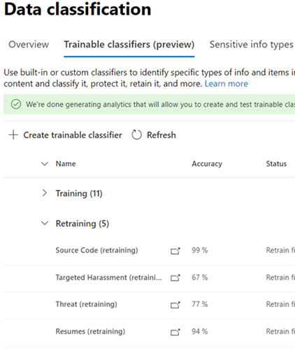
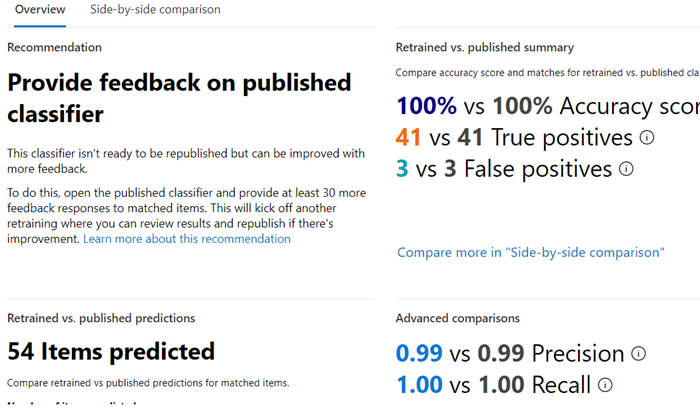

# How to retrain a classifier in communications compliance

A Microsoft 365 trainable classifier is a tool you can train to recognize various types of content by giving it samples to look at. Once trained, you can use it to identify item for application of Office sensitivity labels, communications compliance policies, and retention label policies.

This article shows you how to improve the performance of custom trainable classifiers and some pre-trained classifiers by providing them additional feedback.

To learn more about the different types of classifiers, see [Learn about trainable classifiers](classifier-learn-about.md).

## Permissions

To access classifiers in the Microsoft 365 Compliance center:

- the Compliance admin role or Compliance Data Administrator is required to train a classifier

You'll need accounts with these permissions to use classifiers in these scenarios:

- Communication compliance policy scenario: Insider Risk Management Admin, Supervisory Review Administrator 

## Overall workflow

> [!IMPORTANT]
> You provide feedback in the compliance solution that is using the classifier as a condition. **If you don't have a communications compliance policy that uses a classifier as a condition, stop here.**

As you use your classifiers, you may want to increase the precision of the classifications that they're making. You do this by evaluating the quality of the classifications made  for items it has identified as being a match or not a match. After you make 30 evaluations for a classifier it takes that feedback and automatically retrains itself.

To understand more about the overall workflow of retraining a classifier, see [Process flow for retraining a classifier](classifier-learn-about.md#retraining-classifiers).

> [!NOTE]
> A classifier must already be published and in use before it can be retrained.

## How to retrain a classifier in communication compliance policies

1. Open the Communication compliance policy that uses a classifier as a condition and choose one of the identified items from the **Pending** list.
2. Choose the ellipsis and **Improve classification**.
3. In the **Detailed feedback** pane, if the item is a true positive, choose, **Match**.  If the item is a false positive, that is it was incorrectly included in the category, choose **Not a match**.
4. If there is another classifier that would be more appropriate for the item, you can choose it from the **Suggest other trainable classifiers** list. This will trigger the other classifier to evaluate the item.

> [!TIP]
> You can provide feedback on multiple items simultaneously by choosing them all and then choosing **Provide detailed feedback** in the command bar.

5. Choose **Send feedback** to send your evaluation of the `match`, `not a match` classifications and suggest other trainable classifiers. When you've provided 30 instances of feedback to a classifier, it will automatically  retrain. Retraining can take from 1-4 hours. Classifiers can only be retrained twice per day.

> [!IMPORTANT]
> This information goes to the classifier in your tenant, **it does not go back to Microsoft**.

6.  Open the **Data classification** page in the **Microsoft 365 compliance center**.
7. Open **Trainable classifiers**.
8. The classifier that was used in your Communications compliance policy will appear under the **Re-training** heading.

9. Once retraining completes, choose the classifier to open the retraining overview.

10. Review the recommended action, and the prediction comparisons of the retrained and currently published versions of the classifier.
11. If you satisfied with the results of the retraining, choose **Re-publish**.
12. If you are not satisfied with the results of the retraining, you can choose to provide additional feedback to the classifier in the Communications compliance interface and start another retraining cycle or do nothing in which case the currently published version of the classifier will continue to be used. 

## Details on republishing recommendations

Here is a little information on how we formulate the recommendation to re-publish a retrained classifier or suggest further retraining. This requires a little deeper understanding of how trainable classifiers work.

After a retrain, we evaluate the classifier's performance on both the items with feedback as well as any items originally used to train the classifier. 

- For built-in models, items used to train the classifier are the items used by Microsoft to build the model.
- For custom models, items used in the original training the classifier are from the sites you had added for test and review.

We compare the performance numbers on both sets of items for the retrained and published classifier to provide a recommendation on whether there was improvement to republish. 

## See also

- [Learn about trainable classifiers](classifier-learn-about.md)
- [Default crawled file name extensions and parsed file types in SharePoint Server](/sharepoint/technical-reference/default-crawled-file-name-extensions-and-parsed-file-types)