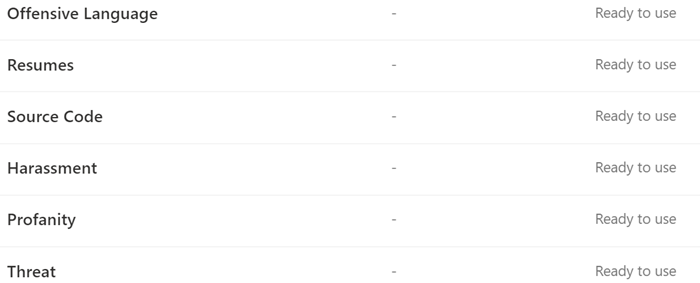

# Learn about trainable classifiers

Classifying and labeling content so it can be protected and handled properly is the starting place for the information protection discipline. Microsoft 365 has three ways to classify content.

## Manually

This method requires human judgment and action. An admin may either use the pre-existing labels and sensitive information types or create their own and then publish them. Users and admins apply them to content as they encounter it. You can then protect the content and manage its disposition.

## Automated pattern matching

This category of classification mechanisms include finding content by:

- Keywords or metadata values (keyword query language).
- Using previously identified patterns of sensitive information like social security, credit card or bank account numbers [(Sensitive information type entity definitions)](sensitive-information-type-entity-definitions.md).
- Recognizing an item because it's a variation on a template [(document finger printing)](document-fingerprinting.md).
- Using the presence of exact strings [(exact data match)](create-custom-sensitive-information-types-with-exact-data-match-based-classification.md).

Sensitivity and retention labels can then be automatically applied to make the content available for use in [Learn about data loss prevention](dlp-learn-about-dlp.md)) and [auto-apply polices for retention labels](apply-retention-labels-automatically.md).

## Classifiers

This classification method is particularly well suited to content that isn't easily identified by either the manual or automated pattern matching methods. This method of classification is more about training a classifier to identify an item based on what the item is, not by elements that are in the item (pattern matching). A classifier learns how to identify a type of content by looking at hundreds of examples of the content you're interested in classifying. You start by feeding it examples that are definitely in the category. Once it processes those, you test it by giving it a mix of both matching and non-matching examples. The classifier then makes predictions as to whether any given item falls into the category you're building. You then confirm its results, sorting out the true positives, true negatives, false positives, and false negatives to help increase the accuracy of its predictions. 

When you publish the classifier, it sorts through items in locations like SharePoint Online, Exchange, and OneDrive, and classifies the content. After you publish the classifier, you can continue to train it using a feedback process that is similar to the initial training process.

### Where you can use trainable classifiers
Both built-in classifiers and trainable classifiers are available as a condition for [Office autolabeling with sensitivity labels](apply-sensitivity-label-automatically.md), [auto-apply retention label policy based on a condition](apply-retention-labels-automatically.md#configuring-conditions-for-auto-apply-retention-labels) and in [communication compliance](communication-compliance.md). 

Sensitivity labels can use classifiers as conditions, see [Apply a sensitivity label to content automatically](apply-sensitivity-label-automatically.md).

> [!IMPORTANT]
> Classifiers only work with items that are not encrypted and are in English.

## Types of classifiers

- **pre-trained classifiers** - Microsoft has created and pre-trained a number of classifiers that you can start using without training them. These classifiers will appear with the status of `Ready to use`.
- **custom classifiers** - If you have classification needs that extend beyond what the pre-trained classifiers cover, you can create and train your own classifiers.

### Pre-trained classifiers

Microsoft 365 comes with five pre-trained classifiers:

> [!CAUTION]
> We are deprecating the **Offensive Language** pre-trained classifier because it has been producing a high number of false positives. Don't use it and if you are currently using it, you should move your business processes off of it. We recommend using the **Threat**, **Profanity**, and **Harassment** pre-trained classifiers instead.

- **Resumes**: detects items that are textual accounts of an applicant's personal, educational, professional qualifications, work experience, and other personally identifying information
- **Source Code**: detects items that contain a set of instructions and statements written in the top 25 used computer programming languages on GitHub
    - ActionScript
    - C
    - C#
    - C++
    - Clojure
    - CoffeeScript
    - Go
    - Haskell
    - Java
    - JavaScript
    - Lua
    - MATLAB
    - Objective-C
    - Perl
    - PHP
    - Python
    - R
    - Ruby
    - Scala
    - Shell
    - Swift
    - Tex
    - Vim Script

> [!NOTE]
> Source Code is trained to detect when the bulk of the text is source code. It does not detect source code text that is interspersed with plain text.

- **Harassment**: detects a specific category of offensive language text items related to offensive conduct targeting one or multiple individuals based on the following traits: race, ethnicity, religion, national origin, gender, sexual orientation, age, disability
- **Profanity**: detects a specific category of offensive language text items that contain expressions that embarrass most people
- **Threat**: detects a specific category of offensive language text items related to threats to commit violence or do physical harm or damage to a person or property
- **Discrimination**: detects explicit discriminatory language and is particularly sensitive to discriminatory language against the African American/Black communities when compared to other communities.

These appear in the **Microsoft 365 compliance center** > **Data classification** > **Trainable classifiers** view with the status of `Ready to use`.

> [!IMPORTANT]
> Please note the offensive language, harassment, profanity, discrimination, and threat classifiers only work with searchable text and are not an exhaustive or complete list of terms or language across these areas. Further, language and cultural standards continually change, and in light of these realities, Microsoft reserves the right to update these classifiers in its discretion. While classifiers may assist your organization in detecting these areas, classifiers are not intended to provide your organization's sole means of detecting or addressing the use of such language. Your organization, not Microsoft or its subsidiaries, remains responsible for all decisions related to monitoring, scanning, blocking, removal, and retention of any content identified by a pre-trained classifier, including compliance with local privacy and other applicable laws. Microsoft encourages consulting with legal counsel before deployment and use.

### Custom classifiers

When the pre-trained classifiers don't meet your needs, you can create and train your own classifiers. There's significantly more work involved with creating your own, but they'll be much better tailored to your organizations needs. 

For example you could create trainable classifiers for:
 
- Legal documents - such as attorney client privilege, closing sets, statement of work
- Strategic business documents - like press releases, merger and acquisition, deals, business or marketing plans, intellectual property, patents, design docs
- Pricing information - like invoices, price quotes, work orders, bidding documents 
- Financial information - such as organizational investments, quarterly or annual results    

#### Process flow for creating custom classifiers

Creating and publishing a classifier for use in compliance solutions, such as retention policies and communication supervision, follows this flow. For more detail on creating a custom trainable classifier see, [Creating a custom classifier](classifier-get-started-with.md).

### Retraining classifiers

You can help improve the accuracy of all custom classifiers and some pre-trained classifiers by providing them with feedback on the accuracy of the classification that they perform. This is called retraining and follow this workflow.

## See also

- [Retention labels](retention.md)
- [Learn about data loss prevention](dlp-learn-about-dlp.md)
- [Sensitivity labels](sensitivity-labels.md)
- [Sensitive information type entity definitions](sensitive-information-type-entity-definitions.md)
- [Document finger printing](document-fingerprinting.md)
- [Exact data match](create-custom-sensitive-information-types-with-exact-data-match-based-classification.md)
