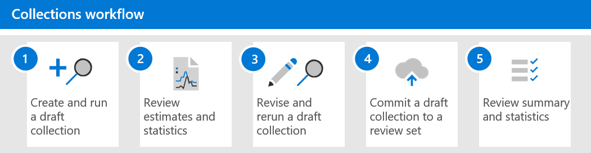

# Learn about collections in Advanced eDiscovery

> [!NOTE]
> We're rolling out a new collections experience in Advanced eDiscovery, which is described in this article. This rollout will take a number of weeks before it's available to all organizations. If the new collections experience isn't available in your organization, you can still collect case content with the [Advanced eDiscovery search tool](create-search-to-collect-data.md).

When organizations are faced with gathering the communications and content that may be relevant to an investigation or potential litigation, they face a significant challenge under the best of circumstances. In today’s modern workplace, the volume, variety, and velocity of content is enabling innovation and remote work, while also expanding the requirements and process for managing collections for eDiscovery investigations.

The collection workflow poses significant technical challenges around extracting content from native locations and sources. It's also a critical point in the assessment and strategy for common litigation or investigations scenarios. As organizations begin to assess an investigation, the first questions asked are who was involved? After identifying who was involved, these custodians can quickly be placed on hold to preserve relevant content. The next question is what took place? To answer this second fundamental question of any investigation, managers must turn to the data. To quickly assess the most relevant content to the question of what took place, managers start to refine the target of the question to ensure that the collection results are comprehensive without being too broad.

Collections in Advanced eDiscovery help eDiscovery managers quickly scope a search for content across email, documents, and other content in Microsoft 365. Collections provide managers with an estimate of the content that may be relevant to the case. This allows managers to make quick, informed decisions about the size and scope of content relevant to a case. eDiscovery managers can create a collection to search custodial data sources (such as mailboxes and SharePoint sites) and by using specific search criteria (such as keywords and date ranges) to quickly define the scope of their collection.

After the collection is defined, eDiscovery managers can save the collection as a draft and get estimates, including estimates for data volume, the content locations that contain results, and the number of hits for search query condition. These insights can help to inform if the collection should be revised to narrow or expand the scope of the collection before moving on the review and analyze stages in the eDiscovery workflow.

When the manager is satisfied with the scope of the collection and the estimated amount of content that's likely to be responsive, the manager can add or *commit* the content to a review set. When committing a collection to a review set, that manager also has the options to include chat conversations, cloud attachments, and document versions. The content in the collection also goes through another level of processing during ingestion into the review set. and the collection will be updated with the final collection summary. After content is added to the review set, eDiscovery managers can continue to query, group, and refine the content in to help with minimization and review. Additionally, the collection is updated with information and statistics about the content committed to the review set. This provides a historical reference about the content in the collection.

With the release of collections in an Advanced eDiscovery, the **Searches** tab has been renamed to **Collections** in an Advanced eDiscovery case in the Microsoft 365 compliance center. The steps to define the scope and size of the collection follow the same process as search to define locations and conditions. Save as draft and get preview estimates enables quick validation of targeted scope of collections prior to committing a full search and collection into the review set. This enables improved job management, and targeted iterations for starting to minimize content during the search and collection process.

## Collections workflow

To get started using collections in Advanced eDiscovery, here's a basic workflow and descriptions of each step in the process.

1. **Create and run a draft collection**. The first step is to create a draft collection and define the custodial and non-custodial data sources to search. You can also search other data sources that haven't been added to the case. After you add the data sources, you configure the search query to search the data sources for content relevant to the case. You can keywords, properties, and conditions to build search queries that return content that's likely most relevant to the case. For more information, see [Create a draft collection](create-draft-collection.md).

2. **Review estimates and statistics**. After you create a draft collection and run it, the next step is to view collection statistics to help you verify whether relevant content is being found and the content locations with the most hits. You can also preview a sample of the search results to further help you determine if the content is within scope of your investigation. For more information, see [Statistics and reports for draft collections](collection-statistics-reports.md#statistics-and-reports-for-draft-collections).

3. **Revise and rerun a draft collection**. Based on the estimates and statistics returned by the collection, you can edit the draft collection by changing the data sources that are searched and the search query to expand or narrow the collection. You can update and rerun the draft collection until you're confident that collection contains the content that's most relevant to your case.

4. **Commit a draft collection to a review set**. When you're satisfied that the collection returns the type content that is relevant to the case, you can commit the collection to the review set. When you commit a collection, you have the option to add conversation threads, cloud attachments, and document versions to the review set, all of which might be relevant to the case. The following things happen when you commit a collection:

   - Child items (such as email attachments, email signatures, and images) are extracted from a parent item (such as an email message, chat message, or document), indexed (in a process called *deep indexing*), and added to the review set as separate files.

   - Deep indexing is performed on items collected from additional data sources. These types of data sources are content locations other than the custodial and non-custodial data sources previously added to the case.

   For more information, see [Commit a draft collection to a review set](commit-draft-collection.md).

5. **Review collection summary and statistics**. After you commit a collection to a review set, information about the collection is retained, such as statistics about extracted items, deep indexing, the search query used for the collection, and the content locations that items were collected from. Also, committed collections can't be edited or rerun. You can only copy or delete them. Preserving collections provides a historical record of the collected items that were added to a review set. For more information, see [Statistics and reports for committed collections](collection-statistics-reports.md#statistics-and-reports-for-committed-collections).
