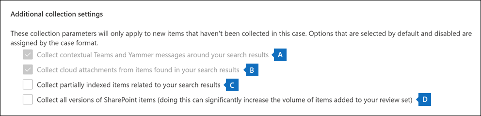

# Commit a draft collection to a review set in eDiscovery (Premium)

When you're satisfied with the items you've collected in a draft collection and are ready to analyze, tag, and review them, you can add a collection to a review set in the case. When you commit a draft collection to a review set, collected items are copied from their original content location in Microsoft 365 to a review set. A review set is a secure, Microsoft-provided Azure Storage location in the Microsoft cloud.

## Commit a draft collection to a review set

1. In the Microsoft Purview compliance portal, open the Microsoft Purview eDiscovery (Premium) case, and then select the **Collections** tab to display a list of the collections in the case.

   

   > [!TIP]
   > A value of `Estimated` in the **Status** column identifies the draft collections that can be added to a review set. A status of `Committed` indicates that a collection has already been added to a review set.

2. On the **Collections** page, select the draft collection that you want to commit to a review set.

3. On the bottom of the flyout page, select **Actions** > **Edit collection**.

4. In the edit collection wizard, click **Next** until the **Save draft or collect** page is displayed.

5. Configure the following settings:

   1. Select **Collect items and add to review set**.

   2. Decide whether to add the collection to a new review set (which is created after you submit the collection) or add it to an existing review set. Complete this section based on your decision.

   3. Configure the additional collection settings:

      .

       a. **Teams and Yammer messages**: Select this option to add conversation threads to the collection that include the chat items returned by the search query in the collection. This means that the chat conversation that contains items that match the search criteria is reconstructed. This lets you review chat items in the context of the back and forth conversation. For more information, see [Conversation threading in eDiscovery (Premium)](conversation-review-sets.md).

       b. **Cloud attachments**: Select this option to include modern attachments or linked files when the collection results are added to the review set. This means the target file of a modern attachment or linked file is added to the review set.

       > [!NOTE]
       > The two options to collect contextual Teams and Yammer messages and cloud attachments are selected by default (and grayed out) for cases that were created using the new case format. For more information, see [Use the new case format](advanced-ediscovery-new-case-format.md).

       c. **Partially indexed items**: Select this option to add partially indexed items from additional data sources to the review set. If the collection searched additional data sources (as specified on the **Additional locations** page in the collections wizard), there may be partially indexed items from these locations that you want to add to the review set. Custodial and non-custodial data sources typically don't have partially indexed items. That's because the Advanced indexing process reindexes items when custodial and non-custodial data sources are added to a case. Also, Adding partially indexed items will increase the number of items added to the review set. 
 After partially indexed items are added to the review set, you can apply a filter to specifically view these items. For more information, see [Filter partially indexed items](review-set-search.md#filter-partially-indexed-items)

      d. **SharePoint versions**: Select this option to enable the collection of all versions of a SharePoint document per the version limits and search parameters of the collection. Selecting this option will significantly increase the size of items that are added to the review set. After document versions are added to the review set, 

   4. Configure the settings to define the scale of the collection to add to the review set:

      - **Add all collection results**: Select this option to add all the items that match the search criteria of the collection to the review set.

      - **Add a sample of the collection results**: Select this option to add a sample of the collection results to the review set instead of adding all results. If you select this option, click **Edit sample parameters** and choose one of the following options:

         - **Sample based on confidence**: Items from the collection are added to the review set will be determined by the statistical parameters that you set. If you typically use a confidence level and interval when sampling results, specify them in the drop-down boxes. Otherwise, use the default settings.

         - **Randomly sample**: Items from the collection are added to the review set based on a random selection of the specified percentage of the total number of items returned by the search.

6. On the **Review your collection** page, you can review the collection settings that you configured on the previous page. Click **Edit** if you want to change them.

7. Click **Submit** to create the draft collection. A page is displayed confirming that the collection was created.

## What happens after you commit a draft collection

When you commit a draft collection to a review set, the following things happen:

- If you created a new review set to commit the collection to, the review set is created and displayed on the **Review sets** tab in the case. The status of the new review set is **Ready**. This status value means the review set has been created; it doesn't mean that the collection has been added to the review set. The status of adding items in the collection to the review set is displayed on the **Collections** tab.

- The collection search query is run again. This means the actual search results copied to the review set may be different than the estimated results that were returned when the collection search was last run.

- All items in the search results are copied from the original data source in the live service, and copied to a secure Azure Storage location in the Microsoft cloud.

- Encrypted SharePoint and OneDrive documents and encrypted files attached email messages that's returned in the search results are decrypted when you commit the collection to a review set. You can review and query the decrypted files in the review set. For more information, see [Decryption in Microsoft 365 eDiscovery tools](ediscovery-decryption.md).

- Optical character recognition (OCR) functionality extracts text from images, and includes the image text with the content that's added to a review set. For more information, see the [Optical character recognition](#optical-character-recognition) section in this article.

- After the commit is successfully completed, the value of the status column of on the **Collections** tab is changed to `Committed`.

## Optical character recognition

When you commit a collection to a review set, optical character recognition (OCR) functionality in eDiscovery (Premium) automatically extracts text from images, and includes the image text with the content that's added to a review set. You can view the extracted text in the Text viewer of the selected image file in the review set. This lets you conduct further review and analysis on text in images. OCR is supported for loose files, email attachments, and embedded images. For a list of image file formats that are supported for OCR, see [Supported file types in eDiscovery (Premium)](supported-filetypes-ediscovery20.md#image).

You have to enable OCR functionality for each case that you create in eDiscovery (Premium). For more information, see [Configure search and analytics settings](configure-search-and-analytics-settings-in-advanced-ediscovery.md#optical-character-recognition-ocr).
