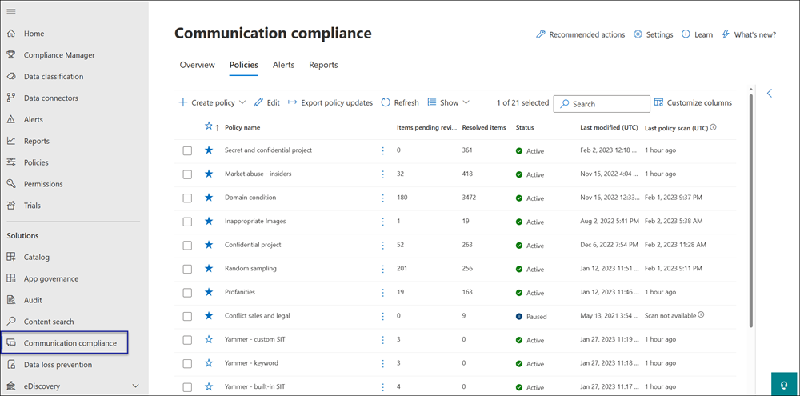

# Case study - Contoso quickly configures an offensive language policy for Microsoft Teams, Exchange, and Yammer communications

Communication compliance in Microsoft 365 helps minimize communication risks by helping you detect, capture, and act on inappropriate messages in your organization. Pre-defined and custom policies allow you to scan internal and external communications for policy matches so they can be examined by designated reviewers. Reviewers can investigate scanned email, Microsoft Teams, Yammer, or third-party communications in your organization and take appropriate remediation actions to make sure they're compliant with your organization's message standards.

The Contoso Corporation is a fictional organization that needs to quickly configure a policy to monitor for offensive language. They have been using Microsoft 365 primarily for email, Microsoft Teams, and Yammer support for their users but have new requirements to enforce company policy around workplace harassment. Contoso IT administrators and compliance specialists have a basic understanding of the fundamentals of working with Microsoft 365 and are looking for end-to-end guidance for how to quickly get started with communication compliance.

This case study will cover the basics for quickly configuring a communication compliance policy to monitor communications for offensive language. This guidance includes:

- Step 1 - Planning for communication compliance
- Step 2 - Accessing communication compliance in Microsoft 365
- Step 3 - Configuring prerequisites and creating a communication compliance policy
- Step 4 - Investigation and remediation of alerts

## Step 1: Planning for communication compliance

Contoso IT administrators and compliance specialists attended online webinars about compliance solutions in Microsoft 365 and decided that communication compliance policies will help them meet the updated corporate policy requirements for reducing workplace harassment. Working together, they've developed a plan to create and enable a communication compliance policy that will monitor for offensive language for chats sent in Microsoft Teams, private messages and community conversations in Yammer, and in email messages sent in Exchange Online. Their plan includes identifying:

- The IT administrators that need access to communication compliance features.
- The compliance specialists that need to create and manage communication policies.
- The compliance specialists and other colleague in other departments (Human Resources, Legal, etc.) that need to investigate and remediate communication compliance alerts.
- The users that will be in-scope for the communication compliance offensive language policy.

### Licensing

The first step is to confirm that Contoso's Microsoft 365 licensing includes support for the communication compliance solution. To access and use communication compliance, Contoso IT administrators need to verify that Contoso has one of the following:

- Microsoft 365 E5 subscription (paid or trial version)
- Microsoft 365 E3 subscription + the Microsoft 365 E5 Compliance add-on
- Microsoft 365 E3 subscription + the Microsoft 365 E5 Insider Risk Management add-on
- Microsoft 365 A5 subscription (paid or trial version)
- Microsoft 365 A3 subscription + the Microsoft 365 A5 Compliance add-on
- Microsoft 365 A3 subscription + the Microsoft 365 A5 Insider Risk Management add-on
- Microsoft 365 G5 subscription (paid or trial version)
- Microsoft 365 G5 subscription + the Microsoft 365 G5 Compliance add-on
- Microsoft 365 G5 subscription + the Microsoft 365 G5 Insider Risk Management add-on
- Office 365 Enterprise E5 subscription (paid or trial version)
- Office 365 Enterprise E3 subscription + the Office 365 Advanced Compliance add-on (no longer available for new subscriptions, see note)

They must also confirm that users included in communication compliance policies must be assigned one of the licenses above.

>[!IMPORTANT]
>Office 365 Advanced Compliance is no longer sold as a standalone subscription. When current subscriptions expire, customers should transition to one of the subscriptions above, which contain the same or additional compliance features.

Contoso IT administrators take the following steps to verify the licensing support for Contoso:

1. IT administrators sign in to the **Microsoft 365 admin center** [(https://admin.microsoft.com)](https://admin.microsoft.com) and navigate to **Microsoft 365 admin center** > **Billing** > **Licenses**.

2. Here they confirm that they have one of the [license options](https://docs.microsoft.com/microsoft-365/compliance/communication-compliance-configure?view=o365-worldwide#before-you-begin) that includes support for communication compliance.

### Permissions for communication compliance

There are five role groups used to configure permissions to manage communication compliance features. To make **Communication compliance** available as a menu option in Microsoft 365 compliance center and to continue with these configuration steps, Contoso administrators are assigned the *Communication Compliance Admin* role.

Contoso decides to use the *Communication Compliance* role group assign all the communication compliance administrators, analysts, investigators, and viewers  to the group. This makes it easier for Contoso to get started quickly and best fits their compliance management requirements.

|**Role**|**Role permissions**|
|:-----|:-----|
| **Communication Compliance** | Use this role group to manage communication compliance for your organization in a single group. By adding all user accounts for designated administrators, analysts, investigators, and viewers, you can configure communication compliance permissions in a single group. This role group contains all the communication compliance permission roles. This configuration is the easiest way to quickly get started with communication compliance and is a good fit for organizations that do not need separate permissions defined for separate groups of users. |
| **Communication Compliance Admin** | Use this role group to initially configure communication compliance and later to segregate communication compliance administrators into a defined group. Users assigned to this role group can create, read, update, and delete communication compliance policies, global settings, and role group assignments. Users assigned to this role group cannot view message alerts. |
| **Communication Compliance Analyst** | Use this group to assign permissions to users that will act as communication compliance analysts. Users assigned to this role group can view policies where they are assigned as Reviewers, view message metadata (not message content), escalate to additional reviewers, or send notifications to users. Analysts cannot resolve pending alerts. |
| **Communication Compliance Investigator** | Use this group to assign permissions to users that will act as communication compliance investigators. Users assigned to this role group can view message metadata and content, escalate to additional reviewers, escalate to an Advanced eDiscovery case, send notifications to users, and resolve the alert. |
| **Communication Compliance Viewer** | Use this group to assign permissions to users that will manage communication reports. Users assigned to this role group can access all reporting widgets on the communication compliance home page and can view all communication compliance reports. |

1. Contoso IT administrators sign into the **Office 365 Security & Compliance center** permissions page [(https://protection.office.com/permissions)](https://protection.office.com/permissions) using credentials for a global administrator account and select the link to view and manage roles in Microsoft 365.
2. In the **Security & Compliance Center**, they go to **Permissions** and select the link to view and manage roles in Office 365.
3. The administrators select the *Communication Compliance* role group, then select **Edit role group**.
4. The administrators select **Choose members** from the left navigation pane, then select **Edit**.
5. They select **Add** and then select the checkbox for all Contoso users that will manage communication compliance, investigate, and review alerts.
6. The administrators select **Add**, then select **Done**.
7. They select **Save** to add Contoso users to the role group. They select **Close** to complete the steps.

## Step 2: Accessing communication compliance in Microsoft 365

After configuring the permissions for communication compliance, Contoso IT administrators and compliance specialists assigned to the Communication Compliance role group can access the communication compliance solution in Microsoft 365. Contoso IT administrators and compliance specialists have several ways to access communication compliance and get started creating a new policy:

- Starting directly from the communication compliance solution
- Starting from the Microsoft 365 compliance center
- Starting from the Microsoft 365 solution catalog
- Starting from the Microsoft 365 admin center

### Starting directly from the communication compliance solution

The quickest way to access the solution is to sign in directly to the **Communication compliance** (<https://compliance.microsoft.com/supervisoryreview>) solution. Using this link, Contoso IT administrators and compliance specialists will be directed to the communication compliance Overview dashboard where you can quickly review the status of alerts and create new policies from the pre-defined templates.

### Starting from the Microsoft 365 compliance center

Another easy way for Contoso IT administrators and compliance specialists to access the communication compliance solution is to sign in directly to the **Microsoft 365 compliance center** [(https://compliance.microsoft.com)](https://compliance.microsoft.com). After signing in, users simply need to select the **Show all** control to display all the compliance solutions and then select the **Communication compliance** solution to get started.

### Starting from the Microsoft 365 solution catalog

Contoso IT administrators and compliance specialists could also choose to access the communication compliance solution by selecting the Microsoft 365 solution catalog. By selecting **Catalog** in **Solutions** section of the left navigation while in the **Microsoft 365 compliance center**, they can open the solution catalog listing all Microsoft 365 compliance solutions. Scrolling down to the **Insider risk management** section, Contoso IT administrators can select Communication compliance to get started. Contoso IT administrators also decide to use the Show in navigation control to pin the communication compliance solution to the left-navigation pane for quicker access when they sign in going forward.

### Starting from the Microsoft 365 admin center

To access communication compliance when starting from the Microsoft 365 admin center, Contoso IT administrators and compliance specialists sign in to the Microsoft 365 admin center [(https://admin.microsoft.com)](https://admin.microsoft.com) and navigate to **Microsoft 365 admin center** > **Compliance**.

This action opens the **Office 365 Security and Compliance center**, and they must select the link to the **Microsoft 365 compliance center** provided in the banner at the top of the page.

Once in the **Microsoft 365 compliance center**, Contoso IT administrators select **Show all** to display the full list of compliance solutions.

After selecting **Show all**, the Contoso IT administrators can access the communication compliance solution.

## Step 3: Configuring prerequisites and creating a communication compliance policy

To get started with a communication compliance policy, there are several prerequisites that Contoso IT administrators need to configure before setting up the new policy to monitor for offensive language. After these prerequisites have been completed, Contoso IT administrators and compliance specialists can configure the new policy and compliance specialists can start investigation and remediating any generated alerts.

### Enabling auditing in Microsoft 365

Communication compliance requires audit logs to show alerts and track remediation actions taken by reviewers. The audit logs are a summary of all activities associated with a defined organizational policy or anytime there is a change to a communication compliance policy.

Contoso IT administrators review and complete the [step-by-step instructions](https://docs.microsoft.com/microsoft-365/compliance/turn-audit-log-search-on-or-off) to turn on auditing. After they turn on auditing, a message is displayed that says the audit log is being prepared and that they can run a search in a couple of hours after the preparation is complete. The Contoso IT administrators only have to do this action once.

### Configuring Yammer tenant for Native Mode

Communication compliance requires that the Yammer tenant for an organization is in Native Mode to monitor for offensive language in private messages and public community conversations.

Contoso IT administrators make sure they review the information in the [Overview of Yammer Native Mode in Microsoft 365 article](https://docs.microsoft.com/yammer/configure-your-yammer-network/overview-native-mode) and follow the steps for running the migration tool in the [Configure your Yammer network for Native Mode for Microsoft 365](https://docs.microsoft.com/yammer/configure-your-yammer-network/native-mode) article.

### Setting up a group for in-scope users

Contoso compliance specialists want to add all users to the communication policy that will monitor for offensive language. They could decide to add each user account to the policy separately, but they've decided it is much easier and saves time to use an **All Users** distribution group for the users for this policy.

They need to create a new group to include all Contoso users, so they take the following steps:

1. Contoso IT administrators IT sign in to the **Microsoft 365 admin center** [(https://admin.microsoft.com)](https://admin.microsoft.com) and navigate to **Microsoft 365 admin center** > **Groups** > **Groups**.
2. They select **Add a group** and complete the wizard to create a new *Microsoft 365 group* or *Distribution group*.

    

3. After the new group is created, they need to add all Contoso users to the new group. They open the **Exchange admin center** [(https://outlook.office365.com/ecp)](https://outlook.office365.com/ecp) and navigate to **Exchange admin center** > **recipients** > **groups**. The Contoso IT administrators select the Membership area and the new *All Employees* group they created and select the **Edit** control to add all Contoso users to the new group in the wizard.

    

### Creating the policy to monitor for offensive language

With all the prerequisites completed, the IT administrators and the compliance specialists for Contoso are ready to configure the communication compliance policy to monitor for offensive language. Using the new offensive language policy template, configuring this policy is simple and quick.

1. The Contoso IT administrators and compliance specialists sign into the **Microsoft 365 compliance center** and select **Communication compliance** from the left navigation pane. This action opens the **Overview** dashboard that has quick links for communication compliance policy templates. They choose the **Monitor for offensive language** template by selecting **Get started** for the template.

    

2. On the policy template wizard, the Contoso IT administrators and compliance specialists work together to complete the three required fields: **Policy name**, **Users or groups to supervise**, and **Reviewers**.
3. Since the policy wizard has already suggested a name for the policy, the IT administrators and compliance specialists decide to keep the suggested name and focus on the remaining fields. They select the *All users* group for the **Users or groups to supervise** field and select the compliance specialists that should investigate and remediate policy alerts for the **Reviewers** field. The last step to configure the policy and start gathering alert information is to select **Create policy**.

    

## Step 4: Investigate and remediate alerts

Now that the communication compliance policy to monitor for offensive language is configured, the next step for the Contoso compliance specialists will be to investigate and remediate any alerts generated by the policy. It will take up to 24 hours for the policy to fully process communications in all the communication source channels and for alerts to show up in the **Alert dashboard**.

After alerts are generated, Contoso compliance specialists will follow the [workflow instructions](https://docs.microsoft.com/microsoft-365/compliance/communication-compliance-investigate-remediate) to investigate and remediate offensive language issues.