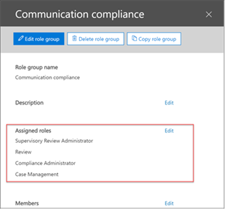

# Configure communication compliance in Microsoft 365

>[!IMPORTANT]
>This topic applies to configuring communication compliance in a Microsoft 365 subscription. If you want to configure Supervision policies for a Microsoft 365 subscription, see [Configure supervision for Microsoft 365](supervision-policies.md).

Use communication compliance policies to capture employee communications for examination by internal or external reviewers. For more information about how communication compliance policies can help you monitor communications in your organization, see [communication compliance policies in Microsoft 365](communication-compliance.md). If you'd like to review how Contoso quickly configured a communication compliance policy to monitor for offensive language in Microsoft Teams and Exchange Online communications, check out this [case study](communication-compliance-case-study.md).

## Before you begin

Before you get started with communication compliance, you should confirm your [Microsoft 365 subscription](https://www.microsoft.com/microsoft-365/compare-all-microsoft-365-plans) and any add-ons. To access and use communication compliance, your organization must have one of the following subscriptions or add-ons:

- Microsoft 365 E5 subscription (paid or trial version)
- Microsoft 365 E3 subscription + the Microsoft 365 E5 Compliance add-on
- Microsoft 365 E3 subscription + the Microsoft 365 E5 Insider Risk Management add-on
- Microsoft 365 A5 subscription (paid or trial version)
- Microsoft 365 A3 subscription + the Microsoft 365 A5 Compliance add-on
- Microsoft 365 A3 subscription + the Microsoft 365 A5 Insider Risk Management add-on
- Office 365 Enterprise E5 subscription (paid or trial version)
- Office 365 Enterprise E3 subscription + the Office 365 Advanced Compliance add-on

Users included in communication compliance policies must must be assigned one of the licenses above.

>[!IMPORTANT]
>Office 365 Advanced Compliance is no longer sold as a standalone subscription. When current subscriptions expire, customers should transition to one of the subscriptions above, which contain the same or additional compliance features.

If you don't have an existing Office 365 Enterprise E5 plan and want to try insider risk management, you can [add Microsoft 365](https://docs.microsoft.com/office365/admin/try-or-buy-microsoft-365) to your existing Office 365 subscription or [sign up for a trial](https://www.microsoft.com/microsoft-365/enterprise) of Office 365 Enterprise E5.

## Step 1 (required): Enable permissions for communication compliance

>[!Important]
>By default, Global Administrators do not have access to communication compliance features. The roles assigned in this step are required before any communication compliance features will be accessible.

To make **Communication compliance** available as a menu option in Microsoft 365 compliance center, you must be assigned the **Supervisory Review Administrator** role. You must create a new role group for reviewers with the **Supervisory Review Administrator**, **Case Management**, **Compliance Administrator**, and **Review** roles to investigate and remediate messages with policy matches.

### Create a new role group

1. Sign into [https://protection.office.com/permissions](https://protection.office.com/permissions) using credentials for an admin account in your Microsoft 365 organization.

2. In the Security &amp; Compliance Center, go to **Permissions**. Select the link to view and manage roles in Office 365.

3. Select **Create**.

4. In the **Name** field, give the new role group a friendly name. Select **Next**.

5. Select **Choose roles** and then select **Add**. Select the checkbox for **Supervisory Review Administrator**, **Case Management**, **Compliance Administrator**, and **Review**, then select **Add** and **Done**. Select **Next**.

    

6. Select **Choose members** and then select **Add**. Select the checkbox for all the users and groups you want create policies and manage messages with policy matches, then select **Add** and **Done**. Select **Next**.

7. Select **Create role group** to finish.

For more information about role groups and permissions, see [Permissions in the Compliance Center](../security/office-365-security/protect-against-threats.md).

## Step 2 (required): Enable the audit log

Communication compliance requires audit logs to show alerts and track remediation actions taken by reviewers. The audit logs are a summary of all activities associated with a defined organizational policy or anytime a communication compliance policy changes.

For step-by-step instructions to turn on auditing, see [Turn audit log search on or off](turn-audit-log-search-on-or-off.md). After you turn on auditing, a message is displayed that says the audit log is being prepared and that you can run a search in a couple of hours after the preparation is complete. You only have to do this action once. For more information about the using the audit log, see [Search the audit log](search-the-audit-log-in-security-and-compliance.md).

## Step 3 (optional): Set up groups for communication compliance

 When you create a communication compliance policy, you define who has their communications reviewed and who performs reviews. In the policy, you'll use email addresses to identify individuals or groups of people. To simplify your setup, you can create groups for people who have their communication reviewed and groups for people who review those communications. If you're using groups, you may need several. For example, if you want to monitor communications between two distinct groups of people or if you want to specify a group that isn't going to be supervised.

Use the following chart to help you configure groups in your organization for communication compliance policies:

| **Policy Member** | **Supported Groups** | **Unsupported Groups** |
|:-----|:-----|:-----|
|Supervised users   Non-supervised users | Distribution groups   Office 365 Groups | Dynamic distribution groups |
| Reviewers | None | Distribution groups   Dynamic distribution groups   Mail-enabled security groups |
  
When you select an Office 365 group for supervised users, the policy monitors the content of the shared Office 365 mailbox and the Microsoft Teams channels associated with the group. When you select a distribution list, the policy monitors individual user mailboxes.

For more information about setting up groups, see:

- [Create and manage distribution groups](https://docs.microsoft.com/Exchange/recipients-in-exchange-online/manage-distribution-groups/manage-distribution-groups)
- [Overview of Office 365 Groups](https://docs.microsoft.com/office365/admin/create-groups/office-365-groups?view=o365-worldwide)

## Step 4 (required): Create a communication compliance policy
  
>[!Important]
>Using PowerShell to create and manage communication compliance policies is not supported. To create and manage these policies, you must use the policy management controls in the [Microsoft 365 communication compliance solution](https://compliance.microsoft.com/supervisoryreview).

1. Sign into [https://compliance.microsoft.com](https://compliance.microsoft.com) using credentials for an admin account in your Microsoft 365 organization.

2. In the Microsoft 365 compliance center, select **Communication compliance**.
  
3. Select the **Policies** tab.

4. Select **Create policy** to create and configure a new policy from a template or to create and configure a custom policy.

    If you choose a policy template to create a policy, you will:

    - Confirm or update the policy name. Policy names cannot be changed once the policy is created.
    - Choose the users or groups to supervise, including choosing users or groups you'd like to exclude.
    - Choose the reviewers for the policy. Reviewers are individual users and all reviewers must have mailboxes hosted on Exchange Online. Reviewers added here are the reviewers that you can choose from when escalating an alert in the investigation and remediation workflow.
    - Choose a limited condition field, usually a sensitive info type or keyword dictionary to apply to the policy.

    If you choose to use the policy wizard to create a custom policy, you will:

    - Give the policy a name and description. Policy names can't be changed once the policy is created.
    - Choose the users or groups to supervise, including all users in your organization, specific users and groups, or other users and groups you'd like to exclude.
    - Choose the reviewers for the policy. Reviewers are individual users and all reviewers must have mailboxes hosted on Exchange Online.
    - Choose the communication channels to scan, including Exchange, Microsoft Teams, or Skype for Business. You'll also choose to scan third-party sources if you've configured a connector in Microsoft 365.
    - Choose the communication direction to monitor, including inbound, outbound, or internal communications.
    - Define the communication compliance policy [conditions](communication-compliance-feature-reference.md#ConditionalSettings). You can choose from message address, keyword, file types, and size match conditions.
    - Choose if you'd like to include sensitive information types. This step is where you can select default and custom sensitive info types. Pick from existing custom sensitive information types or custom keyword dictionaries in the communication compliance policy wizard. You can create these items before running the wizard if needed. You can also create new sensitive information types from within the communication compliance policy wizard.
    - Choose if you'd like to enable the offensive language classifier. This  classifier detects inappropriate language sent or received in the body of email messages.
    - Define the percentage of communications to review.
    - Review your policy selections and create the policy.

5. Select **Create policy** when using the templates or **Submit** when using the custom policy wizard.

6. The **Your policy was created** page is displayed with guidelines on when policy will be activated and which communications will be captured.

## Step 5 (optional): Create employee notice templates

If you want to have the option of responding to a policy alert by sending a reminder notice to the associated employee, you'll need to create at least one notice template in your organization. The notice template fields are editable before they're sent as part of the alert remediation process, and creating a customized notice template for each communication compliance policy is recommended.

1. Sign into [https://compliance.microsoft.com](https://compliance.microsoft.com) using credentials for an admin account in your Microsoft 365 organization.

2. In the Microsoft 365 compliance center, go to **Communication compliance**.

3. Select the **Notice templates** tab and then select **Create notice template**.

4. On the **Modify a notice template** page, complete the following fields:

    - Notice template name (required)
    - Send from (required)
    - Cc and Bcc (optional)
    - Subject (required)
    - Message body (required)

5. Select **Save** to create and save the notice template.

## Step 6 (optional): Test your communication compliance policy

After you create a communication compliance policy, it's a good idea to test it to make sure that the conditions you defined are being properly enforced by the policy. You may also want to [test your data loss prevention (DLP) policies](create-test-tune-dlp-policy.md) if your communication compliance policies include sensitive information types. Make sure you give your policies time to activate so that the communications you want to test are captured.

Follow these steps to test your communication compliance policy:

1. Open an email client or Microsoft Teams while signed in as a supervised user defined in the policy you want to test.
2. Send an email or Microsoft Teams chat that meets the criteria you've defined in the communication compliance policy. This test can be a keyword, attachment size, domain, etc. Make sure you determine if your configured conditional settings in the policy are too restrictive or too lenient.

    > [!NOTE]
    > Communications in all source channels can take up to 24 hours to fully process in a policy.

3. Sign in to Microsoft 365 as a reviewer designated in the communication compliance policy. Navigate to **Communication compliance** > **Alerts** to view the alerts for your policies.

4. Remediate the alert using the remediation controls and verify that the alert is properly resolved.
