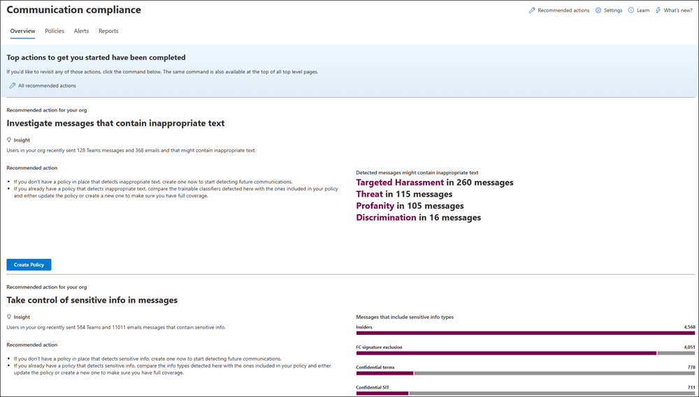

# Get started with communication compliance

>[!IMPORTANT]
>Microsoft Purview Communication Compliance provides the tools to help organizations detect regulatory compliance violations (for example SEC or FINRA), such as sensitive or confidential information, harassing or threatening language, and sharing of adult content. Built with privacy by design, usernames are pseudonymized by default, role-based access controls are built in, investigators are opted in by an admin, and audit logs are in place to help ensure user-level privacy.

Use communication compliance policies to identify user communications for analysis by internal or external reviewers. For more information about how communication compliance policies can help you detect communications in your organization, see [communication compliance policies](/microsoft-365/compliance/communication-compliance-policies). If you'd like to review how Contoso quickly configured a communication compliance policy to detect potentially inappropriate content in Microsoft Teams, Exchange Online, and Yammer communications, check out this [case study](/microsoft-365/compliance/communication-compliance-case-study).

[!INCLUDE [purview-preview](../includes/purview-preview.md)]

## Subscriptions and licensing

Before getting started with communication compliance, you should confirm your [Microsoft 365 subscription](https://www.microsoft.com/microsoft-365/compare-all-microsoft-365-plans) and any add-ons. To access and use communication compliance, your organization must have one of the following subscriptions or add-ons:

- Microsoft 365 E5/A5/F5/G5 subscription (paid or trial version)
- Microsoft 365 E3/A3/F3/G5 subscription + the Microsoft 365 E5/A5/F5/G5 Compliance add-on
- Microsoft 365 E3/A3/F3/G5 subscription + the Microsoft 365 E5/A5/F5/G5 Insider Risk Management add-on
- Office 365 Enterprise E5 subscription (paid or trial version)
- Office 365 A5 subscription (paid or trial version)
- Office 365 Enterprise E3 subscription + the Office 365 Advanced Compliance add-on (no longer available for new subscriptions, see note)

Users included in communication compliance policies must be assigned one of the licenses above. For more information about subscriptions and licensing, see [Microsoft 365 guidance for security & compliance](/office365/servicedescriptions/microsoft-365-service-descriptions/microsoft-365-tenantlevel-services-licensing-guidance/microsoft-365-security-compliance-licensing-guidance#communication-compliance).

> [!IMPORTANT]
> Communication compliance is currently available for tenants hosted in geographical regions and countries supported by Azure service dependencies. To verify that communication compliance is supported for your organization, see [Azure dependency availability by country/region](/troubleshoot/azure/general/dependency-availability-by-country).

If you don't have an existing Office 365 Enterprise E5 plan and want to try communication compliance, you can [add Microsoft 365](/office365/admin/try-or-buy-microsoft-365) to your existing subscription or [sign up for a trial](https://www.microsoft.com/microsoft-365/enterprise) of Office 365 Enterprise E5.

> [!NOTE]
> Office 365 Advanced Compliance is no longer sold as a standalone subscription. When current subscriptions expire, customers should transition to one of the subscriptions above, which contain the same or additional compliance features.

## Recommended actions (preview)

Recommended actions can help your organization quickly get started with communication compliance. Included on the **Overview** page, recommended actions will help guide you through the steps to configure and deploy policies.

The following recommendations are available to help you get started and maximize your communication compliance configuration:

- **Get to know communication compliance**: Before completing set up, review our official documentation to learn about, plan for, and deploy communication compliance in your organization.
- **Assign permissions to ensure your team can get their jobs done**: Ensure that only the appropriate stakeholders can access the solution by assigning team members responsible for managing communication compliance features and investigating and reviewing alerts.
- **Create distribution groups for users' whose communications you want to detect**: Create distribution groups containing users who will be included in communication compliance policies.
- **Create your first policy to start detecting communications**: Detect and investigate potential regulatory compliance violations by first setting up a policy that identifies potential violations across your organization's internal and/or external communications.
- **Review alerts to investigate detected messages and take action**: Identify and analyze messages that match a policy's conditions to trigger alerts that provide context around a policy violation, so you can investigate and take action if needed.
- **Review reports for quick insights into how policies are performing**: Get quick insights into how your policies are performing, view detailed reports to drill down further, and export results for further analyses.

Each action in communication compliance has three attributes:

- **Action**: The name and description of the recommended action.
- **Recommended, required or optional**: Whether the recommended action is highly recommended, required, or optional for communication compliance features to function as expected.
- **Estimated time to complete**: Estimated time to complete the recommended action in minutes.

Select recommendations from the list to get started with configuring communication compliance. Each recommended action guides you through the required activities for the recommendation, including any requirements, what to expect, and the impact of configuring the feature in your organization. Some recommended actions will be automatically marked as complete when configured. If not, you'll need to manually select the action as complete when configured.

Also included on the Policies page, recommended actions insights help summarize current sensitive information types and potential regulatory compliance violations in communications in your organization. Insights are supported by [data classification](/microsoft-365/compliance/data-classification-overview) and the application of sensitivity labels, retention labels, and sensitive information type classification. These insights are aggregated and don't include any personally identifiable information (PII) for users in your organization.



Activity in messages is aggregated by [classifier type](/microsoft-365/compliance/communication-compliance-policies#classifiers) from existing policies that use the *Detect inappropriate text* policy template or custom policies that use classifiers. Investigate alerts for these messages on the **Alert dashboard** for your policies.

Activity involving [sensitive information types](/microsoft-365/compliance/communication-compliance-policies#sensitive-information-types) is detected in messages covered in existing policies and for messages that aren't covered by existing policies. Insight messages that aren't covered by existing policies can't be investigated and remediated, a new policy must be created to detect and remediate similar activity in future messages. Insights are aggregated for all sensitive information types, including ones that your organization hasn't previously defined in an existing communication compliance policy. Use these insights to create a new communication compliance policy or to update existing policies. After creating a new policy, messages alerts for this policy might or might not match an equal number of messages identified in a similar insight. Your policy might have different conditions, a different number of in-scope users, and only detects message activity that occurs after the policy is active.

>[!TIP]
>Don't want to see the recommended action insights? Open a request with Microsoft Support to disable the display of these insight widgets for your organization.

## Step 1 (required): Enable permissions for communication compliance

> [!IMPORTANT]
> After configuring your role groups, it may take up to 30 minutes for the role group permissions to apply to assigned users across your organization.

There are six role groups used to configure initial permissions to manage communication compliance features. To make **Communication compliance** available as a menu option in Microsoft Purview compliance portal and to continue with these configuration steps, you must be assigned to one of the following roles or role groups:

- Azure Active Directory [*Global Administrator*](/azure/active-directory/roles/permissions-reference#global-administrator) role
- Azure Active Directory [*Compliance Administrator*](/azure/active-directory/roles/permissions-reference#compliance-administrator) role
- Microsoft Purview compliance portal [*Organization Management*](/microsoft-365/security/office-365-security/permissions-in-the-security-and-compliance-center) role group
- Microsoft Purview compliance portal [*Compliance Administrator*](/microsoft-365/security/office-365-security/permissions-in-the-security-and-compliance-center) role group
- *Communication Compliance* role group
- *Communication Compliance Admin* role group

Members of the following roles have the same solution permissions included with the *Communication Compliance Admin* role group:

- Azure Active Directory *Global Administrator*
- Azure Active Directory *Compliance Administrator*
- Microsoft Purview compliance portal *Organization Management*
- Microsoft Purview compliance portal *Compliance Administrator*

> [!IMPORTANT]
> Make sure you always have at least one user in the *Communication Compliance* or *Communication Compliance Admin* role groups, depending on the option you choose. This way your communication compliance configuration doesn't get in to a 'zero administrator' scenario if assigned users leave your organization.

Depending on how you want to manage communication compliance policies and alerts, you'll need to assign users to specific role groups to manage different sets of communication compliance features. You have the option of assigning users with different compliance responsibilities to specific role groups to manage different areas of communication compliance features. Or you may decide to assign all user accounts for designated administrators, analysts, investigators, and viewers to the *Communication Compliance* role group. Use a single role group or multiple role groups to best fit your compliance management requirements.

Choose from these solution role group options when configuring and managing communication compliance:

| Role | Role permissions |
|:-----|:-----------------|
| **Communication Compliance** | Use this role group to manage communication compliance for your organization in a single group. By adding all user accounts for designated administrators, analysts, investigators, and viewers, you can configure communication compliance permissions in a single group. This role group contains all the communication compliance permission roles. This configuration is the easiest way to quickly get started with communication compliance and is a good fit for organizations that don't need separate permissions defined for separate groups of users. Users that create policies as a communication compliance administrator must have their mailbox hosted on Exchange Online.|
| **Communication Compliance Admin** | Use this role group to initially configure communication compliance and later to segregate communication compliance administrators into a defined group. Users assigned to this role group can create, read, update, and delete communication compliance policies, global settings, and role group assignments. Users assigned to this role group can't view message alerts. Users that create policies as a communication compliance administrator must have their mailbox hosted on Exchange Online.|
| **Communication Compliance Analyst** | Use this group to assign permissions to users that will act as communication compliance analysts. Users assigned to this role group can view policies where they're assigned as Reviewers, view message metadata (not message content), escalate to additional reviewers, or send notifications to users. Analysts can't resolve pending alerts. |
| **Communication Compliance Investigator** | Use this group to assign permissions to users that will act as communication compliance investigators. Users assigned to this role group can view message metadata and content, escalate to additional reviewers, escalate to an eDiscovery (Premium) case, send notifications to users, and resolve the alert. |
| **Communication Compliance Viewer** | Use this group to assign permissions to users that will manage communication reports. Users assigned to this role group can access all reporting widgets on the communication compliance home page and can view all communication compliance reports. |

### Option 1: Assign all compliance users to the Communication Compliance role group

1. Sign into [https://compliance.microsoft.com/permissions](https://compliance.microsoft.com/permissions) using credentials for an admin account in your Microsoft 365 organization.

2. In the Security &amp; Compliance Center, go to **Permissions**. Select the link to view and manage roles in Office 365.

3. Select the *Communication Compliance* role group, then select **Edit role group**.

4. Select **Choose members** from the left navigation pane, then select **Edit**.

5. Select **Add** and then select the checkbox for all users you want to add to the *Communication Compliance* role group.

6. Select **Add**, then select **Done**.

7. Select **Save** to add the users to the role group. Select **Close** to complete the steps

### Option 2: Assign users to specific communication compliance role groups

Use this option to assign users to specific role groups to segment communication compliance access and responsibilities among different users in your organization.

1. Sign into the [Microsoft Purview compliance portal](https://compliance.microsoft.com) using credentials for an admin account in your Microsoft 365 organization, and then go to the **Permissions**</a>.

2. Select the link to view and manage roles in Office 365.

3. Select one of the communication compliance role groups, then select **Edit role group**.

4. Select **Choose members** from the left navigation pane, then select **Edit**.

5. Select **Add** and then select the checkbox for all users you want to add to the role group.

6. Select **Add**, then select **Done**.

7. Select **Save** to add the users to the role group.

8. Select the next communication compliance role group, then repeat steps 4-7 for each required role group.

9. Select **Close** to complete the steps.

For more information about role groups and permissions, see [Permissions in the Compliance Center](../security/office-365-security/protect-against-threats.md).

## Step 2 (required): Enable the audit log

Communication compliance requires audit logs to show alerts and track remediation actions taken by reviewers. The audit logs are a summary of all activities associated with a defined organizational policy or anytime a communication compliance policy changes.

Auditing is enabled for Microsoft 365 organizations by default. Some organizations may have disabled auditing for specific reasons. If auditing is disabled for your organization, it might be because another administrator has turned it off. We recommend confirming that it's OK to turn auditing back on when completing this step.

For step-by-step instructions to turn on auditing, see [Turn audit log search on or off](/microsoft-365/compliance/turn-audit-log-search-on-or-off). After you turn on auditing, a message is displayed that says the audit log is being prepared and that you can run a search in a couple of hours after the preparation is complete. You only have to do this action once. For more information about the using the audit log, see [Search the audit log](/microsoft-365/compliance/search-the-audit-log-in-security-and-compliance).

## Step 3 (optional): Set up groups for communication compliance

 When you create a communication compliance policy, you define who has their communications reviewed and who performs reviews. In the policy, you'll use email addresses to identify individuals or groups of people. To simplify your setup, you can create groups for people who have their communication reviewed and groups for people who review those communications. If you're using groups, you may need several. For example, if you want to detect communications between two distinct groups of people or if you want to specify a group that isn't going to be supervised.

Use the following chart to help you configure groups in your organization for communication compliance policies:

| **Policy Member** | **Supported Groups** | **Unsupported Groups** |
|:-----|:-----|:-----|
|Supervised users <br> Excluded users | Distribution groups <br> Microsoft 365 Groups | Dynamic distribution groups <br> Nested distribution groups <br> Mail-enabled security groups <br> Microsoft 365 groups with dynamic membership |
| Reviewers | None | Distribution groups <br> Dynamic distribution groups <br> Nested distribution groups <br> Mail-enabled security groups |

When you assign a *distribution group* in the policy, the policy detects all emails and Teams chats from each user in the *distribution group*. When you assign a *Microsoft 365 group* in the policy, the policy detects all emails and Teams chats sent to the *Microsoft 365 group*,* not the individual emails and chats received by each group member. Using distribution groups in communication compliance policies are recommended so that individual emails and Teams chats from each user are automatically detected.

If you're an organization with an Exchange on-premises deployment or an external email provider and you want to detect Microsoft Teams chats for your users, you must create a distribution group for the users with on-premises or external mailboxes. Later in these steps, you'll assign this distribution group as the **Supervised users and groups** selection in the policy wizard. For more information about the requirements and limitations for enabling cloud-based storage and Teams support for on-premises users, see [Search for Teams chat data for on-premises users](/microsoft-365/compliance/search-cloud-based-mailboxes-for-on-premises-users).

To manage supervised users in large enterprise organizations, you may need to detect messages for all users across large groups. You can use PowerShell to configure a distribution group for a global communication compliance policy for the assigned group. This enables you to detect messages for thousands of users with a single policy and keep the communication compliance policy updated as new employees join your organization.

1. Create a dedicated [distribution group](/powershell/module/exchange/new-distributiongroup) for your global communication compliance policy with the following properties: Make sure that this distribution group isn't used for other purposes or other Office 365 services.

    - **MemberDepartRestriction = Closed**. Ensures that users can't remove themselves from the distribution group.
    - **MemberJoinRestriction = Closed**. Ensures that users can't add themselves to the distribution group.
    - **ModerationEnabled = True**. Ensures that all messages sent to this group are subject to approval and that the group isn't being used to communicate outside of the communication compliance policy configuration.

    ```PowerShell
    New-DistributionGroup -Name <your group name> -Alias <your group alias> -MemberDepartRestriction 'Closed' -MemberJoinRestriction 'Closed' -ModerationEnabled $true
    ```

2. Select an unused [Exchange custom attribute](/Exchange/recipients/mailbox-custom-attributes) to track users added to the communication compliance policy in your organization.

3. Run the following PowerShell script on a recurring schedule to add users to the communication compliance policy:

    ```PowerShell
    $Mbx = (Get-Mailbox -RecipientTypeDetails UserMailbox -ResultSize Unlimited -Filter {CustomAttribute9 -eq $Null})
    $i = 0
    ForEach ($M in $Mbx)
    {
      Write-Host "Adding" $M.DisplayName
      Add-DistributionGroupMember -Identity <your group name> -Member $M.DistinguishedName -ErrorAction SilentlyContinue
      Set-Mailbox -Identity $M.Alias -<your custom attribute name> SRAdded
      $i++
    }
    Write-Host $i "Mailboxes added to supervisory review distribution group."
    ```

For more information about setting up groups, see:

- [Create and manage distribution groups](/Exchange/recipients-in-exchange-online/manage-distribution-groups/manage-distribution-groups)
- [Overview of Microsoft 365 Groups](/office365/admin/create-groups/office-365-groups)

## Step 4 (optional): Verify your Yammer tenant is in Native Mode

In Native Mode, all Yammer users are in Azure Active Directory (Azure AD), all groups are Office 365 Groups, and all files are stored in SharePoint Online. Your Yammer tenant must be in Native Mode for communication compliance policies to check and identify risky conversations in private messages and community conversations in Yammer.

For more information about configuring Yammer in Native Mode, see:

- [Overview of Yammer Native Mode in Microsoft 365](/yammer/configure-your-yammer-network/overview-native-mode)
- [Configure your Yammer network for Native Mode for Microsoft 365](/yammer/configure-your-yammer-network/native-mode)

## Step 5 (required): Create a communication compliance policy

>[!IMPORTANT]
>Using PowerShell to create and manage communication compliance policies isn't supported. To create and manage these policies, you must use the policy management controls in the [communication compliance solution](https://compliance.microsoft.com/supervisoryreview).

>[!TIP]  
>Want to see an in-depth walkthrough of setting up a new communication compliance policy and remediating an alert? Check out [this 15-minute video](/microsoft-365/compliance/communication-compliance-plan#creating-a-communication-compliance-policy-walkthrough) to see a demonstration of how communication compliance policies can help you detect potentially inappropriate messages, investigate potential violations, and remediate compliance issues.

1. Sign into the [Microsoft Purview compliance portal](https://compliance.microsoft.com) using credentials for an admin account in your Microsoft 365 organization.

2. In the Microsoft Purview compliance portal, select **Communication compliance**.

3. Select the **Policies** tab.

4. Select **Create policy** to create and configure a new policy from a template or to create and configure a custom policy.

    If you choose a policy template to create a policy, you will:

    - Confirm or update the policy name. Policy names can't be changed once the policy is created.

    - Choose the users or groups to supervise, including choosing users or groups you'd like to exclude. When using the conflict of interest template, you'll select two groups or two users to detect internal communications.

    - Choose the reviewers for the policy. Reviewers are individual users and all reviewers must have mailboxes hosted on Exchange Online. Reviewers added here are the reviewers that you can choose from when escalating an alert in the investigation and remediation workflow. When reviewers are added to a policy, they automatically receive an email message that notifies them of the assignment to the policy and provides links to information about the review process.

    - Choose a limited condition field, usually a sensitive info type or keyword dictionary to apply to the policy.

    > [!NOTE]
    > If you want to enable [optical character recognition (OCR)](/microsoft-365/compliance/communication-compliance-policies#optical-character-recognition-ocr) to identify embedded or attached images in messages for printed or handwritten text that match policy conditions, select **Customize policy** > **Conditions and percentage** and enable **Extract printed or handwritten text from images for evaluation**.

    If you choose to use the policy wizard to create a custom policy, you will:

    - Give the policy a name and description. Policy names can't be changed once the policy is created.

    - Choose the users or groups to supervise, including all users in your organization, specific users and groups, or other users and groups you'd like to exclude.

    - Choose the reviewers for the policy. Reviewers are individual users and all reviewers must have mailboxes hosted on Exchange Online. Reviewers added here are the reviewers that you can choose from when escalating an alert in the investigation and remediation workflow. When reviewers are added to a policy, they automatically receive an email message that notifies them of the assignment to the policy and provides links to information about the review process.

    - Choose the communication channels to check, including Exchange, Microsoft Teams, or Yammer. You'll also choose to check third-party sources if you've configured a connector in Microsoft 365.

    - Choose the communication direction to detect, including inbound, outbound, or internal communications.

    - Define the communication compliance policy [conditions](/microsoft-365/compliance/communication-compliance-policies#conditional-settings). You can choose from message address, keyword, file types, and size match conditions.

    - Choose if you'd like to include sensitive information types. This step is where you can select default and custom sensitive info types. Pick from existing custom sensitive information types or custom keyword dictionaries in the communication compliance policy wizard. You can create these items before running the wizard if needed. You can also create new sensitive information types from within the communication compliance policy wizard.

    - Choose if you'd like to enable classifiers. Classifiers can detect potentially inappropriate language and images sent or received in the body of email messages or other types of text. You can choose the following built-in classifiers: *Threat*, *Profanity*, *Targeted harassment*, *Adult images*, *Racy images*, and *Gory images*.

    - Enable [optical character recognition (OCR)](/microsoft-365/compliance/communication-compliance-policies#optical-character-recognition-ocr) to identify embedded or attached images in messages for printed or handwritten text that match policy conditions. For custom policies, one or more conditional settings associated with text, keywords, classifiers, or sensitive info types must be configured in the policy to enable the selection of optical character recognition (OCR) documents.

    - Define the percentage of communications to review.

    - Review your policy selections and create the policy.

5. Select **Create policy** when using the templates or **Submit** when using the custom policy wizard.

6. The **Your policy was created** page is displayed with guidelines on when policy will be activated and which communications will be captured.

## Step 6 (optional): Update compliance boundaries for communication compliance policies

[Compliance boundaries](/microsoft-365/compliance/set-up-compliance-boundaries) create logical boundaries within an organization that control the user content locations (such as mailboxes, OneDrive accounts, and SharePoint sites) that eDiscovery managers can search.

If you've configured compliance boundaries in your organization, you must update the compliance boundaries to allow certain users access to mailboxes that support communication compliance policies. You'll need to allow access to communication compliance administrators and communication compliance reviewers for your policy management and investigation and remediation actions to work properly.

To allow access for communication compliance admins and reviewers, run the following PowerShell commands. You only need to run these commands once, even if you add new communication compliance policies in the future:

```powershell
Import-Module ExchangeOnlineManagement
$UserCredential = Get-Credential
Connect-IPPSSession -Credential $UserCredential
New-ComplianceSecurityFilter -FilterName "CC_mailbox" -Users <list your communication compliance admins and reviewers user alias or email address> -Filters "Mailbox_Name -like 'SupervisoryReview{*'" -Action All
```

For more information about cmdlet syntax, see [New-ComplianceSecurityFilter](/powershell/module/exchange/new-compliancesecurityfilter).

## Step 7 (optional): Create notice templates and configure user anonymization

If you want to have the option of responding to a policy alert by sending a reminder notice to the associated user, you'll need to create at least one notice template in your organization. The notice template fields are editable before they're sent as part of the alert remediation process, and creating a customized notice template for each communication compliance policy is recommended.

You can also choose to enable anonymization for displayed usernames when investigating policy matches and taking action on messages.

1. Sign into the [Microsoft Purview compliance portal](https://compliance.microsoft.com) using credentials for an admin account in your Microsoft 365 organization.

2. In the Microsoft Purview compliance portal, go to **Communication compliance**.

3. To configure anonymization for usernames, select the **Privacy** tab.

4. To enable anonymization, select **Show anonymized versions of usernames**.

5. Select **Save**.

6. Navigate to the **Notice templates** tab and then select **Create notice template**.

7. On the **Modify a notice template** page, complete the following fields:

    - Template name (required)
    - Send from (required)
    - Cc and Bcc (optional)
    - Subject (required)
    - Message body (required)

8. Select **Save** to create and save the notice template.

## Step 8 (optional): Test your communication compliance policy

After you create a communication compliance policy, it's a good idea to test it to make sure that the conditions you defined are being properly enforced by the policy. You may also want to [test your Microsoft Purview Data Loss Prevention (DLP) policies](/microsoft-365/compliance/create-test-tune-dlp-policy) if your communication compliance policies include sensitive information types. Make sure you give your policies time to activate so that the communications you want to test are captured.

Follow these steps to test your communication compliance policy:

1. Open an email client, Microsoft Teams, or Yammer while signed in as a supervised user defined in the policy you want to test.

2. Send an email, Microsoft Teams chat, or Yammer message that meets the criteria you've defined in the communication compliance policy. This test can be a keyword, attachment size, domain, etc. Make sure you determine if your configured conditional settings in the policy are too restrictive or too lenient.

    > [!NOTE]
    > Email messages can take approximately 24 hours to fully process in a policy. Communications in Microsoft Teams, Yammer, and third-party platforms can take approximately 48 hours to fully process in a policy.

3. Sign in to Microsoft 365 as a reviewer designated in the communication compliance policy. Navigate to **Communication compliance** > **Alerts** to view the alerts for your policies.

4. Remediate the alert using the remediation controls and verify that the alert is properly resolved.

## Next steps

After you've completed these steps to create your first communication compliance policy, you'll start to receive alerts from activity indicators after 24-48 hours. Configure additional policies as needed using the guidance in Step 5 of this article.

To learn more about investigating communication compliance alerts, see [Investigate and remediate communication compliance alerts](/microsoft-365/compliance/communication-compliance-investigate-remediate).

To keep up with the latest communication compliance updates, select **What's new** in [communication compliance](https://compliance.microsoft.com/) for your organization.
