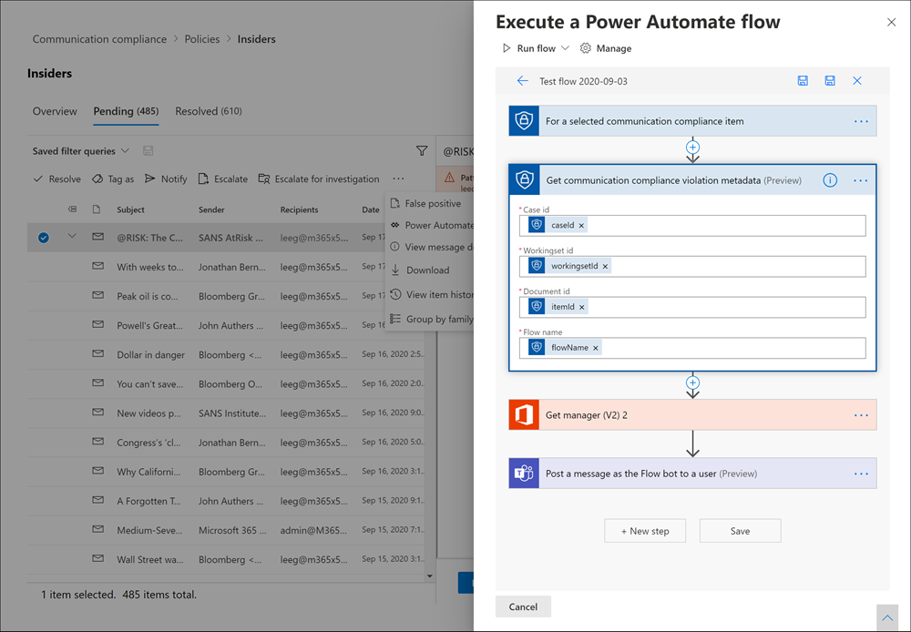
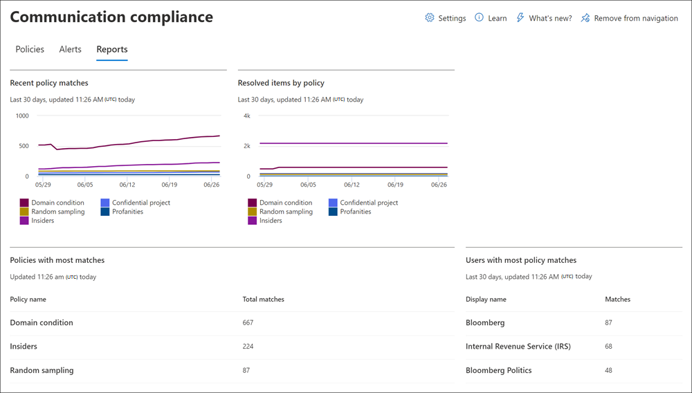

# Communication compliance feature reference

## Policies

>[!Important]
>Using PowerShell to create and manage communication compliance policies is not supported. To create and manage these policies, you must use the policy management controls in the [Microsoft 365 communication compliance solution](https://compliance.microsoft.com/supervisoryreview).

You create communication compliance policies for Microsoft 365 organizations in the Microsoft 365 compliance center. Communication compliance policies define which communications and users are subject to review in your organization, define which custom conditions the communications must meet, and specify who should do reviews. Users assigned the *Communication Compliance Admin* role can set up policies, and anyone who has this role assigned can access the **Communication compliance** page and global settings in the Microsoft 365 compliance center. If needed, you can export the history of modifications to a policy to a .csv (comma-separated values) file that also includes the status of alerts pending review, escalated items, and resolved items. Policies can't be renamed and can be deleted when no longer needed.

>[!NOTE]
>Supervision policies created in the Security & Compliance Center for Office 365 subscriptions cannot migrate to Microsoft 365. If you're migrating from an Office 365 subscription to a Microsoft 365 subscription, you'll need to create new communication compliance polices to replace existing Supervision policies.

## Policy templates

Policy templates are pre-defined policy settings that you can use to quickly create policies to address common compliance scenarios. Each of these templates has differences in conditions and scope, and all templates use the same types of scanning signals. You can choose from the following policy templates:

|**Area**|**Policy Template**|**Details**|
|:-----|:-----|:-----|
| **Offensive language and anti-harassment** | Monitor communications for offensive language | - Locations: Exchange Online, Microsoft Teams, Yammer, Skype for Business <br> - Direction: Inbound, Outbound, Internal <br> - Review Percentage: 100% <br> - Conditions: Offensive language classifier |
| **Sensitive information** | Monitor communications for sensitive information | - Locations: Exchange Online, Microsoft Teams, Yammer, Skype for Business <br> - Direction: Inbound, Outbound, Internal <br> - Review Percentage: 10% <br> - Conditions: Sensitive information, out-of-the-box content patterns, and types, custom dictionary option, attachments larger than 1 MB |
| **Regulatory compliance** | Monitor communications for info related to financial regulatory compliance | - Locations: Exchange Online, Microsoft Teams, Yammer, Skype for Business <br> - Direction: Inbound, Outbound <br> - Review Percentage: 10% <br> - Conditions: custom dictionary option, attachments larger than 1 MB |
| **Conflict of interest** | Monitor communications between two groups or two users to help avoid conflicts of interest | - Locations: Exchange Online, Microsoft Teams, Yammer, Skype for Business <br> - Direction: Internal <br> - Review Percentage: 100% <br> - Conditions: None |

Communications are scanned every 24 hours from the time policies are created. For example, if you create an offensive language policy at 11:00 AM, the policy will gather communication compliance signals every 24 hours at 11:00 AM daily. Editing a policy doesn't change this time. To view the last scan date and time for a policy, navigate to the *Last policy scan* column on the **Policy** page. After creating a new policy, it may take up to 24 hours to view the first policy scan date and time. The date and time of the last scan will be converted to the time zone of your local system.

## Permissions

>[!Important]
>By default, Global Administrators do not have access to communication compliance features. The roles assigned in this step are required before any communication compliance features will be accessible.

There are five role groups used to configure permissions to manage communication compliance features. To make **Communication compliance** available as a menu option in Microsoft 365 compliance center and to continue with these configuration steps, you must be assigned to the *Communication Compliance* or *Communication Compliance Admin* role groups. To access and manage communication compliance features after initial configuration, users must be a member of at least one communication compliance role group.

Depending on how you wish to manage communication policies and alerts, you'll need to assign users to specific role groups. You can choose to assign users with different compliance responsibilities to specific role groups to manage different areas of communication compliance features. Or you may decide to assign all user accounts for designated administrators, analysts, investigators, and viewers to the *Communication Compliance* role group. Use a single role group or multiple role groups to best fit your compliance management requirements.

Choose from these role group options when configuring communication compliance:

|**Role group**|**Role group permissions**|
|:-----|:-----|
| **Communication Compliance** | Use this role group to manage communication compliance for your organization in a single group. By adding all user accounts for designated administrators, analysts, investigators, and viewers, you can configure communication compliance permissions in a single group. This role group contains all the communication compliance permission roles. This configuration is the easiest way to quickly get started with communication compliance and is a good fit for organizations that do not need separate permissions defined for separate groups of users. |
| **Communication Compliance Admin** | Use this role group to initially configure communication compliance and later to segregate communication compliance administrators into a defined group. Users assigned to this role group can create, read, update, and delete communication compliance policies, global settings, and role group assignments. Users assigned to this role group cannot view message alerts. |
| **Communication Compliance Analyst** | Use this group to assign permissions to users that will act as communication compliance analysts. Users assigned to this role group can view policies where they are assigned as Reviewers, view message metadata (not message content), escalate to other reviewers, or send notifications to users. Analysts cannot resolve pending alerts. |
| **Communication Compliance Investigator** | Use this group to assign permissions to users that will act as communication compliance investigators. Users assigned to this role group can view message metadata and content, escalate to other reviewers, escalate to an Advanced eDiscovery case, send notifications to users, and resolve the alert. |
| **Communication Compliance Viewer** | Use this group to assign permissions to users that will manage communication reports. Users assigned to this role group can access all reporting widgets on the communication compliance home page and can view all communication compliance reports. |

### For organizations using the original permissions and role groups

The new role group structure replaces initial role group structure for communication compliance. For organizations already using communication compliance, you needed to be assigned the Supervisory Review Administrator role to get started with communication compliance in the Microsoft 365 compliance center. Additionally, you had to create a new role group for reviewers with the Supervisory Review Administrator, Case Management, Compliance Administrator, and Review roles to investigate and remediate messages with policy matches. Essentially, all admins and reviewers were in a single role group and everyone had the same access and management permissions. With the latest updates to communication compliance, you should plan to migrate from the previous role group structure to the new role group structure. Support for the previous role group structure will be phased out.

To help your migration planning, consider the following example. You currently have three types of users in your organization, IT admins, triage, and reviewers. These three types of users are in the previous role group structure and are all members of a single role group with the following roles assigned:

- Supervisory Review Administrator
- Case Management
- Compliance Administrator
- Review

To update the roles for these users for the new role group structure, and to separate the access and management permissions for the users, you may consider three new groups and the associated new role group assignments:

- **IT Admins**: Assigned to the new *Communication Compliance Admin* role group.
- **Triage**: Assigned to the *Communication Compliance Analyst* role group.
- **Reviewers**: Assigned to the new *Communication Compliance Investigator* role group.

## Supervised users

Before you start using communication compliance, you must determine who needs their communications reviewed. In the policy, user email addresses identify individuals or groups of people to supervise. Some examples of these groups are Microsoft 365 Groups, Exchange-based distribution lists, Yammer communities, and Microsoft Teams channels. You also can exclude specific users or groups from scanning with a specific exclusion group or a list of groups. For more information about groups types supported in communication compliance policies, see [Get started with communication compliance](communication-compliance-configure.md#step-3-optional-set-up-groups-for-communication-compliance).

>[!IMPORTANT]
>Users covered by communication compliance policies must have either a Microsoft 365 E5 Compliance license, an Office 365 Enterprise E3 license with the Advanced Compliance add-on, or be included in an Office 365 Enterprise E5 subscription. If you don't have an existing Enterprise E5 plan and want to try communication compliance, you can [sign up for a trial of Office 365 Enterprise E5](https://go.microsoft.com/fwlink/p/?LinkID=698279).

## Reviewers

When you create a communication compliance policy, you must determine who reviews the messages of the supervised users. In the policy, user email addresses identify individuals or groups of people to review supervised communications. All reviewers must have mailboxes hosted on Exchange Online and must be assigned to either the *Communication Compliance Analysis* or *Communication Compliance Investigation* roles. Reviewers (either analysts or investigators) must also have the *Communication Compliance Case Management* role assigned. When reviewers are added to a policy, they automatically receive an email message that notifies them of the assignment to the policy and provides links to information about the review process.

## Groups for supervised users and reviewers

To simplify your setup, create groups for people who need their communications reviewed and groups for people who review those communications. If you're using groups, you might need several. For example, if you want to scan communications between two distinct groups of people, or if you want to specify a group that isn't supervised.

When you assign a Distribution group in the policy, the policy monitors all emails from each user in Distribution group. When you assign a Microsoft 365 group in the policy, the policy monitors all emails sent to that group, not the individual emails received by each group member.

Adding groups and distribution lists to communication compliance policies are part of the overall conditions and rules set, so the maximum number of groups and distribution lists that a policy supports varies depending on the number of conditions also added to the policy. Each policy should support approximately 20 groups or distribution lists, depending on the number of additional conditions present in the policy.

## Supported communication types

With communication compliance policies, you can choose to scan messages in one or more of the following communication platforms as a group or as standalone sources. Communications captured across these platforms are retained for seven years for each policy by default, even if users leave your organization and their mailboxes are deleted.

- **Microsoft Teams**: Chat communications in both public and private Microsoft Teams channels and individual chats can be scanned. When users are assigned to a communication compliance policy with Microsoft Teams coverage selected, chat communications for the users are automatically monitored across all Microsoft Teams where the users are a member. Microsoft Teams coverage is automatically included for pre-defined policy templates and is selected by default in the custom policy template. Teams chats matching communication compliance policy conditions may take up to 48 hours to process. Use the following group management configurations to supervise individual user chats and channel communications in Teams:

    - **For Teams chat communications:** Assign individual users or assign a [distribution group](https://support.office.com/article/Distribution-groups-E8BA58A8-FAB2-4AAF-8AA1-2A304052D2DE) to the communication compliance policy. This setting is for one-to-one or one-to-many user/chat relationships.
    - **For Teams Channel communications:** Assign every Microsoft Teams channel or Microsoft 365 group you want to scan that contains a specific user to the communication compliance policy. If you add the same user to other Microsoft Teams channels or Microsoft 365 groups, be sure to add these new channels and groups to the communication compliance policy. If any member of the channel is a supervised user within a policy and the *Inbound* direction is configured in a policy, all messages sent within the channel are subject to review and potential policy matches (even for users in the channel that aren't explicitly supervised). For example, User A is the owner or a member of a channel. User B and User C are members of the same channel and use language that is matched to the offensive language policy that supervises only User A. User B and User C create policy matches for conversations within the channel even though they aren't directly supervised in the offensive language policy. Teams conversations between User B and User C that are outside of the channel that includes User A would not be subject to the offensive language policy that includes User A. To exclude channel members from supervision when other members of the channel are explicitly supervised, turn off the *Inbound* communication direction setting in the applicable communication compliance policy.
    - **For Teams chat communications with hybrid email environments**: Communication compliance can monitor chat messages for users for organizations with an Exchange on-premises deployment or an external email provider that have enabled Microsoft Teams. You must create a distribution group for the users with on-premises or external mailboxes to monitor. When creating a communication compliance policy, you'll assign this distribution group as the **Supervised users and groups** selection in the policy wizard.

- **Exchange email**: Mailboxes hosted on Exchange Online as part of your Microsoft 365 or Office 365 subscription are all eligible for message scanning. Exchange email messages and attachments matching communication compliance policy conditions may take up to 24 hours to process. Supported attachment types for communication compliance are the same as the [file types supported for Exchange mail flow rule content inspections](/exchange/security-and-compliance/mail-flow-rules/inspect-message-attachments#supported-file-types-for-mail-flow-rule-content-inspection).

- **Yammer**: Private messages and public conversations and associated attachments in Yammer communities can be scanned. When a user is added to communication compliance policy that includes Yammer as a defined channel, communications across all Yammer communities that the user is a member of are included in the scanning process. Yammer chats and attachments matching communication compliance policy conditions may take up to 24 hours to process. Yammer must be in [Native Mode](/yammer/configure-your-yammer-network/overview-native-mode) for communication compliance policies to monitor Yammer communications and attachments. In Native Mode, all Yammer users are in Azure Active Directory (AAD), all groups are Office 365 Groups, and all files are stored in SharePoint Online.

- **Skype for Business Online**: Chat communications and associated attachments in Skype for Business Online can be supervised. Skype for Business Online chats matching communication compliance policy conditions may take up to 24 hours to process. Supervised chat conversations are sourced from [previous conversations saved in Skype for Business Online](https://support.office.com/article/Find-a-previous-Skype-for-Business-conversation-18892eba-5f18-4281-8c87-fd48bd72e6a2).  Use the following group management configuration to supervise user chat communications in Skype for Business Online:

    - **For Skype for Business Online chat communications**: Assign individual users or assign a [distribution group](https://support.office.com/article/Distribution-groups-E8BA58A8-FAB2-4AAF-8AA1-2A304052D2DE) to the communication compliance policy. This setting is for one-to-one or one-to-many user/chat relationships.

- **Third-party sources**: You can scan communications for data imported into mailboxes in your Microsoft 365 organization from third-party sources like [Instant Bloomberg](archive-instant-bloomberg-data.md), [Slack](archive-slack-data.md), [Zoom](archive-zoommeetings-data.md), SMS, and many others. For a full list of connectors supported in communication compliance, see [Archive third-party data](archiving-third-party-data.md).

    You must configure a third-party connector for your Microsoft 365 organization before you can assign the connector to a communication compliance policy. The **Third-Party Sources** section of the communication compliance policy wizard only displays currently configured third-party connectors.

## Policy settings

### Users

You can choose to select **All users** or to define specific users in a communication compliance policy. Selecting **All users** applies the policy to all users and all groups that any user is included in as a member. Defining specific users applies the policy to the defined users and any groups the defined users are included in as a member.

### Direction

By default, the **Direction is** condition is displayed and can't be removed. Communication direction settings in a policy are chosen individually or together:

- **Inbound**: Detects communications sent **to** supervised users from external and internal senders, including other supervised users in the policy.
- **Outbound**: Detects communications sent **from** supervised users to external and internal recipients, including other supervised users in the policy.
- **Internal**: Detects communications **between** the supervised users or groups in the policy.

### Sensitive information types

You have the option of including sensitive information types as part of your communication compliance policy. Sensitive information types are either pre-defined or custom data types that can help identify and protect credit card numbers, bank account numbers, passport numbers, and more. As part of [Learn about data loss prevention](dlp-learn-about-dlp.md), the sensitive information configuration can use patterns, character proximity, confidence levels, and even custom data types to help identify and flag content that may be sensitive. The default sensitive information types are:

- Financial
- Medical and health
- Privacy
- Custom information type

To learn more about sensitive information details and the patterns included in the default types, see [Sensitive information type entity definitions](sensitive-information-type-entity-definitions.md).

### Custom keyword dictionaries

Configure custom keyword dictionaries (or lexicons) to provide simple management of keywords specific to your organization or industry. Keyword dictionaries support up to 100 KB of terms (post-compression) in the dictionary and support any language. The tenant limit is also 100 KB after compression. If needed, you can apply multiple custom keyword dictionaries to a single policy or have a single keyword dictionary per policy. These dictionaries are assigned in a communication compliance policy and can be sourced from a file (such as a .csv or .txt list), or from a list you can [Import in the Compliance center](create-a-keyword-dictionary.md). Use custom dictionaries when you need to support terms or languages specific to your organization and policies.

### Classifiers

Built-in trainable and global classifiers scan sent or received messages across all communication channels in your organization for different types of compliance issues. Classifiers use a combination of artificial intelligence and keywords to identify language in messages likely to violate anti-harassment policies. Built-in classifiers currently support message keyword identification in several languages:

- Chinese (Simplified)
- English
- French
- German
- Italian
- Japanese
- Portuguese
- Spanish

Communication compliance built-in trainable and global classifiers scan communications for terms, images, and sentiment for the following types of language and content:

- **Threat**: Scans for threats to commit violence or physical harm to a person or property.
- **Targeted harassment**: Scans for offensive conduct targeting people regarding race, color, religion, national origin.
- **Profanity**: Scans for profane expressions that embarrass most people.
- **Adult images**: Scans for images that are sexually explicit in nature.
- **Racy images**: Scans for images that are sexually suggestive in nature, but contain less explicit content than images deemed Adult.
- **Gory images**: Scans for images that depict violence and gore.

The *Adult*, *Racy*, and *Gory* image classifiers scan files in .jpeg, .png, .gif, and .bmp formats. The size for image files must be less than 4 megabytes (MB) and the dimensions of the images must be greater than 50x50 pixels and greater than 50 kilobytes (KB) for the image to qualify for evaluation. Image identification is supported for Exchange Online email messages and Microsoft Teams channels and chats.

The built-in trainable and global classifiers don't provide an exhaustive list of terms or images across these areas. Further, language and cultural standards continually change, and in light of these realities, Microsoft reserves the right to update classifiers at its discretion. While classifiers may assist your organization in monitoring these areas, classifiers aren't intended to provide your organization's sole means of monitoring or addressing such language or imagery. Your organization, not Microsoft, remains responsible for all decisions related to monitoring, scanning, and blocking language and images in these areas, including compliance with local privacy and other applicable laws. Microsoft encourages consulting with legal counsel before deployment and use.

>[!NOTE]
>Policies using classifiers will inspect and evaluate messages with a word count of six or greater. Messages containing less than six words aren't evaluated in policies using classifiers. To identify and take action on shorter messages containing inappropriate content, we recommend including a custom keyword dictionary to communication compliance policies monitoring for this type of content.

For information about trainable classifiers in Microsoft 365, see [Getting started with trainable classifiers](classifier-get-started-with.md).

### Optical character recognition (OCR) (preview)

Configure built-in or custom communication compliance policies to scan and identify printed or handwritten text from images that may be inappropriate in your organization. Integrated Azure Cognitive Services and optical scanning support for identifying text in images help analysts and investigators detect and act on instances where inappropriate conduct may be missed in communications that is primarily non-textual.

You can enable optical character recognition (OCR) in new policies from templates, custom policies, or update existing policies to expand support for processing embedded images and attachments. When enabled in a policy created from a policy template, automatic scanning is supported for embedded or attached images in email and Microsoft Teams chat messages. For custom policies, one or more conditional settings associated with keywords, built-in classifiers, or sensitive info types must be configured in the policy to enable the selection of OCR scanning.

Images from 50 KB to 4 MB in the following image formats are scanned and processed:

- .jpg/.jpeg (joint photographic experts group)
- .png (portable network graphics)
- .bmp (bitmap)
- .tiff (tag image file format)
- .pdf (portable document format)

>[!NOTE]
>Scanning and extraction for embedded and attached .pdf images is currently supported only for email messages.

When reviewing pending alerts for policies with OCR enabled, images identified and matched to policy conditions are displayed as child items for associated alerts. You can view the original image to evaluate the identified text in context with the original message. It may take up to 48 hours for detected images to be available with alerts.

### Conditional settings
<a name="ConditionalSettings"> </a>

The conditions you choose for the policy apply to communications from both email and third-party sources in your organization (like from Instant Bloomberg).

The following table explains more about each condition.
  
|**Condition**|**How to use this condition**|
|:-----|:-----|
| **Content matches any of these classifiers** | Apply to the policy when any classifiers are included or excluded in a message. Some classifiers are pre-defined in your tenant, and custom classifiers must be configured separately before they're available for this condition. Only one classifier can be defined as a condition in a policy. For more information about configuring classifiers, see [Learn about trainable classifiers (preview)](classifier-learn-about.md). |
| **Content contains any of these sensitive info types** | Apply to the policy when any sensitive information types are included or excluded in a message. Some classifiers are pre-defined in your tenant, and custom classifiers can be configured separately or as part of the condition assignment process. Each sensitive information type you choose is applied separately and only one of these sensitive information types must apply for the policy to apply to the message. For more information about custom sensitive information types, see [Learn about sensitive information types](sensitive-information-type-learn-about.md). |
| **Message is received from any of these domains**  <br><br> **Message is not received from any of these domains** | Apply the policy to include or exclude specific domains or email addresses in received messages. Enter each domain or email address and separate multiple domains or email addresses with a comma. Each domain or email address entered is applied separately, only one domain or email address must apply for the policy to apply to the message. <br><br> If you want to scan all email from a specific domain, but want to exclude messages that don't need review (newsletters, announcements, and so on), you must configure a **Message is not received from any of these domains** condition that excludes the email address (example "newsletter@contoso.com"). |
| **Message is sent to any of these domains**  <br><br> **Message is not sent to any of these domains** | Apply the policy to include or exclude specific domains or email addresses in sent messages. Enter each domain or email address and separate multiple domains or email addresses with a comma. Each domain or email address is applied separately, only one domain or email address must apply for the policy to apply to the message. <br><br> If you want to scan all email sent to a specific domain, but want to exclude sent messages that don't need review, you must configure two conditions: <br> - A **Message is sent to any of these domains** condition that defines the domain ("contoso.com"), AND <br> - A **Message is not sent to any of these domains** condition that excludes the email address ("subscriptions@contoso.com"). |
| **Message is classified with any of these labels**  <br><br> **Message is not classified with any of these labels** | To apply the policy when certain retention labels are included or excluded in a message. Retention labels must be configured separately and configured labels are chosen as part of this condition. Each label you choose is applied separately (only one of these labels must apply for the policy to apply to the message). For more information about retention labels, see [Learn about retention policies and retention labels](retention.md).|
| **Message contains any of these words**  <br><br> **Message contains none of these words** | To apply the policy when certain words or phrases are included or excluded in a message, enter each word separated with a comma. For phrases of two words or more, use quotation marks around the phrase. Each word or phrase you enter is applied separately (only one word must apply for the policy to apply to the message). For more information about entering words or phrases, see the next section [Matching words and phrases to emails or attachments](communication-compliance-feature-reference.md#Matchwords).|
| **Attachment contains any of these words**  <br><br> **Attachment contains none of these words** | To apply the policy when certain words or phrases are included or excluded in a message attachment (such as a Word document), enter each word separated with a comma. For phrases of two words or more, use quotation marks around the phrase. Each word or phrase you enter is applied separately (only one word must apply for the policy to apply to the attachment). For more information about entering words or phrases, see the next section [Matching words and phrases to emails or attachments](communication-compliance-feature-reference.md#Matchwords).|
| **Attachment is any of these file types**  <br><br> **Attachment is none of these file types** | To supervise communications that include or exclude specific types of attachments, enter the file extensions (such as .exe or .pdf). If you want to include or exclude multiple file extensions, enter these on separate lines. Only one attachment extension must match for the policy to apply.|
| **Message size is larger than**  <br><br> **Message size is not larger than** | To review messages based on a certain size, use these conditions to specify the maximum or minimum size a message can be before it's subject to review. For example, if you specify **Message size is larger than** \> **1.0 MB**, all messages that are 1.01 MB and larger are subject to review. You can choose bytes, kilobytes, megabytes, or gigabytes for this condition.|
| **Attachment is larger than**  <br><br> **Attachment is not larger than** | To review messages based on the size of their attachments, specify the maximum or minimum size an attachment can be before the message and its attachments are subject to review. For example, if you specify **Attachment is larger than** \> **2.0 MB**, all messages with attachments 2.01 MB and over are subject to review. You can choose bytes, kilobytes, megabytes, or gigabytes for this condition.|
   
#### Matching words and phrases to emails or attachments
<a name="Matchwords"> </a>

Each word you enter and separate with a comma is applied separately (only one word must apply for the policy condition to apply to the email or attachment). For example, let's use the condition, **Message contains any of these words**, with the keywords "banker", "confidential", and "insider trading" separated by a comma (banker, confidential,"insider trading"). The policy applies to any messages that includes the word "banker", "confidential", or the phrase "insider trading". Only one of these words or phrases must occur for this policy condition to apply. Words in the message or attachment must exactly match what you enter.

>[!IMPORTANT]
>When importing a custom dictionary file, each word or phrase must be separated with a carriage return and on a separate line. <br> For example: <br><br>
>*banker* <br>
>*confidential* <br>
>*insider trading*

To scan both email messages and attachments for the same keywords, create a [data loss prevention policy](create-test-tune-dlp-policy.md) with a [custom keyword dictionary](create-a-keyword-dictionary.md) for the terms you wish to scan in messages. This policy configuration identifies defined keywords that appear in either the email message **OR** in the email attachment. Using the standard conditional policy settings (*Message contains any of these words* and *Attachment contains any of these words*) to identify terms in messages and in attachments requires the terms to be present in **BOTH** the message and the attachment.
  
#### Enter multiple conditions

If you enter multiple conditions, Microsoft 365 uses all the conditions together to determine when to apply the communication compliance policy to communication items. When you set up multiple conditions, all conditions must be met for the policy to apply, unless you enter an exception. For example, you need a policy that applies if a message contains the word "trade", and is larger than 2 MB. However, if the message also contains the words "Approved by Contoso financial", the policy shouldn't apply. In this example, the three conditions would be defined as follows:
  
- **Message contains any of these words**, with the keyword "trade"
- **Message size is larger than**, with the value 2 MB
- **Message contains none of these words**, with the keywords "Approved by Contoso financial team"

### Review percentage

If you want to reduce the amount of content to review, you can specify a percentage of all the communications governed by a communication compliance policy. A real-time, random sample of content is selected from the total percentage of content that matches chosen policy conditions. If you want reviewers to review all items, you can configure **100%** in a communication compliance policy.

## Privacy

Protecting the privacy of users that have policy matches is important and can help promote objectivity in data investigation and analysis reviews for communication compliance alerts. This setting applies only to user names displayed the communication compliance solution. It does not affect how names are displayed in other compliance solutions or admin center.

For users with a communication compliance match, you can choose one of the following settings in **Communication compliance settings**:

- **Show anonymized versions of usernames**: User names are anonymized to prevent users in *Communication Compliance Analyst* role group from seeing who is associated with policy alerts. Users in the *Communication Compliance Investigator* role group will always see user names, not the anonymized versions. For example, a user 'Grace Taylor' would appear with a randomized pseudonym such as 'AnonIS8-988' in all areas of the communication compliance experience. Choosing this setting anonymizes all users with current and past policy matches and applies to all policies. User profile information in the communication compliance alert details will not be available when this option is chosen. However, user names are displayed when adding new users to existing policies or when assigning users to new policies. If you choose to turn off this setting, user names are displayed for all users that have current or past policy matches.
- **Do not show anonymized versions of usernames**: User names are displayed for all current and past policy matches for communication compliance alerts. User profile information (the name, title, alias, and organization or department) is displayed for the user for all communication compliance alerts.

## Notice templates

You can create notice templates if you want to send users an email reminder notice for policy matches as part of the issue resolution process. Notices can only be sent to the user email address associated with the policy match that generated the specific alert for remediation. When selecting a notice template to apply to a policy violation as part of the remediation workflow, you can choose to accept the field values defined in the template or overwrite the fields as needed.

Notices templates are custom email templates where you can define the following message fields in the **Communication compliance settings** area:

|**Field**|**Required**| **Details** |
|:-----|:-----|:-----|
|**Template name** | Yes | Friendly name for the notice template that you'll select in the notify workflow during remediation, supports text characters. |
| **Sender address** | Yes | The address of one or more users or groups that send the message to the user with a policy match, selected from the Active Directory for your subscription. |
| **CC and BCC addresses** | No | Optional users or groups to be notified of the policy match, selected from the Active Directory for your subscription. |
| **Subject** | Yes | Information that appears in the subject line of the message, supports text characters. |
| **Message body** | Yes | Information that appears in the message body, supports text or HTML values. |

### HTML for notices

If you'd like to create more than a simple text-based email message for notifications, you can create a more detailed message by using HTML in the message body field of a notice template. The following example provides the message body format for a basic HTML-based email notification template:

```HTML
<!DOCTYPE html>
<html>
    <body>
        <h2>Action Required: Contoso Employee Code of Conduct Policy Training</h2>
        <p>A recent message you've sent has generated a policy alert for the Contoso Employee <a href='https://www.contoso.com'>Code of Conduct Policy</a>.</p>
        <p>You are required to attend the Contoso Employee Code of Conduct <a href='https://www.contoso.com'>training</a> within the next 14 days. Please contact <a href='mailto:hr@contoso.com'>Human Resources</a> with any questions about this training request.</p>
        <p>Thank you,</p>
        <p><em>Human Resources</em></p>
    </body>
</html>
```

>[!NOTE]
>HTML href attribute implementation in the communication compliance notification templates currently support only single quotation marks instead of double quotation marks for URL references.

## Filters

Communication compliance filters allow you to filter and sort alert messages for quicker investigation and remediation actions. Filtering is available on the **Pending** and **Resolved** tabs for each policy. To save a filter or filter set as a saved filter query, one or more values must be configured as filter selections. The following table outlines filter details:

|**Filter**|**Details**|
|:-----|:-----|
| **Date** | The date the message was sent or received by a user in your organization. To filter for a single day, select a date range that starts with the day you want results for and end with the following day. For example, if you wanted to filter results for 9/20/2020, you would choose a filter date range of 9/20/2020-9/21/2020.|
| **File class** | The class of the message based on the message type, either *message* or *attachment*. |
| **Has attachment** | The attachment presence in the message. |
| **Item class** | The source of the message based on the message type, email, Microsoft Team chat, Bloomberg, etc. For more information on common Item Types and Message Classes, see [Item Types and Message Classes](/office/vba/outlook/concepts/forms/item-types-and-message-classes). |
| **Recipient domains** | The domain to which the message was sent. This domain is normally your Microsoft 365 subscription domain by default. |
| **Recipient** | The user to which the message was sent. |
| **Sender** | The person who sent the message. |
| **Sender domain** | The domain that sent the message. |
| **Size** | The size of the message in KB. |
| **Subject/Title** | The message subject or chat title. |
| **Tags** | The tags assigned to a message, either *Questionable*, *Compliant*, or *Non-compliant*. |
| **Escalated To** | The user name of the person included as part of a message escalation action. |
| **Classifiers** | The name of built-in and custom classifiers that apply to the message. Some examples include *Offensive Language*, *Targeted Harassment*, *Profanity*, *Threat*, and more.

## Alert policies

After you configure a policy, a corresponding alert policy is automatically created and alerts are generated for messages that match conditions defined in the policy. By default, all policy matches alert triggers are assigned a severity level of medium in the associated alert policy. Alerts are generated for a communication compliance policy once the aggregation trigger threshold level is met in the associated alert policy.

For communication compliance policies, the following alert policy values are configured by default:

|**Alert policy trigger**|**Default value**|
|:-----|:-----|
| Aggregation | Simple aggregation |
| Threshold | 4 activities |
| Window | 60 minutes |

>[!Note]
>The alert policy threshold trigger settings for activities supports a minimum value of 3 or higher for communication compliance policies.

You can change the default settings for triggers on number of activities, period for the activities, and for specific users in alert policies on the **Alert policies** page in the Security & Compliance Center.

### Change the severity level for an alert policy

If you'd like to change the severity level assigned in an alert policy for a specific communication compliance policy, complete the following steps:

1. Sign into [https://compliance.microsoft.com](https://compliance.microsoft.com) using credentials for an admin account in your Microsoft 365 organization.

2. In the Microsoft 365 compliance center, go to **Policies**.

3. Select **Office 365 alert** on the **Policies** page to open the **Alerts policies** page in the **Office 365 Security & Compliance center**.

4. Select the checkbox for the communication compliance policy you want to update, then select **Edit policy**.

5. On the **Description** tab, select the **Severity** dropdown to configure the policy alert level.

6. Select **Save** to apply the new severity level to the policy.

7. Select **Close** to exit the alert policy details page.

## Power Automate flows

[Microsoft Power Automate](/power-automate/getting-started) is a workflow service that automates actions across applications and services. By using flows from templates or created manually, you can automate common tasks associated with these applications and services. When you enable Power Automate flows for communication compliance, you can automate important tasks for alerts and users. You can configure Power Automate flows to notify managers when users have communication compliance alerts and other applications.

Customers with Microsoft 365 subscriptions that include communication compliance do not need additional Power Automate licenses to use the recommended default communication compliance Power Automate template. The default template can be customized to support your organization and cover core communication compliance scenarios. If you choose to use premium Power Automate features in these templates, create a custom template using the Microsoft 365 compliance connector, or use Power Automate templates for other compliance areas in Microsoft 365, you may need additional Power Automate licenses.

>[!IMPORTANT]
>Are you receiving prompts for additional license validation when testing Power Automate flows? Your organization may not have received service updates for this preview feature yet. Updates are being deployed and all organizations with Microsoft 365 subscriptions that include communication compliance should have license support for flows created from the recommended Power Automate templates by October 30, 2020.



The following Power Automate template is provided to customers to support process automation for communication compliance alerts:

- **Notify manager when a user has a communication compliance alert**: Some organizations may need to have immediate management notification when a user has a communication compliance alert. When this flow is configured and selected, the manager for the case user is sent an email message with the following information about all alerts:
    - Applicable policy for the alert
    - Date/Time of the alert
    - Severity level of the alert

### Create a Power Automate flow

To create a Power Automate flow from a recommended default template, you'll use the **Manage Power Automate flows** option from the **Automate** control when working directly in an alert. To create a Power Automate flow with **Manage Power Automate flows**, you must be a member of at least one communication compliance role group.

Complete the following steps to create a Power Automate flow from a default template:

1. In the Microsoft 365 compliance center, go to **Communication compliance** > **Policies** and select the policy with the alert you want review.
2. From the policy, select the **Pending** tab and select a pending alert.
3. Select **Power Automate** from the alert action menu.
4. On the **Power Automate** page, select a default template from the **Communication compliance templates you may like** section on the page.
5. The flow will list the embedded connections needed for the flow and will display if the connection statuses are available. If needed, update any connections that aren't displayed as available. Select **Continue**.
6. By default, the recommended flows are pre-configured with the recommended communication compliance and Microsoft 365 service data fields required to complete the assigned task for the flow. If needed, customize the flow components by using the **Show advanced options** control and configuring the available properties for the flow component.
7. If needed, add any additional steps to the flow by selecting the **New step** button. In most cases, this change should not be needed for the recommended default templates.
8. Select **Save draft** to save the flow for further configuration later, or select **Save** to complete the configuration for the flow.
9. Select **Close** to return to the Power Automate flow page. The new template will be listed as a flow on the **My flows** tab and is automatically available from the Power Automate control for the user that created the flow when working with communication compliance alerts.

### Share a Power Automate flow

By default, Power Automate flows created by a user are only available to that user. For other communication compliance users to have access and use a flow, the flow must be shared by the flow creator. To share a flow, you'll use the **Power Automate** control when working directly in an alert.

To share a Power Automate flow, you must be a member of at least one communication compliance role group.
Complete the following steps to share a Power Automate flow:

1. In the Microsoft 365 compliance center, go to **Communication compliance** > **Policies** and select the policy with the alert you want review.
2. From the policy, select the **Pending** tab and select a pending alert.
3. Select **Power Automate** from the alert action menu.
4. On the **Power Automate flows** page, select the **My flows** or **Team flows** tab.
5. Select the flow to share, then select **Share** from the flow options menu.
6. On the flow sharing page, enter the name of the user or group you want to add as an owner for the flow.
7. On the **Connection Used** dialog, select **OK** to acknowledge that the added user or group will have full access to the flow.

### Edit a Power Automate flow

If you need to edit a flow, you'll use the **Power Automate** control when working directly in an alert. To edit a Power Automate flow, you must be a member of at least one communication compliance role group.

Complete the following steps to edit a Power Automate flow:

1. In the Microsoft 365 compliance center, go to **Communication compliance** > **Policies** and select the policy with the alert you want review.
2. From the policy, select the **Pending** tab and select a pending alert.
3. Select **Power Automate** from the alert action menu.
4. On the **Power Automate flows** page, select flow to edit. Select **Edit** from the flow control menu.
5. Select the **ellipsis** > **Settings** to change a flow component setting or **ellipsis** > **Delete** to delete a flow component.
6. Select **Save** and then **Close** to complete editing the flow.

### Delete a Power Automate flow

If you need to delete a flow, you'll use the **Power Automate** control when working directly in an alert. To delete a Power Automate flow, you must be a member of at least one communication compliance role group.

Complete the following steps to delete a Power Automate flow:

1. In the Microsoft 365 compliance center, go to **Communication compliance** > **Policies** and select the policy with the alert you want review.
2. From the policy, select the **Pending** tab and select a pending alert.
3. Select **Power Automate** from the alert action menu.
4. On the **Power Automate flows** page, select flow to delete. Select **Delete** from the flow control menu.
5. On the deletion confirmation dialog, select **Delete** to remove the flow or select **Cancel** to exit the deletion action.

## Reports

The new **Reports** dashboard is the central location for viewing all communication compliance reports. Report widgets provide a quick view of insights most commonly needed for an overall assessment of the status of communication compliance activities. Information contained in the report widgets is not exportable. Detailed reports provide in-depth information related to specific communication compliance areas and offer the ability to filter, group, sort, and export information while reviewing.



The **Reports dashboard** contains the following report widgets and detailed reports links:

- **Recent policy matches** widget: displays the number of matches by active policy over time.
- **Resolved items by policy** widget: displays the number of policy match alerts resolved by policy over time.
- **Users with most policy match** widget: displays the users (or anonymized usernames) and number of policy matches for a given period.
- **Policy with most matches** widget: displays the policies and the number of matches for a given period, ranked highest to lowest for matches.
- **Escalations by policy** widget: displays the number of escalations per policy over a given time.
- **Policy settings and status** detailed report: provides a detailed look at policy configuration and settings, as well as the general status for each of the policy (matches and actions) on messages. Includes policy information and how policies are associated with users and groups, locations, review percentages, reviewers, status, and when the policy was last modified. Use the *Export* option to create a .csv file containing the report details.
- **Items and actions per policy** detailed report: Review and export matching items and remediation actions per policy. Includes policy information and how policies are associated with:

    - Items matched
    - Escalated items
    - Resolved items
    - Tagged as compliant
    - Tagged as non-compliant
    - Tagged as questionable
    - Items pending review
    - User notified
    - Case created
    
    Use the *Export* option to create a .csv file containing the report details.
- **Item and actions per location** detailed report: Review and export matching items and remediation actions per Microsoft 365 location. Includes information about how workload platforms are associated with:

    - Items matched
    - Escalated items
    - Resolved items
    - Tagged as compliant
    - Tagged as non-compliant
    - Tagged as questionable
    - Items pending review
    - User notified
    - Case created

    Use the *Export* option to create a .csv file containing the report details.
- **Activity by user** detailed report: Review and export matching items and remediation actions per user. Includes information about how users are associated with:

    - Items matched
    - Escalated items
    - Resolved items
    - Tagged as compliant
    - Tagged as non-compliant
    - Tagged as questionable
    - Items pending review
    - User notified
    - Case created

    Use the *Export* option to create a .csv file containing the report details.

## Audit

In some instances, you must provide information to regulatory or compliance auditors to prove supervision of user activities and communications. This information may be a summary of all activities associated with a defined organizational policy or anytime a communication compliance policy changes. Communication compliance policies have built-in audit trails for complete readiness for internal or external audits. Detailed audit histories of every create, edit, and delete action are captured by your communication policies to provide proof of supervisory procedures.

>[!Important]
>Auditing must be enabled for your organization before communication compliance events will be recorded. To enable auditing, see [Enable the audit log](communication-compliance-configure.md#step-2-required-enable-the-audit-log). When activities trigger events that are captured in the Microsoft 365 audit log, it may take up to 48 hours before these events can be viewed in communication compliance policies.

To view communication compliance policy update activities, select the **Export policy updates** control on the main page for any policy. You must be assigned the *Global Admin* or *Communication Compliance Admin* roles to export update activities. This action generates an audit file in the .csv format that contains the following information:

|**Field**|**Details**|
|:-----|:-----|
| **CreationDate** | The date the update activity was performed in a policy. |
| **UserIds** | The user that performed the update activity in a policy. |
| **Operations** | The update operations performed on the policy. |
| **AuditData** | This field is the main data source for all policy update activities. All update activities are recorded and separated by comma delimiters. |

To view communication compliance review activities for a policy, select the **Export review activities** control on the **Overview** page for a specific policy. You must be assigned the *Global Admin* or *Communication Compliance Admin* roles to export review activities. This action generates an audit file in the .csv format that contains the following information:

|**Field**|**Details**|
|:-----|:-----|
| **CreationDate** | The date the review activity was performed in a policy. |
| **UserIds** | The user that performed the review activity in a policy. |
| **Operations** | The review operations performed on the policy. |
| **AuditData** | This field is the main data source for all policy review activities. All review activities are recorded and separated by comma delimiters. |

You can also view audit activities in the unified audit log or with the [Search-UnifiedAuditLog](/powershell/module/exchange/search-unifiedauditlog) PowerShell cmdlet. To learn more about audit log retention policies, see [Manage audit log retention policies](audit-log-retention-policies.md).

For example, the following example returns the activities for all the supervisory review activities (policies and rules):

```PowerShell
Search-UnifiedAuditLog -StartDate $startDate -EndDate $endDate -RecordType AeD -Operations SupervisoryReviewTag
```

This example returns the update activities for your communication compliance policies:

```PowerShell
Search-UnifiedAuditLog -StartDate $startDate -EndDate $endDate -RecordType Discovery -Operations SupervisionPolicyCreated,SupervisionPolicyUpdated,SupervisionPolicyDeleted
```

This example returns activities that match your current communication compliance policies:

```PowerShell
Search-UnifiedAuditLog -StartDate $startDate -EndDate $endDate -Operations SupervisionRuleMatch 
```

Communication compliance policy matches are stored in a supervision mailbox for each policy. In some cases, you may need to check the size of your supervision mailbox for a policy to make sure you aren't approaching the current 50 GB limit. If the mailbox limit is reached, policy matches aren't captured and you'll need to create a new policy (with the same settings) to continue to capture matches for the same activities.

To check the size of a supervision mailbox for a policy, complete the following steps:

1. Use the [Connect-ExchangeOnline](/powershell/module/exchange/connect-exchangeonline) cmdlet in the Exchange Online PowerShell V2 module to connect to Exchange Online PowerShell using modern authentication.
2. Run the following command in PowerShell:

    ```PowerShell
    ForEach ($p in Get-SupervisoryReviewPolicyV2 | Sort-Object Name) 
    {
       "<Name of your communication compliance policy>: " + $p.Name
       Get-MailboxStatistics $p.ReviewMailbox | ft ItemCount,TotalItemSize
    }
    ```

## Transitioning from Supervision in Office 365

Organizations using supervision policies in Office 365 should immediately plan to transition to communication compliance policies in Microsoft 365 and need to understand these important points:

- The supervision solution in Office 365 has been fully replaced by the communication compliance solution in Microsoft 365. We recommend creating new policies in communication compliance that have the same settings as existing supervision policies to use the new investigation and remediation improvements.
- Messages saved in supervision in Office 365 policy matches cannot be moved or shared into communication compliance in Microsoft 365.
- For organizations with both solutions used side by side during the transition process, policies used in each solution must have unique policy names. Groups and custom keyword dictionaries can be shared between solutions during a transition period.

For retirement information for supervision in Office 365, see the [Microsoft 365 Roadmap](https://www.microsoft.com/microsoft-365/roadmap) for details.

## Ready to get started?

To configure communication compliance for your Microsoft 365 organization, see [Configure communication compliance for your Microsoft 365 organization](communication-compliance-configure.md).
