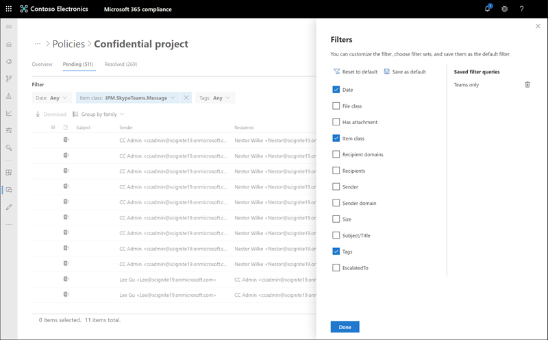
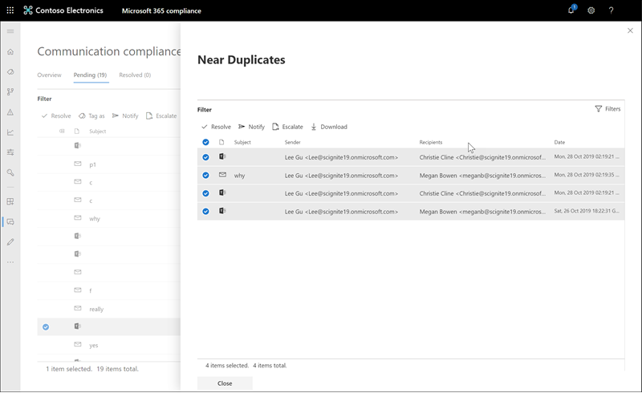
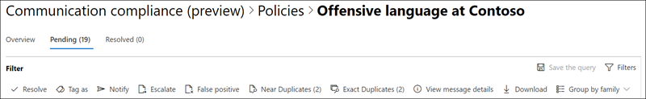
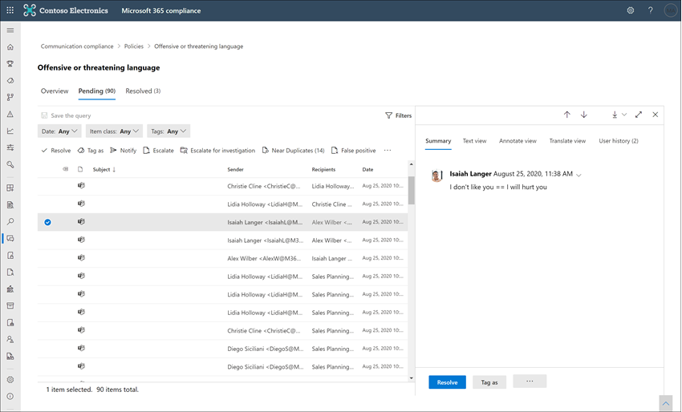

# Investigate and remediate communication compliance alerts

After you've configured your communication compliance policies, you'll start to receive alerts in the Microsoft 365 compliance center for message issues that match your policy conditions. Follow the workflow instructions here to investigate and remediate alert issues.

## Investigate alerts

The first step to investigate issues detected by your policies is to review communication compliance alerts in the Microsoft 365 compliance center. There are several areas in the communication compliance solution area to help you to quickly investigate alerts, depending on how you prefer to view alert grouping:

- **Communication compliance policy page**: When you sign in to [https://compliance.microsoft.com](https://compliance.microsoft.com) using credentials for an admin account in your Microsoft 365 organization, select **Communication compliance** to display the communication compliance **Policy** page. This page displays communication compliance policies configured for your Microsoft 365 organization and links to recommended policy templates. Each policy listed includes the count of alerts that need review, the number of escalated and resolved items, status of the policy, and the date and time of the last policy scan. Selecting a policy displays all the pending alerts for matches to the policy, select a specific alert to launch the policy details page and to start remediation actions.
- **Alerts**: Navigate to **Communication compliance** > **Alerts** to display the last 30 days of alerts grouped by policy matches. This view allows you to quickly see which communication compliance policies are generating the most alerts ordered by severity. To start remediation actions, select the policy associated with the alert to launch the **Policy details** page. From the **Policy details** page, you can review a summary of the activities on the **Overview** page, review and act on alert messages on the **Pending** page, or review the history of closed alerts on the **Resolved** page.
- **Reports**: Navigate to **Communication compliance** > **Reports** to display communication compliance report widgets. Each widget provides an overview of communication compliance activities and statuses, including access to deeper insights about policy matches and remediation actions.

### Using filters

The next step is to sort the messages so that it's easier for you to investigate alerts. From the **Policy details** page, communication compliance supports multi-level filtering for several message fields to help you quickly investigate and review messages with policy matches. Filtering is available for pending and resolved items for each configured policy. You can configure filter queries for a policy or configure and save custom and default filter queries for use in each specific policy. After configuring fields for a filter, you'll see the filter fields displayed on the top of the alert message queue that you can configure for specific filter values.

For a complete list of filters and field details, see [Filters](communication-compliance-feature-reference.md#filters) in the feature reference article.

#### To configure a filter

1. Sign into [https://compliance.microsoft.com](https://compliance.microsoft.com) using credentials for an admin account in your Microsoft 365 organization.

2. In the Microsoft 365 compliance center, go to **Communication compliance**.

3. Select the **Policies** tab and then select a policy for investigation, double-click to open the **Policy** page.

4. On the **Policy** page, select either the **Pending** or **Resolved** tab to display the items for filtering.

5. Select the **Filters** control to open the **Filters** details page.

6. Select one or more checkboxes to enable filters for these alerts. You can choose from numerous filters, including *Date*, *Sender*, *Subject/Title*, *Classifiers*, *Language*, and more.

7. If you'd like to save the filter selected as the default filter, select **Save as default**. If you want to use this filter as a saved filter, select **Done**.

8. If you'd like to save the selected filters as a filter query, select **Save the query** control after you've configured at least one filter value. Enter a name for the filter query and select **Save**. This filter is available to use for only this policy and is listed in the **Saved filter queries** section of the **Filters** details page.

    

### Using near and exact duplicate analysis

Communication compliance policies automatically scan and pre-group near and exact message duplicates without any additional configuration steps. This view allows you to quickly act on similar messages one-by-one or as a group, reducing the message investigation burden for reviewers. As duplicates are detected, the **Near Duplicates** and/or the **Exact Duplicates** controls are displayed in the remediation action toolbar. This view isn't available if near or exact duplicates aren't found.

#### To remediate duplicates

1. Sign into [https://compliance.microsoft.com](https://compliance.microsoft.com) using credentials for an admin account in your Microsoft 365 organization.

2. In the Microsoft 365 compliance center, go to **Communication compliance**.

3. Select the **Policies** tab and then select a policy for investigation, double-click to open the **Policy** page.

4. On the **Policy** page, select either the **Pending** or **Resolved** tab to display duplicate messages.

5. Select the **Near Duplicates** or **Exact Duplicates** controls to open the duplicates details page.

6. Select one or more messages to remediation action controls for these messages.

7. Select **Resolve**, **Notify**, **Escalate**, or **Download** to apply the action to the selected duplicate messages as the default filter.

8. Select **Close** after completing the remediation actions on the messages.

    

## Remediate alerts

No matter where you start to review alerts or the filtering you configure, the next step is to take action to remediate the alert. Start your alert remediation using the following workflow on the **Policy** or **Alerts** pages.

### Step 1: Examine the message basics

 Sometimes it's obvious from the source or subject that a message can be immediately remediated. It may be that the message is spurious or incorrectly matched to a policy and it should be resolved as a false positive. Select the **False Positive** control to immediately resolve the alert and remove from the pending alert queue. From the source or sender information, you may already know how the message should be routed or handled in these circumstances. Consider using the **Tag as** or **Escalate** controls to assign a tag to applicable messages or to send messages to a designated reviewer.

### Step 2: Examine the message details

After reviewing the message basics, it's time to open a message to examine the details and to determine further remediation actions. Select a message to view the complete message header and body information. Several different views are available to help you decide the proper course of action:

- **Source view**: This view is the standard message view commonly seen in most web-based messaging platforms. The header information is formatted in the normal style and the message body supports imbedded graphic files and word-wrapped text. If [optical character recognition (OCR)](communication-compliance-feature-reference.md#optical-character-recognition-ocr) is enabled for the policy, images containing printed or handwritten text that match policy conditional are viewed as a child item for the associated message in this view.
- **Text view**: Text view displays a line-numbered text-only view of the message and includes keyword highlighting in messages and attachments for sensitive info type terms or keywords matched in the associated communication compliance policy. Keyword highlighting can help you quickly scan long messages and attachments for the area of interest. In some cases, highlighted text may be only in attachments for messages matching policy conditions. Keyword highlighting isn't supported for terms identified by built-in classifiers assigned to a policy. Embedded files aren't displayed and the line numbering this view is helpful for referencing pertinent details among multiple reviewers.
- **Annotate view**: This view allows reviewers to add annotations directly on the message that are saved to the view of the message. If [OCR is enabled](communication-compliance-feature-reference.md#optical-character-recognition-ocr) for the policy, images containing printed or handwritten text that match policy conditional are viewed as a child item for the associated message in this view and may be annotated.
- **Conversation view (preview)**: Available for Microsoft Teams chat messages, this view displays up to five messages before and after an alert message to help reviewers view the activity in the conversational context. This context helps reviewers to quickly evaluate messages and make more informed message resolution decisions. Real-time message additions to conversations are displayed, including all inline images, emojis, and stickers available in Teams. Image or text file attachments to messages aren't displayed. Notifications are automatically displayed for messages that have been edited or for messages that have been deleted from the conversation window. When a message is resolved, the associated conversational messages aren't retained with the resolved message. Conversation messages are available for up to 60 days after the alert message is identified.
- **User history**: User history view displays all other alerts generated by any communication compliance policy for the user sending the message.
- **Pattern detected notification**: Many harassing and bullying actions over time and involve reoccurring instances of the same behavior by a user. The *Pattern detected* notification is displayed in the alert details and raises attention to the alert. Detection of patterns is on a per-policy basis and evaluates behavior over the last 30 days when at least two messages are sent to the same recipient by a sender. Investigators and reviewers can use this notification to identify repeated behavior to evaluate the alert as appropriate.
- **Show Translate view**: This view automatically converts alert message text to the language configured in the *Displayed language* setting in the Microsoft 365 subscription for each reviewer. The Translate view helps broaden investigative support for organizations with multilingual users and eliminates the need for additional translation services outside of the communication compliance review process. Using Microsoft Translate services, the Translate view can be turned on and off as needed and supports a wide range of languages. For a complete list of supported languages, see [Microsoft Translator Languages](https://www.microsoft.com/translator/business/languages/). Languages listed in the *Translator Language List* are supported in the Translate view.

    

### Step 3: Decide on a remediation action

Now that you've reviewed the details of the message for the alert, you can choose several remediation actions:

- **Resolve**: Selecting the **Resolve** control immediately removes the message from the **Pending alerts** queue and no further action can be taken on the message. By selecting **Resolve**, you've essentially closed the alert without further classification and it can't be reopened for further actions. All resolved messages are displayed in the **Resolved** tab.
- **False Positive**: You can always resolve a message as a false positive at any point during the message review workflow. False positive signifies that the alert was non-actionable or that the alert was incorrectly generated by the alerting process. The message cannot be reopened and all false positive messages are displayed in the **Resolved** tab.
- **Power Automate (preview)**: Use a Power Automate flow to automate process tasks for an alert message. By default, communication compliance includes the *Notify manager when a user has a communication compliance alert* flow template that reviewers can use to automate the notification process for users with message alerts. For more information about creating and managing Power Automate flows in communication compliance, see the [Communication compliance feature reference](communication-compliance-feature-reference.md#power-automate-flows) article.
- **Tag as**: Tag the message as *compliant*, *non-compliant*, or as *questionable* as it relates to the policies and standards for your organization. Adding tags and tagging comments helps you micro-filter policy alerts for escalations or as part of other internal review processes. After tagging is complete, you can also choose to resolve the message to move it out of the pending review queue.
- **Notify**: You can use the **Notify** control to assign a custom notice template to the alert and to send a warning notice to the user. Choose the appropriate notice template configured in the **Communication compliance settings** area and select **Send** to email a reminder to the user that sent the message and to resolve the issue.
- **Escalate**: Using the **Escalate** control, you can choose who else in your organization should review the message. Choose from a list of reviewers configured in the communication compliance policy to send an email notification requesting additional review of the message alert. The selected reviewer can use a link in the email notification to go directly to items escalated to them for review.
- **Escalate for investigation**: Using the **Escalate for investigation** control, you can create a new [Advanced eDiscovery case](overview-ediscovery-20.md) for single or multiple messages. You'll provide a name and notes for the new case, and user who sent the message matching the policy is automatically assigned as the case custodian. You don't need any additional permissions to manage the case. Creating a case does not resolve or create a new tag for the message. You can select a total of 100 messages when creating an Advanced eDiscovery case during the remediation process. Messages in all communication channels monitored by communication compliance are supported. For example, you could select 50 Microsoft Teams chats, 25 Exchange Online email messages, and 25 Yammer messages when you open a new Advanced eDiscovery case for a user.
- **Remove message in Teams**: Using the **Remove message in Teams** control, you can block inappropriate messages and content identified in alerts from Microsoft Teams channels and 1:1 and group chats. Removed messages and content are replaced with a policy tip that explains that it is blocked and the policy that applies to its removal from view. Recipients are provided a link in the policy tip to learn more about the applicable policy and the review process. The sender receives a policy tip for the blocked message and content but can review the details of the blocked message and content for context regarding the removal.

    

### Step 4: Determine if message details should be archived outside of communication compliance

Message details can be exported or downloaded if you need to archive the messages in a separate storage solution. Selecting the **Download** control automatically adds selected messages to a .ZIP file that can be saved to storage outside of Microsoft 365.
