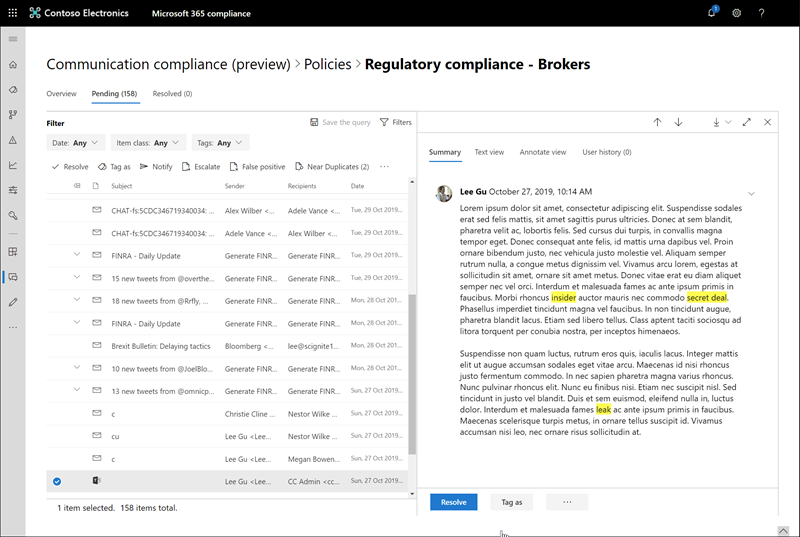

# Investigate and remediate communication compliance alerts

After you've configured your communication compliance policies, you'll start to receive alerts in the Microsoft 365 compliance center for message issues that match your policy conditions. Follow the workflow instructions here to investigate and remediate alert issues.

## Investigate alerts

The first step to investigate issues detected by your policies is to review generated alerts in the Microsoft 365 compliance center. There are several areas in the compliance center to help you to quickly investigate alerts, depending on how you prefer to view alert grouping:

- **Communication compliance home page**: When you sign in to [https://compliance.microsoft.com](https://compliance.microsoft.com) using credentials for an admin account in your Microsoft 365 organization, select **Communication compliance** > **Overview** to display the communication compliance home page. Here you'll see:
    - Alerts needing review listed from high to low severity. Select an alert to launch the alert details page and to start remediation actions.
    - Recent policy matches listed by policy name.
    - Resolved items listed by policy name.
    - Escalations listed by policy name.
    - Users with the most policy matches, listed from the most to the least number of matches.
- **Alerts tab**: Navigate to **Communication compliance** > **Alerts** to display alerts grouped by matched communication compliance policy. This view allows you to quickly see which communication compliance policies are generating the most alerts ordered by severity.  To start remediation actions, expand a policy to select a specific alert and to launch the alert details page.
- **Policies tab**: Navigate to **Communication compliance** > **Policies** to display communication compliance policies configured for your Microsoft 365 organization. Each policy listed includes the count of alerts that need review. Selecting a policy displays all the pending alerts for matches to the policy, select a specific alert to launch the policy details page and to start remediation actions.

### Using filters

The next step is to sort the messages so that it's easier for you to investigate alerts. Communication compliance supports multi-level filtering for several message fields to help you quickly investigate and review messages with policy matches. Filtering is available for pending and resolved items for each configured policy. You can configure filter queries for a policy or configure and save custom and default filter queries for use in each specific policy. After configuring fields for a filter, you'll see the filter fields displayed on the top of the alert message queue that you can configure for specific filter values.

For a complete list of filters and field details, see [Filters](communication-compliance-feature-reference.md#filters) in the feature reference topic.

#### To configure a filter

1. Sign into [https://compliance.microsoft.com](https://compliance.microsoft.com) using credentials for an admin account in your Microsoft 365 organization.

2. In the Microsoft 365 compliance center, go to **Communication compliance**.

3. Select the **Policies** tab and then select a policy for investigation, double-click to open the **Policy** page.

4. On the **Policy** page, select either the **Pending** or **Resolved** tab to display the items for filtering.

5. Select the **Filters** control to open the **Filters** details page.

6. Select one or more checkboxes to enable filters for these alerts. You can choose from numerous filters, including *Date*, *Sender*, *Subject/Title*, *Classifiers*, and more.

7. If you'd like to save the filter selected as the default filter, select **Save as default**. If you want to use this filter as a saved filter, select **Done**.

8. If you'd like to save the selected filters as a filter query, select **Save the query** control after you've configured at least one filter value. Enter a name for the filter query and select **Save**. This filter is available to use for only this policy and is listed in the **Saved filter queries** section of the **Filters** details page.

    

### Using near and exact duplicate analysis

Communication compliance policies automatically scan and pre-group near and exact message duplicates without any additional configuration steps. This view allows you to quickly remediate similar messages one-by-one or as a group, reducing the message investigation burden for reviewers. As duplicates are detected, the **Near Duplicates** and/or the **Exact Duplicates** controls are displayed in the remediation action toolbar.

#### To remediate duplicates

1. Sign into [https://compliance.microsoft.com](https://compliance.microsoft.com) using credentials for an admin account in your Microsoft 365 organization.

2. In the Microsoft 365 compliance center, go to **Communication compliance**.

3. Select the **Policies** tab and then select a policy for investigation, double-click to open the **Policy** page.

4. On the **Policy** page, select either the **Pending** or **Resolved** tab to display duplicate messages.

5. Select the **Near Duplicates** or **Exact Duplicates** controls to open the duplicates details page.

6. Select one or more messages to remediation action controls for these messages.

7. Select **Resolve**, **Notify**, **Escalate**, or **Download** to apply the action to the selected duplicate messages.elected as the default filter.

8. Select **Close** after completing the remediation actions on the messages.

    

## Remediate alerts

No matter where you start to review alerts or the filtering you configure, the next step is to take action to remediate the alert. Start your alert remediation using the following workflow on the **Policy** or **Alerts** pages:

1. **Examine the message basics**: Sometimes it's obvious from the source or subject that a message can be immediately remediated. It may be that the message is spurious or incorrectly matched to a policy and it should be resolved as a false positive. Select the **False Positive** control to immediately resolve the alert and remove from the pending alert queue. From the source or sender information, you may already know how the message should be routed or handled in these circumstances. Consider using the **Tag as** or **Escalate** controls to assign a tag to applicable messages or to send messages to a designated reviewer.

    

2. **Examine the message details**: After reviewing the message basics, it's time to open a message to examine the details and to determine further remediation actions. Select a message to view the complete message header and body information. Several different views are available to help you decide the proper course of action:

    - **Source view**: This view is the standard message view commonly seen in most web-based messaging platforms. The header information is formatted in the normal style and the message body supports imbedded graphic files and word-wrapped text.
    - **Text view**: Text view displays a line-numbered text-only view of the message and includes keyword highlighting for terms matched in the associated communication compliance policy. Keyword highlighting can help you quickly scan long messages for the area of interest. Embedded files aren't displayed and the line numbering this view is helpful for referencing pertinent details among multiple reviewers.
    - **Annotate view**: This view allows reviewers to add annotations directly on the message that are saved to the view of the message.
    - **User history**: User history view displays all other alerts generated by any communication compliance policy for the user sending the message.

    

3. **Decide on a remediation action**: Now that you've reviewed the details of the message for the alert, you can choose several remediation actions:

    - **Resolve**: Selecting the **Resolve** control immediately removes the message from the **Pending alerts** queue and no further action can be taken on the message. By selecting **Resolve**, you've essentially closed the alert without further classification and it can't be reopened for further actions. All resolved messages are displayed in the **Resolved** tab.
    - **False Positive**: You can always resolve a message as a false positive at any point during the message review workflow. The message cannot be reopened and all false positive messages are displayed in the **Resolved** tab.
    - **Tag as**: Tag the message as *compliant*, *non-compliant*, or as *questionable* as it relates to the policies and standards for your organization. Adding tags and tagging comments can help you micro-filter policy alerts for escalations or as part of other internal review processes. After tagging is complete, you can also choose to resolve the message to move it out of the pending review queue.
    - **Notify**: You can use the **Notify** control to assign a custom notice template to the alert and to send a warning notice to the user. Choose the appropriate notice template, and select **Send** to email a reminder to the employee that sent the message and to resolve the issue.
    - **Escalate**: Using the **Escalate** control, you can choose who else in your organization should review the message. Choose from a list of configured reviewers to send an email notification requesting additional review of the message alert. The selected reviewer can use a link in the email notification to go directly to items escalated to them for review.
    - **Create a case**: Using the **Create a case** control, you can create a new [Advanced eDiscovery case]((overview-ediscovery-20.md)) for single or multiple messages. You'll provide a name and notes for the new case, and user who sent the message matching the policy is automatically assigned as the case custodian. You don't need any additional permissions to manage the case. Creating a case does not resolve or create a new tag for the message.

4. **Determine if message details should be archived outside of communication compliance**: Message details can be exported or downloaded if you need to archive the messages in a separate storage solution. Selecting the **Download** control automatically adds selected messages to a .ZIP file that can be saved to storage outside of Microsoft 365.
