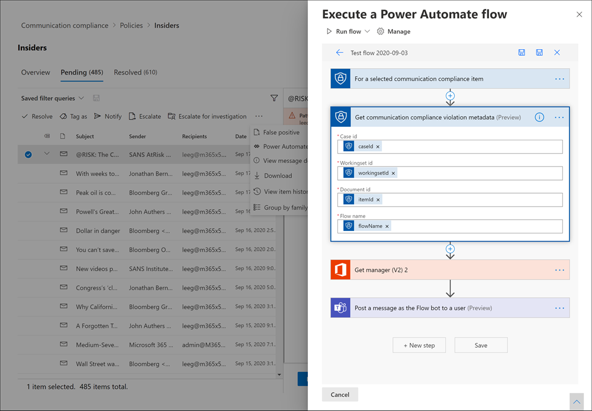

# Investigate and remediate communication compliance alerts

> [!IMPORTANT]
> Microsoft Purview Communication Compliance provides the tools to help organizations detect regulatory compliance violations (for example SEC or FINRA), such as sensitive or confidential information, harassing or threatening language, and sharing of adult content. Built with privacy by design, usernames are pseudonymized by default, role-based access controls are built in, investigators are opted in by an admin, and audit logs are in place to help ensure user-level privacy.

After you've configured your [communication compliance policies](/microsoft-365/compliance/communication-compliance-policies), you'll begin receiving alerts in the [Microsoft Purview compliance portal](https://compliance.microsoft.com) for message issues that match your policy conditions. To view and act on alerts, users must be assigned to the following permissions:

- The *Communication Compliance Analysts* or the *Communication Compliance Investigators* role group
- Reviewer in the policy that is associated with the alert

After you establish required permissions, follow the workflow instructions below to investigate and remediate alert issues.

[!INCLUDE [purview-preview](../includes/purview-preview.md)]

## Investigate alerts

The first step to investigate issues detected by your policies is to review alerts in the Microsoft Purview compliance portal. There are several areas in the communication compliance area to help you to quickly investigate alerts, depending on how you prefer to view alert grouping:

- **Communication compliance policy page**: When you sign into the [Microsoft Purview compliance portal](https://compliance.microsoft.com) using credentials for an admin account in your Microsoft 365 organization, select **Communication compliance** to display the communication compliance **Policy** page. This page displays communication compliance policies configured for your Microsoft 365 organization and links to recommended policy templates. Each policy listed includes the count of alerts that need review, the number of escalated and resolved items, status of the policy, and the date and time of the last policy check. Select a policy to display all pending alerts for matches to the policy, then select a specific alert to launch the policy details page and to start remediation actions.
- **Alerts**: Navigate to **Communication compliance** > **Alerts** to display the last 30 days of alerts grouped by policy matches. This view allows you to quickly see which communication compliance policies are generating the most alerts ordered by severity. To start remediation actions, select the policy associated with the alert to launch the **Policy details** page. From the **Policy details** page, you can review a summary of the activities on the **Overview** page, review and act on alert messages on the **Pending** tab, or review the history of closed alerts on the **Resolved** tab.
- **Reports**: Navigate to **Communication compliance** > **Reports** to display communication compliance report widgets. Each widget provides an overview of communication compliance activities and statuses, including access to deeper insights about policy matches and remediation actions.

### Using filters

The next step is to sort the messages so it's easier for you to investigate alerts. From the **Policy details** page, communication compliance supports multi-level filtering for several message fields to help you quickly investigate and review messages with policy matches. Filtering is available for pending and resolved items for each configured policy. You can configure filter queries for a policy or configure and save custom and default filter queries for use in each specific policy. After configuring fields for a filter, you'll see the filter fields displayed on the top of the alert message queue that you can configure for specific filter values.

For the date filter, the date and time for events are listed in Coordinated Universal Time (UTC). When filtering messages for views, the requesting user's local date/time determines the results based on the conversion of the user's local date/time to UTC. For example, if a user in U.S. Pacific Daylight Time (PDT) filters a report from 8/30/2021 to 8/31/2021 at 00:00, the report includes messages from 8/30/2021 07:00 UTC to 8/31/2021 07:00 UTC. If the same user was in U.S. Eastern Daylight Time (EDT) when filtering at 00:00, the report includes messages from 8/30/2021 04:00 UTC to 8/31/2021 04:00 UTC.

#### Filter details

Communication compliance filters allow you to filter and sort alert messages for quicker investigation and remediation actions. Filtering is available on the **Pending** and **Resolved** tabs for each policy. To save a filter or filter set as a saved filter query, one or more values must be configured as filter selections.

The following table outlines filter details:

|**Filter**|**Details**|
|:-----|:-----|
| **Date** | The date the message was sent or received by a user in your organization. To filter for a single day, select a date range that starts with the day you want results for and end with the following day. For example, if you wanted to filter results for 9/20/2020, you would choose a filter date range of 9/20/2020-9/21/2020.|
| **File class** | The class of the message based on the message type, either *message* or *attachment*. |
| **Has attachment** | The attachment presence in the message. |
| **Item class** | The source of the message based on the message type, email, Microsoft Teams chat, Bloomberg, etc. For more information, see [Item Types and Message Classes](/office/vba/outlook/concepts/forms/item-types-and-message-classes). |
| **Recipient domains** | The domain to which the message was sent; typically your Microsoft 365 subscription domain by default. |
| **Recipient** | The user to which the message was sent. |
| **Sender** | The person who sent the message. |
| **Sender domain** | The domain that sent the message. |
| **Size** | The size of the message in KB. |
| **Subject/Title** | The message subject or chat title. |
| **Tags** | The tags assigned to a message, either *Questionable*, *Compliant*, or *Non-compliant*. |
| **Language** | The detected language of text in the message. The message is classified according to the language of the majority of the message text. For example, for a message containing both German and Italian text, but the majority of text is German, the message is classified as German (DE). For a list of supported languages, see [Learn about trainable classifiers](/microsoft-365/compliance/classifier-learn-about). <br><br> You can also filter by more than one language. For example, to filter messages classified as German and Italian, enter 'DE,IT' (the 2-digit language codes) in the Language filter search box. To view the detected language classification for a message, select a message, select View message details, and scroll to the *EmailDetectedLanguage* field. |
| **Escalated To** | The user name of the person included as part of a message escalation action. |
| **Classifiers** | The name of built-in and custom classifiers that apply to the message. Some examples include *Targeted Harassment*, *Profanity*, *Threat*, and more.

#### To configure a filter

1. Sign into the [Microsoft Purview compliance portal](https://compliance.microsoft.com) using credentials for an admin account in your Microsoft 365 organization.

2. In the Microsoft Purview compliance portal, go to **Communication compliance**.

3. Select the **Policies** tab and then select a policy for investigation, double-click to open the **Policy** page.

4. On the **Policy** page, select either the **Pending** or **Resolved** tab to display the items for filtering.

5. Select the **Filters** control to open the **Filters** details page.

6. Select one or more checkboxes to enable filters for these alerts. You can choose from numerous filters, including *Date*, *Sender*, *Subject/Title*, *Classifiers*, *Language*, and more.

7. If you'd like to save the filter selected as the default filter, select **Save as default**. If you want to use this filter as a saved filter, select **Done**.

8. If you'd like to save the selected filters as a filter query, select **Save the query** control after you've configured at least one filter value. Enter a name for the filter query and select **Save**. This filter is available to use for only this policy and is listed in the **Saved filter queries** section of the **Filters** details page.

    

## Remediate alerts

No matter where you start to review alerts or the filtering you configure, the next step is to take action to remediate the alert. Start your alert remediation using the following workflow on the **Policy** or **Alerts** pages.

### Step 1: Examine the message basics

 Sometimes it's obvious from the source or subject that a message can be immediately remediated. It may be that the message is spurious or incorrectly matched to a policy and it should be resolved as misclassified. Select the **Report as misclassified** control to share misclassified content with Microsoft, immediately resolve the alert, and remove from the pending alert queue. From the source or sender information, you may already know how the message should be routed or handled in these circumstances. Consider using the **Tag as** or **Escalate** controls to assign a tag to applicable messages or to send messages to a designated reviewer.


### Step 2: Examine the message details

After reviewing the message basics, now you can open a message to examine the details and determine further remediation actions. Select a message to view the complete message header and body information. Several different options and views are available to help you decide the proper course of action:

- **Attachments**: This option allows you to examine modern attachments that match policy conditions. Modern attachments content is extracted as text and is viewable on the policy's **Pending** alerts tab. For more information, see the [Communication compliance feature reference](/microsoft-365/compliance/communication-compliance-channels).
- **Source**: This view is the standard message view commonly seen in most web-based messaging platforms. The header information is formatted in the normal style and the message body supports imbedded graphic files and word-wrapped text. If [optical character recognition (OCR)](/microsoft-365/compliance/communication-compliance-policies#optical-character-recognition-ocr) is enabled for the policy, images containing printed or handwritten text that match policy conditional are viewed as a child item for the associated message in this view.
- **Plain text**: Text view that displays a line-numbered text-only view of the message and includes keyword highlighting in messages and attachments for sensitive info type terms, terms identified by built-in classifiers assigned to a policy, or for terms included in a dedicated keyword dictionary assigned to a policy. Keyword highlighting, which is currently available for English language only, can help direct you to the area of interest in long messages and attachments. In some cases, highlighted text might be only in attachments for messages matching policy conditions. Embedded files aren't displayed and the line numbering in this view is helpful for referencing pertinent details among multiple reviewers.
- **Conversation**: Available for Microsoft Teams chat messages, this view displays up to five messages before and after an alert message to help reviewers view the activity in the conversational context. This context helps reviewers to quickly evaluate messages and make more informed message resolution decisions. Real-time message additions to conversations are displayed, including all inline images, emojis, and stickers available in Teams. Image or text file attachments to messages aren't displayed. Notifications are automatically displayed for messages that have been edited or for messages that have been deleted from the conversation window. When a message is resolved, the associated conversational messages aren't retained with the resolved message. Conversation messages are available for up to 60 days after the alert message is identified.
- **User history**: User history view displays all other alerts generated by any communication compliance policy for the user sending the message.
- **Pattern detected notification**: Many harassing and bullying actions over time involve reoccurring instances of the same behavior by a user. The *Pattern detected* notification is displayed in the alert details and raises attention to the alert. Detection of patterns is on a per-policy basis and evaluates behavior over the last 30 days when at least two messages are sent to the same recipient by a sender. Investigators and reviewers can use this notification to identify repeated behavior to evaluate the alert as appropriate.
- **Translation**: This view automatically converts alert message text to the language configured in the *Displayed language* setting in the Microsoft 365 subscription for each reviewer. The *Translation* view helps broaden investigative support for organizations with multilingual users and eliminates the need for additional translation services outside of the communication compliance review process. Using Microsoft translation services, communication compliance automatically detects if the text is in a different language than the user's current system setting and will display alert message text accordingly. For a complete list of supported languages, see [Microsoft Translator Languages](https://www.microsoft.com/translator/business/languages/). Languages listed in the *Translator Language List* are supported in the *Translation* view.

### Step 3: Decide on a remediation action

Now that you've reviewed the details of the message for the alert, you can choose several remediation actions:

- **Resolve**: Selecting the **Resolve** control immediately removes the message from the **Pending alerts** queue and no further action can be taken on the message. By selecting **Resolve**, you've essentially closed the alert without further classification. All resolved messages are displayed in the **Resolved** tab.
- **Report as misclassified**: You can always resolve a message as misclassified at any point during the message review workflow. Misclassified signifies that the alert was non-actionable or that the alert was incorrectly generated by the alerting process and any trainable classifiers. Resolving the item as misclassified sends message content, attachments, and the message subject (including metadata) to Microsoft to help improve trainable classifiers. Data that is sent to Microsoft doesn't contain information that may identify or be used to identify any users in your organization. Further actions can’t be taken on the message and all misclassified messages are displayed in the **Resolved** tab.
- **Power Automate (preview)**: Use a Power Automate flow to automate process tasks for an alert message. By default, communication compliance includes the *Notify manager when a user has a communication compliance alert* flow template that reviewers can use to automate the notification process for users with message alerts. For more information about creating and managing Power Automate flows in communication compliance, see the **Step 5: Consider Power Automate flows** section in this article.
- **Tag as**: Tag the message as *compliant*, *non-compliant*, or as *questionable* as it relates to the policies and standards for your organization. Adding tags and tagging comments helps you micro-filter policy alerts for escalations or as part of other internal review processes. After tagging is complete, you can also choose to resolve the message to move it out of the pending review queue.
- **Notify**: You can use the **Notify** control to assign a custom notice template to the alert and to send a warning notice to the user. Choose the appropriate notice template configured in the **Communication compliance settings** area and select **Send** to email a reminder to the user that sent the message and to resolve the issue.
- **Escalate**: Using the **Escalate** control, you can choose who else in your organization should review the message. Choose from a list of reviewers configured in the communication compliance policy to send an email notification requesting additional review of the message alert. The selected reviewer can use a link in the email notification to go directly to items escalated to them for review.
- **Escalate for investigation**: Using the **Escalate for investigation** control, you can create a new [eDiscovery (Premium) case](/microsoft-365/compliance/overview-ediscovery-20) for single or multiple messages. You'll provide a name and notes for the new case, and user who sent the message matching the policy is automatically assigned as the case custodian. You don't need any additional permissions to manage the case. Creating a case doesn't resolve or create a new tag for the message. You can select a total of 100 messages when creating an eDiscovery (Premium) case during the remediation process. Messages in all communication channels included in communication compliance are supported. For example, you could select 50 Microsoft Teams chats, 25 Exchange Online email messages, and 25 Yammer messages when you open a new eDiscovery (Premium) case for a user.
- **Remove message in Teams**: Using the **Remove message in Teams** control, you can block potentially inappropriate messages and content identified in alerts from Microsoft Teams channels and 1:1 and group chats. This includes Teams chat messages reported by users and chat messages detected using machine-learning and classifier-based communication compliance policies. Removed messages and content are replaced with a policy tip that explains that it's blocked and the policy that applies to its removal from view. Recipients are provided a link in the policy tip to learn more about the applicable policy and the review process. The sender receives a policy tip for the blocked message and content but can review the details of the blocked message and content for context regarding the removal.

### Step 4: Determine if message details should be archived outside of communication compliance

Message details can be exported or downloaded if you need to archive the messages in a separate storage solution. Selecting the **Download** control automatically adds selected messages to a .ZIP file that can be saved to storage outside of Microsoft 365.

### Step 5: Consider Power Automate flows

[Microsoft Power Automate](/power-automate/getting-started) is a workflow service that automates actions across applications and services. By using flows from templates or created manually, you can automate common tasks associated with these applications and services. When you enable Power Automate flows for communication compliance, you can automate important tasks for alerts and users. You can configure Power Automate flows to notify managers when users have communication compliance alerts and other applications.

Customers with Microsoft 365 subscriptions that include communication compliance don't need additional Power Automate licenses to use the recommended default communication compliance Power Automate template. The default template can be customized to support your organization and cover core communication compliance scenarios. If you choose to use premium Power Automate features in these templates, create a custom template using the Microsoft Purview connector, or use Power Automate templates for other compliance areas in Microsoft Purview, you may need additional Power Automate licenses.

> [!IMPORTANT]
> Are you receiving prompts for additional license validation when testing Power Automate flows? Your organization may not have received service updates for this preview feature yet. Updates are being deployed and all organizations with Microsoft 365 subscriptions that include communication compliance should have license support for flows created from the recommended Power Automate templates before October 30, 2020.



The following Power Automate template is provided to customers to support process automation for communication compliance alerts:

- **Notify manager when a user has a communication compliance alert**: Some organizations may need to have immediate management notification when a user has a communication compliance alert. When this flow is configured and selected, the manager for the case user is sent an email message with the following information about all alerts:
  - Applicable policy for the alert
  - Date/Time of the alert
  - Severity level of the alert

#### Create a Power Automate flow

To create a Power Automate flow from a recommended default template, you'll use the **Manage Power Automate flows** option from the **Automate** control when working directly in an alert. To create a Power Automate flow with **Manage Power Automate flows**, you must be a member of at least one communication compliance role group.

Follow these steps to create a Power Automate flow from a default template:

1. In the [Microsoft Purview compliance portal](https://compliance.microsoft.com), go to **Communication compliance** > **Policies** and select the policy with the alert you want review.
2. From the policy, select the **Pending** tab and select a pending alert.
3. Select **Power Automate** from the alert action menu.
4. On the **Power Automate** page, select a default template from the **Communication compliance templates you may like** section on the page.
5. The flow lists the embedded connections needed for the flow and displays if the connection statuses are available. If needed, update any connections that aren't displayed as available. Select **Continue**.
6. By default, the recommended flows are pre-configured with the recommended communication compliance and Microsoft 365 service data fields required to complete the assigned task for the flow. If needed, customize the flow components by using the **Show advanced options** control and configuring the available properties for the flow component.
7. If needed, add any additional steps to the flow by selecting the **New step** button. In most cases, this change shouldn't be needed for the recommended default templates.
8. Select **Save draft** to save the flow for further configuration later, or select **Save** to complete the configuration for the flow.
9. Select **Close** to return to the Power Automate flow page. The new template will be listed as a flow on the **My flows** tab and is automatically available from the Power Automate control for the user that created the flow when working with communication compliance alerts.

#### Share a Power Automate flow

By default, Power Automate flows created by a user are only available to that user. For other communication compliance users to have access and use a flow, the flow must be shared by the flow creator. To share a flow, use the **Power Automate** control when working directly in an alert.

To share a Power Automate flow, you must be a member of at least one communication compliance role group.

Follow these steps to share a Power Automate flow:

1. In the [Microsoft Purview compliance portal](https://compliance.microsoft.com), go to **Communication compliance** > **Policies** and select the policy with the alert you want review.
2. From the policy, select the **Pending** tab and select a pending alert.
3. Select **Power Automate** from the alert action menu.
4. On the **Power Automate flows** page, select the **My flows** or **Team flows** tab.
5. Select the flow to share, then select **Share** from the **Flow Options** menu.
6. On the flow sharing page, enter the name of the user or group you want to add as an owner for the flow.
7. On the **Connection Used** dialog, select **OK** to acknowledge that the added user or group will have full access to the flow.

#### Edit a Power Automate flow

If you need to edit a flow, you'll use the **Power Automate** control when working directly in an alert. To edit a Power Automate flow, you must be a member of at least one communication compliance role group.

Follow these steps to edit a Power Automate flow:

1. In the [Microsoft Purview compliance portal](https://compliance.microsoft.com), go to **Communication compliance** > **Policies** and select the policy with the alert you want review.
2. From the policy, select the **Pending** tab and select a pending alert.
3. Select **Power Automate** from the alert action menu.
4. On the **Power Automate flows** page, select flow to edit. Select **Edit** from the flow control menu.
5. Select the **ellipsis** > **Settings** to change a flow component setting or **ellipsis** > **Delete** to delete a flow component.
6. Select **Save** and then **Close** to complete editing the flow.

#### Delete a Power Automate flow

If you need to delete a flow, use the **Power Automate** control when working directly in an alert. To delete a Power Automate flow, you must be a member of at least one communication compliance role group.

Follow these steps to delete a Power Automate flow:

1. In the [Microsoft Purview compliance portal](https://compliance.microsoft.com), go to **Communication compliance** > **Policies** and select the policy with the alert you want review.
2. From the policy, select the **Pending** tab and select a pending alert.
3. Select **Power Automate** from the alert action menu.
4. On the **Power Automate flows** page, select flow to delete. Select **Delete** from the flow control menu.
5. On the deletion confirmation dialog, select **Delete** to remove the flow or select **Cancel** to exit the deletion action.

### Step 6: Consider creating notice templates

You can create notice templates if you want to send users an email reminder notice for policy matches as part of the issue resolution process. Notices can only be sent to the user email address associated with the policy match that generated the specific alert for remediation. When selecting a notice template to apply to a policy violation as part of the remediation workflow, you can choose to accept the field values defined in the template or overwrite the fields as needed.

Notices templates are custom email templates where you can define the following message fields in the **Communication compliance settings** area:

|**Field**|**Required**| **Details** |
|:-----|:-----|:-----|
|**Template name** | Yes | Friendly name for the notice template that you'll select in the notify workflow during remediation, supports text characters. |
| **Sender address** | Yes | Address of one or more users or groups that send the message to the user with a policy match, selected from the Active Directory for your subscription. |
| **CC and BCC addresses** | No | Optional users or groups to be notified of the policy match, selected from the Active Directory for your subscription. |
| **Subject** | Yes | Information that appears in the subject line of the message, supports text characters. |
| **Message body** | Yes | Information that appears in the message body, supports text or HTML values. |

### HTML for notices

If you'd like to create more than a simple text-based email message for notifications, you can create a more detailed message by using HTML in the message body field of a notice template. The following example provides the message body format for a basic HTML-based email notification template:

```HTML
<!DOCTYPE html>
<html>
    <body>
        <h2>Action Required: Contoso Employee Code of Conduct Policy Training</h2>
        <p>A recent message you've sent has generated a policy alert for the Contoso Employee <a href='https://www.contoso.com'>Code of Conduct Policy</a>.</p>
        <p>You are required to attend the Contoso Employee Code of Conduct <a href='https://www.contoso.com'>training</a> within the next 14 days. Please contact <a href='mailto:hr@contoso.com'>Human Resources</a> with any questions about this training request.</p>
        <p>Thank you,</p>
        <p><em>Human Resources</em></p>
    </body>
</html>
```

> [!NOTE]
> HTML href attribute implementation in the communication compliance notification templates currently support only single quotation marks instead of double quotation marks for URL references.

## Unresolve messages (preview)

When messages are resolved, they're removed from the **Pending** tab view and displayed in the **Resolved** tab. Investigation and remediation actions aren't available for messages in the *Resolved* view. However, there may be instances where you need to take additional action on a message that was mistakenly resolved or that needs further investigation after initial resolution. You can use the unresolve command feature move one or more messages from the *Resolved* view back to the *Pending* view.

Follow these steps to unresolve messages:

1. Sign into the [Microsoft Purview compliance portal](https://compliance.microsoft.com) using credentials for a user assigned to the *Communication Compliance Analysts* or *Communication Compliance Investigators* role groups in your Microsoft 365 organization.
2. In the Microsoft Purview compliance portal, go to **Communication compliance**.
3. Select the **Policies** tab and then select a policy that contains the resolved alert message, double-click to open the **Policy** page.
4. On the **Policy** page, select the **Resolved** tab.
5. On the **Resolved** tab, select one or more messages to move back to *Pending*.
6. On the command bar, select **Unresolve**.
7. On the **Unresolve item** pane, add any comments applicable to the unresolve action and select **Save** to move the item back to *Pending*.
8. Select the **Pending** tab to verify the selected items are displayed.
