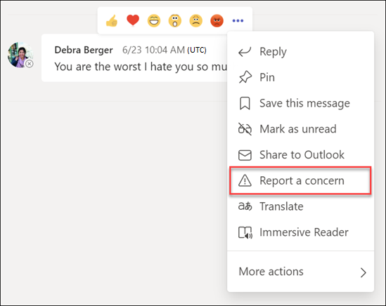
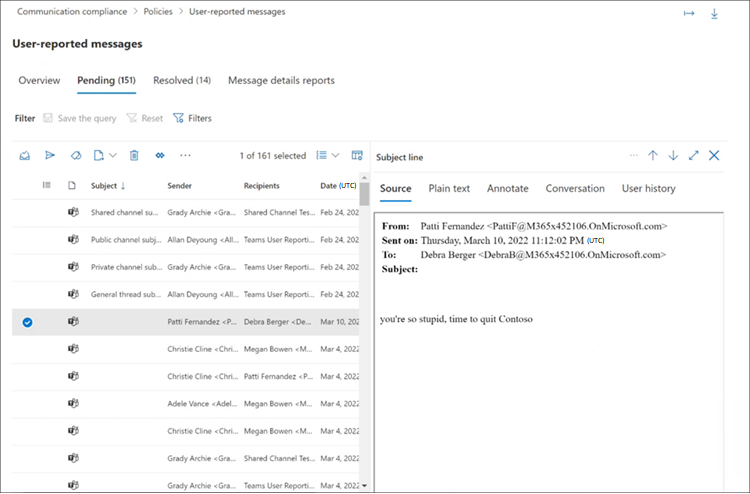

# Create and manage communication compliance policies

> [!IMPORTANT]
> Microsoft Purview Communication Compliance provides the tools to help organizations detect regulatory compliance violations (for example SEC or FINRA), such as sensitive or confidential information, harassing or threatening language, and sharing of adult content. Built with privacy by design, usernames are pseudonymized by default, role-based access controls are built in, investigators are opted in by an admin, and audit logs are in place to ensure user-level privacy.

[!INCLUDE [purview-preview](../includes/purview-preview.md)]

## Policies

> [!IMPORTANT]
> Using PowerShell to create and manage communication compliance policies is not supported. To create and manage these policies, you must use the policy management controls in the [communication compliance solution](https://compliance.microsoft.com/supervisoryreview).

You create communication compliance policies for Microsoft 365 organizations in the Microsoft Purview compliance portal. Communication compliance policies define which communications and users are subject to review in your organization, define which custom conditions the communications must meet, and specify who should do reviews. Users assigned the *Communication Compliance Admins* role can set up policies, and anyone who has this role assigned can access the **Communication compliance** page and global settings in the Microsoft Purview compliance portal. If needed, you can export the history of modifications to a policy to a .csv (comma-separated values) file that also includes the status of alerts pending review, escalated items, and resolved items. Policies can't be renamed and can be deleted when no longer needed.

## Policy templates

Policy templates are pre-defined policy settings that you can use to quickly create policies to address common compliance scenarios. Each of these templates has differences in conditions and scope, and all templates use the same types of scanning signals. You can choose from the following policy templates:

|**Area**|**Policy Template**|**Details**|
|:-----|:-----|:-----|
| **Inappropriate text** | Detect inappropriate text | - Locations: Exchange Online, Microsoft Teams, Yammer   - Direction: Inbound, Outbound, Internal   - Review Percentage: 100%   - Conditions: Threat, Discrimination, and Targeted harassment classifiers |
| **Inappropriate images** | Detect inappropriate images | - Locations: Exchange Online, Microsoft Teams, Yammer   - Direction: Inbound, Outbound, Internal   - Review Percentage: 100%   - Conditions: Adult and Racy image classifiers |
| **Sensitive information** | Monitor for sensitive info | - Locations: Exchange Online, Microsoft Teams, Yammer   - Direction: Inbound, Outbound, Internal   - Review Percentage: 10%   - Conditions: Sensitive information, out-of-the-box content patterns, and types, custom dictionary option, attachments larger than 1 MB |
| **Regulatory compliance** | Monitor for regulatory compliance | - Locations: Exchange Online, Microsoft Teams, Yammer   - Direction: Inbound, Outbound   - Review Percentage: 10%   - Conditions: custom dictionary option, attachments larger than 1 MB |
| **Conflict of interest** | Monitor for conflict of interest | - Locations: Exchange Online, Microsoft Teams, Yammer   - Direction: Internal   - Review Percentage: 100%   - Conditions: None |

Communications are scanned every 24 hours from the time policies are created. For example, if you create an inappropriate content policy at 11:00 AM, the policy will gather communication compliance signals every 24 hours at 11:00 AM daily. Editing a policy doesn't change this time. To view the last scan date and time for a policy, navigate to the *Last policy scan* column on the **Policy** page. After creating a new policy, it may take up to 24 hours to view the first policy scan date and time. The date and time of the last scan are converted to the time zone of your local system.

## User-reported messages policy

>[!NOTE]
>Availability for user-reported messages for organizations licensed and using [communication compliance](/microsoft-365/compliance/communication-compliance-configure#subscriptions-and-licensing) and Microsoft Teams started in May 2022. This feature will be available by August 31, 2022 for all organizations licensed and using communication compliance through July 2022. For organizations starting to use communication compliance after July 2022, user-reported messages policy availability may take up to 30 days from the date of your licensing and first use of communication compliance.

As part of a layered defense to detect and remediate inappropriate messages in your organization, you can supplement communication compliance policies with user-reported messages in Microsoft Teams. This feature empowers users in your organization to self-report inappropriate internal personal and group chat messages, such as harassing or threatening language, sharing of adult content, and sharing of sensitive or confidential information, to help foster a safe and compliant work environment.

Enabled by default in the [Teams admin center](/microsoftteams/manage-teams-in-modern-portal), the *Report a concern* option in Teams messages allows users in your organization to submit inappropriate internal personal and group chat messages for review by communication compliance reviewers for the policy. These messages are supported by a default system policy that supports reporting messages in Teams group and private chats.

When a user submits a Teams chat message for review, the message is copied to the User-reported message policy. Reported messages initially remain visible to all chat members and there isn't any notification to chat members or the submitter that a message has been reported in channel, private, or group chats. A user can't report the same message more than once and the message remains visible to all users included in the chat session during the policy review process.

During the review process, communication compliance reviewers can perform all the standard [remediation actions](/microsoft-365/compliance/communication-compliance-investigate-remediate#step-3-decide-on-a-remediation-action) on the message, including removing the message from the Teams chat. Depending on how the messages are remediated, the message sender and recipients will see different [notification messages](/microsoftteams/communication-compliance#act-on-inappropriate-messages-in-microsoft-teams) in Teams chats after the review.

User reported messages from Teams chats are the only messages processed by the User-reported message policy and only the assigned reviewers for the policy can be modified. All other policy properties aren't editable. When the policy is created, the initial reviewers assigned to the policy are all members of the *Communication Compliance Admins* role group (if populated with at least one user) or all members of your organization's *Global Admin* role group. The policy creator is a randomly selected user from the *Communication Compliance Admins* role group (if populated with at least one user) or a randomly selected user from your organization's *Global Admin* role group.  

Admins should immediately assign custom reviewers to this policy as appropriate for your organization. This may include reviewers such as your Compliance Officer, Risk Officer, or members of your Human Resources department. To customize the reviewers for chat messages submitted as user-reported messages, complete the following steps:

1. Sign into [Microsoft Purview compliance portal](https://compliance.microsoft.com/) using credentials for an admin account in your Microsoft 365 organization.
2. In the compliance portal, go to **Communication compliance**.
3. On the **Policy** tab, select the *User-reported messages* policy and select **Edit**.
4. On the **Monitor for user-reported messages** pane, assign reviewers for the policy. Reviewers must have mailboxes hosted on Exchange Online. When reviewers are added to a policy, they automatically receive an email message that notifies them of the assignment to the policy and provides links to information about the review process.
5. Select **Save**.

The *Report a concern* option is enabled by default and can be controlled via Teams messaging policies in the [Teams Admin Center](/microsoftteams/manage-teams-in-modern-portal). Users in your organization will automatically get the global policy, unless you create and assign a custom policy. Edit the settings in the global policy or create and assign one or more custom policies to turn on or turn off the *Report a concern* option. To learn more, see [Manage messaging policies in Teams](/microsoftteams/messaging-policies-in-teams).  

>[!IMPORTANT]
>If you're using PowerShell to turn on or turn off the **End user reporting** option in the Teams Admin Center, you must use [Microsoft Teams cmdlets module version 4.2.0](/MicrosoftTeams/teams-powershell-release-notes) or later.

## Policy for insider risk management integration (preview)

When users experience employment stressors, they may become risky users. This feeling may lead to uncharacteristic or malicious behavior by some users that could surface as potentially inappropriate behavior on your organization's messaging systems. Communication compliance can provide risk signals detected in applicable messages to [insider risk management](/microsoft-365/compliance/insider-risk-management) risky user policies by using a dedicated [Detect inappropriate text](#policy-templates) policy. This policy is automatically created (if selected as an option) during configuration of a [Data leaks by risky employees](/microsoft-365/compliance/insider-risk-management-policies#data-leaks-by-risky-users-preview) or [Security policy violations by risky employees](/microsoft-365/compliance/insider-risk-management-policies#security-policy-violations-by-risky-users-preview) policy in insider risk management.

When configured for an insider risk management policy, a dedicated policy named *Risky users in messages - (date created)* is created in communication compliance and automatically includes all organization users in the policy. This policy starts detecting risky behavior in messages by using the built-in [Threat, Harassment, and Discrimination classifiers](#classifiers) and automatically sends these signals to insider risk management. If needed, this policy can be edited to update the scope of included users and the policy conditions and classifiers.  

Users that send 5 or more messages classified as risky within 24 hours are automatically brought in-scope for insider risk management policies that include this option. Once in-scope, the insider risk management detect risky activities configured in the policy and generate alerts as applicable. It may take up to 48 hours from the time risky messages are sent until the time a user is brought in-scope in an insider risk management policy. If an alert is generated for a risky activity detected by the insider risk management policy, the triggering event for the alert is identified as being sourced from the communication compliance risk activity.

All users assigned to the [Insider Risk Management Investigators](/microsoft-365/compliance/insider-risk-management-plan#plan-for-the-review-and-investigation-workflow) role group are automatically assigned as reviewers in the dedicated communication compliance policy. If inside risk management investigators need to review the associated risky user alert directly on the communication compliance alerts page (linked from the insider risk management alert details), they must be manually added to the *Communication Compliance Investigators* role group.

Before integrating communication compliance with insider risk management, you should also consider the following guidance when detecting messages containing potentially inappropriate text:

- **For organizations without an existing *Detect inappropriate text* policy**. The new *Risky user in messages - (date created)* policy will be automatically created by the insider risk management policy wizard. In most cases, no further actions are needed.
- **For organizations with an existing *Detect inappropriate text* policy**. The new *Risky user in messages - (date created)* policy will be automatically created by the insider risk management policy wizard. Although you'll have two communication compliance policies for potentially inappropriate text in messages, investigators will not see duplicate alerts for the same activity. Insider risk management investigators will only see alerts for the dedicated integration policy and communication compliance investigators will only see the alerts for the existing policy. If needed, you can edit the dedicated policy to change the in-scope users or individual policy conditions as applicable.

## Pause a policy

After you've created a communication compliance policy, the policy may be temporarily paused if needed. Pausing a policy may be used for testing or troubleshooting policy matches, or for optimizing policy conditions. Instead of deleting a policy in these circumstances, pausing a policy also preserves existing policy alerts and messages for ongoing investigations and reviews. Pausing a policy prevents inspection and alert generation for all user message conditions defined in the policy for the time the policy is paused. To pause or restart a policy, users must be a member of the *Communication Compliance Admins* role group.

To pause a policy, navigate to the **Policy** page, select a policy, and then select **Pause policy** from the actions toolbar. On the **Pause policy** pane, confirm you'd like to pause the policy by selecting **Pause**. In some cases, it may take up to 24 hours for a policy to be paused. Once the policy is paused, alerts for messages matching the policy aren't created. However, messages associated with alerts that were created prior to pausing the policy remain available for investigation, review, and remediation.

The policy status for paused policies may indicate several states:

- **Active**: The policy is active
- **Paused**: The policy is fully paused.
- **Pausing**: The policy is in the process of being paused.
- **Resuming**: The policy in the process of being resumed.
- **Error in resuming**: An error has been encountered when resuming the policy. For the error stack trace, hover your mouse over the *Error in resuming* status in the Status column on the Policy page.
- **Error in pausing**: An error has been encountered when pausing the policy. For the error stack trace, hover your mouse over the *Error in pausing* status in the Status column on the Policy page.

To resume a policy, navigate to the **Policy** page, select a policy, and then select **Resume policy** from the actions toolbar. On the **Resume policy** pane, confirm you'd like to resume the policy by selecting **Resume**. In some cases, it may take up to 24 hours for a policy to be resumed. Once the policy is resumed, alerts for messages matching the policy will be created and will be available for investigation, review, and remediation.

## Copy a policy

For organizations with existing communication compliance policies, there may be scenarios when creating a new policy from an existing policy may be helpful. Copying a policy creates an exact duplicate of an existing policy, including all in-scope users, all assigned reviewers, and all policy conditions. Some scenarios may include:

- **Policy storage limit reached**: Active communication compliance policies have message storage limits. When the storage limit for a policy is reached, the policy is automatically deactivated. Organizations that need to continue to detect, capture, and act on inappropriate messages covered by the deactivated policy can quickly create a new policy with an identical configuration.
- **Detect and review inappropriate messages for different groups of users**: Some organizations may prefer to create multiple policies with the same configuration but include different in-scope users and different reviewers for each policy.
- **Similar policies with small changes**: For policies with complex configurations or conditions, it may save time to create a new policy from a similar policy.

To copy a policy, users must be a member of the *Communication Compliance* or *Communication Compliance Admins* role groups. After a new policy is created from an existing policy, it may take up to 24 hours to view messages that match the new policy configuration.

To copy a policy and create a new policy, complete the following steps:

1. Select the policy you want to copy.
2. Select **Copy policy** command bar button on the command bar or select **Copy policy** from the action menu for the policy.
3. In the **Copy policy** pane, you can accept the default name for the policy in the **Policy name** field or rename the policy. The policy name for the new policy can't be the same as an existing active or deactivated policy. Complete the **Description** field as needed.
4. If you don't need further customization of the policy, select **Copy policy** to complete the process. If you need to update the configuration of the new policy, select **Customize policy**. This starts the policy wizard to help you update and customize the new policy.

## Policy activity detection

Communications are scanned every hour from the time policies are created. For example, if you create an inappropriate content policy at 11:00 AM, the policy will gather communication compliance signals every hour starting from when the policy was created. Editing a policy doesn't change this time. To view the last scan date and time for a policy, navigate to the *Last policy scan* column on the **Policy** page. After creating a new policy, it may take up to an hour to view the first policy scan date and time. The date and time of the last scan are converted to the time zone of your local system.

The following table outlines the time to detection for supported content types:

|**Content type**|**Time to detection**|
|:---------------|:--------------------|
| Email body content | 1 hour |
| Teams body content | 1 hour |
| Yammer body content | 13 hours |
| Email OCR | 13 hours |
| Teams OCR | 13 hours |
| Email attachment | 13 hours |
| Team attachment | 13 hours |
| Teams modern attachment | 13 hours |
| Teams metadata | 1 hour |
| Email metadata | 1 hour |

For existing policies created before July 31, 2022 it may take up to 24 hours to detect messages and review alerts that match these policies. To reduce the latency for these policies, [copy the existing policy](/microsoft-365/compliance/communication-compliance-policies#copy-a-policy) and create a new policy from the copy. If you don't need to retain any data from the older policy, it can be paused or deleted.

To identify an older policy, review *Last policy scan* column on the **Policy** page. Older policies will display a full date for the scan while policies created after July 31, 2022 will display *1 hour ago* for the scan. Another option to reduce latency is to wait until December 31, 2022 for your existing policies to be automatically migrated to the new detection criteria.

## Storage limit notification (preview)

Each communication compliance policy has a storage limit size of 100 GB or 1 million messages, whichever is reached first. As the policy approaches these limits, notification emails are automatically sent to users assigned to the *Communication Compliance* or *Communication Compliance Admins* role groups. Notifications messages are sent when the storage size or message count reach 80, 90, and 95 percent of the limit. When the policy limit is reached, the policy is automatically deactivated, and the policy stops processing messages for alerts.

> [!IMPORTANT]
> If a policy is deactivated due to reaching the storage and message limits, be sure to evaluate how to manage the deactivated policy. If you delete the policy, all messages, associated attachments, and message alerts will be permanently deleted. If you need to maintain these items for future use, do not delete the deactivated policy.

To manage policies approaching the storage and message limits, consider making a copy of the policy to maintain coverage continuity or take the following actions to help minimize current policy storage size and message counts:

- Consider reducing the number of users assigned to the policy. Removing users from the policy or creating different policies for different groups of users can help slow the growth of policy size and total messages.
- Examine the policy for excessive false positive alerts. Consider adding exceptions or changes to the policy conditions to ignore common false positive alerts.
- If a policy has reached the storage or message limits and has been deactivated, make a copy of the policy  to continue to detect and take action for the same conditions and users.

## Policy settings

### Users

You can choose to select **All users** or to define specific users in a communication compliance policy. Selecting **All users** applies the policy to all users and all groups that any user is included in as a member. Defining specific users applies the policy to the defined users and any groups the defined users are included in as a member.

### Direction

By default, the **Direction is** condition is displayed and can't be removed. Communication direction settings in a policy are chosen individually or together:

- **Inbound**: Detects communications sent **to** supervised users from external and internal senders, including other supervised users in the policy.
- **Outbound**: Detects communications sent **from** supervised users to external and internal recipients, including other supervised users in the policy.
- **Internal**: Detects communications **between** the supervised users or groups in the policy.

### Sensitive information types

You have the option of including sensitive information types as part of your communication compliance policy. Sensitive information types are either pre-defined or custom data types that can help identify and protect credit card numbers, bank account numbers, passport numbers, and more. As part of [Learn about Microsoft Purview Data Loss Prevention](/microsoft-365/compliance/dlp-learn-about-dlp), the sensitive information configuration can use patterns, character proximity, confidence levels, and even custom data types to help identify and flag content that may be sensitive. The default sensitive information types are:

- Financial
- Medical and health
- Privacy
- Custom information type

> [!IMPORTANT]
> SITs have two different ways of defining the max unique instance count parameters. To learn more, see [Instance count supported values for SIT](/microsoft-365/compliance/create-a-custom-sensitive-information-type#instance-count-supported-values-for-sit).

To learn more about sensitive information details and the patterns included in the default types, see [Sensitive information type entity definitions](/microsoft-365/compliance/sensitive-information-type-entity-definitions).

### Custom keyword dictionaries

Configure custom keyword dictionaries (or lexicons) to provide simple management of keywords specific to your organization or industry. Keyword dictionaries support up to 100 KB of terms (post-compression) in the dictionary and support any language. The tenant limit is also 100 KB after compression. If needed, you can apply multiple custom keyword dictionaries to a single policy or have a single keyword dictionary per policy. These dictionaries are assigned in a communication compliance policy and can be sourced from a file (such as a .csv or .txt list), or from a list you can [Import in the compliance portal](/microsoft-365/compliance/create-a-keyword-dictionary). Use custom dictionaries when you need to support terms or languages specific to your organization and policies.

### Classifiers

[Built-in trainable and global classifiers](/microsoft-365/compliance/classifier-learn-about) inspect sent or received messages across all communication channels in your organization for different types of compliance issues. Classifiers use a combination of artificial intelligence and keywords to identify language in messages likely to violate anti-harassment policies. 

Policies using classifiers will inspect and evaluate messages with a word count of six or greater. Messages containing fewer than six words aren't evaluated in policies using classifiers. To identify and take action on shorter messages containing inappropriate content, we recommend including a custom keyword dictionary to communication compliance policies detecting this type of content.

Communication compliance can use specific built-in trainable and global classifiers to inspect communications for the following types of language and content:

|**Classifier**|**Description**|
|:-------------|:--------------|
| **Adult images** | Detects images that are potentially sexually explicit in nature. |
| **Corporate sabotage (preview)** | Detects messages that may mention acts to damage or destroy corporate assets or property. This classifier can help customers manage regulatory compliance obligations such as NERC Critical Infrastructure Protection standards or state by state regulations like Chapter 9.05 RCW in Washington state.  |
| **Customer complaints (preview)** | Detects messages that may suggest customer complaints made on your organization's products or services, as required by law for regulated industries. This classifier can help customers manage regulatory compliance obligations such as FINRA Rule 4530, FINRA 4513, FINRA 2111, Consumer Financial Protection Bureau, Code of Federal Regulations Title 21: Food and Drugs, and the Federal Trade Commission Act.  |
| **Discrimination** | Detects potentially explicit discriminatory language and is particularly sensitive to discriminatory language against the African American/Black communities when compared to other communities. |
| **Gifts & entertainment (preview)** | Detects messages that may suggest exchanging gifts or entertainment in return for service, which violates regulations related to bribery. This classifier can help customers manage regulatory compliance obligations such as Foreign Corrupt Practices Act (FCPA), UK Bribery Act, and FINRA Rule 2320.  |
| **Gory images** | Detects images that potentially depict violence and gore. |
| **Harassment** | Detects potentially offensive conduct targeting people regarding race, color, religion, national origin. |
| **Money laundering (preview)** | Detects signs that may suggest money laundering or engagement in acts to conceal or disguise the origin or destination of proceeds. This classifier can help customers manage regulatory compliance obligations such as the Bank Secrecy Act, the USA Patriot Act, FINRA Rule 3310, and the Anti-Money Laundering Act of 2020. |
| **Profanity** | Detects potentially profane expressions that embarrass most people. |
| **Racy images** | Detects images that are potentially sexually suggestive in nature, but contain less explicit content than images deemed Adult. |
| **Regulatory collusion (preview)** | Detects messages that may violate regulatory anti-collusion requirements such as an attempted concealment of sensitive information. This classifier can help customers manage regulatory compliance obligations such as the Sherman Antitrust Act, Securities Exchange Act 1933, Securities Exchange Act of 1934, Investment Advisers Act of 1940, Federal Commission Act, and the Robinson-Patman Act. |
| **Stock manipulation (preview)** | Detects signs of possible stock manipulation, such as recommendations to buy, sell or hold stocks that may suggest an attempt to manipulate the stock price. This classifier can help customers manage regulatory compliance obligations such as the Securities Exchange Act of 1934, FINRA Rule 2372, and FINRA Rule 5270. |
| **Threat** | Detects potential threats to commit violence or physical harm to a person or property. |
| **Unauthorized disclosure (preview)** | Detects sharing of information containing content that is explicitly designated as confidential or internal to unauthorized individuals. This classifier can help customers manage regulatory compliance obligations such as FINRA Rule 2010 and SEC Rule 10b-5. |

> [!IMPORTANT]
> Preview classifiers may detect a large volume of bulk sender/newsletter content due to a known issue. While these classifiers are in preview, you can mitigate the detection of large volumes of bulk sender/newsletter content by adding the [*Message is not sent to any of these domains* condition](/microsoft-365/compliance/communication-compliance-policies#conditional-settings) to your polices with a list of domains to exclude.

> [!NOTE]
> Policies using Threat, Harassment, and Profanity classifiers in the English language will inspect and evaluate messages with a word count of three or greater. Messages containing less than three words aren't evaluated in policies using these types of classifiers. To identify and take action on shorter messages containing inappropriate content, we recommend including a custom keyword dictionary to communication compliance policies detecting this type of content.

### Optical character recognition (OCR)

Configure built-in or custom communication compliance policies to scan and identify printed or handwritten text from images that may be inappropriate in your organization. Integrated [Azure Cognitive Services and optical scanning support](/azure/cognitive-services/computer-vision/overview-ocr) for identifying text in images help analysts and investigators detect and act on instances where inappropriate conduct may be missed in communications that is primarily non-textual.

You can enable optical character recognition (OCR) in new policies from templates, custom policies, or update existing policies to expand support for processing embedded images and attachments. When enabled in a policy created from a policy template, automatic scanning is supported for embedded or attached images in email and Microsoft Teams chat messages. For images embedded in document files, OCR scanning isn't supported. For custom policies, one or more conditional settings associated with keywords, built-in classifiers, or sensitive info types must be configured in the policy to enable the selection of OCR scanning.

Images from 50 KB to 4 MB in the following image formats are scanned and processed:

- .jpg/.jpeg (joint photographic experts group)
- .png (portable network graphics)
- .bmp (bitmap)
- .tiff (tag image file format)
- .pdf (portable document format)

> [!NOTE]
> Scanning and extraction for embedded and attached .pdf images is currently supported only for email messages.

When reviewing pending alerts for policies with OCR enabled, images identified and matched to policy conditions are displayed as child items for associated alerts. You can view the original image to evaluate the identified text in context with the original message. It may take up to 48 hours for detected images to be available with alerts.

### Conditional settings

The conditions you choose for the policy apply to communications from both email and third-party sources in your organization (like from Instant Bloomberg).

The following table explains more about each condition.

|**Condition**|**How to use this condition**|
|:-----|:-----|
| **Content matches any of these classifiers** | Apply to the policy when any classifiers are included or excluded in a message. Some classifiers are pre-defined in your organization, and custom classifiers must be configured separately before they're available for this condition. Only one classifier can be defined as a condition in a policy. For more information about configuring classifiers, see [Learn about trainable classifiers (preview)](/microsoft-365/compliance/classifier-learn-about). |
| **Content contains any of these sensitive info types** | Apply to the policy when any sensitive information types are included or excluded in a message. Some classifiers are pre-defined in your tenant, and custom classifiers can be configured separately or as part of the condition assignment process. Each sensitive information type you choose is applied separately and only one of these sensitive information types must apply for the policy to apply to the message. For more information about custom sensitive information types, see [Learn about sensitive information types](/microsoft-365/compliance/sensitive-information-type-learn-about). |
| **Message is received from any of these domains**     **Message is not received from any of these domains** | Apply the policy to include or exclude specific domains in received messages. Enter each domain and separate multiple domains with a comma. Each domain entered is applied separately, only one domain must apply for the policy to apply to the message. If you want to use **Message is received from any of these domains** to look for messages from specific emails address you need to combine this with another condition like **Message contains any of these words** or **Content matches any of these classifiers** or you might get unexpected results.    If you want to scan all email from a specific domain, but want to exclude messages that don't need review (newsletters, announcements, and so on), you must configure a **Message is not received from any of these domains** condition that excludes the email address (example newsletter@contoso.com). |
| **Message is sent to any of these domains**     **Message is not sent to any of these domains** | Apply the policy to include or exclude specific domains in sent messages. Enter each domain and separate multiple domains with a comma. Each domain is applied separately, only one domain must apply for the policy to apply to the message.    If you want to exclude all emails sent to two specific domains, you'd configure the **Message is not sent to any of these domains** condition with the two domains (example 'contoso.com,wingtiptoys.com'). |
| **Message is classified with any of these labels**     **Message is not classified with any of these labels** | To apply the policy when certain retention labels are included or excluded in a message. Retention labels must be configured separately and configured labels are chosen as part of this condition. Each label you choose is applied separately (only one of these labels must apply for the policy to apply to the message). For more information about retention labels, see [Learn about retention policies and retention labels](/microsoft-365/compliance/retention).|
| **Message contains any of these words**     **Message contains none of these words** | To apply the policy when certain words or phrases are included or excluded in a message, enter each word separated with a comma. For phrases of two words or more, use quotation marks around the phrase. Each word or phrase you enter is applied separately (only one word must apply for the policy to apply to the message). For more information about entering words or phrases, see the next section [Matching words and phrases to emails or attachments](#matching-words-and-phrases-to-emails-or-attachments).|
| **Attachment contains any of these words**     **Attachment contains none of these words** | To apply the policy when certain words or phrases are included or excluded in a message attachment (such as a Word document), enter each word separated with a comma. For phrases of two words or more, use quotation marks around the phrase. Each word or phrase you enter is applied separately (only one word must apply for the policy to apply to the attachment). For more information about entering words or phrases, see the next section [Matching words and phrases to emails or attachments](#matching-words-and-phrases-to-emails-or-attachments).|
| **Attachment is any of these file types**     **Attachment is none of these file types** | To supervise communications that include or exclude specific types of attachments, enter the file extensions (such as .exe or .pdf). If you want to include or exclude multiple file extensions, enter file types separated by a comma (example *.exe,.pdf,.zip*). Only one attachment extension must match for the policy to apply.|
| **Message size is larger than**     **Message size is not larger than** | To review messages based on a certain size, use these conditions to specify the maximum or minimum size a message can be before it's subject to review. For example, if you specify **Message size is larger than** \> **1.0 MB**, all messages that are 1.01 MB and larger are subject to review. You can choose bytes, kilobytes, megabytes, or gigabytes for this condition.|
| **Attachment is larger than**     **Attachment is not larger than** | To review messages based on the size of their attachments, specify the maximum or minimum size an attachment can be before the message and its attachments are subject to review. For example, if you specify **Attachment is larger than** \> **2.0 MB**, all messages with attachments 2.01 MB and over are subject to review. You can choose bytes, kilobytes, megabytes, or gigabytes for this condition.|

#### Matching words and phrases to emails or attachments

Each word you enter and separate with a comma is applied separately (only one word must apply for the policy condition to apply to the email or attachment). For example, let's use the condition, **Message contains any of these words**, with the keywords "banker", "confidential", and "insider trading" separated by a comma (banker, confidential,"insider trading"). The policy applies to any messages that includes the word "banker", "confidential", or the phrase "insider trading". Only one of these words or phrases must occur for this policy condition to apply. Words in the message or attachment must exactly match what you enter.

> [!IMPORTANT]
>
> When importing a custom dictionary file, each word or phrase must be separated with a carriage return and on a separate line. For example:
>
> *banker*  
> *confidential*  
> *insider trading*

To scan both email messages and attachments for the same keywords, create a [custom keyword dictionary](/microsoft-365/compliance/create-a-keyword-dictionary) for the terms you wish to scan in messages. This policy configuration identifies defined keywords that appear in either the email message **OR** in the email attachment. Using the standard conditional policy settings (*Message contains any of these words* and *Attachment contains any of these words*) to identify terms in messages and in attachments requires the terms to be present in **BOTH** the message and the attachment.

#### Enter multiple conditions

If you enter multiple conditions, Microsoft 365 uses all the conditions together to determine when to apply the communication compliance policy to communication items. When you set up multiple conditions, all conditions must be met for the policy to apply, unless you enter an exception. For example, you need a policy that applies if a message contains the word "trade", and is larger than 2 MB. However, if the message also contains the words "Approved by Contoso financial", the policy shouldn't apply. In this example, the three conditions would be defined as follows:

- **Message contains any of these words**, with the keyword "trade"
- **Message size is larger than**, with the value 2 MB
- **Message contains none of these words**, with the keywords "Approved by Contoso financial team"

### Review percentage

If you want to reduce the amount of content to review, you can specify a percentage of all the communications governed by a communication compliance policy. A real-time, random sample of content is selected from the total percentage of content that matches chosen policy conditions. If you want reviewers to review all items, you can configure **100%** in a communication compliance policy.

## Alert policies

After you configure a policy, a corresponding alert policy is automatically created and alerts are generated for messages that match conditions defined in the policy. It may take up to 24 hours after creating a policy start to receive alerts from activity indicators. By default, all policy matches alert triggers are assigned a severity level of medium in the associated alert policy. Alerts are generated for a communication compliance policy once the aggregation trigger threshold level is met in the associated alert policy. A single email notification is sent once every 24 hours for any alerts, regardless of the number of individual messages that match policy conditions. For example, Contoso has an inappropriate content policy enabled and for January 1st, there were 100 policy matches that generated six alerts. A single email notification for the six alerts is sent at end of January 1st.

For communication compliance policies, the following alert policy values are configured by default:

|**Alert policy trigger**|**Default value**|
|:-----|:-----|
| Aggregation | Simple aggregation |
| Threshold | Default: 4 activities   Minimum: 3 activities   Maximum: 2,147,483,647 activities |
| Window | Default: 60 minutes   Minimum: 60 minutes   Maximum: 10,000 minutes |

> [!NOTE]
> The alert policy threshold trigger settings for activities supports a minimum value of 3 or higher for communication compliance policies.

You can change the default settings for triggers on number of activities, period for the activities, and for specific users in alert policies on the **Alert policies** page in the Microsoft Purview compliance portal.

### Change the severity level for an alert policy

If you'd like to change the severity level assigned in an alert policy for a specific communication compliance policy, complete the following steps:

1. Sign into [Microsoft Purview compliance portal](https://compliance.microsoft.com) using credentials for an admin account in your Microsoft 365 organization.

2. In the Microsoft Purview compliance portal, go to **Policies**.

3. Select **Office 365 alert** on the **Policies** page to open the **Alerts policies** page.

4. Select the checkbox for the communication compliance policy you want to update, then select **Edit policy**.

5. On the **Description** tab, select the **Severity** dropdown to configure the policy alert level.

6. Select **Save** to apply the new severity level to the policy.

7. Select **Close** to exit the alert policy details page.
