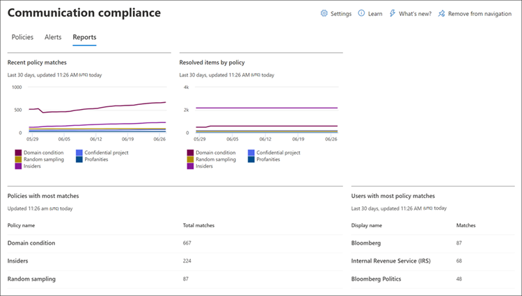
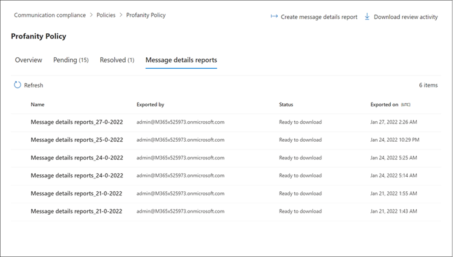

# Use communication compliance reports and audits

> [!IMPORTANT]
> Microsoft Purview Communication Compliance provides the tools to help organizations detect regulatory compliance (for example, SEC or FINRA) and business conduct violations such as sensitive or confidential information, harassing or threatening language, and sharing of adult content. Built with privacy by design, usernames are pseudonymized by default, role-based access controls are built in, investigators are opted in by an admin, and audit logs are in place to help ensure user-level privacy.

[!INCLUDE [purview-preview](../includes/purview-preview.md)]

## Reports

The **Reports** dashboard is the central location for viewing all communication compliance reports. To view and manage reports, users must be assigned to the *Communication Compliance Viewers* role group.

Report widgets provide a quick view of insights most commonly needed for an overall assessment of the status of communication compliance activities. Information contained in the report widgets isn't exportable. Detailed reports provide in-depth information related to specific communication compliance areas and offer the ability to filter, group, sort, and export information while reviewing.

For the date range filter, the date and time for events are listed in Coordinated Universal Time (UTC). When filtering messages, all filters for the report are made applicable at the 00:00:00 UTC start date to the 23:59:59 UTC end date.



The **Reports dashboard** contains the following report widgets and detailed reports links:

### Report widgets

- **Recent policy matches**: displays the number of matches by active policies over time.
- **Resolved items by policy**: displays the number of policy match alerts resolved by policies over time.
- **Users with most policy match**: displays the users (or anonymized usernames) and number of policy matches for a given period.
- **Policy with most matches**: displays the policies and the number of matches for a given period, ranked highest to lowest for matches.
- **Escalations by policy**: displays the number of escalations per policy over a given time.

### Detailed reports

Use the *Export* option to create a .csv file containing the report details for any detailed report. The *Export* report option supports file size downloads up to 3 MB.

- **Policy settings and status**: provides a detailed look at policy configuration and settings, as well as the general status for each of the policy (matches and actions) on messages. Includes policy information and how policies are associated with users and groups, locations, review percentages, reviewers, status, and when the policy was last modified. Use the *Export* option to create a .csv file containing the report details.
- **Items and actions per policy**: Review and export matching items and remediation actions per policy. Includes policy information and how policies are associated with:

  - Items matched
  - Escalated items
  - Resolved items
  - Tagged as compliant
  - Tagged as non-compliant
  - Tagged as questionable
  - Items pending review
  - User notified
  - Case created

- **Item and actions per location**: Review and export matching items and remediation actions per Microsoft 365 location. Includes information about how workload platforms are associated with:

  - Items matched
  - Escalated items
  - Resolved items
  - Tagged as compliant
  - Tagged as non-compliant
  - Tagged as questionable
  - Items pending review
  - User notified
  - Case created

- **Activity by user**: Review and export matching items and remediation actions per user. Includes information about how users are associated with:

  - Items matched
  - Escalated items
  - Resolved items
  - Tagged as compliant
  - Tagged as non-compliant
  - Tagged as questionable
  - Items pending review
  - User notified
  - Case created

- **Sensitive information type per location**: Review and export information about the detection of sensitive information types and the associated sources in communication compliance policies. Includes the overall total and the specific breakdown of sensitive information type instances in the sources configured in your organization. The values for each third-party source are displayed in separate columns in the .csv file. Examples are:

  - **Email**: Sensitive information types detected in Exchange email messages.
  - **Teams**: Sensitive information types detected in Microsoft Teams channels and chat messages.
  - **Yammer**: Sensitive information types detected in Yammer inboxes, posts, chats, and replies.
  - **Third-party sources**: Sensitive information types detected for activities associated with third-party connectors configured in your organization. To view the breakdown of third-party sources for a specific sensitive information type in the report, hover your mouse over the value for the sensitive information type in the Third-party source column.
  - **Other**: Sensitive information types used for internal system processing. Selecting or deselecting this source for the report won't affect any values.

- **Email blast senders**: Review and export the list of senders of email blast messages that were filtered out from your communication compliance policies to reduce "noise." [**Filter email blasts** is a communication compliance policy setting](communication-compliance-policies.md#filter-email-blasts). The Email blast senders report includes the following fields:

   - Policy name
   - Policy last modified date
   - Sender
   - Number of mails filtered

### Message details report

Create custom reports and review details for messages contained in specific policies on the **Policies** tab. These reports can be used for all-up reviews of messages and for creating a report snapshot for the status of messages for a customizable time period. After creating a report, you can view and download the details report as a .csv file on the **Message details reports** tab.



To create a new message details report, complete the following steps:

1. Sign into the Microsoft Purview compliance portal with an account that is a member of the *Communication Compliance Investigators* role group.
2. Navigate to the **Policies** tab, select a policy, and then select **Create message details report**.
3. On the **Create message details report** pane, enter a name for the report in the **Report name** field.
4. Under **Users in report**, select one of the following:
   - **All users**. Select this option if you want to create a report with message information for all users in the policy. 
   - **Select users**. Select this option, and then select specific users from the list to create a report with messages sent by those specific users. Only the users who have sent a message that has been flagged will be available in the list.
5. In **Choose a date range**, select a *Start date* and *End date* for the report.
6. Select **Create**.
7. The report creation confirmation is displayed.

Depending on the number of items in the report, it can take a few minutes to hours before the report is ready to be downloaded. You can check progress on the **Message details reports** tab. Report status is *In progress* or *Ready to download*. You can have up to 15 separate reports processing simultaneously. To download a report, select a report in the *Ready to download* state and select **Download report**.

> [!NOTE]
> If your selected time period doesn't return any message results in the report, there were not any messages for the selected time period. The report will be blank.

Message details reports contain the following information for each message item in the policy:

- **Match ID**: Unique ID for a copy of the message in communication compliance.
- **Internet Message ID**: Unique ID for the message across platforms.
- **Conversation Family ID**: Thread ID for the message.
- **Sender**: Sender of the message.
- **Recipients**: Recipients included for the message.
- **Date**: The date when the message was sent.
- **Location**: Channel that the message was sent on. This can be Exchange Online, Teams, Yammer, or any third-party channel supported by communication compliance. 
- **Subject**: Subject of the message.
- **Contains Attachments**: Status of any attachments for the message. Values are either *Yes* or *No*.
- **Policy Name**: Name of the policy associated with the message. This value will be the same for all messages in the report.
- **Item Status**: Status of the message item in the policy. Values are *Pending* or *Resolved*.
- **Tags**: Tags assigned to the message. Values are *Questionable, Compliant*, or *Non-compliant*.
- **Keyword Matches**: Keyword matches for the message.
- **Trainable Classifier ID**: ID of the trainable classifier that was matched.
- **Trainable Classifier Name and Matched Keywords**: The name of the trainable classifier and the keywords that triggered the classifier match.
- **Reviewers**: Reviewers assigned to message.
- **Pending for (days)**: Number of days the message has been in a pending state. For resolved messages, the value is 0.
- **Comment for Resolved**: Comments for the message entered when resolved.
- **Resolved Date**: Date and Coordinated Universal Time (UTC) the message was resolved.
- **Last Updated By**: User name of the last updater.
- **Last Updated On**: Date and Coordinated Universal Time (UTC) the message was last updated.
- **History of Comments**: List of all comments for the message alert, including comment author and date and Coordinated Universal Time (UTC) of the comment.

## Audit

In some instances, you must provide information to regulatory or compliance auditors to prove that user activities and communications are scoped. This information may be a summary of all activities associated with a defined organizational policy or anytime a communication compliance policy changes. Communication compliance policies have built-in audit trails for complete readiness for internal or external audits. Detailed audit histories of every create, edit, and delete action are captured by your communication policies to provide proof of scoped procedures.

> [!IMPORTANT]
> Auditing must be enabled for your organization before communication compliance events will be recorded. To enable auditing, see [Enable the audit log](/microsoft-365/compliance/communication-compliance-configure#step-2-required-enable-the-audit-log). When activities trigger events that are captured in the Microsoft 365 Audit log, it may take up to 48 hours before these events can be viewed in communication compliance policies.

To view communication compliance policy update activities, select the **Export policy updates** control on the main page for any policy. You must be assigned the *Global Admin* or *Communication Compliance Admins* roles to export update activities. This action generates an audit file in the .csv format that contains the following information:

|Field|Details|
|---|---|
| **CreationDate** | Date the update activity was performed in a policy. |
| **UserIds** | User that performed the update activity in a policy. |
| **Operations** | Update operations performed on the policy. |
| **AuditData** | Main data source for all policy update activities. All update activities are recorded and separated by comma delimiters. |

To view communication compliance review activities for a policy, select the **Export review activities** control on the **Overview** page for a specific policy. You must be assigned the *Global Admin* or *Communication Compliance Admins* roles to export review activities. This action generates an audit file in the .csv format that contains the following information:

|Field|Details|
|---|---|
| **CreationDate** | Date the review activity was performed in a policy. |
| **UserIds** | User that performed the review activity in a policy. |
| **Operations** | Review operations performed on the policy. |
| **AuditData** | Main data source for all policy review activities. All review activities are recorded and separated by comma delimiters. |

You can also view audit activities in the unified audit log or with the [Search-UnifiedAuditLog](/powershell/module/exchange/search-unifiedauditlog) PowerShell cmdlet. To learn more about audit log retention policies, see [Manage audit log retention policies](/microsoft-365/compliance/audit-log-retention-policies).

For example, the following example returns the activities for all the scoped review activities (policies and rules):

```PowerShell
Search-UnifiedAuditLog -StartDate $startDate -EndDate $endDate -RecordType AeD -Operations SupervisoryReviewTag
```

This example returns the update activities for your communication compliance policies:

```PowerShell
Search-UnifiedAuditLog -StartDate $startDate -EndDate $endDate -RecordType Discovery -Operations SupervisionPolicyCreated,SupervisionPolicyUpdated,SupervisionPolicyDeleted
```

This example returns activities that match your current communication compliance policies:

```PowerShell
Search-UnifiedAuditLog -StartDate $startDate -EndDate $endDate -Operations SupervisionRuleMatch
```

Communication compliance policy matches are stored in a scoped mailbox for each policy. In some cases, you may need to check the size of your scoped mailbox for a policy to make sure you aren't approaching the current 100-GB storage size or 1 million message limit. If the mailbox limit is reached, policy matches aren't captured and you'll need to create a new policy (with the same settings) to continue to capture matches for the same activities.

To check the size of a scoped mailbox for a policy, complete the following steps:

1. [Connect to Exchange Online PowerShell](/powershell/exchange/connect-to-exchange-online-powershell).
2. Run the following command:

    ```PowerShell
    ForEach ($p in Get-SupervisoryReviewPolicyV2 | Sort-Object Name)
    {
       "<Name of your communication compliance policy>: " + $p.Name
       Get-MailboxStatistics $p.ReviewMailbox | ft ItemCount,TotalItemSize
    }
    ```
