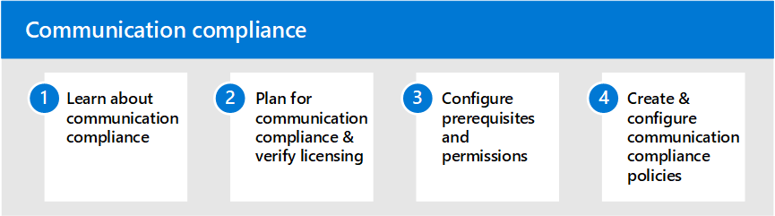

# Communication compliance in Microsoft 365

Protecting sensitive information and detecting and acting on workplace harassment incidents is an important part of compliance with internal policies and standards. Communication compliance in Microsoft 365 helps minimize these risks by helping you quickly detect, capture, and take remediation actions for email and Microsoft Teams communications. These include inappropriate communications containing profanity, threats, and harassment and communications that share sensitive information inside and outside of your organization.

## Configure communication compliance for Microsoft 365

Use the following steps to configure communication compliance for your organization:

1. Learn about [communication compliance](communication-compliance.md) in Microsoft 365
2. Plan for [communication compliance](communication-compliance-plan.md) and [verify licensing](communication-compliance-configure.md#subscriptions-and-licensing)
3. Review [feature reference and solution capabilities](communication-compliance-feature-reference.md)
4. Configure [prerequisites](communication-compliance-configure.md#step-2-required-enable-the-audit-log) and [permissions](communication-compliance-configure.md#step-1-required-enable-permissions-for-communication-compliance)
5. Create and configure [communication compliance policies](communication-compliance-configure.md#step-5-required-create-a-communication-compliance-policy)

## More information about communication compliance

- [Investigate and remediate alerts](communication-compliance-investigate-remediate.md)
- [Case study - Contoso quickly configures an offensive language policy for Microsoft Teams, Exchange, and Yammer communications](communication-compliance-case-study.md)