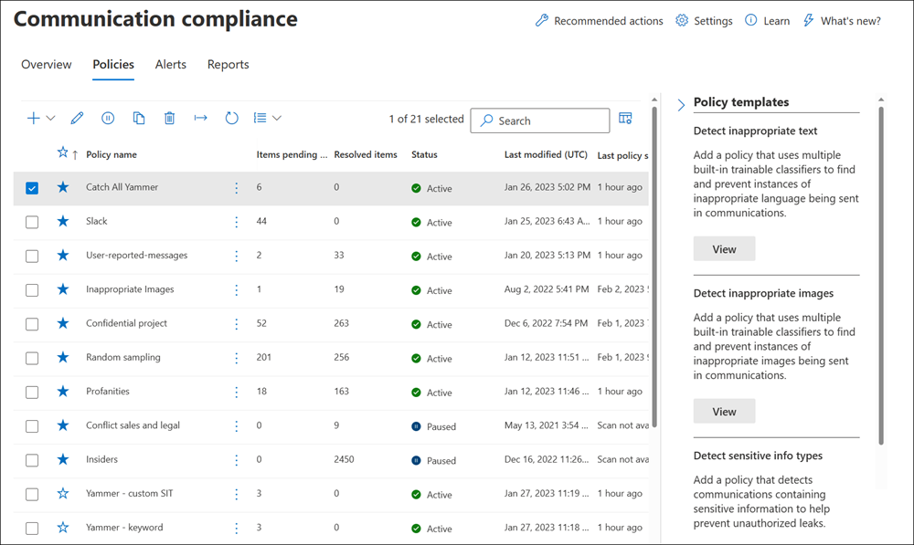

# Learn about communication compliance in Microsoft 365

Communication compliance is an insider risk solution in Microsoft 365 that helps minimize communication risks by helping you detect, capture, and act on inappropriate messages in your organization. Pre-defined and custom policies allow you to scan internal and external communications for policy matches so they can be examined by designated reviewers. Reviewers can investigate scanned email, Microsoft Teams, Yammer, or third-party communications in your organization and take appropriate actions to make sure they're compliant with your organization's message standards.

Communication compliance policies in Microsoft 365 help you overcome many modern challenges associated with compliance and internal and external communications, including:

- Scanning increasing types of communication channels
- The increasing volume of message data
- Regulatory enforcement and the risk of fines

Additionally, there may be a separation of duties between your IT admins and your compliance management team. Communication compliance supports the separation between configuration of policies and the investigation and review of messages. For example, the IT group for your organization may be responsible for setting up communication compliance role permissions, groups, and policies and investigators and reviewers may be responsible for message triage, review, and mitigation actions.

For the latest Ignite presentations for communication compliance, see the following videos:

- [Foster a culture of safety and inclusion with communication compliance](https://www.youtube.com/watch?v=oLVzxcaef3w)
- [Learn how to reduce communication risks within your organization](https://www.youtube.com/watch?v=vzARb1YaxGo)
- [Fulfill regulatory compliance requirements with communication compliance](https://www.youtube.com/watch?v=gagOhtCBfgU)
- [Better with Microsoft Teams - Learn more about the latest native Teams integrated features in communication compliance](https://www.youtube.com/watch?v=m4jukD5Fh-o)

For a quick overview of communication compliance, see the [Detect workplace harassment and respond with Communication Compliance in Microsoft 365](https://youtu.be/z33ji7a7Zho) video on the [Microsoft Mechanics channel](https://www.youtube.com/user/OfficeGarageSeries).

## Scenarios for communication compliance

Communication compliance policies can assist with reviewing messages in your organization in several important compliance areas:

- **Corporate policies**

    Users must comply with acceptable use, ethical standards, and other corporate policies in all their business-related communications. Communication compliance policies can detect policy matches and help you take corrective actions to help mitigate these types of incidents. For example, you could scan user communications in your organization for potential human resources concerns such as harassment or the use of inappropriate or offensive language.

- **Risk management**

    Organizations are responsible to all communications distributed throughout their infrastructure and corporate network systems. Using communication compliance policies to help identify and manage potential legal exposure and risk can help minimize risks before they can damage corporate operations. For example, you could scan messages in your organization for unauthorized communications and conflicts of interest about confidential projects such as upcoming acquisitions, mergers, earnings disclosures, reorganizations, or leadership team changes.

- **Regulatory compliance**

    Most organizations must comply with some type of regulatory compliance standards as part of their normal operating procedures. These regulations often require organizations to implement some type of supervisory or oversight process for messaging that is appropriate for their industry. The Financial Industry Regulatory Authority (FINRA) Rule 3110 is a good example of a requirement for organizations to have supervisory procedures in place to scan user communications and the types of businesses in which it engages. Another example may be a need to review broker-dealer communications in your organization to safeguard against potential money laundering, insider trading, collusion, or bribery activities. Communication compliance policies can help your organization meet these requirements by providing a process to both scan and report on corporate communications. For more information on support for financial organizations, see [Key compliance and security considerations for US banking and capital markets](../solutions/financial-services-secure-collaboration.md).

## Key feature areas

Communication compliance in Microsoft 365 offers several important features to help address compliance concerns on your messaging platforms:

- Intelligent customizable templates
- Flexible remediation workflows
- Actionable insights

### Intelligent customizable templates

Intelligent customizable templates in communication compliance allow you to apply machine learning to intelligently detect communication violations in your organization.

- **Customizable pre-configured templates**: New policy templates help address the most common communications risks. Initial policy creation and follow-on updating are now quicker with pre-defined anti-harassment and offensive language, sensitive information, conflict of interest, and regulatory compliance templates.
- **New machine learning support**: Built-in threat, harassment, profanity, and image [classifiers](classifier-get-started-with.md) help reduce false positives in scanned messages, saving reviewers time during the investigation and remediation process.
- **Improved condition builder**: Configuring policy conditions is now streamlined into a single, integrated experience in the policy wizard, reducing confusion in how conditions are applied for policies.

### Flexible remediation workflows

Built-in remediation workflows allow you to quickly identify and take action on messages with policy matches in your organization. The following new features increase efficiency for investigation and remediation activities:

- **Flexible remediation workflow**: New remediation workflow helps you quickly take action on policy matches, including new options to escalate messages to other reviewers and to send email notifications to users with policy matches.
- **Conversation policy matching**: Messages in conversations are grouped by policy matches to give you more visibility about how conversations relate to your communication policies. For example, conversation policy matching in the *Pending Alerts* view will automatically show all messages in a Teams channel that have matches for your Offensive Language policy. Other messages in the conversation that don't match the Offensive Language policy would not be displayed.
- **Keyword highlighting**: Terms matching policy conditions are highlighted in the message text view to help reviewers quickly locate and remediate policy alerts.
- **Exact and near duplicate detection**: In addition to scanning for exact terms matching communication compliance policies, near duplicate detection groups textually similar terms and messages together to help speed up your review process.
- **Optical character recognition (OCR) (preview)**: Scan, detect, and investigate printed and handwritten text within images embedded or attached to email or Microsoft Teams chat messages.
- **New filters**: Investigate and remediate policy alerts faster with message filters for several fields, including sender, recipient, date, domains, and many more.
- **Improved message views**: Investigation and remediation actions are now quicker with new message source, text, and annotation views. Message attachments are now viewable to provide complete context when taking remediation actions.
- **User history view**: Historical view of all user message remediation activities, such as past notifications and escalations for policy matches, now provides reviewers with more context during the remediation workflow process. First-time or repeat instances of policy matches for users are now archived and easily viewable.
- **Pattern detected notification**: Many harassing and bullying actions take place over time and involve reoccurring instances of the same behavior by a user. The new pattern detected notification displayed in alert details helps raise attention to these alerts and this type of behavior.
- **Show Translate view**: Quickly investigate message details in eight languages using translate support in the remediation workflow. Messages in other languages are automatically converted to the display language of the reviewer.

### Actionable insights

New interactive dashboards for alerts, policy matches, actions, and trends help you quickly view the status of pending and resolved alerts in your organization.

- **Proactive intelligent alerts**: Alerts for policy matches requiring immediate attention include new dashboards for pending items sorted by severity and new automatic email notifications sent to designated reviewers.
- **Interactive dashboards**: New dashboards display policy matches, pending and resolved actions, and trends by users and policy.
- **Auditing support**: A full log of policy and review activities is easily exported from the Microsoft 365 compliance center to help support audit review requests.

## Integration with Microsoft 365 services

Communication compliance policies scan and capture messages across several communication channels to help you quickly review and remediate compliance issues:

- **Microsoft Teams**: Chat communications for public and private [Microsoft Teams](/MicrosoftTeams/Teams-overview) channels and individual chats are supported in communication compliance as a standalone channel source or with other Microsoft 365 services. You'll need to manually add individual users, distribution groups, or specific Microsoft Teams channels when you select users and groups to supervise in a communication compliance policy.
- **Exchange Online**: All mailboxes hosted on [Exchange Online](/Exchange/exchange-online) in your Microsoft 365 organization are eligible for scanning. Emails and attachments matching communication compliance policy conditions are instantly available for monitoring and in compliance reports. Exchange Online is now an optional source channel and is no longer required in communication compliance policies.
- **Yammer**: Private messages and public community conversations in [Yammer](/yammer/yammer-landing-page) are supported in communication compliance policies. Yammer is an optional channel and must be in [native mode](/yammer/configure-your-yammer-network/overview-native-mode) to support scanning of messages and attachments.
- **Skype for Business Online**: Communication compliance policies support scanning chat communications and associated attachments in [Skype for Business Online](/SkypeForBusiness/skype-for-business-online).
- **Third-party sources**: You can scan messages from [third-party sources](archiving-third-party-data.md) for data imported into mailboxes in your Microsoft 365 organization. Communication compliance supports connections to several popular platforms, including Instant Bloomberg and others.

To learn more about messaging channel support in communication compliance policies, see [supported communication types](communication-compliance-feature-reference.md#supported-communication-types).

## Workflow

Communication compliance helps you address common pain points associated with complying with internal policies and regulatory compliance requirements. With focused policy templates and a flexible workflow, you can use actionable insights to quickly resolve detected compliance issues.

Identifying and resolving compliance issues with communication compliance in Microsoft 365 uses the following workflow:

### Configure

In this workflow step, you identify your compliance requirements and configure applicable communication compliance policies. Policy templates are a great way to not only quickly configure a new compliance policy, but to also quickly modify and update policies as your requirements change. For example, you may want to quickly test a policy for offensive language and anti-harassment on communications for a small group of users before configuring a policy for all users in your organization.

>[!Important]
>By default, Global Administrators do not have access to communication compliance features. To enable permissions for communication compliance features, see [Make communication compliance available in your organization](communication-compliance-configure.md#step-1-required-enable-permissions-for-communication-compliance).

You can choose from the following policy templates in the Microsoft 365 compliance center:

- **Offensive or threatening language**: Use this template to quickly create a policy that uses built-in classifiers to automatically detect content that may be considered abusive or offensive.
- **Sensitive information**: Use this template to quickly create a policy to scan communications containing defined sensitive information types or keywords to help make sure that important data isn't shared with people that shouldn't have access.
- **Regulatory compliance**: Use this template to quickly create a policy to scan communications for references to standard financial terms associated with regulatory standards.
- **Conflict of interest**: Use this template to quickly create a policy to monitor communications between two groups or two users to help avoid conflicts of interest.
- **Custom policy**: Use this template to configure specific communication channels, individual detection conditions, and the amount of content to monitor and review in your organization.

### Investigate

In this step, you look deeper into the issues detected as matching your communication compliance policies. This step includes the following actions available in the Microsoft 365 compliance center:

- **Alerts**: When a message matches a policy condition, an alert is automatically generated. For each alert, you can see the status, the severity, the time detected, and if an Advanced eDiscovery case is assigned and its status. New alerts are displayed on the communication compliance home page and the **Alerts** page and are listed in order of severity.
- **Issue management**: For each alert, you can take investigative actions to help remediate the issue detected in the message.
- **Document review**: During the investigation of an issue, you can use several views of the message to help properly evaluate the detected issue. The views include a conversation summary, text-only, annotated, and detail views of the communication conversation.
- **Reviewing user activity history**: View the history of user message activities and remediation actions, such as past notifications and escalations, for policy matches.
- **Filters**: Use filters such as sender, recipient, date, and subject to quickly narrow down the message alerts that you want to review.

### Remediate

The next step is to remediate communication compliance issues you've investigated using the following options:

- **Resolve**: After reviewing an issue, you can remediate by resolving the alert. Resolving an alert removes it from the pending alert queue, and the action is preserved as an entry in the Resolved queue for the matching policy. Alerts are automatically resolved after marking the alert as a false positive, sending a notice to a user about the alert, or opening a new case for the alert.
- **Tag a message**: As part of the resolution of an issue, you can tag the detected message as compliant, non-compliant, or as questionable as it relates to the policies and standards for your organization. Tagging can help you micro-filter policy alerts for escalations or as part of other internal review processes.
- **Notify the user**: Often, users accidentally or inadvertently violate a communication compliance policy. You can use the notify feature to provide a warning notice to the user and to resolve the issue.
- **Escalate to another reviewer**: Sometimes, the initial reviewer of an issue needs input from other reviewers to help resolve the incident. You can easily escalate message issues to reviewers in other areas of your organization as part of the resolution process.
- **Mark as a false positive**: Messages incorrectly detected as matches of compliance policies will occasionally slip through to the review process. You can mark these types of alerts as false positives and automatically resolve the issue.
- **Remove message in Teams (preview)**: Inappropriate messages may be removed from displaying in Microsoft Teams channels or personal and group chat messages. Inappropriate messages that are removed are replaced with a notification that the message has been removed for a policy violation.
- **Escalate for investigation**: In the most serious situations, you may need to share communication compliance information with other reviewers in your organization. Communication compliance is tightly integrated with other Microsoft 365 compliance features to help you with end-to-end risk resolution. Escalating a case for investigation allows you to transfer data and management of the case to Advanced eDiscovery in Microsoft 365. Advanced eDiscovery provides an end-to-end workflow to preserve, collect, review, analyze, and export content that's responsive to your organization's internal and external investigations. It allows legal teams to manage the entire legal hold notification workflow. To learn more about Advanced eDiscovery cases, see [Overview of Advanced eDiscovery in Microsoft 365](overview-ediscovery-20.md).

### Monitor

Keeping track and managing compliance issues identified by communication compliance policies spans the entire workflow process. As alerts are generated and investigation and remediation actions are implemented, existing policies may need review and updates, and new policies may need to be created.

- **Monitor and report**: Use communication compliance dashboard widgets, export logs, and events recorded in the unified audit logs to continually evaluate and improve your compliance posture.

## Ready to get started?

- For planning information, see [Plan for communication compliance](communication-compliance-plan.md).
- Check out the [case study for Contoso](communication-compliance-case-study.md) and see how they quickly configured a communication compliance policy to monitor for offensive language in Microsoft Teams, Exchange Online, and Yammer communications.
- To configure communication compliance for your Microsoft 365 organization, see [Configure communication compliance for Microsoft 365](communication-compliance-configure.md).
