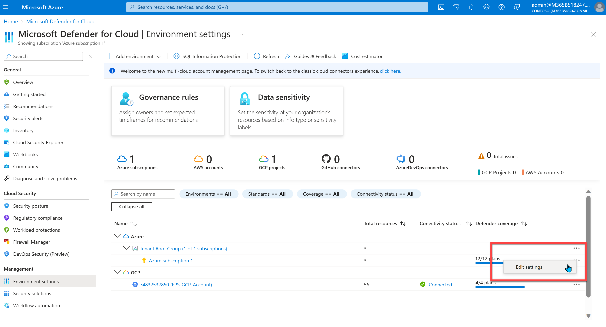

# Configure cloud settings for use with Compliance Manager

[!INCLUDE [purview-preview](../includes/purview-preview.md)]

## Setting up for multicloud support

Compliance Manager integrates with [Microsoft Defender for Cloud](/azure/defender-for-cloud/defender-for-cloud-introduction) to provide multicloud support. Organizations must have at least one subscription within Microsoft Azure and then enable Defender for Cloud so that Compliance Manager can receive the necessary signals to monitor your cloud services. Once you have Defender for Cloud, you need to assign the relevant industry and regulatory standards to your subscriptions.

Depending on what your organization has already set up, jump to the section below that aligns to your situation in order to get started:

- **You don't have Azure**: [Activate Azure and create a subscription](#activate-azure-and-create-a-subscription)
- **You have Azure but don't have Defender for Cloud**: [Enable Defender for Cloud on your Azure subscription](#enable-defender-for-cloud)
- **You have Defender for Cloud but haven't assigned standards**: [Assign standards to your cloud service subscriptions](#add-standards-to-your-subscriptions)

##### Standards supported by Compliance Manager and Defender for Cloud

The standards or regulations listed below are supported across Defender for Cloud and Compliance Manager. Each standard is available to support Microsoft 365 in addition to the other cloud services listed in parentheses.

> [!TIP]
> Defender for Cloud refers to “standards,” while Compliance Manager uses “regulations” to refer to the same thing.

- AWS Foundational Security Best Practices
- CIS 1.1.0 (GCP)
- CIS Microsoft Azure Foundations Benchmark v1.1.0 (Azure)
- CIS 1.2.0 (AWS, GCP)
- CIS Microsoft Azure Foundations Benchmark v1.3.0 (Azure)
- CIS Microsoft Azure Foundations Benchmark v1.4.0 (Azure)
- FedRAMP High (Azure)
- FedRAMP Moderate (Azure)
- ISO 27001 (Azure, GCP)
- NIST SP 800-171 Rev.2 (Azure)
- NIST SP 800-53 Rev.4 (Azure)
- NIST SP 800 53 Rev.5 (Azure, AWS, GCP)
- PCI DSS 3.2.1 (AWS, GCP)
- PCI DSS v4.0 (Azure)
- SOC 2 Type 2 (Azure)
- SWIFT CSP-CDCF v2022 (Azure)

## Activate Azure and create a subscription

Setting up a subscription within Microsoft Azure is a prerequisite for getting started with Defender for Cloud. If you don’t have a subscription, you can [sign up for a free account](https://azure.microsoft.com/pricing/free-trial/).

## Enable Defender for Cloud

Visit [Quickstart: Set up Microsoft Defender for Cloud](/azure/defender-for-cloud/get-started). Follow the steps to enable Defender for Cloud on your Azure subscription and become familiar with the Defender for Cloud Overview page. Once you've enabled Defender for Cloud, follow the additional steps below to make sure you're set up for Compliance Manager integration.

Most setup functions require the user to hold the [Owner role in Azure](/azure/role-based-access-control/built-in-roles#owner). Get more details about [User roles and permissions for Defender for Cloud](/azure/defender-for-cloud/permissions).

#### Confirm access to Defender for Cloud Regulatory compliance

1. Go to [Microsoft Defender for Cloud | Regulatory compliance](https://portal.azure.com/#view/Microsoft_Azure_Security/SecurityMenuBlade/~/22).

1. Validate that you see a dashboard like this:
  

1. If you don’t see the dashboard above and instead see a notice about insufficient licensing, follow the prompts to activate an applicable Defender for Cloud plan. We recommend enabling one of these two plans: **Foundational CSPM** or **Defender CSPM**, which are currently free to use and provide sufficient functionality ([learn more about these plans](/azure/defender-for-cloud/concept-cloud-security-posture-management)). You can manually select the plans by following the steps below:

    1. In Defender for Cloud, select **Environment settings** on the left navigation.
    1. Select **Azure** from your list of environments. Expand the item underneath **Azure** to view the subscription, then select the subscription. You'll arrive at the **Defender plans** page.
    1. In the **Plan** column, find the rows for **Foundational CSPM** and **Defender CSPM**. In the **Status** row, select the **On** button for both plans.

#### View available environments

1. In Defender for Cloud, select **Environment settings** on the left navigation.

1. View the available environments and subscriptions currently visible to MDC for your tenant. You may need to expand your management groups to view subscriptions, which you can do by selecting **Expand all** below the search bar. In addition to your Azure subscriptions, you'll also see any Google Cloud Platform (GCP) projects or Amazon Web Services (AWS) accounts connected to Defender for Cloud.

1. If you don't see an expected subscription and have already confirmed your Defender for Cloud licensing in the previous steps, check your current directory and subscription filters in your Azure [Portal settings](https://portal.azure.com/#settings/directory). In this view, you can adjust any subscription filters or switch to a different directory if one is available, and then return to the **Environment settings** view to check the results.

1. If you don't see an expected AWS or GCP environment, account, or project, proceed to the next step to set up the necessary connectors.

#### Connect to your Amazon Web Services or Google Cloud Provider accounts (optional)

Follow these instructions if you have an Amazon Web Services (AWS) account or Google Cloud Platform (GCP)  project that you want Compliance Manager to assess compliance posture, and you don’t already see those accounts or projects in your Azure Environment settings. When you complete this process, you can begin assigning standards to your connected AWS or GCP subscriptions within about an hour, though full data can take up to 24 hours to appear.

1. In Defender for Cloud, select **Environment settings** on the left navigation.

1. Select **Add environment** and choose either **Amazon Web Services** or **Google Cloud Platform**.
  

1. Follow the wizard steps to complete the account setup. Connecting to the accounts requires admin permissions in the AWS or GCP accounts being used, and some configuration steps within AWS or GCP. These steps are detailed in the wizard.
    1. For a simple setup option, consider starting with just one account such as GCP. In the first step of **Account details**, at  **Onboard**, select **Single account**. This option requires the least amount of configuration effort.

## Add standards to your subscriptions

Check the [list of standards supported by Defender for Cloud and Compliance Manager](#standards-supported-by-compliance-manager-and-defender-for-cloud) to ensure your desired standard is supported. Then follow the steps below.

1. In Defender for Cloud, select **Environment settings** on the left navigation.

1. Your available environments and subscriptions will be listed on the page. You may need to expand your management groups to view subscriptions, which you can do by selecting **Expand all** below the search bar. Find the subscription to which you want to add a standard.

1. On the row for the subscription, select the ellipses on the far right and select **Edit settings**.
    

1. On the left navigation, under **Policy settings**, select **Security policy**.

1. Browse the list of available standards under **Industry & regulatory standards**. You can view more standards by selecting the **Add more standards** button at the bottom of the list. Assign at least one of the supported standards listed below to your subscription by selecting **Enable** on the standard's row.

## Resources

- [Quickstart: Set up Microsoft Defender for Cloud](/azure/defender-for-cloud/get-started)
- [User roles and permissions for Defender for Cloud](/azure/defender-for-cloud/permissions)
