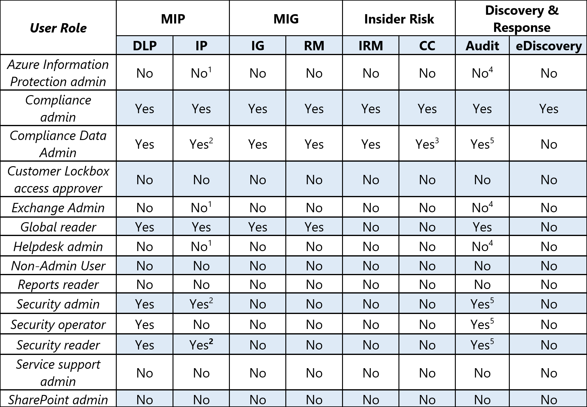
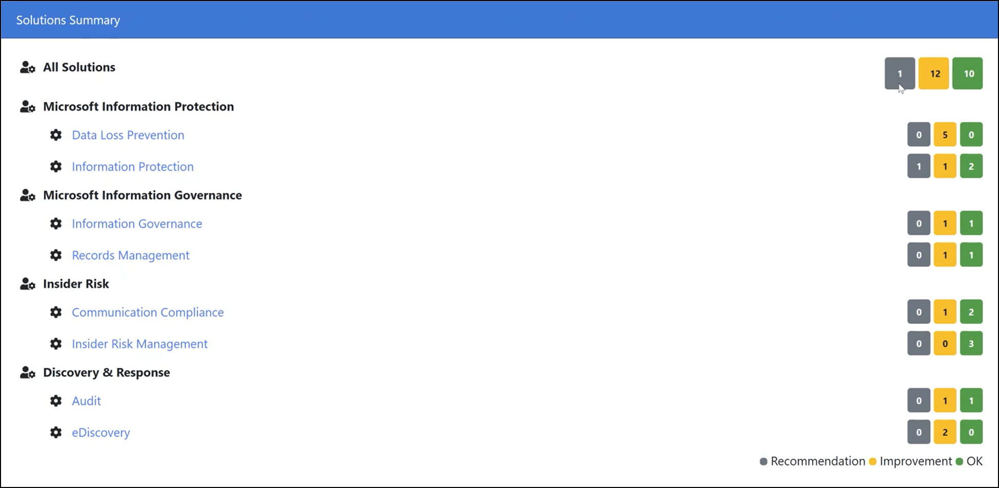

# Microsoft Compliance Configuration Analyzer for Compliance Manager (preview)

**In this article:** Learn how to install and run the Microsoft Compliance Configure Analyzer tool to get quickly started with Microsoft Compliance Manger.

## Microsoft Compliance Configuration Analyzer (MCCA) (preview) overview

The Microsoft Compliance Configuration Analyzer (MCCA) is a preview tool that can help you get started with [Microsoft Compliance Manager](compliance-manager.md). MCCA is a PowerShell-based utility that will fetch your organization’s current configurations and validate them against Microsoft 365 recommended best practices. These best practices are based on a set of controls that include key regulations and standards for data protection and data governance.

MCCA can help you quickly see which improvement actions in Compliance Manager apply to your current Microsoft 365 environment. Each action identified by MCCA will give you recommendations for implementation, with direct links to Compliance Manager and the applicable solution to start taking corrective action.

An additional resource for understanding MCCA is by visiting the [README instructions on GitHub](https://github.com/OfficeDev/MCCA#overview). This page provides detailed information about prerequisites and gives full installation instructions. You don’t need a GitHub account to access this page.

**Availability**: MCCA is available to all organizations with Office 365 and Microsoft 365 licenses and US Government Community (GCC) Moderate, GCC High, and Department of Defense (DoD) customers.

## Install MCCA and run a report

You can install the MCCA tool using Windows PowerShell. Once you download and install the tool, you don’t need to repeat those steps in order to run reports. Each time you open MCCA, it will ask you for your login credentials, and it will generate a new, updated report.

#### Step 1: Install Windows PowerShell
To begin, you'll need the Exchange Online PowerShell module (v2.0.3 or higher) that's available in the PowerShell gallery. [Get installation instructions](https://www.powershellgallery.com/packages/ExchangeOnlineManagement/2.0.3).

#### Step 2: Install MCCA

To install MCCA, start by using PowerShell in administrator mode. Follow the steps below:

1. Select the Windows **Start** button.
2. Type **PowerShell**, right-click on **Windows PowerShell**, then select **Run as administrator**.
1. At the command prompt, type:

    ```powershell
    Install-Module -Name MCCAPreview
    ```

#### Step 3: Run a report

After you install MCCA, you can run MCCA and generate a report. To run a report:

1. Open PowerShell
2. Run the cmdlet:

    ```powershell
    Get-MCCAReport
    ```

   If you're a GCC High customer, you'll need to provide an additional input parameter to run the report:

    ```powershell
    Get-MCCAReport -ExchangeEnvironmentName O365USGovGCCHigh
    ```

3. Once MCCA runs, it does an initial version check and ask for credentials. At the Input the user name prompt, sign in with your Microsoft 365 account email address ([view the roles eligible to create reports](#role-based-reporting)). Then enter your password at the password prompt.

Your report will then take approximately 2-5 minutes to generate. When it’s done, a browser window opens and displays your HTML report. Every time you run the tool, it will ask for your credentials and generate a new report. This report is stored locally in the following directory:

C:\Users\<username>\AppData\Local\Microsoft\MCCA. 

You can access previously generated reports from this directory.

## Understanding your report

Your report reflects data based on the date and time at which it was generated. The top section provides details on when it was generated, your organization name, and tenant ID.

#### Geolocation-based reporting

The **Note** section shows that your report is customized based on the geographic location of your tenant. Recommendations listed in the tool will be specific to your country or region.

Your geolocation selection is used to assess sensitive information types (SITs) which are relevant to that geolocation and generate a report that aligns to your country or region. Choose geolocations based on data you have in your tenant.

To change your report's location information, you need provide a geolocation (-Geo) input parameter. You can choose either one or multiple geolocations applicable for your tenant.

Follow these instructions to run a report based on a specific location:

1. Open PowerShell
2. To specify a certain region, you’ll run a cmdlet using the numbers from the table below that correspond to the country or region. Enter multiple numbers by separating them with a comma. For example, the cmdlet below will run a customized report for Asia-Pacific and Japan:

    ```powershell
    Get-MCCAReport -Geo @(1,7)
    ```
  | Input |  Country or Region | 
  | :------------- | :------------: |
  | 1 | Asia-Pacific |
  | 2 | Australia |
  | 3 | Canada |
  | 4 | Europe (excluding France) / Middle East / Africa |
  | 5 | France |
  | 6 | India |
  | 7 | Japan |
  | 8 | Korea |
  | 9 | North America (excluding Canada) |
  | 10 | South America |
  | 11 | South Africa |
  | 12 | Switzerland |
  | 13 | United Arab Emirates |
  | 14 | United Kingdom |


 > [!NOTE]
> The report will always include MCCA supported international sensitive information types such as SWIFT code, credit card number, etc.

#### Role-based reporting

Your report will also be customized based on your role.

The table below shows which roles have access to which sections of the report. Other roles within your organization (not listed in the table below) may not be able to run the tool, or they may run the tool and have limited access to information in the final report.



Exceptions:
1. Users won't be able to generate report for IP apart from “Use IRM for Exchange Online” section.
2. Users will be able to generate report for IP apart from “Use IRM for Exchange Online” section.
3. Users will be able to generate report for IP apart from “Enable Communication Compliance in O365” section.
4. Users won't be able to generate report for IP apart from “Enable Auditing in Office 365” section.
5. Users will be able generate report for IP apart from “Enable Auditing in Office 365” section.

#### Solutions Summary section

The **Solutions Summary** section of the report gives an overview of improvement actions that your organization can take in Compliance Manager to help improve your compliance posture.



MCCA evaluates your current configurations against the recommended improvement actions in Compliance Manager. Any improvement action identified by the MCCA tool as needing attention will be listed in this section.

Next to each Microsoft solution are color-coded boxes indicating the number of items that correspond to improvement actions in Compliance Manager. The actions are broken down into three status states:

- **OK**: the actions that meet recommended conditions and need no attention at this time
- **Improvement**: actions that need attention
- **Recommendation**: actions that don’t need attention, but for which we recommend best practices
 
Select a box to view improvements and recommendations.

**Items with the Improvement status**

Select the dropdown next to the **Improvement** label to the right of the improvement action. You’ll see a quick summary and details about your current settings and the recommended improvement actions. The summary includes direct links into Compliance Manager, the applicable solution in the Microsoft 365 compliance center, and relevant documentation.

Clicking on the Compliance Manager link takes you to a filtered view of all the improvement actions within that solution that you have not yet implemented. From there, you can see the number of points you can achieve to increase your [compliance score](compliance-score-calculation.md), and the assessments they apply to, and the applicable regulations and certifications.

For DLP, there’s a **Remediation Script** button that gives you a pre-generated PowerShell script based on what’s recommended. You can copy and paste it directly in your PowerShell console. It will create a DLP policy in test mode

**Items with Recommendation status**

Select the dropdown next to the **Recommendation** label to the right of the improvement action. You’ll see a summary of your organization’s current Microsoft 365 environment related to the improvement action, along with recommended best practices.

## Resources

For more detailed information on installing, setting up, and using MCCA, see the [README instructions on GitHub](https://github.com/OfficeDev/MCCA#overview) (no GitHub account required).

For more information on Windows PowerShell, start at [How to use the PowerShell documentation](/powershell/scripting/how-to-use-docs?view=powershell-7). See also [Starting Windows PowerShell](/powershell/scripting/windows-powershell/starting-windows-powershell?view=powershell-7).
