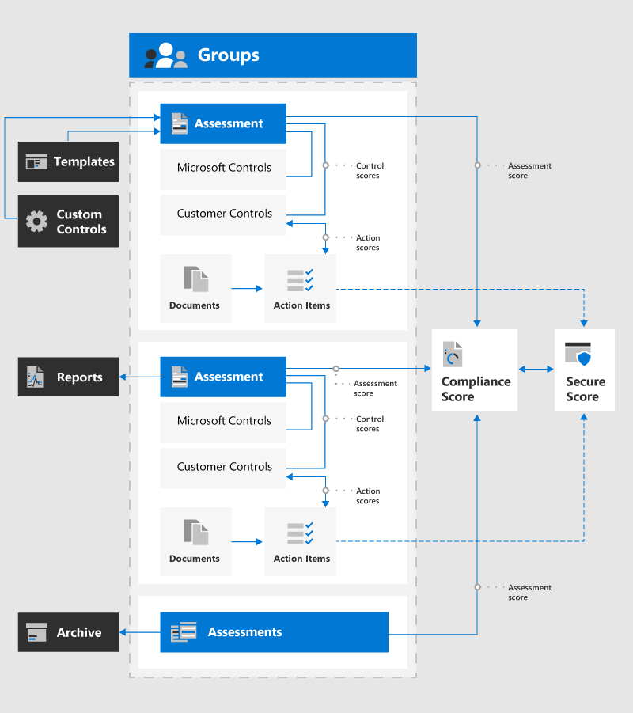
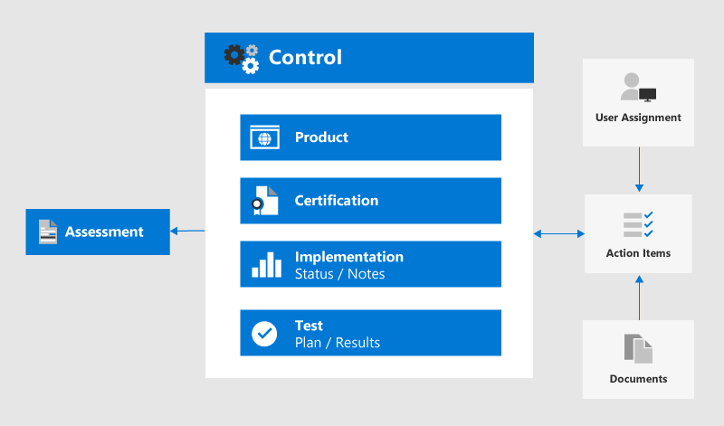

# Microsoft Compliance Manager (preview)

> [!IMPORTANT]
> Compliance Manager isn't available in Office 365 operated by 21Vianet, Office 365 Germany, Office 365 U.S. Government Community High (GCC High), or Office 365 Department of Defense.

**In this article**: Read this article to learn what Compliance Manager is and understand its main components.

**Learn about updates**: We published several updates in the April 2020 public preview release. Visit the [Compliance Manager release notes](compliance-manager-release-notes.md) to see what's new and known issues.

## What is Compliance Manager

[Microsoft Compliance Manager (preview)](https://servicetrust.microsoft.com/ComplianceManager) is a free workflow-based risk assessment tool in the Microsoft Service Trust Portal for managing regulatory compliance activities related to Microsoft cloud services. Part of your Microsoft 365, Office 365, or Azure Active Directory subscription, Compliance Manager helps you manage regulatory compliance within the shared responsibility model for Microsoft cloud services.

With Compliance Manager, your organization can:
  
- Combine detailed compliance information Microsoft provided to auditors and regulators about its cloud services with your compliance self-assessment for standards and regulations applicable for your organization. These include standards and regulations outlined by the International Organization for Standardization (ISO), the National Institute of Standards and Technology (NIST), the Health Insurance Portability and Accountability Act (HIPAA), the General Data Protection Regulation (GDPR), and many others.
- Enable you to assign, track, and record compliance and assessment-related activities, which can help your organization cross team barriers to achieve your compliance goals.
- Provide a Compliance Score to help you track your progress and prioritize auditing controls that help reduce your organization's exposure to risk.
- Provide a secure repository for you to upload and manage evidence and other artifacts related to your compliance activities.
- Produce richly detailed Microsoft Excel reports that document compliance activities performed by Microsoft and your organization for auditors, regulators, and other compliance reviewers.

> [!NOTE]
> The customer actions provided in Compliance Manager are recommendations; it is up to your organization to evaluate the effectiveness of these recommendations in their respective regulatory environment prior to implementation. Recommendations found in Compliance Manager should not be interpreted as a guarantee of compliance.

## Relationship to Compliance Score

[Microsoft Compliance Score (preview)](compliance-score.md) is a feature in the Microsoft 365 compliance center that provides a top-level view into your organization's compliance posture. It calculates a risk-based score measuring your progress in completing actions that help reduce risks around data protection and regulatory standards. Knowing your overall compliance score helps your organization understand and manage compliance. Understand [how your compliance score is calculated](compliance-score-methodology.md).

Compliance Manager shares the same backend with Compliance Score. During the public preview phase for both tools, Compliance Manager is where you'll manage your assessments and custom control implementations. Learn more about the [relationship between Compliance Score and Compliance Manager](compliance-score-release-notes.md#compliance-score-relationship-to-compliance-manager).
  
> [!IMPORTANT]
> Compliance Score does not express an absolute measure of organizational compliance with any particular standard or regulation. It expresses the extent to which you have adopted controls which can reduce the risks to personal data and individual privacy. No service can guarantee that you are compliant with a standard or regulation, and the Compliance Score should not be interpreted as a guarantee in any way.

## Compliance Manager components

Compliance Manager uses several components to help you with your compliance management activities. These components work together to provide a complete management work flow and hassle-free compliance reports for auditors.

The diagram shows the relationships between the primary components of Compliance Manager:

## Groups

[Groups](working-with-compliance-manager.md#groups) are containers that allow you to organize Assessments and share common information and workflow tasks between Assessments that have the same or related customer-managed controls. When two different Assessments in the same group share customer-managed control, the completion of implementation details, testing, and status for the control automatically synchronize to the same control in any other Assessment in the Group. This unifies the assigned Action Items for each control across the group and reduces duplicating work. You can also choose to use groups to organize. Assessments by year, area, compliance standard, or other groupings to help organize your compliance work.

## Assessments

[Assessments](working-with-compliance-manager.md#assessments) are containers that allow you to organize controls based on responsibilities shared between Microsoft and your organization for assessing cloud service security and compliance risks. Assessments help you implement data protection safeguards specified by a compliance standard and applicable data protection standards, regulations, or laws. They help you discern your data protection and compliance posture against the selected industry standard for the selected Microsoft cloud service. Assessments are completed by the implementation of controls included in the Assessment that map to a certification standard.

By default, Compliance Manager creates the following Assessments for your organization:

- Office 365 ISO 27001
- Office 365 NIST 800-53
- Office 365 GDPR

Assessments include several components:
  
- **In-Scope Services**: Each assessment applies to a specific set of Microsoft services.
- **Microsoft-managed controls**: For each cloud service, Microsoft implements and manages a set of compliance controls for applicable standards and regulations.
- **Customer-managed controls**: These collection of controls are implemented by your organization when you take actions for each control.
- **Assessment Score**: The percentage of the total possible score for customer-managed controls in the Assessment. This helps you track the implementation of the Actions assigned to each control.

## Controls

[Controls](working-with-compliance-manager.md#controls-and-actions) are compliance process containers in Compliance Manager that define how you manage compliance activities. These controls are organized into control families that align with the Assessment structure for corresponding certifications or regulations.

- **Control ID**: The name of the selected control from the corresponding certification or regulation.
- **Control Title**: The title for the Control ID from the corresponding certification or regulation.
- **Article ID**: This field is only for GDPR assessments and specifies the corresponding GDPR article number.
- **Description**: Text of control from the corresponding certification or regulation. Due to copyright restrictions, a link to relevant information is listed for ISO standards.

There are three types of controls in Compliance Manager, **Microsoft-managed controls**, **customer-managed controls**, and **Shared management controls**.

### Microsoft-managed controls

For each cloud service, Microsoft implements and manages a set of controls as part of Microsoft's compliance with various standards and regulations. Each control provides details about how Microsoft implemented the control, and how and when that implementation was tested and validated by Microsoft and/or by an independent third-party auditor.

### Customer-managed controls

Customer-managed controls are managed by your organization. Your organization is responsible for customer-managed control implementation as part of your compliance process for a given standard or regulation. Customer-managed controls are organized into control families for the corresponding certification or regulation. Use the customer-managed controls to implement the recommended actions suggested by Microsoft as part of your compliance activities. Your organization can use the prescriptive guidance and recommended customer actions in each customer-managed control to manage the implementation and assessment process for that control.

Customer-managed controls in Assessments also have built-in workflow management functionality that you can use to manage and track your progress towards Assessment completion. With this workflow functionality, you can:

- Assign Action Items for each control
- Track assigned Action Items
- Upload evidence of the implementation of the control
- Document the testing and validation of the control
- Mark the Action Items as implemented and tested

For example, a Compliance Officer in your organization assigns an Action Item to an IT admin with the responsibility and necessary permissions to perform the recommended action. The IT admin uploads evidence of the implementation tasks (screenshots of configuration or policy settings) and assigns the Action Item back to the Compliance Officer when completed. The Compliance Officer evaluates the collected evidence, tests the implementation of the control, and records the implementation date and test results in Compliance Manager.

### Shared management controls

A shared control refers to any control where Microsoft and customers both share responsibilities for implementation. For example, controls related to personnel screening, account and password management, and encryption require actions by both Microsoft and customers.

## Action Items

[Actions Items](working-with-compliance-manager.md#controls-and-actions) are included in customer-managed controls as part of the built-in workflow management functionality that you can use to manage and track your progress towards Assessment completion.

People in your organization can use Compliance Manager to review the customer-managed controls from all Assessments for which they're assigned. When a user signs in to Compliance Manager and opens the **Action Items** dashboard, a list of Action Items assigned to them is displayed. Depending on the Compliance Manager role assigned to the user, they can provide implementation or test details, update the Status, or assign Action Items.

Certification controls are typically implemented by one person and tested by another. For example, after Action Items initially assigned to one person for implementation are completed, those Action Items are assigned to the next person to test and upload evidence. Any user with sufficient permissions for control assignments can assign and reassign Action Items. This enables central management of control assignments and decentralized routing of Action Items between implementors and testers.

Note that **Improvement actions** in Compliance Score are the equivalent of **Action Items** in Compliance Manager.

## Permissions

Compliance Manager uses a role-based access control permission model. Only users who are assigned a user role may access Compliance Manager, and the actions allowed by each user are restricted by role type. [View a table](working-with-compliance-manager.md#permissions) showing the actions allowed for each permission.

The portal admin for Compliance Manager can set permissions for other users in within Compliance Manager by following these steps:

1. From the top **More** drop-down menu, select **Admin**, then **Settings**.
2. From here, select the role you want to assign, and then add the employee you want to assign to that role. Users will then be able to perform certain actions.

Users who are assigned the [Global Reader role in Azure Active Directory (Azure AD)](https://docs.microsoft.com/azure/active-directory/users-groups-roles/directory-assign-admin-roles#global-reader) have read-only permission to access Compliance Manager. However, they cannot edit data or perform any actions within Compliance Manager.

There is no longer a default **Guest access** role. Each user must be assigned a role in order to access and work within Compliance Manager.
  
## Manage evidence

Compliance Manager can store evidence of your implementation tasks around testing and validation of customer-managed controls. Evidence includes documents, spreadsheets, screenshots, images, scripts, script output files, and other files. Compliance Manager also automatically receives telemetry and creates an evidence record for Action Items that are integrated with Secure Score. Any data uploaded as evidence into Compliance Manager is stored in the United States on Microsoft Cloud Storage sites. This data is replicated across Azure regions located in Southeast Asia and Western Europe.

## Templates

Compliance Manager provides pre-configured [templates](working-with-compliance-manager.md#templates) for Assessments and allows you to create customized templates for customer-managed controls for your compliance needs. New templates are created by importing controls information from an Excel file, or you can create a template from a copy of an existing template.

The pre-configured templates included with Compliance Manager are:

1. [ISO 27001:2013](https://go.microsoft.com/fwlink/?linkid=2109073)
2. [ISO 27018:2014](https://go.microsoft.com/fwlink/?linkid=2109074)
3. [ISO 27701:2019](https://go.microsoft.com/fwlink/?linkid=2113025)
4. [NIST 800-53 Rev. 4](https://go.microsoft.com/fwlink/?linkid=2109075)
5. [NIST 800-171](https://go.microsoft.com/fwlink/?linkid=2108867)
6. [NIST Cybersecurity Framework (CSF)](https://go.microsoft.com/fwlink/?linkid=2108868)
7. [Cloud Security Alliance (CSA) Cloud Controls Matrix (CCM) 3.0.1](https://go.microsoft.com/fwlink/?linkid=2109076)
8. [Federal Financial Institutions Examination Council (FFIEC) Information Security Booklet](https://go.microsoft.com/fwlink/?linkid=2109077) 
9. [HIPAA](https://go.microsoft.com/fwlink/?linkid=2109078) / [HITECH](https://go.microsoft.com/fwlink/?linkid=2109079)
10. [FedRAMP Moderate](https://go.microsoft.com/fwlink/?linkid=2108869)
11. [European Union GDPR](https://go.microsoft.com/fwlink/?linkid=2108870)
12. [California Consumer Privacy Act (CCPA)](https://go.microsoft.com/fwlink/?linkid=2108871) (Preview)
13. [IRAP](https://go.microsoft.com/fwlink/?linkid=2113709) / [Australian Government ISM](https://go.microsoft.com/fwlink/?linkid=2113024) (Preview)
14. [Microsoft 365 Data Protection Baseline](compliance-score-methodology.md#initial-score-based-on-microsoft-365-data-protection-baseline)

## Secure Score integration

Compliance Manager is integrated with [Microsoft Secure Score](../security/mtp/microsoft-secure-score.md) to automatically apply Secure Score credit to the Compliance Score for synced Action Items. This is configurable for individual Action Items or all actions globally, and provides updates from Secure Score.

For example, you have a security-related requirement for activating Azure Rights Management in your organization that also applies to a compliance-related Action Item. When Azure Rights Management is activated and processed by Secure Score, Compliance Manager receives notification of the update, and the score for the Action Item automatically updates with completion credit.

## Ready to get started?

Start [working with Compliance Manager](working-with-compliance-manager.md) to manage regulatory compliance activities for your organization.

## Resources

- [Interactive guide: Assess and enhance your data protection controls with Compliance Manager](https://content.cloudguides.com/guides/Compliance%20Manager)
- [Microsoft Security, Privacy, and Compliance Tech Community](https://techcommunity.microsoft.com/t5/Security-Privacy-Compliance/ct-p/SecurityPrivacyCompliance)
