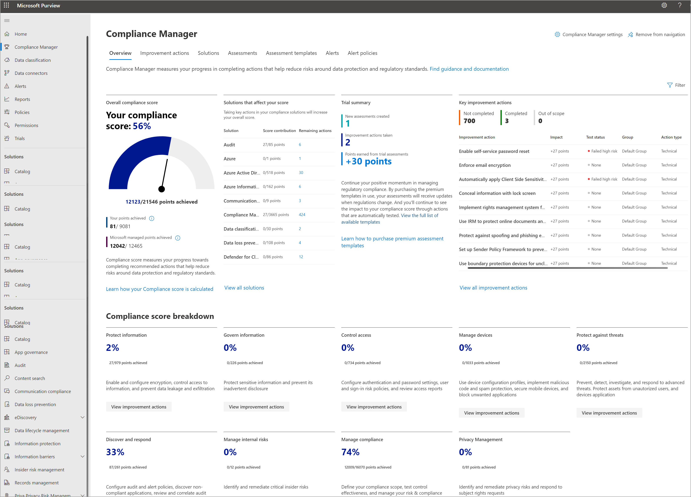

# Microsoft Purview Compliance Manager

**In this article:** Learn what Compliance Manager is, how it helps simplify compliance and reduce risk, and its key components.

[!INCLUDE [purview-preview](../includes/purview-preview.md)]

## What is Compliance Manager?

[Microsoft Purview Compliance Manager](https://compliance.microsoft.com/compliancemanager) is a solution in the <a href="https://go.microsoft.com/fwlink/p/?linkid=2077149" target="_blank">Microsoft Purview compliance portal</a> that helps you automatically assess and manage compliance across your multicloud environment. Compliance Manager can help you throughout your compliance journey, from taking inventory of your data protection risks to managing the complexities of implementing controls, staying current with regulations and certifications, and reporting to auditors.

Watch the video below to learn how Compliance Manager can help simplify how your organization manages compliance:
 
 
>[!VIDEO https://www.microsoft.com/videoplayer/embed/RE4VdoO]

Compliance Manager helps simplify compliance and reduce risk by providing:

- Pre-built assessments for common industry and regional standards and regulations, or custom assessments to meet your unique compliance needs (available assessments depend on your licensing agreement; [learn more](/office365/servicedescriptions/microsoft-365-service-descriptions/microsoft-365-tenantlevel-services-licensing-guidance/microsoft-365-security-compliance-licensing-guidance)).

- Workflow capabilities to help you efficiently complete your risk assessments through a single tool.

- Detailed step-by-step guidance on suggested improvement actions to help you comply with the standards and regulations that are most relevant for your organization. For actions that are managed by Microsoft, you’ll see implementation details and audit results.

- A risk-based compliance score to help you understand your compliance posture by measuring your progress in completing improvement actions.

The Compliance Manager overview page shows your current compliance score, helps you see what needs attention, and guides you to key improvement actions. Below is an example of the overview page:

## Understanding your compliance score

Compliance Manager awards you points for completing improvement actions taken to comply with a regulation, standard, or policy, and combines those points into an overall compliance score. Each action has a different impact on your score depending on the potential risks involved. Your compliance score can help prioritize which action to focus on to improve your overall compliance posture. Compliance Manager gives you an initial score based on the Microsoft 365 data protection baseline. This baseline is a set of controls that includes key regulations and standards for data protection and general data governance.

##### Learn more

[Understand how your compliance score is calculated](compliance-score-calculation.md).

[Learn how to work with improvement actions](compliance-manager-improvement-actions.md).

## Key elements: controls, assessments, regulations, improvement actions

Compliance Manager uses several data elements to help you manage your compliance activities. As you use Compliance Manager to assign, test, and monitor compliance activities, it’s helpful to have a basic understanding of the key elements: controls, assessments, regulations, and improvement actions.

Be sure to check out the [Compliance Manager glossary of terms](compliance-manager-glossary.md).

##### Controls

A control is a requirement of a regulation, standard, or policy. It defines how you assess and manage system configuration, organizational process, and people responsible for meeting a specific requirement of a regulation, standard, or policy. Compliance Manager tracks the following types of controls:

1. **Microsoft managed controls**: controls for Microsoft cloud services, which Microsoft is responsible for implementing
2. **Your controls**: sometimes referred to as customer managed controls, these are controls implemented and managed by your organization
3. **Shared controls**: these are controls that both your organization and Microsoft share responsibility for implementing

Learn more about [monitoring control progress](compliance-manager-assessments.md#monitor-assessment-progress-and-controls).

##### Assessments

An assessment is grouping of controls from a specific regulation, standard, or policy. Completing the actions within an assessment help you meet the requirements of a standard, regulation, or law. For example, you may have an assessment that, when you complete all actions within it, helps to bring your Microsoft 365 settings in line with ISO 27001 requirements. Assessments have several components:

- **In-scope services**: the specific set of Microsoft services applicable to the assessment
- **Microsoft managed controls**: controls for Microsoft cloud services, which Microsoft implements on your behalf
- **Your controls**: sometimes referred to as customer managed controls, these are controls implemented and managed by your organization
- **Shared controls**: these are controls that both your organization and Microsoft share responsibility for implementing
- **Assessment score**: shows your progress in achieving total possible points from actions within the assessment that are managed by your organization and by Microsoft

Learn more about [creating and managing assessments](compliance-manager-assessments.md).

##### Regulations

Compliance Manager provides over 360 regulatory templates to help you quickly create assessments. Learn more about working with [regulations in Compliance Manager](compliance-manager-templates.md) and view the full [list of regulations](compliance-manager-templates-list.md).

##### Improvement actions

Improvement actions help centralize your compliance activities. Each improvement action provides recommended guidance that’s intended to help you align with data protection regulations and standards. Improvement actions can be assigned to users in your organization to perform implementation and testing work. You can also store documentation, notes, and record status updates within the improvement action. Learn more about [working with improvement actions](compliance-manager-improvement-actions.md).

## Supported languages

Compliance Manager is available in the following languages:

- English
- Bahasa Indonesian
- Bahasa Malay
- Chinese (Simplified)
- Chinese (Traditional)
- Czech
- Danish
- Dutch
- Finnish
- French
- German
- Hebrew
- Hungarian
- Italian
- Japanese
- Korean
- Norwegian
- Polish
- Portuguese (Brazilian)
- Russian
- Spanish
- Swedish
- Thai
- Turkish

## Next steps: set up and customize

- [Sign in, assign permissions and roles, configure settings, and personalize your dashboard view](compliance-manager-setup.md).
- [Learn about and set up for multicloud support](compliance-manager-multicloud.md).
- [Create assessments to help you comply with industry standards that matter most to your organization](compliance-manager-assessments.md).

To help you comply with data privacy regulations, we’ve designed a workflow to guide you through an end-to-end process to plan and implement capabilities across Microsoft 365, including using Compliance Manager. For more information, see [Deploy information protection for data privacy regulations with Microsoft 365](../solutions/information-protection-deploy.md).
