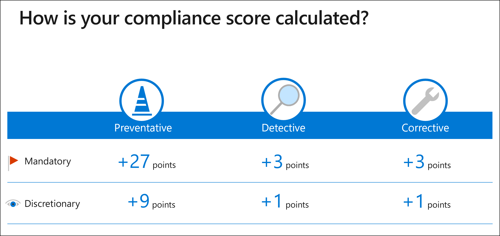

# Compliance score calculation

**In this article:** Learn how Compliance Manager calculates a compliance score for your organization. This article explains how to **interpret your score**, what the **Data Protection Baseline assessment** includes, **continuous monitoring**, and **how different types of actions are managed and scored**.

> [!IMPORTANT]
> Recommendations from Compliance Manager should not be interpreted as a guarantee of compliance. It is up to you to evaluate and validate the effectiveness of customer controls per your regulatory environment. These services are subject to the terms and conditions in the [Online Services Terms](https://go.microsoft.com/fwlink/?linkid=2108910). See also [Microsoft 365 licensing guidance for security and compliance](/office365/servicedescriptions/microsoft-365-service-descriptions/microsoft-365-tenantlevel-services-licensing-guidance/microsoft-365-security-compliance-licensing-guidance).

## How to read your compliance score

The Compliance Manager dashboard displays your overall compliance score. This score measures your progress in completing recommended improvement actions within controls. Your score can help you understand your current compliance posture. It can also help you prioritize actions based on their potential to reduce risk.

A score value is assigned at three levels:

1. **Improvement action score**: each action has a different impact on your score depending on the potential risk involved

2. **Control score**: this score is the sum of points earned by completing improvement actions within the control. This sum is applied in its entirety to your overall compliance score when the control meets both of the following conditions:
    - **Implementation Status** equals **Implemented** or **Alternative Implementation**, and
    - **Test Result** equals **Passed**.

3. **Assessment score**: this score is the sum of your control scores. It is calculated using action scores. Each Microsoft action and each improvement action managed by your organization is counted once, regardless of how often it is referenced in a control.

The overall compliance score is calculated using action scores, where each Microsoft action is counted once, each technical action you manage is counted once, and each non-technical action you manage is counted once per group. This logic is designed to provide the most accurate accounting of how actions are implemented and tested in your organization. You may notice that this can cause your overall compliance score to differ from the average of your assessment scores. Read more below about [how actions are scored](#action-types-and-points).

## Initial score based on Microsoft 365 data protection baseline
  
Compliance Manager gives you an initial score based on the Microsoft 365 data protection baseline. This baseline is a set of controls that includes key regulations and standards for data protection and general data governance. This baseline draws elements primarily from NIST CSF (National Institute of Standards and Technology Cybersecurity Framework) and ISO (International Organization for Standardization), as well as from FedRAMP (Federal Risk and Authorization Management Program) and GDPR (General Data Protection Regulation of the European Union).

Your initial score is calculated according to the default Data Protection Baseline assessment provided to all organizations. Upon your first visit, Compliance Manager is already collecting signals from your Microsoft 365 solutions. You’ll see at a glance how your organization is performing relative to key data protection standards and regulations, and see suggested improvement actions to take.

Because every organization has specific needs, Compliance Manager relies on you to set up and manage assessments to help minimize and mitigate risk as comprehensively as possible.

## How Compliance Manager continuously assesses controls

Compliance Manager automatically scans through your Microsoft 365 environment and detects your system settings, continuously and automatically updating your technical action status. Microsoft Secure Score is the underlying engine that performs the monitoring.

Your action status is updated on your dashboard every 24 hours. Once you follow a recommendation to implement a control, you’ll typically see the control status updated the next day.

For example, if you turn on multi-factor authentication (MFA) in the Azure AD portal, Compliance Manager detects the setting and reflects it in the control access solution details. Conversely, if you didn’t turn on MFA, Compliance Manager flags that as a recommended action for you to take.

Learn more about [Secure Score and how it works](../security/defender/microsoft-secure-score.md).
  
## Action types and points

Compliance Manager tracks two types of actions:

1. **Your improvement actions**: actions that your organization manages.
2. **Microsoft actions**: actions that Microsoft manages.

Both types of actions have points that count toward your overall score when completed.

### Technical and non-technical actions

Actions are grouped by whether they are technical or non-technical in nature. The scoring impact of each action differs by type.

- **Technical actions** are implemented by interacting with the technology of a solution (for example, changing a configuration). The points for technical actions are granted once per action, regardless of how many groups it belongs to.

- **Non-technical actions** are managed by your organization and implemented in ways other than working with the technology of a solution. There are two types of non-technical actions: **documentation** and **operational**. The points for these actions are applied to your compliance score at a group level. This means that if an action exists in multiple groups, you will receive the action's point value each time you implement it within a group.

**Example of how technical and non-technical actions are scored:**

Let's say you have a technical action worth 3 points that exists in 5 groups, and you have a non-technical action worth 3 points that exists in the same 5 groups.

If you successfully implement the technical action, the total number of points you receive is 3. This is because you only need to implement the action once for your tenant. The implementation and test status for the technical action will show the same in all instances of that action, in every group it belongs to.

If you successfully implement the non-technical action in each of the 5 groups, the total number of points you receive is 15. This is because you need to implement the action in each group. The implementation and test status for the non-technical action will differ across groups because the action is implemented separately within each of its groups.

This scoring logic is designed to provide the most accurate accounting of how actions are implemented and tested in your organization.

### How score values are determined
 
Actions are assigned a score value based on whether they’re mandatory or discretionary, and whether they’re preventative, detective, or corrective.

### Mandatory and discretionary actions

 - **Mandatory actions** can't be bypassed, either intentionally or accidentally. An example of a mandatory action is a centrally managed password policy that sets requirements for password length, complexity, and expiration. Users must follow these requirements to access the system.
  
 - **Discretionary actions** rely upon users to understand and adhere to a policy. For example, a policy requiring users to lock their computer when they leave it is a discretionary action because it relies on the user.
  
### Preventative, detective, and corrective actions
  
 - **Preventative actions** address specific risks. For example, protecting information at rest using encryption is a preventative action against attacks and breaches. Separation of duties is a preventative action to manage conflict of interest and guard against fraud.
  
 - **Detective actions** actively monitor systems to identify irregular conditions or behaviors that represent risk, or that can be used to detect intrusions or breaches. Examples include system access auditing and privileged administrative actions. Regulatory compliance audits are a type of detective action used to find process issues.
  
- **Corrective actions** try to keep the adverse effects of a security incident to a minimum, take corrective action to reduce the immediate effect, and reverse the damage if possible. Privacy incident response is a corrective action to limit damage and restore systems to an operational state after a breach.
  
Each action has an assigned value in Compliance Manager based on the risk it represents:

|**Type**|**Assigned score**|
|:-----|:-----|
| Preventative mandatory | 27 |
| Preventative discretionary | 9 |
| Detective mandatory | 3 |
| Detective discretionary | 1 |
| Corrective mandatory | 3 |
| Corrective discretionary | 1 |
  
