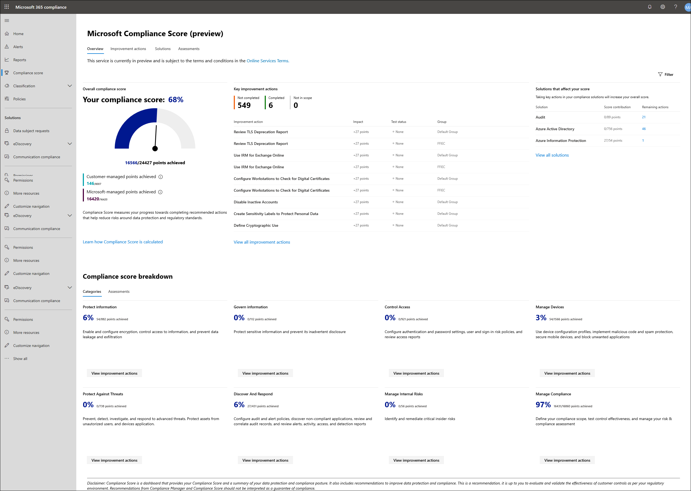

# Microsoft Compliance Score (Preview) setup

## Before you begin

The Microsoft 365 global administrator for your organization will likely be the first user to access Compliance Score. We recommend the global admin sign in and set user permissions as outlined below when visiting Compliance Score for the first time.

## Sign in

1. Go to the [Microsoft 365 compliance center](https://compliance.microsoft.com/) and **sign in** with your Microsoft 365 global admin account.
2. Select **Compliance Score** on the left navigation pane. You should then see your [Compliance Score dashboard with your score](#understand-the-compliance-score-dashboard).

The direct link to access Compliance Score is: [https://compliance.microsoft.com/compliancescore](https://compliance.microsoft.com/compliancescore).

## Set user permissions and assign roles

Compliance Score uses a role-based access control (RBAC) permission model. Only users who are assigned a role may access Compliance Score, and the actions allowed by each user are restricted by role type.

### Where to set permissions

The global admin for your organization can set user permissions in the Microsoft 365 compliance center or in Azure Active Directory (Azure AD). Once roles are set in either of these locations, users will be able to access Compliance Score (as well as  Compliance Manager).

Note that existing Compliance Manger roles **do not** transfer over to Compliance Score.  This means that if you were previously assigned a role in Compliance Manager, that role will not grant you access to Compliance Score. Your global admin will need to set permissions and a role for you in the Microsoft 365 compliance center or Azure AD so that you can access Compliance Score.

### Role types

The table below shows how each Microsoft 365 compliance center role maps to existing Compliance Manger roles, and the functions allowed by each role.

| User can: | Microsoft 365 compliance center role | Compliance Manager role | 
| :------------- | :-------------: | :------------: |
| **Read but not edit data**| Azure AD global reader  | Azure AD global reader | 
| **Read but not edit data**| Security reader | Compliance Manager reader  | 
| **Edit data**| Compliance administrator | Compliance Manager contributor | 
| **Edit test results**| Compliance administrator | Compliance Manager assessor | 
| **Manage assessments, and template and tenant data**| Compliance administrator Compliance data administrator Security administrator | Compliance Manager administrator | 
| **Assign users**| Global administrator | Portal admin | 

> [!NOTE]
> When you go from Compliance Score to Compliance Manager to complete a task (for example, to manage assessments), your browser will open a new tab and a dialog box appears. In the top section with the header, "Already a Microsoft cloud services customer? Sign in to your account," select **Sign In** to access Compliance Manager; you will not need to re-enter your credentials.

### How to set permissions and roles in the Microsoft 365 compliance center

To set permissions in the Microsoft 365 compliance center:

1. Go to the [Microsoft 365 compliance center](https://compliance.microsoft.com) and sign in with your global admin account.
2. Select **Permissions** on the left navigation pane. From here, you can view roles and assign permissions.

## Configure automatic Secure Score updates

By default, all new tenants have [Secure Score](../security/mtp/microsoft-secure-score.md) automatic updates turned on. This means that all actions that are monitored by Secure Score will automatically update the status for the same action in Compliance Score.

Your global administrator can manage this setting to turn off automatic updates for all actions, or set updates for actions individually.

During public preview, you will need to go to the Microsoft Service Trust Portal (where Compliance Manger is located) to manage Secure Score updates.

To manage automatic Secure Score updates, follow these steps:

1. Sign in to the [Service Trust Portal](https://servicetrust.microsoft.com) with your global administrator account.

2. On the Service Trust Portal top menu bar, under **More**, select **Admin** and then choose **Settings**.

3. In the **Secure Score** tab, select the corresponding button to either **turn on for all actions**, **turn off for all actions**, or **set per action.**

If you choose **set per action,** take these additional steps to turn on Secure Score updates for individual actions:

4. Select **Compliance Manager** from the top menu (note: do not select "Compliance Manager (classic)").

5. Select **Tenant Management** in the upper-right corner of your screen.

6. On the **Customer Actions** pane, find your intended action with an ellipsis (**...**) under the **Affected Actions** column. Click on the ellipses and select **Edit.**

7. Switch the **Secure Score continuous update** toggle switch to **On.**

8. Select **Save.** Secure Score continuous monitoring is now turned on for that action.

**Note:** Only the global administrator can turn on or off automatic updates for all actions. The Compliance Manager administrator can turn on automatic updates for individual actions, but not for all actions globally.

Read more about [managing Secure Score updates](compliance-manager-release-notes.md#secure-score).

## Understand the Compliance Score dashboard

The Compliance Score dashboard is designed to provide you an at-a-glance view of your current compliance posture.

### Overall compliance score

Your compliance score, featured prominently at the top, shows a percentage based on points achievable for completing improvement actions addressing key data protection standards and regulations.

When you come to Compliance Score for the first time, your initial score is based on the built-in Microsoft 365 data protection baseline—a set of controls that includes common industry regulations and standards. Because Compliance Score scans your system of existing Microsoft 365 solutions, it gives an initial assessment of your compliance posture based on privacy and security settings currently enabled by your organization.

As you add assessments that are relevant to your organization, your score becomes even more meaningful. Learn more about [how your score is calculated](compliance-score-methodology.md).

### Key improvement actions

This section lists the top improvement actions you can take right now to make the largest positive impact on your overall compliance score. It lists actions that are not completed or failed with the assessment with high risks.

### Solutions that affect your score

This section shows which solutions contain actions with the greatest opportunity to positively impact your score, and how many outstanding improvement actions you have in each solution.

### Compliance Score breakdown

This section gives you a more detailed view of your score in two different ways:

- **Categories**: shows the percentage of your overall score within data protection categories, such as "protect information" or "manage devices."
- **Assessments**: shows the percentage of your progress in managing assessments for particular compliance and data protection standards, regulations, or laws, such as GDPR or NIST 800-53.

### Filtering your dashboard view

You can filter your dashboard view to see only the items related to particular regulations and standards, solutions, type of action, [groups of assessments you set up](working-with-compliance-manager.md#groups), or data protection categories. Filtering your view in this way will also filter the score on your dashboard, showing how many points you've achieved out of total possible points based on your filter criteria.

To apply filters:

1. Select **Filter** on the upper-right side of the dashboard.
2. Select your filter criteria from the flyout **Filters** pane, then select **Apply**.

Once a filter is applied, you will see your score adjusted in real-time. The compliance score percentage and breakdown information, and the improvement actions and solutions, now only pertain to data covered by your filter criteria. If you sign out of Compliance Score, your filtered view remains when you sign back in.

To remove filters:

- At the **Applied filters** heading above your compliance score, select the **X** next to the individual filter you want to remove; or
- Select **Filter** on the upper-right side of your dashboard, then select **Clear filters**.

## Next step

Visit [Working with Compliance Score](working-with-compliance-score.md) to understand the workflow of how to take actions to improve your score.
