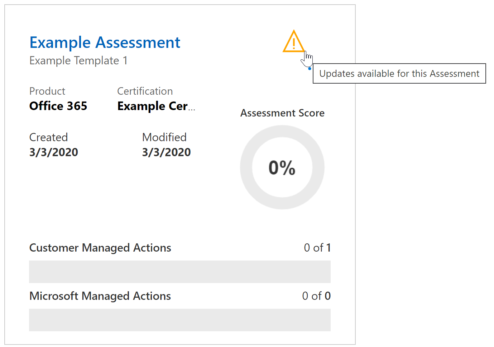
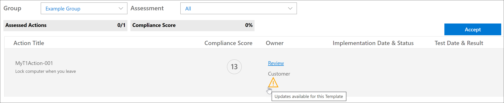

# Microsoft Compliance Score (Preview) updates

The public preview of [Microsoft Compliance Score](compliance-score.md) provides you with early access to upcoming functionality and updates. This article provides details about future updates to Compliance Score and [Compliance Manager](compliance-manager-overview.md), which share the same backend (learn more about the [relationship between Compliance Score and Compliance Manager](compliance-score#relationship-to-compliance-manager)).

## Improved template creation and update processes

The process for importing, modifying, and exporting templates for assessments will be simplified. The new experience makes it easier for you to bring your own assessments into Compliance Score and keep them up-to-date.

### The current process

When you want to create a template in Compliance Manager, there are two ways to do it: by copying an existing template, or by importing template data from Excel into a new template. For example, when you go your **Templates** page, you select **+ Add template**, and then create a brand new template by entering a name, selecting dimensions, and uploading a spreadsheet with template information. Or you have the option to check the **Copy from an existing template** box, select a template to copy, and verify dimensions, as shown in the image below.

If you want to modify, or customize, your template, you must select it from your templates list, select **Add custom control**, and continue along the process ([view detailed process](/working-with-compliance-manager.md#templates)).

### What's changing

We have simplified the process of creating new templates. The Excel spreadsheet used to create templates has been simplified to facilitate easier template creation. We've' replaced the multi-step copy process iwth extension, allowing users to ealsiy compine our templates and tehir own actions and controls.

don't give the impression they can pick 5 of our templates and stuf it into one; use singular on  "our template" and their actions and controls."

Export is - you've already created something and you want to make changes to it, we make it easy to export it. you make inline chnages and put it back in. (he said this next paragraph is good)  In new flow, either yo usay "i will provide everything that's mien" or i will use a MS template and add things. It replaces the copy from existing functionality... (the copy was a multi-step process, adn teh extend is a single step process. you, in one step, say this is your (ms)'s stuff, this is our stuff, hit done/ok and it's all created.  )

2nd para...There will be a new, simpler process for export an existing template, making changes to it, and importing it back into Compliance Manager. The new process replaces **Copy from an existing template** and **Add custom control** functions.

In the new process, you will simply go to your **Templates** page in Compliance Manager, select **+ Add template**, and on the **Template** flyout pane, select the **Create extension from global template** checkbox.

From the drop-down menu, you select the pre-configured template as the basis of your template, then upload an Excel file that contains the customizations for your own controls and actions.

Each time the original assessment is updated through the versioning process (outlined below), your customized assessment will inherit those updates *and* retain your custom controls.

## Versioning notice and control

The next release of Compliance Score and Compliance Manager will contain the most recent updates for all assessment frameworks and provide a clear way to understand and accept all future updates. ... you will see some guidance updaes; and that is related to frameworks. All assessments will receive the most recent updates.....

Whenever an update is available for an assessment's template or an improvement action, an alert icon notifies you that an update is ready and prompts you to either accept or defer the update.

Below is an example of the versioning alert for an assessment:

Below is an example of the versioning alert for an improvement action:

## Common actions will synch status across groups

If your organization has multiple groups of assessments, the behavior of actions that affect your entire organization – in particular, actions marked as type "Technical" – will change. Any duplicate actions across groups will be combined into one single action. That single action will contain all uploaded notes and evidence from the duplicate versions. With this change, actions will behave as they currently do when they belong to the same group; that is, any change made to the action in one group or assessment will now be reflected in all instances. The Implementation Status, Implementation Date, Test Status, and Test Date will reflect the most recently-updated instance of this action.

## Language support

Compliance Score will now be available in the following languages in addition to English: Chinese (Simplified), Chinese (Traditional), French, German, Italian, Japanese, Korean, Portuguese (Brazil), Russian, and Spanish.
