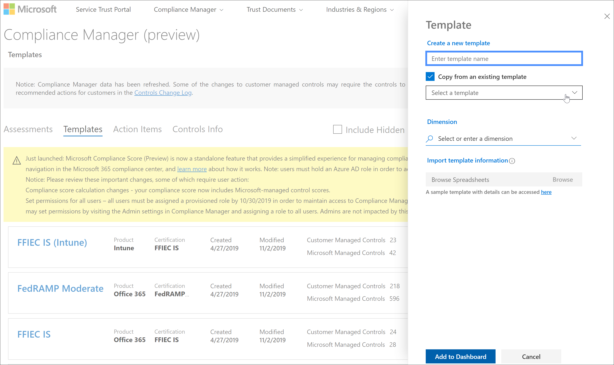
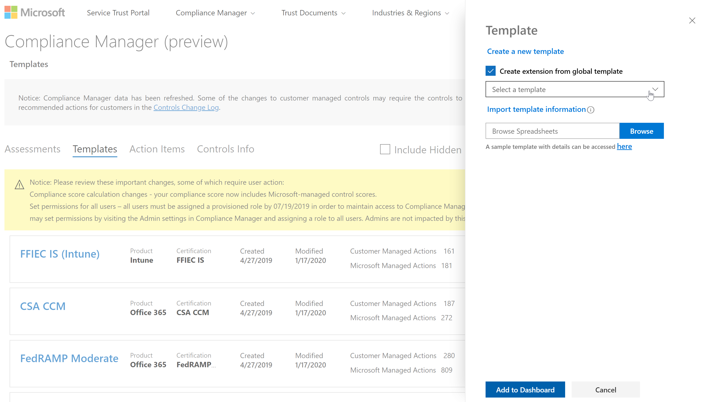
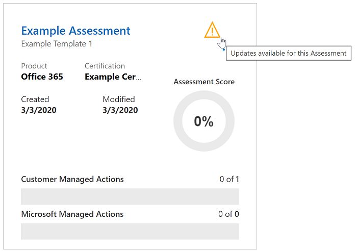
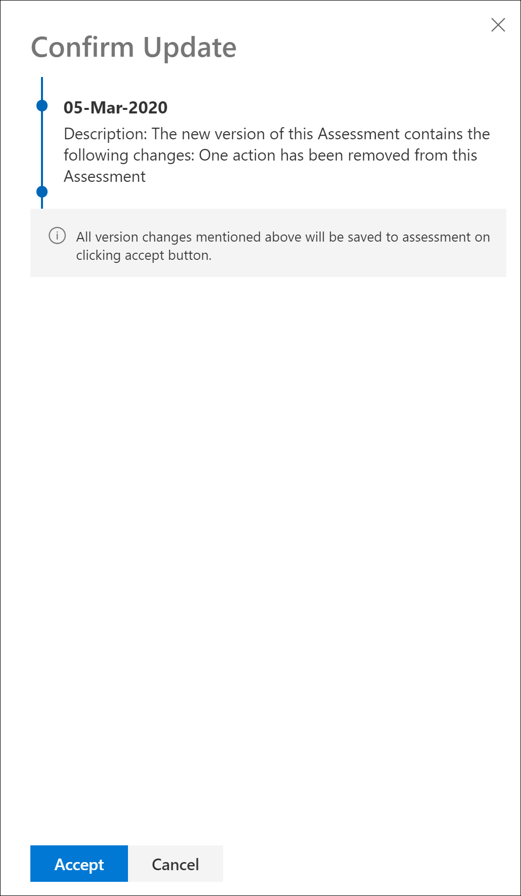

# Microsoft Compliance Score (Preview) updates

 This article provides details about future updates to [Microsoft Compliance Score](compliance-score.md) and [Microsoft Compliance Manager](compliance-manager-overview.md). Learn more about their [relationship](compliance-score-release-notes.md#compliance-score-relationship-to-compliance-manager).

## Improved template creation and update processes

We're simplifying the process for importing, exporting, and modifying templates for assessments. The new experience will make it easier for you to bring your own assessments into Compliance Score and keep them updated.

### The current process

There are two ways to create a template in Compliance Manager. You can copy an existing template, or you can import template data from an Excel spreadsheet into a new template. For example, when you go your **Templates** page, you select **+ Add template** to create a brand new template by entering a name, selecting dimensions, and uploading an Excel file with a specific format and schema. Or you have the option to check the **Copy from an existing template** box, select a template to copy, and verify dimensions, as shown in the image below. Design customization your template requires a [multi-step process](working-with-compliance-manager.md#templates) that begins by selecting **Add custom control** after creating your template.

### What's changing

We're making it easier for you to create new templates and modify your existing templates.

To create a new template, you can take a pre-configured template provided by Microsoft and customize it by adding your own actions and controls. In an easier, one-step **extension** process, you can make all your changes in place, then import the template with all your changes saved. You'll go to your **Templates** page in Compliance Manager and select **+ Add template**. On the **Template** flyout pane, select the **Create extension from global template** checkbox, as seen on the screenshot below. You can add customizations with a new Excel format that is less complex than the current one. This new process replaces the current **Copy from an existing template** and **Add custom control** functions.

Each time the original assessment is updated through the versioning process (outlined below), your customized assessment will inherit those updates and keep your custom controls.

We're also making it easier to modify your own existing templates. You can export your template, make changes in the same workbook, then import it with your edits saved.

## Versioning notice and control

Your organization will receive updated assessments in the next release of Compliance Score and Compliance Manager to help you align with certification and regulation updates. We'll provide a clear way for you to understand and accept all future updates through versioning alerts.

Whenever an update is available for an assessment's template or an improvement action, an alert icon notifies you that an update is ready. When you click on that icon, a pop-up window explains the update and asks you to accept or defer the update.

Below is an example of the versioning alert for an assessment:

Selecting the alert icon reveals a flyout pane explaining the update and prompting you to accept:

## Common actions will synch status across groups

If your organization has multiple groups of assessments, the behavior of actions that affect your entire organization – in particular, actions marked as **Technical** – will change. Any duplicate actions across groups will be combined into one single action. That single action will contain all uploaded notes and evidence from the duplicate versions. With this change, actions will behave as they currently do when they belong to the same group. Any change made to the action in one group or assessment will now be reflected in all instances. The Implementation Status, Implementation Date, Test Status, and Test Date will reflect the most recent updates.

## Language support

Compliance Score will now be available in the following languages in addition to English: Chinese (Simplified), Chinese (Traditional), French, German, Italian, Japanese, Korean, Portuguese (Brazil), Russian, and Spanish.
