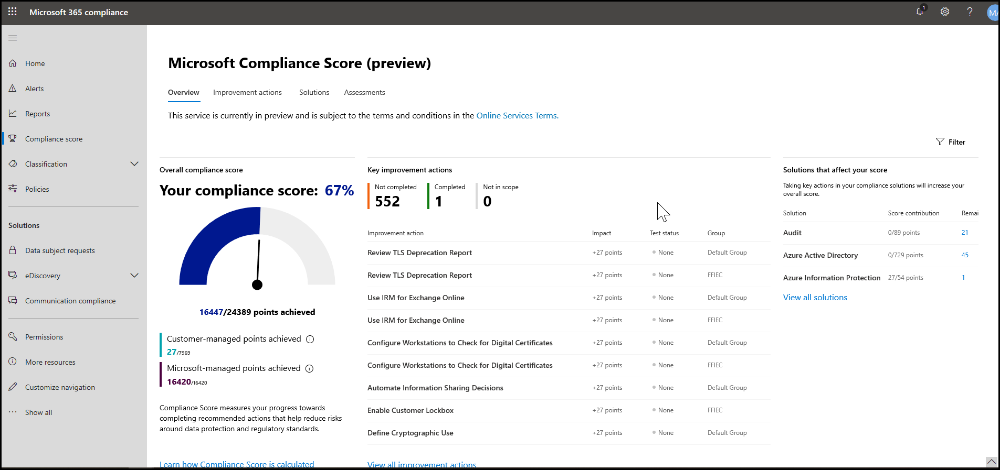

# Microsoft Compliance Score (Preview)

Microsoft Compliance Score helps to simplify the process of managing compliance and reduce compliance risks through a user-friendly experience. Compliance Score is now available for public preview in the [Microsoft 365 compliance center](microsoft-365-compliance-center.md). Read this article to understand what Compliance Score is, how it can help you manage compliance for your organization, and how to get started.

## What is Compliance Score

Microsoft Compliance Score is a preview feature in the Microsoft 365 compliance center to help you understand your organization’s compliance posture. It calculates a risk-based score that measures your progress toward completing recommended actions that help reduce risks around data protection and regulatory standards. It also provides workflow capabilities and built-in control mapping to help you efficiently carry out those actions.

If you currently use [Compliance Manager](compliance-manager-overview.md), you’ll notice that Compliance Score is now a standalone feature with a simpler, more user-friendly design to help you manage compliance more easily. This is what your Compliance Score dashboard will look like:

### Simplified compliance management

Compliance Score helps simplify compliance management by providing:

- **Continuous assessments**: automatically scans through your Microsoft 365 environments to detect and monitor the effectiveness of data protection controls in your system
- **Recommended actions**: provides recommendations and step-by-step guidance for how to implement controls to maximize your score
-  **Built-in control mapping**: helps you stay current with the evolving compliance landscape by providing a built-in common control framework

> [!IMPORTANT] 
> Compliance Score does not express an absolute measure of organizational compliance with any particular standard or regulation. It expresses the extent to which you have adopted controls which can reduce the risks to personal data and individual privacy. Recommendations from Compliance Score and Compliance Manager should not be interpreted as a guarantee of compliance. This service is currently in preview and is subject to the terms and conditions in the [Online Services Terms](https://go.microsoft.com/fwlink/?linkid=2108910).

## Relationship to Compliance Manager

Think of Compliance Score as a simplified version of Compliance Manager. While the two exist as distinct yet integrated tools, Compliance Score makes it easier to monitor your overall compliance posture and take steps to improve it.

During public preview, some functionality remains solely in Compliance Manager, such as managing assessments and creating templates. We recommend beginning all of your compliance management activities in Compliance Score. When you come to functions handled by Compliance Manager, you will be guided to that tool. For that reason, some of this documentation directs you to Compliance Manager topics.

Learn more about the relationship between Compliance Score and Compliance Manager in the [release notes](compliance-manager-release-notes.md).

## Understanding your score

Compliance Score gives you an out-of-the-box score based on the Microsoft 365 data protection baseline, which is a set of controls that includes common industry regulations and standards. While this score is a good starting point for assessing your compliance posture, Compliance Score becomes more powerful for you once you add assessments that are more relevant to your organization.

For example, if your organization belongs to the financial services industry, you may want to add the FFIEC assessment. If your organization belongs to the healthcare industry, you can add the HIPAA/HITECH assessment. Learn how to [add assessments in Compliance Manager](working-with-compliance-manager.md#assessments).

Learn more about [how your compliance score is calculated and continuously monitored](compliance-score-methodology.md).

## Key components: controls, assessments, templates, groups

Compliance Score uses several components to help you manage your compliance activities. As you use Compliance Score to assign, test, and monitor compliance activities, it’s helpful to have a basic understanding of these key components. This diagram shows the relationships among them:

### Controls

A control defines how you assess and manage system configuration, organizational process, and people accountability to meet a specific requirement of a regulation, standard, or internal policy.

Compliance Score tracks two types of controls:

1. **Microsoft-managed controls**: these are controls for Microsoft cloud services that Microsoft is responsible for implementing
2. **Customer-managed controls**: these are controls managed by your organization, which you are responsible for implementing
 
### Assessments

An assessment is an evaluation of a template that initiates the scoring process for your organization. Assessments group the controls necessary to meet the requirements of a standard, regulation, or law. For example, you may have an assessment that, when you complete all actions within it, brings your Office 365 settings in line with ISO 27001 requirements.

By default, Compliance Score provides your organization with an assessment based on the Microsoft 365 data protection baseline.

Assessments include several components:

- **In-scope services**: the specific set of Microsoft services applicable to the assessment. These services account for many regions and industries; are based on market demand and product lifecycle; and incorporate continuous customer feedback and our work with regulators and auditors
- **Microsoft-managed controls**: controls that Microsoft implemented and tested
- **Customer-managed controls**: controls that you manage
- **Assessment score**: the percentage of the points achieved by completing actions within that assessment

> [!NOTE]
> Compliance Score displays your assessments and how they factor into your overall score. However, during public preview you will be directed to Compliance Manager to manage your assessments.

View detailed instructions for [working with assessments in Compliance Manager](working-with-compliance-manager.md#assessments).

### Templates

Compliance Score provides pre-configured templates for assessments and allows you to create customized templates for customer-managed controls to suit your needs. You can create new templates by copying an existing template, or by importing controls information from an Excel file.

The pre-configured templates for Compliance Score are:

1. [ISO 27001:2019](https://go.microsoft.com/fwlink/?linkid=2108866)
2. [ISO 27018:2019](https://go.microsoft.com/fwlink/?linkid=2109074)
3. [NIST 800-53](https://go.microsoft.com/fwlink/?linkid=2109075)
4. [NIST 800-171](https://go.microsoft.com/fwlink/?linkid=2108867)
5. [NIST Cybersecurity Framework (CSF)](https://go.microsoft.com/fwlink/?linkid=2108868)
6. [Cloud Security Alliance (CSA) Cloud Controls Matrix (CCM) 3.0.1](https://go.microsoft.com/fwlink/?linkid=2109076)
8. [Federal Financial Institutions Examination Council (FFIEC) Information Security Booklet](https://go.microsoft.com/fwlink/?linkid=2109077) 
8. [HIPAA](https://go.microsoft.com/fwlink/?linkid=2109078) / [HITECH](https://go.microsoft.com/fwlink/?linkid=2109079)
9. [FedRAMP Moderate](https://go.microsoft.com/fwlink/?linkid=2108869)
10. [European Union GDPR](https://go.microsoft.com/fwlink/?linkid=2108870)
11. [California Consumer Privacy Act (CCPA)](https://go.microsoft.com/fwlink/?linkid=2108871)

> [!NOTE]
> During public preview, go to Compliance Manager to create and customize your templates.

View detailed instructions for [creating and customizing templates in Compliance Manager](working-with-compliance-manager.md#templates).

### Groups

Groups allow you to organize assessments in a way that is logical to you. For example, you may choose to group assessments by year, compliance standard, service, teams within your organization, or some other way. When two different assessments in the same group share customer-managed actions, the completion of implementation details, testing, and status for the control in one assessment automatically synchronizes to the same control in any other assessment in the group. This unifies the assigned improvement actions for each control across the group and reduces duplicating work.

Learn how to [create groups in Compliance Manager](working-with-compliance-manager.md#groups).

## Next step

Sign in, set up permissions, and learn about your Compliance Score dashboard in [Compliance Score setup](compliance-score-setup.md).
