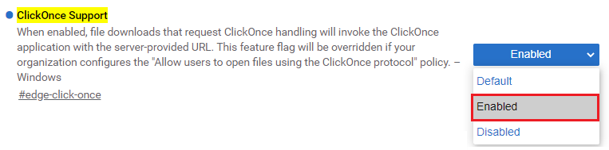
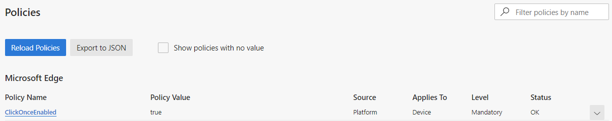
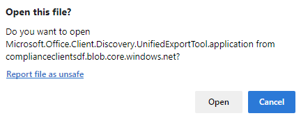
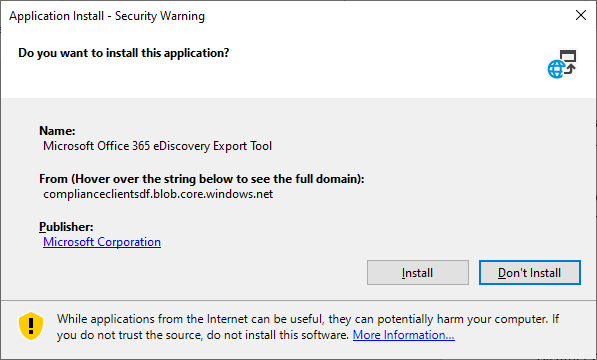

# Use the Office 365 eDiscovery Export Tool in Microsoft Edge

As a result of recent changes to Microsoft Edge, ClickOnce support is no longer enabled by default. To continue using the Microsoft Office 365 eDiscovery Export Tool to download Content Search or eDiscovery search results, you either need to use [Microsoft Internet Explorer](https://support.microsoft.com/help/17621/internet-explorer-downloads) or enable ClickOnce support in Microsoft Edge.

## How to enable ClickOnce support in Microsoft Edge

1. In Microsoft Edge, navigate to **edge://flags/#edge-click-once**.

2. If the existing value is set to **Default** or **Disabled** in the dropdown list, change it to **Enabled**. 
    
   

3. Scroll down to the bottom of the browser window and click **Restart** to restart Edge.

   

**Note:** Organizations can use Group Policy to disable ClickOnce support. To check if there is an organizational policy for ClickOnce support, navigate to **edge://policy**. The following screenshot shows that ClickOnce is enabled across the entire organization. If this policy value is set to **false**, you will need to contact an admin in your organization.

## Install and run the Office 365 eDiscovery Export Tool

1. Click **Download results** on the flyout page of an export in Content Search or an eDiscovery case.

   

2. You will be prompted with a confirmation to launch the tool, Click Open

   

   If the Microsoft Office 365 eDiscovery Export Tool isn't installed, you will be prompted with a Security Warning, 

   > 

3. Click Install to install the tool. After it's installed, the export tool will automatically launch.

For more information about exporting search results, see [Export Content Search results](export-search-results.md).

For more information about flags in Edge, see [How to enable experiment flags in Microsoft Edge](https://microsoftedgesupport.microsoft.com/hc/articles/360034075294-How-to-enable-experiment-flags-in-Microsoft-Edge-Insider-channels)
