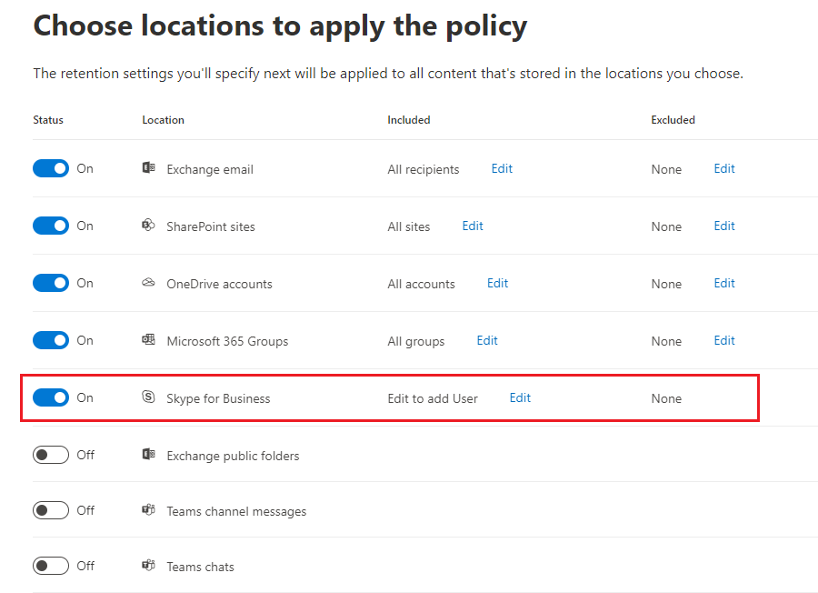
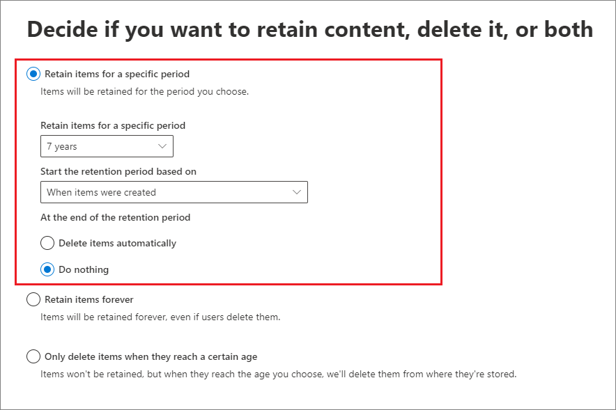

# Configuring common settings for retention policies and retention label policies

>*[Microsoft 365 licensing guidance for security & compliance](https://aka.ms/ComplianceSD).*

Many settings for retention are common to both retention policies and retention label policies. Use the following information to help you configure these settings to proactively retain content, delete content, or both - retain and then delete the content.

For the scenarios that support these policies for retention, see:

- [Create and configure retention policies](create-retention-policies.md).
- [Create retention labels and apply them in apps](create-apply-retention-labels.md)
- [Apply a retention label to content automatically](apply-retention-labels-automatically.md)

Settings that are specific to each scenario are explained in their respective documentation.

For overview information about policies for retention and how retention works in Microsoft 365, see [Learn about retention policies and retention labels](retention.md).

## Scopes - adaptive and static

To understand the differences between the two different types of scopes that you must choose between, see [Adaptive or static policy scopes for retention(retention.md#adaptive-or-static-policy-scopes-for-retention). 

Use the following information to help you configure the type of scope that you choose.

### Configuration information for adaptive scopes

> [!NOTE]
> Adaptive scopes as a new feature is currently in preview and subject to change. The alternative option is a static scope, which provides the same behavior before adaptive scopes were introduced.

When you choose to use adaptive scopes, you are prompted to select what type of adaptive scope you want. There are three different types of adaptive scopes and each one supports different attributes:

| Adaptive scope type | Attributes supported |
|:-----|:-----|
|**Users** - applies to:    - Exchange mail   - OneDrive accounts   - Teams chats   -Teams private channel messages   - Yammer user messages| First Name   Last name  Display name   Job Title   Department   Office  Street Address   City  Zip or Post Code   Country or region   Email Address   Aliases   Custom exchange attributes: CustomAttribute1 - CustomAttribute15|
|**SharePoint sites** - applies to:    - SharePoint sites   - OneDrive accounts |SharePoint URL   SharePoint managed properties |
|**Microsoft 365 Groups** - applies to:    - Microsoft 365 Groups   - Teams channel messages   - Yammer community messages |Name   Description   Email Address   Aliases   Custom exchange attributes: CustomAttribute1 - CustomAttribute15 |

A single policy for retention can have one or many adaptive scopes.

#### To configure an adaptive scope

Before you configure your adaptive scope, use the previous section to identify what type of scope to create and what attributes and values you will use. You might need to work with other administrators to confirm this information, and for SharePoint sites, confirm that the properties are indexed.

1. In the [Microsoft 365 compliance center](https://compliance.microsoft.com/), navigate to one of the following locations:
    
    - If you are using records management:
        - **Solutions** > **Records management** > **Adaptive scopes** tab > + **Create scope**
        
    - If you are not using records management:
       - **Solutions** > **Information governance** > **Adaptive scopes** tab > + **Create scope**
    
    Don't immediately see your option? First select **Show all**. 

2. Follow the prompts in the wizard to first select the type of scope, and then select the attributes you want to use to build the dynamic membership, and type in the attribute values.
    
    For example, to configure an adaptive scope that will be used to identify users in Europe, first select **Users** as the scope type, and then select the **Country or region** attribute, and type in **Europe**. The wizard will query Azure AD and identify all users who have the value **Europe** specified for in their account for the **Country or region** attribute.
    
    > [!IMPORTANT]
    > Because no matches might be a valid result, there's no validation that you typed in the value correctly.
    
    Select **Add attribute** to use any combination of attributes that are supported for their scope type, together with logical operators to build queries. The operators supported are **is equal to**, **is not equal to**, **starts with** and **not starts with**, and you can group selected attributes.
    
    Alternatively, you can select **Advanced query builder** to write your own queries:
    - For **User** scopes, use [OPATH filtering syntax](/powershell/exchange/recipient-filters). For example, to create a user scope that defines its membership by department, country, and state: `(Department -eq "HR") -and (CountryOrRegion -eq "United States") -and (State -eq "California")`
    - For **Sites** and **Microsoft 365 Group** scopes, use Keyword Query Language (KQL). You might already be familiar with creating these queries because you've used them to [specify keywords or searchable properties to auto-apply retention labels](apply-retention-labels-automatically.md#auto-apply-labels-to-content-with-keywords-or-searchable-properties). If not, review the guidance and examples provided for that configuration.

3. Create as many adaptive scopes as you need. You select one or more adaptive scopes when you create your policy for retention.

> [!NOTE]
> It can take a few days for the queries to fully populate and changes will not be immediate. Factor in this delay by waiting a few days before you add a new scope to a policy for retention.

To confirm the current membership and changes for an adaptive scope:

1. Select the scope on the **Adaptive scopes** page

2. From the **Details** pane, select **Scope details**. 
    
    Review the information that identifies all the users, sites, or groups currently in the scope and when they were automatically added or removed.

### Configuration information for static scopes

When you choose to use static scopes, you must then decide whether to apply the policy to all instances for the selected location (the entire location) or to include or exclude specific instances (specific inclusions or exclusions).

#### A policy that applies to entire locations

With the exception of Skype for Business, the default is that all instances for the selected locations are automatically included in the policy without your having to specify them as included or excluded.

For example, **All recipients **for the **Exchange email** location. With this default setting, all existing user mailboxes will be included in the policy, and any new mailboxes created after the policy is applied will automatically inherit the policy.

#### A policy with specific inclusions or exclusions

Be aware that if you use the optional configuration to scope your retention settings to specific users, specific Microsoft 365 groups, or specific sites, there are some limits per policy to be aware of. For more information, see [Limits for retention policies and retention label policies](retention-limits.md). 

To use the optional configuration to scope your retention settings, make sure the **Status** of that location is **On**, and then use the links to include or exclude specific users, Microsoft 365 groups, or sites.

> [!WARNING]
> If you configure instances to include and then remove the last one, the configuration reverts to **All** for the location.  Make sure this is the configuration that you intend before you save the policy.
>
> For example, if you specify one SharePoint site to include in your retention policy that's configured to delete data, and then remove the single site, by default all SharePoint sites will then be subject to the retention policy that permanently deletes data. The same applies to includes for Exchange recipients, OneDrive accounts, Teams chat users, and so on.
>
> In this scenario, toggle the location off if you don't want the **All** setting for the location to be subject to the retention policy. Alternatively, specify exclude instances to be exempt from the policy.

## Locations

Locations in policies for retention identify specific Microsoft 365 services that support retention settings, such as Exchange mail and SharePoint sites.

### Configuration information for Exchange email and Exchange public folders

The **Exchange email** location supports retention for users' email, calendar, and other mailbox items, by applying retention settings at the level of a mailbox.

For detailed information about which items are included and excluded when you configure retention settings for Exchange, see [What's included for retention and deletion](retention-policies-exchange.md#whats-included-for-retention-and-deletion)

Note that even though a Microsoft 365 group has an Exchange mailbox, a retention policy that includes the entire **Exchange email** location won't include content in Microsoft 365 group mailboxes. To retain content in these mailboxes, select the **Microsoft 365 Groups** location.

The **Exchange public folders** location applies retention settings to all public folders and can't be applied at the folder or mailbox level.

### Configuration information for SharePoint sites and OneDrive accounts

When you choose the **SharePoint sites** location, the policy for retention can retain and delete documents in SharePoint communication sites, team sites that aren't connected by Microsoft 365 groups, and classic sites. Team sites connected by Microsoft 365 groups aren't supported with this option and instead, use the **Microsoft 365 Groups** location that applies to content in the group's mailbox, site, and files.

For detailed information about what's included and excluded when you configure retention settings for SharePoint and OneDrive, see [What's included for retention and deletion](retention-policies-sharepoint.md#whats-included-for-retention-and-deletion). 

When you specify your locations for SharePoint sites or OneDrive accounts, you don't need permissions to access the sites and no validation is done at the time you specify the URL on the **Edit locations** page. However, the SharePoint sites that you specify are checked that they exist at the end of the wizard. If this check fails, you see a message that validation failed for the URL you entered, and the wizard won't create the retention policy until the validation check passes. If you see this message, go back in the wizard to change the URL or remove the site from the retention policy.

To specify individual OneDrive accounts to include or exclude, the URL has the following format: `https://<tenant name>-my.sharepoint.com/personal/<user_name>_<tenant name>_com`

For example, for a user in the contoso tenant that has a user name of "rsimone": `https://contoso-my.sharepoint.com/personal/rsimone_contoso_onmicrosoft_com`

To verify the syntax for your tenant and identify URLs for users, see [Get a list of all user OneDrive URLs in your organization](/onedrive/list-onedrive-urls).

### Configuration information for Microsoft 365 Groups

To retain or delete content for a Microsoft 365 group (formerly Office 365 group), use the **Microsoft 365 Groups** location. Even though a Microsoft 365 group has an Exchange mailbox, a retention policy that includes the entire **Exchange email** location won't include content in Microsoft 365 group mailboxes. Although the **Exchange email** location initially allows you to specify a group mailbox to be included or excluded, when you try to save the retention policy, you'll see an error that "RemoteGroupMailbox" is not a valid selection for the Exchange location.

By default, a retention policy applied to a Microsoft 365 group includes the group mailbox and SharePoint teams site. Files stored in the SharePoint teams site are covered with this location, but not Teams chats or Teams channel messages that have their own retention policy locations.

To change the default because you want the retention policy to apply to either just the Microsoft 365 mailboxes, or just the connected SharePoint teams sites, use the [Set-RetentionCompliancePolicy](/powershell/module/exchange/set-retentioncompliancepolicy) PowerShell cmdlet with the *Applications* parameter with one of the following values:

- `Group:Exchange` for just Microsoft 365 mailboxes that are connected to the group.
- `Group:SharePoint` for just SharePoint sites that are connected to the group.

To return to the default value of both the mailbox and SharePoint site for the selected Microsoft 365 groups, specify `Group:Exchange,SharePoint`.

### Configuration information for Skype for Business

Unlike Exchange email, you can't toggle the status of the Skype location on to automatically include all users, but when you turn on that location, you must then manually choose the users whose conversations you want to retain:

When you select **Choose user**, you can quickly include all users by selecting the **Select all** box. However, it's important to understand that each user counts as a specific inclusion in the policy. So if you include 1,000 users by selecting the **Select all** box, it's the same as if you manually selected 1,000 users to include, which is the maximum supported for Skype for Business.

Be aware that **Conversation History**, a folder in Outlook, is a feature that has nothing to do with Skype archiving. **Conversation History** can be turned off by the end user, but archiving for Skype is done by storing a copy of Skype conversations in a hidden folder that is inaccessible to the user but available to eDiscovery.

## Settings for retaining and deleting content

By choosing the settings for retaining and deleting content, your policy for retention will have one of the following configurations for a specified period of time:

- Retain-only

    For this configuration, choose **Retain items for a specific period** and **At end of the retention period: Do nothing**. Or, select **Retain items forever**.

- Retain and then delete

    For this configuration, choose **Retain items for a specific period** and **At end of the retention period: Delete items automatically**.

- Delete-only

    For this configuration, choose **Only delete items when they reach a certain age**.

### Retaining content for a specific period of time

When you configure a policy to retain content, you choose to retain items for a specific number of days, months, or years. Or alternatively, retain the items forever. The retention period is calculated from the age of the content, not from when the retention policy is applied.

For the start of the retention period, you can also choose when the content was created or, supported only for files and the SharePoint, OneDrive, and Microsoft 365 Groups, when the content was last modified.

Examples:

- SharePoint: If you want to retain items in a site collection for seven years after this content is last modified, and a document in that site collection hasn't been modified in six years, the document will be retained for only another year if it's not modified. If the document is edited again, the age of the document is calculated from the new last modified date, and it will be retained for another seven years.

- Exchange: If you want to retain items in a mailbox for seven years, and a message was sent six years ago, the message will be retained for only one year. For Exchange items, the age is based on the date received for incoming email, or the date sent for outgoing email. Retaining items based on when it was last modified applies only to site content in OneDrive and SharePoint.

At the end of the retention period, you choose whether you want the content to be permanently deleted:

### Deleting content that's older than a specific age

A policy for retention can retain and then delete items, or delete old items without retaining them.

In both cases, if your policy deletes items, it's important to understand that the time period you specify is calculated from the time when the item was created or modified, and not from the time the policy was assigned.

For this reason, first consider the age of the existing content and how the policy may impact that content. You might also want to communicate the new policy to your users before assigning it, to give them time to assess the possible impact.

### A policy that applies to entire locations

When you choose locations, with the exception of Skype for Business, the default setting is **All** when the status of the location is **On**.

When a retention policy applies to any combination of entire locations, there is no limit to the number of recipients, sites, accounts, groups, etc., that the policy can include.

For example, if a policy includes all Exchange email and all SharePoint sites, all sites and recipients will be included, no matter how many. And for Exchange, any new mailbox created after the policy is applied will automatically inherit the policy.

### A policy with specific inclusions or exclusions

Be aware that if you use the optional configuration to scope your retention settings to specific users, specific Microsoft 365 groups, or specific sites, there are some limits per policy to be aware of. For more information, see [Limits for retention policies and retention label policies](retention-limits.md). 

To use the optional configuration to scope your retention settings, make sure the **Status** of that location is **On**, and then use the links to include or exclude specific users, Microsoft 365 groups, or sites.

> [!WARNING]
> If you configure includes and then remove the last one, the configuration reverts to **All** for the location.  Make sure this is the configuration that you intend before you save the policy.
>
> For example, if you specify one SharePoint site to include in your retention policy that's configured to delete data, and then remove the single site, by default all SharePoint sites will then be subject to the retention policy that permanently deletes data. The same applies to includes for Exchange recipients, OneDrive accounts, Teams chat users etc.
>
> In this scenario, toggle the location off if you don't want the **All** setting for the location to be subject to the retention policy. Alternatively, specify excludes to be exempt from the policy.

## Updating policies for retention

Some settings can't be changed after a policy for retention is created and saved, which include:
- The policy name and the retention settings except the retention period and when to start the retention period.

If you edit a retention policy and items are already subject to the original settings in your retention policy, your updated settings will be automatically applied to these items in addition to items that are newly identified.

Usually this update is fairly quick but can take several days. When the policy replication across your Microsoft 365 locations is complete, you'll see the status of the retention policy in the Microsoft 365 compliance center change from **On (Pending)** to **On (Success)**.

## Locking the policy to prevent changes

If you need to ensure that no one can turn off the policy, delete the policy, or make it less restrictive, see [Use Preservation Lock to restrict changes to retention policies and retention label policies](retention-preservation-lock.md).
