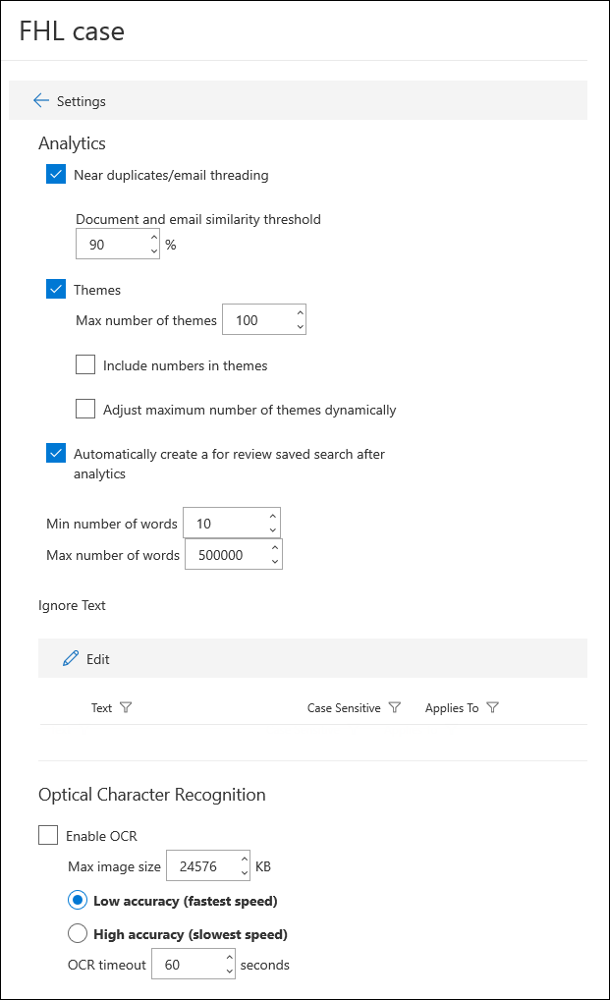
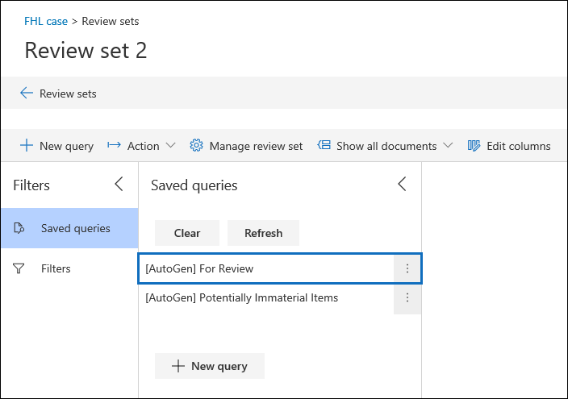

# Configure search and analytics settings in Advanced eDiscovery

You can configure settings for each Advanced eDiscovery case to control the following functionality.

- Near duplicates and email threading

- Themes

- Autogenerated review set query

- Ignore text

- Optical character recognition

To configure search and analytics settings for a case:

1. On the **Advanced eDiscovery** page, select the case.

2. On the **Settings** tab, under **Search & analytics**, click **Select**.

   The case settings page is displayed. These settings are applied to all review sets in a case.

   

## Near duplicates and email threading

In this section, you can set parameters for duplicate detection, near duplicate detection, and email threading. For more information, see [Near duplicate detection](near-duplicates.md) and [Email threading](email-threading.md).

- **Near duplicates/email threading:** When turned on, duplicate detection, near duplicate detection, and email threading are included as part of the workflow when you run analytics on the data in a review set.

- **Document and email similarity threshold:** If the similarity level for two documents is above the threshold, both documents are put in the same near duplicate set.

- **Minimum/maximum number of words:** These settings specify that near duplicates and email threading analysis are performed only on documents that have at least the minimum number of words and at most the maximum number of words.

## Themes

In this section, you can set parameters for themes. For more information, see [Themes](themes-in-advanced-ediscovery.md).

- **Themes:** When turned on, themes clustering is performed as part of the workflow when you run analytics on the data in a review set.

- **Maximum number of themes:** Specifies the maximum number of themes that can be generated when you run analytics on the data in a review set.

- **Include numbers in themes:** When turned on, numbers (that identify a theme) are included when generating themes. 

- **Adjust maximum number of themes dynamically:** In certain situations, there may not be enough documents in a review set to produce the desired number of themes. When this setting is enabled, Advanced eDiscovery adjusts the maximum number of themes dynamically rather than attempting to enforce the maximum number of themes.

## Review set query

If you select the **Automatically create a For Review saved search after analytics** checkbox, Advanced eDiscovery autogenerates review set query named **For Review.** 

This query basically filters out duplicate items from the review set. This lets you review the unique items in the review set. This query is created only when you run analytics for a review set in the case. For more information, about review set queries, see [Query the data in a review set](review-set-search.md).

## Ignore text

There are situations where certain text will diminish the quality of analytics, such as lengthy disclaimers that get added to email messages regardless of the content of the email. If you know of text that should be ignored, you can exclude it from analytics by specifying the text string and the analytics functionality (Near-duplicates, Email threading, Themes, and Relevance) that the text should be excluded for. Using regular expressions (RegEx) as ignored text is also supported. 

## Optical character recognition (OCR)

When this setting is turned on, OCR processing will be run on image files. OCR processing is run in the following situations:

- When custodians and [non-custodial data sources](non-custodial-data-sources.md) are added to a case. OCR processing is performed during the Advanced indexing process. This means that text in image files that matches the search criteria will be returned in a collection search.

- When content from other data sources (that aren't associated with a custodian and added to the case in a non-custodial data source) is added to a review set.

After data is added to a review set, image text can be reviewed, searched, tagged, and analyzed. You can view the extracted text in the Text viewer of the selected image file in the review set. For more information, see:

- [Advanced indexing of custodian data](indexing-custodian-data.md)

- [Add search results to a review set](add-data-to-review-set.md#optical-character-recognition)

- [Supported image file types](supported-filetypes-ediscovery20.md#image)
