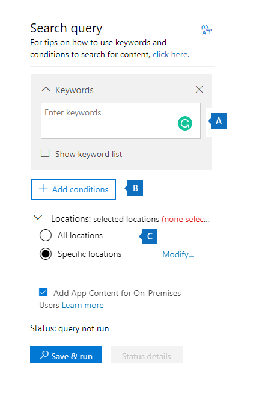

# Content Search

You can use the Content search eDiscovery tool in the compliance center in Office 365 or Microsoft 365 to search for in-place items such as email, documents, and instant messaging conversations in your organization. Use this tool to search for items in these services:
  
- Exchange Online mailboxes

- SharePoint Online sites and OneDrive for Business accounts

- Microsoft Teams

- Microsoft 365 Groups

- Yammer Groups

- Skype for Business conversations

After you run a Content search, the number of content locations and an estimated number of search results are displayed in the search statistics. You can also quickly view statistics, such as the content locations that have the most items that match the search query. After you run a search, you can preview the results or export them to a local computer.

## Create a search

To have access to the **Content search** page to run searches and preview and export search results, an administrator, compliance officer, or eDiscovery manager must be a member of the eDiscovery Manager role group in the Security & Compliance Center. For more information, see [Assign eDiscovery permissions](assign-ediscovery-permissions.md).
  
1. Go to [https://compliance.microsoft.com](https://compliance.microsoft.com) and sign in using your Microsoft email address and password.

2. In the left navigation pane of the Microsoft 365 compliance center, click **Show all**, and then click **Content search**.
    
3. On the **Content search** page, click **New search**.
  
    You can also choose one of the other search options:
    
    - **Guided search:** This option starts a wizard that guides you through the creating the search. The user interface to select content locations and build the search query are the same as the **New search** option.
    
    - **Search by ID list:** This option lets you search for specific email messages and other mailbox items using a list of Exchange IDs. To create an ID list search, you submit a comma-separated value (CSV) file that identifies the specific mailbox items to search for. For instructions, see [Prepare a CSV file for an ID list search](csv-file-for-an-id-list-content-search.md). 
    
4. Under **Search query**, specify the following things:
    
    
  
   - **Keywords to search for:** Type a search query in **Keywords** box. You can specify keywords, message properties such as sent and received dates, or document properties such as file names or the date that a document was last changed. You can use more complex queries that use a Boolean operator, such as **AND**, **OR**, **NOT**, and **NEAR**. You can also search for sensitive information (such as social security numbers) in documents, or search for documents that have been shared externally. If you leave the keyword box empty, all content located in the specified content locations is included in the search results.

      Alternatively, you can click the **Show keyword list** checkbox and the type a keyword in each row. If you do this, the keywords on each row are connected by a logical operator (**c:s**) that is similar in functionality to the **OR** operator in the search query that's created. 
    
      Why use the keyword list? You can get statistics that show how many items match each keyword. This can help you quickly identify which keywords are the most (and least) effective. You can also use a keyword phrase (surrounded by parentheses) in a row. For more information about search statistics, see [View keyword statistics for Content Search results](view-keyword-statistics-for-content-search.md).

     > [!NOTE]
     > To help reduce issues caused by large keyword lists, you're now limited to a maximum of 20 rows in the keyword list.
    
    - **Conditions:** You can add search conditions to narrow a search and return a more refined set of results. Each condition adds a clause to the search query that is created and run when you start the search. A condition is logically connected to the keyword query (specified in the keyword box) by a logical operator (**c:c**) that is similar in functionality to the **AND** operator. That means that items have to satisfy both the keyword query and one or more conditions to be included in the results. This is how conditions help to narrow your results. For a list and description of conditions that you can use in a search query, see the "Search conditions" section in [Keyword queries and search conditions for Content Search](keyword-queries-and-search-conditions.md#search-conditions).
    
       - **Locations:** Choose the content locations to search.
    
      - **All locations:** Use this option to search all content locations in your organization. This includes email in all Exchange mailboxes (including all inactive mailboxes, and mailboxes for all Microsoft Teams, Yammer Groups, and Microsoft 365 Groups), all Skype for Business conversations, all SharePoint and OneDrive for Business sites (including the sites for all Microsoft Teams, Yammer Groups, and Microsoft 365 Groups), and items in all Exchange public folders.
    
      - **Specific locations:** Use this option to search specific content locations. You can search all content locations for a specific Office 365 service (such as searching all Exchange mailboxes or search all SharePoint sites) or you can search for content in specific locations of any of the Office 365 services that are displayed. 
    
        
  
         You can also add distribution groups to the list of Exchange mailboxes to search. For distribution groups, the mailboxes of group members are searched. Dynamic distribution groups aren't supported.
    
       > [!NOTE]
       > When you search all mailbox locations or just specific mailboxes, data from other Office 365 applications that's saved to user mailboxes is included when you export the results of a Content Search. This data won't be included in the estimated search results and isn't available for preview. It is included when you export and download the search results. For more information, see [Content stored in Exchange Online mailboxes](what-is-stored-in-exo-mailbox.md).
   
5. After you've set up your search query, click **Save & run**.
    
6. On the **Save search** page, type a name for the search, and an optional description that helps identify the search. The name of the search has to be unique in your organization. 
    
7. Click **Save** to start the search. 
    
    After you save and run the search, any results returned by the search are displayed in the results pane. Depending on how you have the preview setting configured, the search results are display or you have to click **Preview results** to view them. See the next section for details. 
    
To access this content search again or access other content searches listed on the **Content search** page, select the search and then click **Open**. 
  
To clear the results or create another search, click  **New search**.
  
## Preview search results

There are two configuration settings for previewing search results. After you run a new search or open an existing search, click **Individual results** to view the following preview settings: 
  

  
1. **Preview results automatically:** This setting displays the search results after you run a search.
    
2. **Preview results manually:** This setting displays placeholders in the search results pane, and displays the **Preview results** button that you have to click to display the search results. This is the default setting. It helps enhance search performance by not automatically displaying the search results when you open an existing search. 
    
There are limits related to how many items are available to be previewed. For more information, see [Limits for Content Search](limits-for-content-search.md). 
  
For a list of supported file types that can be previewed, see [Previewing search results](#previewing-search-results) in the "More information about content search" section. If a file type isn't supported for preview or to download a copy of a document, you can click **Download original file** to download it to your local computer. For .aspx Web pages, the URL for the page is included though you might not have permissions to access the page. 
  
Also note that unindexed items aren't available for previewing.
  
## View information and statistics about a search

After you create and run a content search, you can view statistics about the estimated search results. This includes a summary of the search results, the query statistics such as the number of content locations with items that match the search query, and the name of content locations that have the most matching items. You can display statistics for one or more content searches. This lets you quickly compare the results for multiple searches and make decisions about the effectiveness of your search queries.
  
You can also download the search statistics and keyword statistics to a CSV file. This lets you use the filtering and sorting features in Excel to compare results, and prepare reports for your search results.
  
To view search statistics:
  
1. On the **Content search** page, click **Open** and then click the search that you want to view the statistic for.
  
2. On the flyout page, click **Open query**. 
  
3. In the **Individual results** drop down list, click **Search statistics**.
  
4. In the **Type** drop down list, click one of the following options depending on the search statistics you want to view:
  
    - **Summary:** Displays statistics for each type of content locations searched. This contents the number of content locations that contained items that matched the search query, and the total number and size of search result items. This is the default setting.

    - **Queries:** Displays statistics about the search query. This includes the type of content location the query statistics are applicable to, part of the search query the statistics are applicable to (note that **Primary** indicates the entire search query), the number of the content locations that contain items that match the search query, and the total number and size and items that were found (in the specified content location) that match the search query. Statistics for unindexed items (also called *partially indexed items*) are also displayed. However, only partially indexed items from mailboxes are included in the statistics. Partially indexed items from SharePoint and OneDrive are not included in the statistics.

    - **Top locations:** Displays statistics about the number of items that match the search query in each content location. The top 1,000 locations are displayed.

For more detailed information about search statistics, see [View keyword statistics for Content Search results](view-keyword-statistics-for-content-search.md).
  
## Export search results

After a search is successfully run, you can export the search results to a local computer. When you export email results, they can be downloaded to your computer as PST files or as individual messages (.msg files). When you export content from SharePoint and OneDrive sites, copies of native Office documents are exported. There are also other documents and reports that are included with the exported search results. You can also export the search results report and not the actual items.
  
To export search results:
  
1. On the **Content search** page, click the search that you want to export the search results for. 

2. On the flyout page, click **Export results**. You can also export a search results report.

3. Complete the sections on the **Export results** fly out page. Be sure to use the scroll bar to view all export options.

For more detailed instructions and troubleshooting tips, see:
  
- [Export Content search results](export-search-results.md)

- [Export a Content search report](export-a-content-search-report.md)

## More information about content search

See the following sections for more information about Content searches.
  
[Content search limits](#content-search-limits)
  
[Building a search query](#building-a-search-query)
  
[Searching OneDrive accounts](#searching-onedrive-accounts)
  
[Searching Microsoft Teams and Microsoft 365 Groups](#searching-microsoft-teams-and-microsoft-365-groups)

[Searching Yammer Groups](#searching-yammer-groups)
  
[Searching inactive mailboxes](#searching-inactive-mailboxes)
  
[Searching disconnected or de-licensed mailboxes](#searching-disconnected-or-de-licensed-mailboxes)

[Previewing search results](#previewing-search-results)
  
[Partially indexed items](#partially-indexed-items)

[Searching for content in a SharePoint Multi-Geo environment](#searching-for-content-in-a-sharepoint-multi-geo-environment)
  
### Content search limits

- For a description of the limits that are applied to Content search, see [Limits for Content search](limits-for-content-search.md).
  
- Microsoft collects performance information for Content searches run by all organizations. While the complexity of the search query can impact search times, the biggest factor that affects how long searches take is the number of mailboxes searched. Although Microsoft doesn't provide a Service Level Agreement for search times, the following table lists average search times for a Content Search based on the number of mailboxes included in the search.
  
  |**Number of mailboxes**|**Average search time**|
  |:-----|:-----|
  |100  <br/> |30 seconds  <br/> |
  |1,000  <br/> |45 seconds  <br/> |
  |10,000  <br/> |4 minutes  <br/> |
  |25,000  <br/> |10 minutes  <br/> |
  |50,000  <br/> |20 minutes  <br/> |
  |100,000  <br/> |25 minutes  <br/> |
  |||
  
### Building a search query

For detailed information about creating a search query, using Boolean search operators and search conditions, and searching for sensitive information types and content shared with users outside your organization, see [Keyword queries and search conditions for Content Search ](keyword-queries-and-search-conditions.md).
  
Keep the following things in mind when using the keyword list to create a search query.
  
- You have to select the **Show keyword list** checkbox and then type each keyword in a separate row to create a search query where the keywords (or keyword phrases) in each row are connected by the **OR** operator. If you paste a list of keywords in the keyword box or press the **Enter** key after typing a keyword, they won't be connected by the **OR** operator. Here are incorrect and correct examples of how to add a list of keywords. 
    
    **Incorrect**
    
    
  
    **Correct**
    
    
  
- You can also prepare a list of keywords or keyword phrases in an Excel file or a plain text file, and then copy and paste your list into the keyword list. To do this, you have to select the **Show keyword list** check box. Then, click the first row in the keyword list and paste your list. Each line from the Excel or text file is pasted into separate row in the keyword list. 
    
- After you create a query using the keyword list, it's a good idea to verify the search query syntax to make the search query is what you intended. In the search query that's displayed under **Query** in the details pane, the keywords are separated by the text **(c:s)**. This indicates that the keywords are connected by a logical operator similar in functionality to the **OR** operator. Similarly, if your search query includes conditions, the keywords and the conditions are separated by the text **(c:c)**. This indicates that the keywords are connected to the conditions with a logical operator similar in functionality to the **AND** operator. Here's an example of the search query (displayed in the Details pane) that results when using the keyword list and a condition. 
    
    
  
- When you run a content search, Microsoft 365 automatically checks your search query for unsupported characters and for Boolean operators that may not be capitalized. Unsupported characters are often hidden and typically cause a search error or return unintended results. For more information about the unsupported characters that are checked, see [Check your Content Search query for errors](check-your-content-search-query-for-errors.md).
    
- If you have a search query that contains keywords for non-English characters (such as Chinese characters), you can click **Query language-country/region** and select a language-country culture code value for the search. The default language/region is neutral. How can you tell if you need to change the language setting for a content search? If you're certain content locations contain the non-English characters you're searching for, but the search returns no results, the language setting may be the cause. 
  
### Searching OneDrive accounts

- To collect a list of the URLs for the OneDrive sites in your organization, see [Create a list of all OneDrive locations in your organization](https://docs.microsoft.com/onedrive/list-onedrive-urls). This script in this article creates a text file that contains a list of all OneDrive sites. To run this script, you have to install and use the SharePoint Online Management Shell. Be sure to append the URL for your organization's MySite domain to each OneDrive site that you want to search. This is the domain that contains all your OneDrive; for example,  `https://contoso-my.sharepoint.com`. Here's an example of a URL for a user's OneDrive site:  `https://contoso-my.sharepoint.com/personal/sarad_contoso_onmicrosoft.com`.
    
    In the rare case of a person's user principal name (UPN) being changed, the URL for their OneDrive location is changed to incorporate the new UPN. If this happens, you have to modify a content search by adding the user's new OneDrive URL and removing the old one. For more information, see [How UPN changes affect the OneDrive URL](https://docs.microsoft.com/onedrive/upn-changes).
  
### Searching Microsoft Teams and Microsoft 365 Groups

You can search the mailbox that's associated with a Microsoft Team or Microsoft 365 Group. Because Microsoft Teams is built on Microsoft 365 Groups, searching them is similar. In both cases, only the group or team mailbox is searched. The mailboxes of the group or team members aren't searched. To search them, you have to specifically add them to the search.
  
Keep the following things in mind when searching for content in Microsoft Teams and Microsoft 365 Groups.
  
- To search for content located in Teams and Microsoft 365 Groups, you have to specify the mailbox and SharePoint site that are associated with a team or group.

- Content from private channels is stored in each user's mailbox, not the team mailbox. To search for content in private channels, see [eDiscovery of private channels](https://docs.microsoft.com/microsoftteams/ediscovery-investigation#ediscovery-of-private-channels).
    
- Run the **Get-UnifiedGroup** cmdlet in Exchange Online to view properties for a team or a Microsoft 365 Group. This is a good way to get the URL for the site that's associated with a team or a group. For example, the following command displays selected properties for a Microsoft 365 Group named Senior Leadership Team: 
    
  ```text
  Get-UnifiedGroup "Senior Leadership Team" | FL DisplayName,Alias,PrimarySmtpAddress,SharePointSiteUrl
  DisplayName            : Senior Leadership Team
  Alias                  : seniorleadershipteam
  PrimarySmtpAddress     : seniorleadershipteam@contoso.onmicrosoft.com
  SharePointSiteUrl      : https://contoso.sharepoint.com/sites/seniorleadershipteam
  ```

    > [!NOTE]
    > To run the **Get-UnifiedGroup** cmdlet, you have to be assigned the View-Only Recipients role in Exchange Online or be a member of a role group that's assigned the View-Only Recipients role. 
  
- When a user's mailbox is searched, any team or Microsoft 365 Group that the user is a member of won't be searched. Similarly, when you search a team or a Microsoft 365 Group, only the group mailbox and group site that you specify is searched. The mailboxes and OneDrive for Business accounts of group members aren't searched unless you explicitly add them to the search.

- To get a list of the members of a team or a Microsoft 365 Group, you can view the properties on the **Home \> Groups** page in the Microsoft 365 admin center. Alternatively, you can run the following command in Exchange Online PowerShell: 

  ```powershell
  Get-UnifiedGroupLinks <group or team name> -LinkType Members | FL DisplayName,PrimarySmtpAddress
  ```

    > [!NOTE]
    > To run the **Get-UnifiedGroupLinks** cmdlet, you have to be assigned the View-Only Recipients role in Exchange Online or be a member of a role group that's assigned the View-Only Recipients role. 
  
- Conversations that are part of a Teams channel are stored in the mailbox that's associated with the team. Similarly, files that team members share in a channel are stored on the team's SharePoint site. Therefore, you have to add the team mailbox and SharePoint site as a content location to search conversations and files in a channel.
    
- Alternatively, conversations that are part of the Chat list in Teams are stored in the Exchange Online mailbox of the users who participate in the chat. And files that a user shares in Chat conversations are stored in the OneDrive for Business account of the user who shares the file. Therefore, you have to add the individual user mailboxes and OneDrive for Business accounts as content locations to search conversations and files in the Chat list.
    
    > [!NOTE]
    > In an Exchange hybrid deployment, users with an on-premises mailbox might participate in conversations that are part of the Chat list in Teams. In this case, content from these conversations is also searchable because it's saved to a cloud-based storage area (called a *cloud-based mailbox for on-premises users*) for users who have an on-premises mailbox. For more information, see [Search for Teams chat data for on-premises users](search-cloud-based-mailboxes-for-on-premises-users.md).
  
- Every team or team channel contains a Wiki for note-taking and collaboration. The Wiki content is automatically saved to a file with a .mht format. This file is stored in the Teams Wiki Data document library on the team's SharePoint site. You can use the Content Search tool to search the Wiki by specifying the team's SharePoint site as the content location to search.

    > [!NOTE]
    > The capability to search the Wiki for a team or channel (when you search the team's SharePoint site) was released on June 22, 2017. Wiki pages that were saved or updated on that date or after are available to be searched. Wiki pages last saved or updated before that date aren't available for search.

- Summary information for meetings and calls in a Teams channel are also stored in the mailboxes of users who dialed into the meeting or call. This means you can use Content Search to search these summary records. Summary information includes:
  
  - Date, start time, end time, and duration of a meeting or call

  - The date and time when each participant joined or left the meeting or call

  - Calls sent to voice mail

  - Missed or unanswered calls

  - Call transfers, which are represented as two separate calls

  It can take up to 8 hours for meeting and call summary records to be available to be searched.

  In the search results, meeting summaries are identified as **Meeting** in the **Type field**, and call summaries are identified as **Call**. Also, conversations that are part of a Teams channel and 1xN chats are identified as **IM** in the **Type** field.
  
  

   For more information, see [Microsoft Teams launches eDiscovery for calls and meetings](https://techcommunity.microsoft.com/t5/microsoft-teams-blog/microsoft-teams-launches-ediscovery-for-calling-and-meetings/ba-p/210947).

- Card content generated by apps in Teams channels, 1:1 chats, and 1xN chats is stored in mailboxes and can be searched. A *card* is a UI container for short pieces of content. Cards can have multiple properties and attachments, and can include buttons that can trigger card actions. For more information, see [Cards](https://docs.microsoft.com/microsoftteams/platform/task-modules-and-cards/what-are-cards)

  Like other Teams content, where card content is stored is based on where the card was used. Content for cards used in a Teams channel is stored in the Teams group mailbox. Card content for 1:1 and 1xN chats are stored in the mailboxes of the chat participants.

  To search for card content, you can use the `kind:microsoftteams` or `itemclass:IPM.SkypeTeams.Message` search conditions. When reviewing search results, card content generated by bots in a Teams channel have the **Sender/Author** email property as `<appname>@teams.microsoft.com`, where `appname` is the name of the app that generated the card content. If card content was generated by a user, the value of **Sender/Author** identifies the user.

  When viewing card content in Content search results, the content appears as an attachment to the message. The attachment is named `appname.html`, where `appname` is the name of the app that generated the card content. The following screenshots show how card content (for an app named Asana) appears in Teams and in the results of a search.

  **Card content in Teams**

  

  **Card content in search results**
  
  

  > [!NOTE]
  > To display images from card content (such as the checkmarks in the previous screenshot) in search results at this time, you have to be signed into Teams (at https://teams.microsoft.com) in a different tab in the same browser session that you use to view the search results. Otherwise, generic image placeholders are displayed.

- You can use the **Kind** email property or the **Message kind** search condition to search specifically for content in Teams.
  
  - To use the **Kind** property as part of the keyword search query, in the **Keywords** box of a search query, type `kind:microsoftteams`.

    
  
  - To use a search condition, add the **Message kind** condition and use the value `microsoftteams`.

    

   Conditions are logically connected to the keyword query by the **AND** operator. That means an item must match both the keyword query and the search condition to be returned in the search results. For more information, see the "Guidelines for using conditions" section in [Keyword queries and search conditions for Content Search.](keyword-queries-and-search-conditions.md#guidelines-for-using-conditions)
  
### Searching Yammer Groups

You can use the **ItemClass** email property or the **Type** search condition to search specifically for conversation items in Yammer Groups.

  - To use the **ItemClass** property as part of the keyword search query, in the **Keywords** box of a search query, you can type one (or all) of the following property:value pairs:

     - ItemClass:IPM.Yammer.message
     - ItemClass:IPM.Yammer.poll
     - ItemClass:IPM.Yammer.praise
     - ItemClass:IPM.Yammer.question
  
    For example, you can use the following search query to return Yammer messages and Yammer praise items:

    
  
  - Alternatively, you can use the **Type** email condition and select **Yammer messages** to return Yammer items. For example, the following search query will return all Yammer conversation items that contain the keyword "confidential". 

    

### Searching inactive mailboxes

You can search inactive mailboxes in a content search. To get a list of the inactive mailboxes in your organization, run the command  `Get-Mailbox -InactiveMailboxOnly` in Exchange Online PowerShell. Alternatively, you can go to **Information governance** \> **Retention** in the Security & Compliance Center, and then click **More** \> **Inactive mailboxes**.
  
Here are a few things to keep in mind when searching inactive mailboxes.

- If an existing content search includes a user mailbox and that mailbox is made inactive, the content search will continue to search the inactive mailbox when you rerun the search after it becomes inactive.

- Sometimes a user may have an active mailbox and an inactive mailbox that have the same SMTP address. In this case, only the specific mailbox that you select as a location for a content search is searched. In other words, if you add a user's mailbox to a search, you can't assume that both their active and inactive mailboxes are searched. Only the mailbox that you explicitly add to the search is searched.

- You can use Security & Compliance Center PowerShell to create a content search to search an inactive mailbox. To do this, you have to pre-append a period ( . ) to the email address of the inactive mailbox. For example, the following command creates a content search that searches an inactive mailbox with the email address pavelb@contoso.onmicrosoft.com:

   ```powershell
   New-ComplianceSearch -Name InactiveMailboxSearch -ExchangeLocation .pavelb@contoso.onmicrosoft.com -AllowNotFoundExchangeLocationsEnabled $true
   ```

- We strongly recommend that you avoid having an active mailbox and inactive mailbox with the same SMTP address. If you need to reuse the SMTP address that is assigned to an inactive mailbox, we recommend that you recover the inactive mailbox or restore the contents of an inactive mailbox to an active mailbox (or the archive of an active mailbox), and then delete the inactive mailbox. For more information, see one of the following topics:

  - [Recover an inactive mailbox in Office 365](recover-an-inactive-mailbox.md)

  - [Restore an inactive mailbox in Office 365](restore-an-inactive-mailbox.md)

  - [Delete an inactive mailbox in Office 365](delete-an-inactive-mailbox.md)

### Searching disconnected or de-licensed mailboxes

If the Exchange Online license (or the entire Microsoft 365 license) is removed from a user account or in Azure Active Directory, the user's mailbox becomes a *disconnected* mailbox. This means that the mailbox is no longer associated with the user account. Here's what happens when searching disconnected mailboxes:

- If the license is removed from a mailbox, the mailbox is no longer searchable. 

- If an existing content search includes a mailbox in which the license is removed, no search results from the disconnected mailbox will be returned if you rerun the content search.

- If you use the **New-ComplianceSearch** cmdlet to create a content search and specify a disconnected mailbox as the Exchange content location to search, the content search won't return any search results from the disconnected mailbox.

If you need to preserve the data in a disconnected mailbox so that it's searchable, you must place a hold on the mailbox before removing the license. This preserves the data and keeps the disconnected mailbox searchable until the hold is removed. For more information about holds, see [How to identify the type of hold placed on an Exchange Online mailbox](identify-a-hold-on-an-exchange-online-mailbox.md).

### Previewing search results

You can preview supported file types in the preview pane. If a file type isn't supported, you have to download a copy of the file to your local computer to view it. The following file types are supported and can be previewed in the search results pane.
  
- .txt, .html, .mhtml
    
- .eml
    
- .doc, .docx, .docm
    
- .pptm, .pptx
    
- .pdf
    
Also, the following file container types are supported. You can view the list of files in the container in the preview pane.
  
- .zip

- .gzip

### Partially indexed items

- As previously explained, partially indexed items in mailboxes are included in the estimated search results. Partially indexed items from SharePoint and OneDrive aren't included in the estimated search results.

- If a partially indexed item matches the search query (because other message or document properties meet the search criteria), it isn't included in the estimated number of unindexed items. If a partially indexed item is excluded by the search criteria, it isn't included in the estimated number of unindexed items. For more information, see [Partially indexed items in Content Search in Office 365](partially-indexed-items-in-content-search.md).

### Searching for content in a SharePoint Multi-Geo environment

If it's necessary for an eDiscovery manager to search for content in SharePoint and OneDrive in different regions in a [SharePoint multi-geo environment](https://go.microsoft.com/fwlink/?linkid=860840), then you need to do the following things to make that happen:

1. Create a separate user account for each satellite geo location that the eDiscovery manager needs to search. To search for content in sites in that geo location, the eDiscovery manager must sign in to the account you created for that location and then run a content search.

2. Create a search permissions filter for each satellite geo location (and corresponding user account) the eDiscovery manager needs to search. Each of these search permissions filters limits the scope of the content search to a specific geo location when the eDiscovery manager is signed in to the user account associated with that location.

> [!TIP]
> You don't have to use this strategy when using the search tool in [Advanced eDiscovery](overview-ediscovery-20.md). That's because all datacenters are searched when you search SharePoint sites and OneDrive accounts in Advanced eDiscovery. You have to use this strategy of region-specific user accounts and search permissions filters only when using the Content Search tool and running searches associated with [eDiscovery cases](ediscovery-cases.md).

For example, let's say that an eDiscovery manager needs to search for SharePoint and OneDrive content in satellite locations in North American, Europe, and Asia Pacific. The first step is to create three users accounts, one for each location. The next step is to create three search permissions filters, one for each location *and* corresponding user account. Here are examples of the three search permissions filters for this scenario. In each of these examples, the **Region** specifies the SharePoint datacenter location for that geo and the **Users** parameter specifies the corresponding user account.

**North America**

```powershell
New-ComplianceSecurityFilter -FilterName "SPMultiGeo-NAM" -Users ediscovery-nam@contoso.com -Region NAM -Action ALL
```

**Europe**

```powershell
New-ComplianceSecurityFilter -FilterName "SPMultiGeo-EUR" -Users ediscovery-eur@contoso.com -Region EUR -Action ALL
```

**Asia Pacific**

```powershell
New-ComplianceSecurityFilter -FilterName "SPMultiGeo-APC" -Users ediscovery-apc@contoso.com -Region APC -Action ALL
```

Keep the following things in mind when using search permissions filters to search for content in multi-geo environments:

- The **Region** parameter directs searches to the specified satellite location. If an eDiscovery manager only searches SharePoint and OneDrive sites outside of the region specified in the search permissions filter, no search results are returned. 

- The **Region** parameter doesn't control searches of Exchange mailboxes. All datacenters are searched when you search mailboxes.

For more information about using search permissions filters in a multi-geo environment, see the "Searching and exporting content in Multi-Geo environments" section in [Set up compliance boundaries for eDiscovery investigations](set-up-compliance-boundaries.md#searching-and-exporting-content-in-multi-geo-environments).
