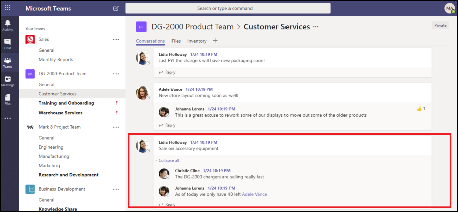
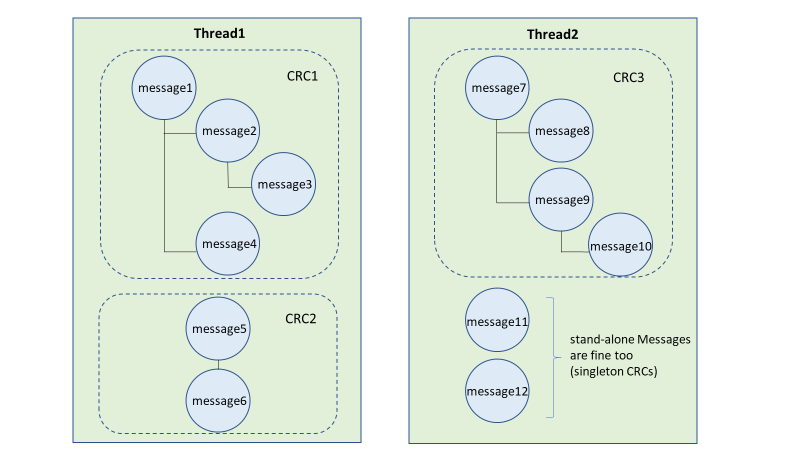

# Conversation threading in Advanced eDiscovery

Instant messaging is a convenient way to ask questions, share ideas, or quickly communicate across large audiences. As instant messaging platforms, like Microsoft Teams and Yammer groups, become core to enterprise collaboration, organizations must evaluate how their eDiscovery workflow addresses these new forms of communication and collaboration.

The Conversation Reconstruction feature in Advanced eDiscovery is designed to help you identify contextual content and produce distinct conversation views. This capability allows you to efficiently and rapidly review complete instant message conversations (also called *threaded conversations*) that are generated in platforms like Microsoft Teams.

With Conversation Reconstruction, you can use built-in capabilities to reconstruct, review, and export threaded conversations. Use Advanced eDiscovery Conversation Reconstruction to:

- Preserve unique message-level metadata across all messages within a conversation.

- Collect contextual messages around your search results.

- Review, annotate, and redact threaded conversations.

- Export individual messages or threaded conversations

## Terminology

Here are few definitions to help you get start using Conversation Reconstruction.

- **Messages:** Represent the smallest unit of a conversation. Messages may vary in size, structure, and metadata. 

- **Conversation:** Represents a grouping of one or more messages. Across different applications, conversations may be represented in different ways. In some applications, there is an explicit action that results from replying to an existing message. Conversations are formed explicitly as a result of this user action. For example, here is a screenshot of a channel conversation in Microsoft Teams.

   

   In other apps (such as 1xN chat messages in Teams), there is not a formal reply chain and instead messages appear as a "flat river of messages" within a single thread. In these types apps, conversations are inferred from a group of messages that occur within a certain time. This "soft-grouping" of messages (as opposed to a reply chain) represent the "back and forth" conversation about a specific topic of interest.

## Step 1: Create a draft collection

After you have identified relevant custodians and content locations, you can create a search to find potentially relevant content. On the **Collections** tab in the Advanced eDiscovery case, you can create a collection by clicking **New collection** and following the wizard. For information about how you can create a collection, build a search query, and preview the search results, see [Create a draft collection](create-draft-collection.md).

## Step 2: Commit a draft collection to a review set

After you have reviewed and finalized the search query in a collection, you can add the search results to a review set. When you add your search results into a review set, the original data is copied to an Azure Storage area to facilitate the review and analysis process. For more information about adding search results to a review set, see [Commit a draft collection to a review set](commit-draft-collection.md).

When you add items from conversations to a review set, you can use the threaded conversations option to collect contextual messages from conversations that contain items that match the search criteria of the collection. After you select the thread conversations option, the following things can happen:

  
  
1. Using a keyword and date range query, the search returned a hit on *Message 3*. This message was part of a larger conversation, illustrated by *CRC1*.
  
2. When you add the data into a review set and enable the conversation retrieval options, Advanced eDiscovery will go back and collect other items in *CRC1*.
  
3. After the items have been added to the review set, you can review all the individual messages from *CRC1*.

To enabled the threaded conversations option, see [Commit a draft collection to a review set](commit-draft-collection.md#commit-a-draft-collection-to-a-review-set).
  
## Step 3: Review and export threaded conversations

After the content has been processed and added to the review set, you can start reviewing the data in the review set. The review capabilities are different depending on whether the content was added to a standard review set or a conversation review set.

### Reviewing conversations in a standard review set

In a standard review set, messages are processed and displayed as individual items, similar to how they're stored in a mailbox folder. In this workflow, each message is processed as a separate item. As a result, the threaded summary and export options aren't available in a standard review set.

  

### Reviewing conversations in a conversation review set

In a conversation review set, individual messages are threaded together and presented as conversations. This lets you review and export contextual conversations. 

  

The following sections describe reviewing and exporting conversations in a conversation review set.

#### Reviewing conversations

In a conversation review set, you can use the following options to facilitate the review process.

- **Group by conversation:** Groups messages within the same conversation together to help users simplify and expedite their review process.

- **Summary view:** Displays the threaded conversation. In this view, you can see the entire conversation and also access the metadata for each individual message.  
  
   - View metadata for individual messages
   
   - Download individual messages

- **Text view:** Provides the extracted text for the entire conversation.

- **Annotate view:** Lets you markup a threaded view of the conversation. All messages in the conversation share the same annotated document.

- **Tagging:** When viewing conversations in a review set, you can view and apply tags by clicking **Tagging panel** in the Coding panel.

- **Rerun conversation conversion:** When messages are added to a conversation review set, a conversion job is automatically run to create the threaded summary and annotate views. If the Conversation Reconstruction job fails, you can rerun this job by clicking **Action > Create conversation PDFs** in the review set.

#### Exporting conversations

In a conversation review set, you can set the following options to export conversations:

a. Metadata options

   - **Load file:** Metadata is included for each individual message, email, and document. There is one row for each message in a conversation. 

   - **Tags:** Tags from your review process are included in the metadata file. Messages in a conversation share the same tags. 

b. Conversation options
  
   - **Conversation files:** When you export conversation files, the annotated view is converted to a PDF file and downloaded to the export folder. Messages in one conversation file point to the PDF version of the same conversation file.  
  
   - **Individual chat messages:** When you export individual messages, each unique message in the conversation is exported as a standalone item. The file is exported in the same format that it was saved as in the mailbox. For a specific conversation, you receive multiple .msg files.

     >[!NOTE]
     > If you applied annotations to the conversation file, these annotations won't be transferred to the individual messages.

c. Other options

   - **Generate text files for all exported content:** Generates a text file for each conversation exported from the review set.

   - **Replace exported content with redacted PDFs:** If redacted conversation files are generated during the review process, then these files are available during export. You can decided whether to export only the native files (by not selecting this option) or to replace the native files with the redacted versions of the native files (by selecting this option), which are exported as PDF files.

## More information

To learn more about how to review case data in Advanced eDiscovery, see the following articles:

- [View case data](view-documents-in-review-set.md)

- [Analyze case data](analyzing-data-in-review-set.md)

- [Export case data](exporting-data-ediscover20.md)
