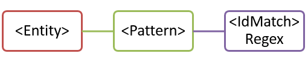
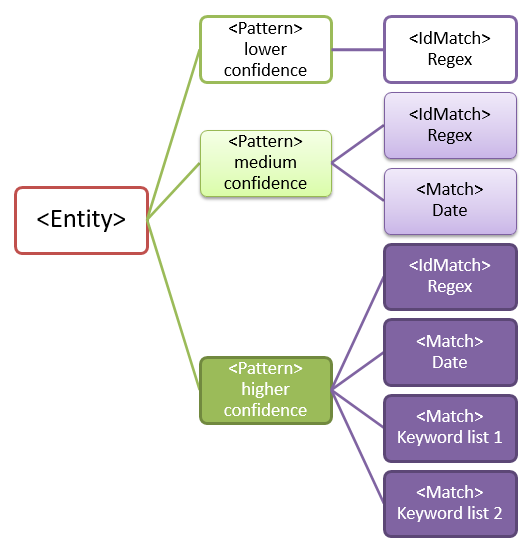
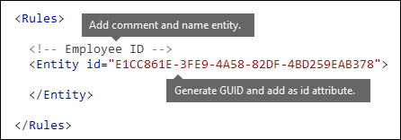
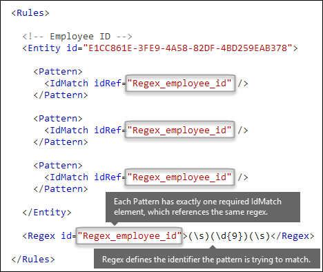
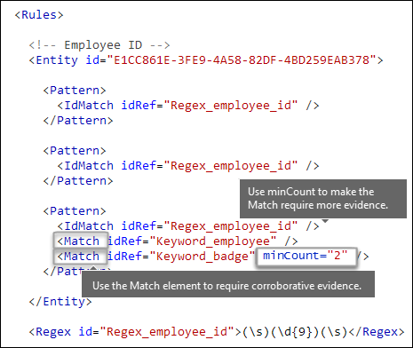
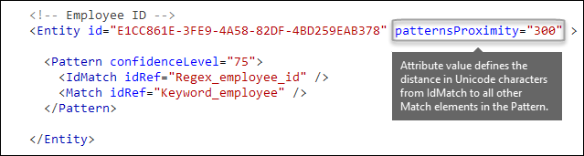
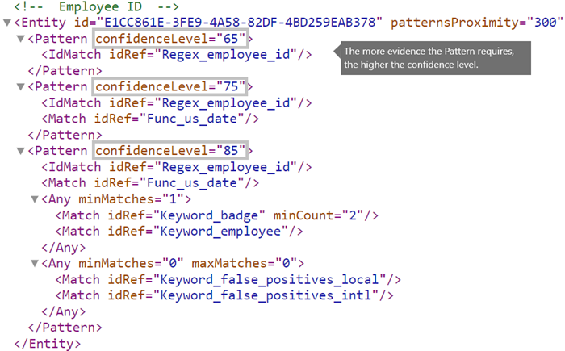
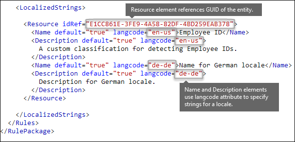
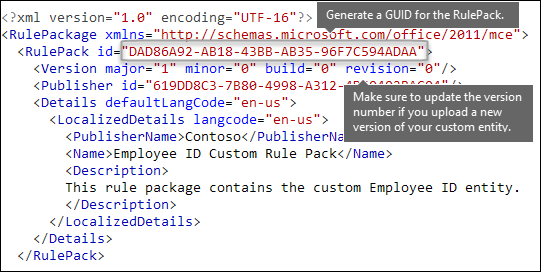

# Create a custom sensitive information type using PowerShell

This article shows you how to create an XML *rule package* file that defines custom [sensitive information types](sensitive-information-type-entity-definitions.md). This article describes a custom sensitive information type that identifies an employee ID. You can use the sample XML in this article as a starting point for your own XML file.

For more information about sensitive information types, see [Learn about sensitive information types](sensitive-information-type-learn-about.md).

After you've created a well-formed XML file, you can upload it to Microsoft 365 using PowerShell. Then, you're ready to use your custom sensitive information type in policies. You can test its effectiveness in detecting the sensitive information as you intended.

> [!NOTE]
> If you don't need the fine-grained control that PowerShell provides, you can create custom sensitive information types in the Microsoft Purview compliance portal. For more information, see [Create a custom sensitive information type](create-a-custom-sensitive-information-type.md).

[!INCLUDE [purview-preview](../includes/purview-preview.md)]

## Important disclaimer

Microsoft Support can't help you create content-matching definitions.

For custom content-matching development, testing, and debugging, you'll need to use your own internal IT resources, or use consulting services, such as Microsoft Consulting Services (MCS). Microsoft Support engineers can provide limited support for this feature, but they can't guarantee that custom content-matching suggestions will fully meet your needs.

MCS can provide regular expressions for testing purposes. They can also provide assistance in troubleshooting an existing RegEx pattern that's not working as expected with a single specific content example.

See [Potential validation issues to be aware of](#potential-validation-issues-to-be-aware-of) in this article.

For more information about the Boost.RegEx (formerly known as RegEx++) engine that's used for processing the text, see [Boost.Regex 5.1.3](https://www.boost.org/doc/libs/1_68_0/libs/regex/doc/html/).

> [!NOTE]
> If you use an ampersand character (&) as part of a keyword in your custom sensitive information type, you need to add an additional term with spaces around the character. For example, use `L & P` _not_ `L&P`.

## Sample XML of a rule package

Here's the sample XML of the rule package that we'll create in this article. Elements and attributes are explained in the sections below.

```xml
<?xml version="1.0" encoding="UTF-16"?>
<RulePackage xmlns="http://schemas.microsoft.com/office/2011/mce">
<RulePack id="DAD86A92-AB18-43BB-AB35-96F7C594ADAA">
  <Version build="0" major="1" minor="0" revision="0"/>
  <Publisher id="619DD8C3-7B80-4998-A312-4DF0402BAC04"/>
  <Details defaultLangCode="en-us">
    <LocalizedDetails langcode="en-us">
      <PublisherName>Contoso</PublisherName>
      <Name>Employee ID Custom Rule Pack</Name>
      <Description>
      This rule package contains the custom Employee ID entity.
      </Description>
    </LocalizedDetails>
  </Details>
</RulePack>
<Rules>
<!-- Employee ID -->
  <Entity id="E1CC861E-3FE9-4A58-82DF-4BD259EAB378" patternsProximity="300" recommendedConfidence="75">
    <Pattern confidenceLevel="65">
      <IdMatch idRef="Regex_employee_id"/>
    </Pattern>
    <Pattern confidenceLevel="75">
      <IdMatch idRef="Regex_employee_id"/>
      <Match idRef="Func_us_date"/>
    </Pattern>
    <Pattern confidenceLevel="85">
      <IdMatch idRef="Regex_employee_id"/>
      <Match idRef="Func_us_date"/>
      <Any minMatches="1">
        <Match idRef="Keyword_badge" minCount="2"/>
        <Match idRef="Keyword_employee"/>
      </Any>
      <Any minMatches="0" maxMatches="0">
        <Match idRef="Keyword_false_positives_local"/>
        <Match idRef="Keyword_false_positives_intl"/>
      </Any>
    </Pattern>
  </Entity>
  <Regex id="Regex_employee_id">(\s)(\d{9})(\s)</Regex>
  <Keyword id="Keyword_employee">
    <Group matchStyle="word">
      <Term>Identification</Term>
      <Term>Contoso Employee</Term>
    </Group>
  </Keyword>
  <Keyword id="Keyword_badge">
    <Group matchStyle="string">
      <Term>card</Term>
      <Term>badge</Term>
      <Term caseSensitive="true">ID</Term>
    </Group>
  </Keyword>
  <Keyword id="Keyword_false_positives_local">
    <Group matchStyle="word">
      <Term>credit card</Term>
      <Term>national ID</Term>
    </Group>
  </Keyword>
  <Keyword id="Keyword_false_positives_intl">
    <Group matchStyle="word">
      <Term>identity card</Term>
      <Term>national ID</Term>
      <Term>EU debit card</Term>
    </Group>
  </Keyword>
  <LocalizedStrings>
    <Resource idRef="E1CC861E-3FE9-4A58-82DF-4BD259EAB378">
      <Name default="true" langcode="en-us">Employee ID</Name>
      <Description default="true" langcode="en-us">
      A custom classification for detecting Employee IDs.
      </Description>
      <Description default="false" langcode="de-de">
      Description for German locale.
      </Description>
    </Resource>
  </LocalizedStrings>
</Rules>
</RulePackage>
```

## What are your key requirements? [Rule, Entity, Pattern elements]

It's important that you understand the basic structure of the XML schema for a rule. Your understanding of the structure will help your custom sensitive information type to identify the right content.

A rule defines one or more entities (also known as sensitive information types). Each entity defines one or more patterns. A pattern is what a policy looks for when it evaluates content (for example, email and documents).

In XML markup, "rules" mean the patterns that define the sensitive information type. Don't associate references to rules in this article with "conditions" or "actions" that are common in other Microsoft features.

### Simplest scenario: entity with one pattern

Here's a simple scenario: You want your policy to identify content that contains nine-digit employee IDs that are used in your organization. A pattern refers to the regular expression in the rule that identifies nine-digit numbers. Any content that contains a nine-digit number satisfies the pattern.



But, this pattern might identify **any** nine-digit number, including longer numbers or other types of nine-digit numbers that aren't employee IDs. This type of unwanted match is known as a *false positive*.

### More common scenario: entity with multiple patterns

Because of the potential for false positives, you typically use more than one pattern to define an entity. Multiple patterns provide supporting evidence for the target entity. For example, additional keywords, dates, or other text can help identify the original entity (for example, the nine-digit employee number).

For example, to increase the likelihood of identifying content that contains an employee ID, you can define other patterns to look for:

- A pattern that identifies a hire date.
- A pattern that identifies both a hire date and the "employee ID" keyword.



There are important points to consider for multiple pattern matches:

- Patterns that require more evidence have a higher confidence level. Based on the confidence level, you can take the following actions:
  - Use more restrictive actions (such as block content) with higher-confidence matches.
  - Use less restrictive actions (such as send notifications) with lower-confidence matches.

- The supporting `IdMatch` and `Match` elements reference RegExes and keywords that are actually children of the `Rule` element, not the `Pattern`. These supporting elements are referenced by the `Pattern`, but are included in the `Rule`. This behavior means that a single definition of a supporting element, such as a regular expression or a keyword list, can be referenced by multiple entities and patterns.

## What entity do you need to identify? [Entity element, ID attribute]

An entity is a sensitive information type, such as a credit card number, that has a well-defined pattern. Each entity has a unique GUID as its ID.

### Name the entity and generate its GUID

1. In your XML editor of choice, add the `Rules` and `Entity` elements.
2. Add a comment that contains the name of your custom entity, such as Employee ID. Later, you'll add the entity name to the localized strings section, and that name appears in the admin center when you create a policy.
3. Generate a unique GUID for your entity. For example, in Windows PowerShell, you can run the command `[guid]::NewGuid()`. Later, you'll also add the GUID to the localized strings section of the entity.



## What pattern do you want to match? [Pattern element, IdMatch element, Regex element]

The pattern contains the list of what the sensitive information type is looking for. The pattern can include RegExes, keywords, and built-in functions. Functions do task like running RegExes to find dates or addresses. Sensitive information types can have multiple patterns with unique confidences.

In the following diagram, all of the patterns reference the same regular expression. This RegEx looks for a nine-digit number `(\d{9})` surrounded by white space `(\s) ... (\s)`. This regular expression is referenced by the `IdMatch` element, and is the common requirement for all patterns that look for the Employee ID entity. `IdMatch` is the identifier that the pattern is to trying to match. A `Pattern` element must have exactly one `IdMatch` element.



A satisfied pattern match returns a count and confidence level, which you can use in the conditions in your policy. When you add a condition for detecting a sensitive information type to a policy, you can edit the count and confidence level as shown in the following diagram. Confidence level (also called match accuracy) is explained later in this article.


Regular expressions are powerful, so there are issues that you need to know about. For example, a RegEx that identifies too much content can affect performance. To learn more about these issues, see the [Potential validation issues to be aware of](#potential-validation-issues-to-be-aware-of) section later in this article.

## Do you want to require additional evidence? [Match element, minCount attribute]

In addition to `IdMatch`, a pattern can use the `Match` element to require additional supporting evidence, such as a keyword, RegEx, date, or address.

A `Pattern` might include multiple `Match` elements:

- Directly in the `Pattern` element.
- Combined by using the `Any` element.

`Match` elements are joined by an implicit AND operator. In other words, all `Match` elements must be satisfied for the pattern to be matched.

You can use the `Any` element to introduce AND or OR operators. The `Any` element is described later in this article.

You can use the optional `minCount` attribute to specify how many instances of a match need to be found for each `Match` elements. For example, you can specify that a pattern is satisfied only when at least two keywords from a keyword list are found.



### Keywords [Keyword, Group, and Term elements, matchStyle and caseSensitive attributes]

As described earlier, identifying sensitive information often requires additional keywords as corroborative evidence. For example, in addition to matching a nine-digit number, you can look for words like "card", "badge", or "ID" using the Keyword element. The `Keyword` element has an `ID` attribute that can be referenced by multiple `Match` elements in multiple patterns or entities.

Keywords are included as a list of `Term` elements in a `Group` element. The `Group` element has a `matchStyle` attribute with two possible values:

- **matchStyle="word"**: A word match identifies whole words surrounded by white space or other delimiters. You should always use **word** unless you need to match parts of words or words in Asian languages.

- **matchStyle="string"**: A string match identifies strings no matter what they're surrounded by. For example, "ID" will match "bid" and "idea". Use `string` only when you need to match Asian words or if your keyword might be included in other strings.

Finally, you can use the `caseSensitive` attribute of the `Term` element to specify that the content must match the keyword exactly, including lower-case and upper-case letters.


### Regular expressions [Regex element]

In this example, the employee `ID` entity already uses the `IdMatch` element to reference a regular expression for the pattern: a nine-digit number surrounded by whitespace. In addition, a pattern can use a `Match` element to reference an additional `Regex` element to identify corroborative evidence, such as a five-digit or nine-digit number in the format of a US postal code.

### Additional patterns such as dates or addresses [built-in functions]

Sensitive information types can also use built-in functions to identify corroborating evidence. For example, a US date, EU date, expiration date, or US address. Microsoft 365 doesn’t support uploading your own custom functions. But, when you create a custom sensitive information type, your entity can reference built-in functions.

For example, an employee ID badge has a hire date on it, so this custom entity can use the built-in `Func_us_date` function   to identify a date in the format that's commonly used in the US.

For more information, see [Sensitive information type functions](sit-functions.md).


## Different combinations of evidence [Any element, minMatches and maxMatches attributes]

In a `Pattern` element, all `IdMatch` and `Match` elements are joined by an implicit AND operator. In other words, all of the matches must be satisfied before the pattern can be satisfied.

You can create more flexible matching logic by using the `Any` element to group `Match` elements. For example, you can use the `Any` element to match all, none, or an exact subset of its child `Match` elements.

The `Any` element has optional `minMatches` and `maxMatches` attributes that you can use to define how many of the child `Match` elements must be satisfied before the pattern is matched. These attributes define the *number* of `Match` elements, not the number of instances of evidence found for the matches. To define a minimum number of instances for a specific match, such as two keywords from a list, use the `minCount` attribute for a `Match` element (see above).

### Match at least one child Match element

To require only a minimum number of `Match` elements, you can use the `minMatches` attribute. In effect, these `Match` elements are joined by an implicit OR operator. This `Any` element is satisfied if a US-formatted date or a keyword from either list is found.

```xml
<Any minMatches="1" >
     <Match idRef="Func_us_date" />
     <Match idRef="Keyword_employee" />
     <Match idRef="Keyword_badge" />
</Any>
```

### Match an exact subset of any children Match elements

To require an exact number of `Match` elements, set `minMatches` and `maxMatches` to the same value. This `Any` element is satisfied only if exactly one date or keyword is found. If there are any more matches, the pattern isn't matched.

```xml
<Any minMatches="1" maxMatches="1" >
     <Match idRef="Func_us_date" />
     <Match idRef="Keyword_employee" />
     <Match idRef="Keyword_badge" />
</Any>
```

### Match none of children Match elements

If you want to require the absence of specific evidence for a pattern to be satisfied, you can set both minMatches and maxMatches to 0. This can be useful if you have a keyword list or other evidence that are likely to indicate a false positive.

For example, the employee ID entity looks for the keyword "card" because it might refer to an "ID card". However, if card appears only in the phrase "credit card", "card" in this content is unlikely to mean "ID card". So you can add "credit card" as a keyword to a list of terms that you want to exclude from satisfying the pattern.

```xml
<Any minMatches="0" maxMatches="0" >
    <Match idRef="Keyword_false_positives_local" />
    <Match idRef="Keyword_false_positives_intl" />
</Any>
```

### Match a number of unique terms

If you want to match a number of unique terms, use the *uniqueResults* parameter, set to *true*, as shown in the following example:

```xml
<Pattern confidenceLevel="75">
    <IdMatch idRef="Salary_Revision_terms" />
    <Match idRef=" Salary_Revision_ID " minCount="3" uniqueResults="true" />
</Pattern>
```

In this example, a pattern is defined for salary revision using at least three unique matches.

## How close to the entity must the other evidence be? [patternsProximity attribute]

Your sensitive information type is looking for a pattern that represents an employee ID, and as part of that pattern it's also looking for corroborative evidence like a keyword such as "ID". It makes sense that the closer together this evidence is, the more likely the pattern is to be an actual employee ID. You can determine how close other evidence in the pattern must be to the entity by using the required patternsProximity attribute of the Entity element.



For each pattern in the entity, the patternsProximity attribute value defines the distance (in Unicode characters) from the IdMatch location for all other Matches specified for that Pattern. The proximity window is anchored by the IdMatch location, with the window extending to the left and right of the IdMatch.


The example below illustrates how the proximity window affects the pattern matching where IdMatch element for the employee ID custom entity requires at least one corroborating match of keyword or date. Only ID1 matches because for ID2 and ID3, either no or only partial corroborating evidence is found within the proximity window.


Note that for email, the message body and each attachment are treated as separate items. This means that the proximity window doesn’t extend beyond the end of each of these items. For each item (attachment or body), both the idMatch and corroborative evidence needs to reside in that item.

## What are the right confidence levels for different patterns? [confidenceLevel attribute, recommendedConfidence attribute]

The more evidence that a pattern requires, the more confidence you have that an actual entity (such as employee ID) has been identified when the pattern is matched. For example, you have more confidence in a pattern that requires a nine-digit ID number, hire date, and keyword in close proximity, than you do in a pattern that requires only a nine-digit ID number.

The Pattern element has a required confidenceLevel attribute. You can think of the value of confidenceLevel (a value among 65/75/85 indicating Low/Medium/High confidence levels) as a unique ID for each pattern in an entity. After you upload your custom sensitive information type and then create a policy, you can reference these confidence levels in the conditions of the rules that you create.



In addition to confidenceLevel for each Pattern, the Entity has a recommendedConfidence attribute. The recommended confidence attribute can be thought of as the default confidence level for the rule. When you create a rule in a policy, if you don't specify a confidence level for the rule to use, that rule will match based on the recommended confidence level for the entity. Please note that the recommendedConfidence attribute is mandatory for each Entity ID in the Rule Package, if missing you won't be able to save policies that use the Sensitive Information Type.

## Do you want to support other languages in the UI of the Compliance center? [LocalizedStrings element]

If your compliance team uses the Microsoft Purview compliance portal to create policies in different locales and in different languages, you can provide localized versions of the name and description of your custom sensitive information type. When your compliance team uses Microsoft 365 in a language that you support, they'll see the localized name in the UI.


The Rules element must contain a LocalizedStrings element, which contains a Resource element that references the GUID of your custom entity. In turn, each Resource element contains one or more Name and Description elements that each use the langcode attribute to provide a localized string for a specific language.



Note that you use localized strings only for how your custom sensitive information type appears in the UI of the Compliance center. You can't use localized strings to provide different localized versions of a keyword list or regular expression.

## Other rule package markup [RulePack GUID]

Finally, the beginning of each RulePackage contains some general information that you need to fill in. You can use the following markup as a template and replace the ". . ." placeholders with your own info.

Most importantly, you'll need to generate a GUID for the RulePack. Above, you generated a GUID for the entity; this is a second GUID for the RulePack. There are several ways to generate GUIDs, but you can do it easily in PowerShell by typing [guid]::NewGuid().

The Version element is also important. When you upload your rule package for the first time, Microsoft 365 notes the version number. Later, if you update the rule package and upload a new version, make sure to update the version number or Microsoft 365 won't deploy the rule package.

```xml
<?xml version="1.0" encoding="utf-16"?>
<RulePackage xmlns="http://schemas.microsoft.com/office/2011/mce">
  <RulePack id=". . .">
    <Version major="1" minor="0" build="0" revision="0" />
    <Publisher id=". . ." />
    <Details defaultLangCode=". . .">
      <LocalizedDetails langcode=" . . . ">
         <PublisherName>. . .</PublisherName>
         <Name>. . .</Name>
         <Description>. . .</Description>
      </LocalizedDetails>
    </Details>
  </RulePack>

 <Rules>
  . . .
 </Rules>
</RulePackage>
```

When complete, your RulePack element should look like this.



## Validators

Microsoft 365 exposes function processors for commonly used SITs as validators. Here's a list of them.

### List of currently available validators

- `Func_credit_card`
- `Func_ssn`
- `Func_unformatted_ssn`
- `Func_randomized_formatted_ssn`
- `Func_randomized_unformatted_ssn`
- `Func_aba_routing`
- `Func_south_africa_identification_number`
- `Func_brazil_cpf`
- `Func_iban`
- `Func_brazil_cnpj`
- `Func_swedish_national_identifier`
- `Func_india_aadhaar`
- `Func_uk_nhs_number`
- `Func_Turkish_National_Id`
- `Func_australian_tax_file_number`
- `Func_usa_uk_passport`
- `Func_canadian_sin`
- `Func_formatted_itin`
- `Func_unformatted_itin`
- `Func_dea_number_v2`
- `Func_dea_number`
- `Func_japanese_my_number_personal`
- `Func_japanese_my_number_corporate`

This gives you the ability to define your own RegEx and validate them. To use validators, define your own RegEx and use the `Validator` property to add the function processor of your choice. Once defined, you can use this RegEx in an SIT.

In the example below, a regular expression - Regex_credit_card_AdditionalDelimiters is defined for Credit card, which is then validated using the checksum function for credit card by using Func_credit_card as a validator.

```xml
<Regex id="Regex_credit_card_AdditionalDelimiters" validators="Func_credit_card"> (?:^|[\s,;\:\(\)\[\]"'])([0-9]{4}[ -_][0-9]{4}[ -_][0-9]{4}[ -_][0-9]{4})(?:$|[\s,;\:\(\)\[\]"'])</Regex>
<Entity id="675634eb7-edc8-4019-85dd-5a5c1f2bb085" patternsProximity="300" recommendedConfidence="85">
<Pattern confidenceLevel="85">
<IdMatch idRef="Regex_credit_card_AdditionalDelimiters" />
<Any minMatches="1">
<Match idRef="Keyword_cc_verification" />
<Match idRef="Keyword_cc_name" />
<Match idRef="Func_expiration_date" />
</Any>
</Pattern>
</Entity>
```

Microsoft 365 provides two generic validators

### Checksum validator

In this example, a checksum validator for employee ID is defined to validate the RegEx for EmployeeID.

```xml
<Validators id="EmployeeIDChecksumValidator">
<Validator type="Checksum">
<Param name="Weights">2, 2, 2, 2, 2, 1</Param>
<Param name="Mod">28</Param>
<Param name="CheckDigit">2</Param> <!-- Check 2nd digit -->
<Param name="AllowAlphabets">1</Param> <!— 0 if no Alphabets -->
</Validator>
</Validators>
<Regex id="Regex_EmployeeID" validators="ChecksumValidator">(\d{5}[A-Z])</Regex>
<Entity id="675634eb7-edc8-4019-85dd-5a5c1f2bb085" patternsProximity="300" recommendedConfidence="85">
<Pattern confidenceLevel="85">
<IdMatch idRef="Regex_EmployeeID"/>
</Pattern>
</Entity>
```

### Date Validator

In this example, a date validator is defined for a RegEx part of which is date.

```xml
<Validators id="date_validator_1"> <Validator type="DateSimple"> <Param name="Pattern">DDMMYYYY</Param> <!—supported patterns DDMMYYYY, MMDDYYYY, YYYYDDMM, YYYYMMDD, DDMMYYYY, DDMMYY, MMDDYY, YYDDMM, YYMMDD --> </Validator> </Validators>
<Regex id="date_regex_1" validators="date_validator_1">\d{8}</Regex>
```

## Changes for Exchange Online

Previously, you might have used Exchange Online PowerShell to import your custom sensitive information types for DLP. Now your custom sensitive information types can be used in both the <a href="https://go.microsoft.com/fwlink/p/?linkid=2059104" target="_blank">Exchange admin center</a> and the Compliance center. As part of this improvement, you should use Security & Compliance PowerShell to import your custom sensitive information types — you can't import them from Exchange Online PowerShell anymore. Your custom sensitive information types will continue to work just like before; however, it may take up to one hour for changes made to custom sensitive information types in the Compliance center to appear in the Exchange admin center.

Note that in the Compliance center, you use the **[New-DlpSensitiveInformationTypeRulePackage](/powershell/module/exchange/new-dlpsensitiveinformationtyperulepackage)** cmdlet to upload a rule package. (Previously, in the Exchange admin center, you used the  **ClassificationRuleCollection**` cmdlet.)

## Upload your rule package

To upload your rule package, do the following steps:

1. Save it as an .xml file with Unicode encoding.

2. [Connect to Security & Compliance PowerShell](/powershell/exchange/exchange-online-powershell)

3. Use the following syntax:

   ```powershell
   New-DlpSensitiveInformationTypeRulePackage -FileData ([System.IO.File]::ReadAllBytes('PathToUnicodeXMLFile'))
   ```

   This example uploads the Unicode XML file named MyNewRulePack.xml from C:\My Documents.

   ```powershell
   New-DlpSensitiveInformationTypeRulePackage -FileData ([System.IO.File]::ReadAllBytes('C:\My Documents\MyNewRulePack.xml'))
   ```

   For detailed syntax and parameter information, see [New-DlpSensitiveInformationTypeRulePackage](/powershell/module/exchange/new-dlpsensitiveinformationtyperulepackage).

   > [!NOTE]
   > The maximum number of rule packages supported is 10, but each package can contain the definition of multiple sensitive information types.

4. To verify that you've successfully created a new sensitive information type, do any of the following steps:

   - Run the [Get-DlpSensitiveInformationTypeRulePackage](/powershell/module/exchange/get-dlpsensitiveinformationtyperulepackage) cmdlet to verify the new rule package is listed:

     ```powershell
     Get-DlpSensitiveInformationTypeRulePackage
     ```

   - Run the [Get-DlpSensitiveInformationType](/powershell/module/exchange/get-dlpsensitiveinformationtype) cmdlet to verify the sensitive information type is listed:

     ```powershell
     Get-DlpSensitiveInformationType
     ```

     For custom sensitive information types, the Publisher property value will be something other than Microsoft Corporation.

   - Replace \<Name\> with the Name value of the sensitive information type (example: Employee ID) and run the [Get-DlpSensitiveInformationType](/powershell/module/exchange/get-dlpsensitiveinformationtype) cmdlet:

     ```powershell
     Get-DlpSensitiveInformationType -Identity "<Name>"
     ```

## Potential validation issues to be aware of

When you upload your rule package XML file, the system validates the XML and checks for known bad patterns and obvious performance issues. Here are some known issues that the validation checks for — a regular expression:

- Lookbehind assertions in the regular expression should be of fixed length only. Variable length assertions will result in errors.

  For example, `"(?<=^|\s|_)"` will not pass validation. The first pattern (`^`) is zero length, while the next two patterns (`\s` and `_`) have a length of one. An alternate way to write this regular expression is `"(?:^|(?<=\s|_))"`.

- Cannot begin or end with alternator `|`, which matches everything because it's considered an empty match.

  For example, `|a` or `b|` will not pass validation.

- Cannot begin or end with a `.{0,m}` pattern, which has no functional purpose and only impairs performance.

  For example, `.{0,50}ASDF` or `ASDF.{0,50}` will not pass validation.

- Cannot have `.{0,m}` or `.{1,m}` in groups, and cannot have `.\*` or `.+` in groups.

  For example, `(.{0,50000})` will not pass validation.

- Cannot have any character with `{0,m}` or `{1,m}` repeaters in groups.

  For example, `(a\*)` will not pass validation.

- Cannot begin or end with `.{1,m}`; instead, use `.`.

  For example, `.{1,m}asdf` will not pass validation. Instead, use `.asdf`.

- Cannot have an unbounded repeater (such as `*` or `+`) on a group.

  For example, `(xx)\*` and `(xx)+` will not pass validation.

- Keywords have a maximum of 50 characters in Length.  If you have a keyword within a Group exceeding this, a suggested solution is to create the Group of terms as a [Keyword Dictionary](./create-a-keyword-dictionary.md) and reference the GUID of the Keyword Dictionary within the XML structure as part of the Entity for Match or idMatch in the file.

- Each Custom Sensitive Information Type can have a maximum of 2048 keywords total.

- The maximum size of Keyword Dictionaries in a single tenant is 480 KB compressed to comply with AD Schema limits. Reference the same dictionary as many times as necessary when creating custom sensitive information types. Start with creating custom keyword lists in the sensitive information type and use keyword dictionaries if you have more than 2048 keywords in a keyword list or a keyword is larger than 50 characters in length.

- A maximum of 50 keyword dictionary based sensitive information types are allowed in a tenant.

- Ensure each Entity element contains a recommendedConfidence attribute.

- When using the PowerShell Cmdlet, there is a maximum return size of the Deserialized Data of approximately 1 megabyte.   This will affect the size of your rule pack XML file. Keep the uploaded file limited to a 770 kilobyte maximum as a suggested limit for consistent results without error when processing.

- The XML structure doesn’t require formatting characters such as spaces, tabs, or carriage return/linefeed entries.  Take note of this when optimizing for space on uploads. Tools such as Microsoft Visual Code provide join line features to compact the XML file.

If a custom sensitive information type contains an issue that may affect performance, it won't be uploaded and you may see one of these error messages:

- `Generic quantifiers which match more content than expected (e.g., '+', '*')`

- `Lookaround assertions`

- `Complex grouping in conjunction with general quantifiers`

## Recrawl your content to identify the sensitive information

Microsoft 365 uses the search crawler to identify and classify sensitive information in site content. Content in SharePoint Online and OneDrive for Business sites is recrawled automatically whenever it's updated. But to identify your new custom type of sensitive information in all existing content, that content must be recrawled.

In Microsoft 365, you can't manually request a recrawl of an entire organization, but you can manually request a recrawl for a site collection, list, or library. For more information, see [Manually request crawling and reindexing of a site, a library or a list](/sharepoint/crawl-site-content).

## Reference: Rule package XML schema definition

You can copy this markup, save it as an XSD file, and use it to validate your rule package XML file.

```xml
<?xml version="1.0" encoding="utf-8"?>
<xs:schema xmlns:mce="http://schemas.microsoft.com/office/2011/mce"
           targetNamespace="http://schemas.microsoft.com/office/2011/mce"
           xmlns:xs="https://www.w3.org/2001/XMLSchema"
           elementFormDefault="qualified"
           attributeFormDefault="unqualified"
           id="RulePackageSchema">
  <!-- Use include if this schema has the same target namespace as the schema being referenced, otherwise use import -->
  <xs:element name="RulePackage" type="mce:RulePackageType"/>
  <xs:simpleType name="LangType">
    <xs:union memberTypes="xs:language">
      <xs:simpleType>
        <xs:restriction base="xs:string">
          <xs:enumeration value=""/>
        </xs:restriction>
      </xs:simpleType>
    </xs:union>
  </xs:simpleType>
  <xs:simpleType name="GuidType" final="#all">
    <xs:restriction base="xs:token">
      <xs:pattern value="[0-9a-fA-F]{8}\-([0-9a-fA-F]{4}\-){3}[0-9a-fA-F]{12}"/>
    </xs:restriction>
  </xs:simpleType>
  <xs:complexType name="RulePackageType">
    <xs:sequence>
      <xs:element name="RulePack" type="mce:RulePackType"/>
      <xs:element name="Rules" type="mce:RulesType">
        <xs:key name="UniqueRuleId">
          <xs:selector xpath="mce:Entity|mce:Affinity|mce:Version/mce:Entity|mce:Version/mce:Affinity"/>
          <xs:field xpath="@id"/>
        </xs:key>
        <xs:key name="UniqueProcessorId">
          <xs:selector xpath="mce:Regex|mce:Keyword|mce:Fingerprint"></xs:selector>
          <xs:field xpath="@id"/>
        </xs:key>
        <xs:key name="UniqueResourceIdRef">
          <xs:selector xpath="mce:LocalizedStrings/mce:Resource"/>
          <xs:field xpath="@idRef"/>
        </xs:key>
        <xs:keyref name="ReferencedRuleMustExist" refer="mce:UniqueRuleId">
          <xs:selector xpath="mce:LocalizedStrings/mce:Resource"/>
          <xs:field xpath="@idRef"/>
        </xs:keyref>
        <xs:keyref name="RuleMustHaveResource" refer="mce:UniqueResourceIdRef">
          <xs:selector xpath="mce:Entity|mce:Affinity|mce:Version/mce:Entity|mce:Version/mce:Affinity"/>
          <xs:field xpath="@id"/>
        </xs:keyref>
      </xs:element>
    </xs:sequence>
  </xs:complexType>
  <xs:complexType name="RulePackType">
    <xs:sequence>
      <xs:element name="Version" type="mce:VersionType"/>
      <xs:element name="Publisher" type="mce:PublisherType"/>
      <xs:element name="Details" type="mce:DetailsType">
        <xs:key name="UniqueLangCodeInLocalizedDetails">
          <xs:selector xpath="mce:LocalizedDetails"/>
          <xs:field xpath="@langcode"/>
        </xs:key>
        <xs:keyref name="DefaultLangCodeMustExist" refer="mce:UniqueLangCodeInLocalizedDetails">
          <xs:selector xpath="."/>
          <xs:field xpath="@defaultLangCode"/>
        </xs:keyref>
      </xs:element>
      <xs:element name="Encryption" type="mce:EncryptionType" minOccurs="0" maxOccurs="1"/>
    </xs:sequence>
    <xs:attribute name="id" type="mce:GuidType" use="required"/>
  </xs:complexType>
  <xs:complexType name="VersionType">
    <xs:attribute name="major" type="xs:unsignedShort" use="required"/>
    <xs:attribute name="minor" type="xs:unsignedShort" use="required"/>
    <xs:attribute name="build" type="xs:unsignedShort" use="required"/>
    <xs:attribute name="revision" type="xs:unsignedShort" use="required"/>
  </xs:complexType>
  <xs:complexType name="PublisherType">
    <xs:attribute name="id" type="mce:GuidType" use="required"/>
  </xs:complexType>
  <xs:complexType name="LocalizedDetailsType">
    <xs:sequence>
      <xs:element name="PublisherName" type="mce:NameType"/>
      <xs:element name="Name" type="mce:RulePackNameType"/>
      <xs:element name="Description" type="mce:OptionalNameType"/>
    </xs:sequence>
    <xs:attribute name="langcode" type="mce:LangType" use="required"/>
  </xs:complexType>
  <xs:complexType name="DetailsType">
    <xs:sequence>
      <xs:element name="LocalizedDetails" type="mce:LocalizedDetailsType" maxOccurs="unbounded"/>
    </xs:sequence>
    <xs:attribute name="defaultLangCode" type="mce:LangType" use="required"/>
  </xs:complexType>
  <xs:complexType name="EncryptionType">
    <xs:sequence>
      <xs:element name="Key" type="xs:normalizedString"/>
      <xs:element name="IV" type="xs:normalizedString"/>
    </xs:sequence>
  </xs:complexType>
  <xs:simpleType name="RulePackNameType">
    <xs:restriction base="xs:token">
      <xs:minLength value="1"/>
      <xs:maxLength value="64"/>
    </xs:restriction>
  </xs:simpleType>
  <xs:simpleType name="NameType">
    <xs:restriction base="xs:normalizedString">
      <xs:minLength value="1"/>
      <xs:maxLength value="256"/>
    </xs:restriction>
  </xs:simpleType>
  <xs:simpleType name="OptionalNameType">
    <xs:restriction base="xs:normalizedString">
      <xs:minLength value="0"/>
      <xs:maxLength value="256"/>
    </xs:restriction>
  </xs:simpleType>
  <xs:simpleType name="RestrictedTermType">
    <xs:restriction base="xs:string">
      <xs:minLength value="1"/>
      <xs:maxLength value="100"/>
    </xs:restriction>
  </xs:simpleType>
  <xs:complexType name="RulesType">
    <xs:sequence>
      <xs:choice maxOccurs="unbounded">
        <xs:element name="Entity" type="mce:EntityType"/>
        <xs:element name="Affinity" type="mce:AffinityType"/>
        <xs:element name="Version" type="mce:VersionedRuleType"/>
      </xs:choice>
      <xs:choice minOccurs="0" maxOccurs="unbounded">
        <xs:element name="Regex" type="mce:RegexType"/>
        <xs:element name="Keyword" type="mce:KeywordType"/>
        <xs:element name="Fingerprint" type="mce:FingerprintType"/>
        <xs:element name="ExtendedKeyword" type="mce:ExtendedKeywordType"/>
      </xs:choice>
      <xs:element name="LocalizedStrings" type="mce:LocalizedStringsType"/>
    </xs:sequence>
  </xs:complexType>
  <xs:complexType name="EntityType">
    <xs:sequence>
      <xs:element name="Pattern" type="mce:PatternType" maxOccurs="unbounded"/>
      <xs:element name="Version" type="mce:VersionedPatternType" minOccurs="0" maxOccurs="unbounded" />
    </xs:sequence>
    <xs:attribute name="id" type="mce:GuidType" use="required"/>
    <xs:attribute name="patternsProximity" type="mce:ProximityType" use="required"/>
    <xs:attribute name="recommendedConfidence" type="mce:ProbabilityType"/>
    <xs:attribute name="workload" type="mce:WorkloadType"/>
  </xs:complexType>
  <xs:complexType name="PatternType">
    <xs:sequence>
      <xs:element name="IdMatch" type="mce:IdMatchType"/>
      <xs:choice minOccurs="0" maxOccurs="unbounded">
        <xs:element name="Match" type="mce:MatchType"/>
        <xs:element name="Any" type="mce:AnyType"/>
      </xs:choice>
    </xs:sequence>
    <xs:attribute name="confidenceLevel" type="mce:ProbabilityType" use="required"/>
  </xs:complexType>
  <xs:complexType name="AffinityType">
    <xs:sequence>
      <xs:element name="Evidence" type="mce:EvidenceType" maxOccurs="unbounded"/>
      <xs:element name="Version" type="mce:VersionedEvidenceType" minOccurs="0" maxOccurs="unbounded" />
    </xs:sequence>
    <xs:attribute name="id" type="mce:GuidType" use="required"/>
    <xs:attribute name="evidencesProximity" type="mce:ProximityType" use="required"/>
    <xs:attribute name="thresholdConfidenceLevel" type="mce:ProbabilityType" use="required"/>
    <xs:attribute name="workload" type="mce:WorkloadType"/>
  </xs:complexType>
  <xs:complexType name="EvidenceType">
    <xs:sequence>
      <xs:choice maxOccurs="unbounded">
        <xs:element name="Match" type="mce:MatchType"/>
        <xs:element name="Any" type="mce:AnyType"/>
      </xs:choice>
    </xs:sequence>
    <xs:attribute name="confidenceLevel" type="mce:ProbabilityType" use="required"/>
  </xs:complexType>
  <xs:complexType name="IdMatchType">
    <xs:attribute name="idRef" type="xs:string" use="required"/>
  </xs:complexType>
  <xs:complexType name="MatchType">
    <xs:attribute name="idRef" type="xs:string" use="required"/>
    <xs:attribute name="minCount" type="xs:positiveInteger" use="optional"/>
    <xs:attribute name="uniqueResults" type="xs:boolean" use="optional"/>
  </xs:complexType>
  <xs:complexType name="AnyType">
    <xs:sequence>
      <xs:choice maxOccurs="unbounded">
        <xs:element name="Match" type="mce:MatchType"/>
        <xs:element name="Any" type="mce:AnyType"/>
      </xs:choice>
    </xs:sequence>
    <xs:attribute name="minMatches" type="xs:nonNegativeInteger" default="1"/>
    <xs:attribute name="maxMatches" type="xs:nonNegativeInteger" use="optional"/>
  </xs:complexType>
  <xs:simpleType name="ProximityType">
    <xs:union>
      <xs:simpleType>
        <xs:restriction base='xs:string'>
          <xs:enumeration value="unlimited"/>
        </xs:restriction>
      </xs:simpleType>
      <xs:simpleType>
        <xs:restriction base="xs:positiveInteger">
          <xs:minInclusive value="1"/>
        </xs:restriction>
      </xs:simpleType>
    </xs:union>
  </xs:simpleType>
  <xs:simpleType name="ProbabilityType">
    <xs:restriction base="xs:integer">
      <xs:minInclusive value="1"/>
      <xs:maxInclusive value="100"/>
    </xs:restriction>
  </xs:simpleType>
  <xs:simpleType name="WorkloadType">
    <xs:restriction base="xs:string">
      <xs:enumeration value="Exchange"/>
      <xs:enumeration value="Outlook"/>
    </xs:restriction>
  </xs:simpleType>
  <xs:simpleType name="EngineVersionType">
    <xs:restriction base="xs:token">
      <xs:pattern value="^\d{2}\.01?\.\d{3,4}\.\d{1,3}$"/>
    </xs:restriction>
  </xs:simpleType>
  <xs:complexType name="VersionedRuleType">
    <xs:choice maxOccurs="unbounded">
      <xs:element name="Entity" type="mce:EntityType"/>
      <xs:element name="Affinity" type="mce:AffinityType"/>
    </xs:choice>
    <xs:attribute name="minEngineVersion" type="mce:EngineVersionType" use="required" />
  </xs:complexType>
  <xs:complexType name="VersionedPatternType">
    <xs:sequence>
      <xs:element name="Pattern" type="mce:PatternType" maxOccurs="unbounded"/>
    </xs:sequence>
    <xs:attribute name="minEngineVersion" type="mce:EngineVersionType" use="required" />
  </xs:complexType>
  <xs:complexType name="VersionedEvidenceType">
    <xs:sequence>
      <xs:element name="Evidence" type="mce:EvidenceType" maxOccurs="unbounded"/>
    </xs:sequence>
    <xs:attribute name="minEngineVersion" type="mce:EngineVersionType" use="required" />
  </xs:complexType>
  <xs:simpleType name="FingerprintValueType">
    <xs:restriction base="xs:string">
      <xs:minLength value="2732"/>
      <xs:maxLength value="2732"/>
    </xs:restriction>
  </xs:simpleType>
  <xs:complexType name="FingerprintType">
    <xs:simpleContent>
      <xs:extension base="mce:FingerprintValueType">
        <xs:attribute name="id" type="xs:token" use="required"/>
        <xs:attribute name="threshold" type="mce:ProbabilityType" use="required"/>
        <xs:attribute name="shingleCount" type="xs:positiveInteger" use="required"/>
        <xs:attribute name="description" type="xs:string" use="optional"/>
      </xs:extension>
    </xs:simpleContent>
  </xs:complexType>
  <xs:complexType name="RegexType">
    <xs:simpleContent>
      <xs:extension base="xs:string">
        <xs:attribute name="id" type="xs:token" use="required"/>
      </xs:extension>
    </xs:simpleContent>
  </xs:complexType>
  <xs:complexType name="KeywordType">
    <xs:sequence>
      <xs:element name="Group" type="mce:GroupType" maxOccurs="unbounded"/>
    </xs:sequence>
    <xs:attribute name="id" type="xs:token" use="required"/>
  </xs:complexType>
  <xs:complexType name="GroupType">
    <xs:sequence>
      <xs:choice>
        <xs:element name="Term" type="mce:TermType" maxOccurs="unbounded"/>
      </xs:choice>
    </xs:sequence>
    <xs:attribute name="matchStyle" default="word">
      <xs:simpleType>
        <xs:restriction base="xs:NMTOKEN">
          <xs:enumeration value="word"/>
          <xs:enumeration value="string"/>
        </xs:restriction>
      </xs:simpleType>
    </xs:attribute>
  </xs:complexType>
  <xs:complexType name="TermType">
    <xs:simpleContent>
      <xs:extension base="mce:RestrictedTermType">
        <xs:attribute name="caseSensitive" type="xs:boolean" default="false"/>
      </xs:extension>
    </xs:simpleContent>
  </xs:complexType>
  <xs:complexType name="ExtendedKeywordType">
    <xs:simpleContent>
      <xs:extension base="xs:string">
        <xs:attribute name="id" type="xs:token" use="required"/>
      </xs:extension>
    </xs:simpleContent>
  </xs:complexType>
  <xs:complexType name="LocalizedStringsType">
    <xs:sequence>
      <xs:element name="Resource" type="mce:ResourceType" maxOccurs="unbounded">
      <xs:key name="UniqueLangCodeUsedInNamePerResource">
        <xs:selector xpath="mce:Name"/>
        <xs:field xpath="@langcode"/>
      </xs:key>
      <xs:key name="UniqueLangCodeUsedInDescriptionPerResource">
        <xs:selector xpath="mce:Description"/>
        <xs:field xpath="@langcode"/>
      </xs:key>
    </xs:element>
    </xs:sequence>
  </xs:complexType>
  <xs:complexType name="ResourceType">
    <xs:sequence>
      <xs:element name="Name" type="mce:ResourceNameType" maxOccurs="unbounded"/>
      <xs:element name="Description" type="mce:DescriptionType" minOccurs="0" maxOccurs="unbounded"/>
    </xs:sequence>
    <xs:attribute name="idRef" type="mce:GuidType" use="required"/>
  </xs:complexType>
  <xs:complexType name="ResourceNameType">
    <xs:simpleContent>
      <xs:extension base="xs:string">
        <xs:attribute name="default" type="xs:boolean" default="false"/>
        <xs:attribute name="langcode" type="mce:LangType" use="required"/>
      </xs:extension>
    </xs:simpleContent>
  </xs:complexType>
  <xs:complexType name="DescriptionType">
    <xs:simpleContent>
      <xs:extension base="xs:string">
        <xs:attribute name="default" type="xs:boolean" default="false"/>
        <xs:attribute name="langcode" type="mce:LangType" use="required"/>
      </xs:extension>
    </xs:simpleContent>
  </xs:complexType>
</xs:schema>
```

## More information

- [Learn about Microsoft Purview Data Loss Prevention](dlp-learn-about-dlp.md)
- [Sensitive information type entity definitions](sensitive-information-type-entity-definitions.md)
- [Sensitive information type functions](sit-functions.md)
