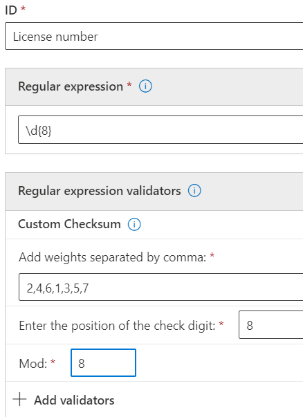
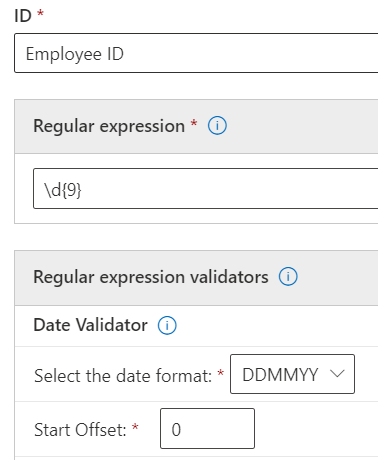

# Get started with custom sensitive information types

If the pre-configured sensitive information types don't meet your needs, you can create your own custom sensitive information types that you fully define or you can copy one of the pre-configured ones and modify it.

The custom sensitive information types that you create by using this method are added to the rule package named `Microsoft.SCCManaged.CustomRulePack`.

There are two ways to create a new sensitive information type:

- [from scratch where you fully define all elements](#create-a-custom-sensitive-information-type)
- [copy and modify an existing sensitive information type](#copy-and-modify-a-sensitive-information-type)

## Before you begin

- You should be familiar with sensitive information types and what they are composed of. See, [Learn about sensitive information types](sensitive-information-type-learn-about.md). It is critical to understand the roles of:
    - [regular expressions](https://www.boost.org/doc/libs/1_68_0/libs/regex/doc/html/) - Microsoft 365 sensitive information types uses the Boost.RegEx 5.1.3 engine
    - keyword lists - you can create your own as you define your sensitive information type or choose from existing keyword lists
    - [keyword dictionary](create-a-keyword-dictionary.md)
    - [functions](what-the-dlp-functions-look-for.md)
    - [confidence levels](sensitive-information-type-learn-about.md#more-on-confidence-levels)
 
- You must have Global admin or Compliance admin permissions to create, test, and deploy a custom sensitive information type through the UI. See [About admin roles](/office365/admin/add-users/about-admin-roles?view=o365-worldwide) in Office 365.

- Your organization must have a subscription, such as Office 365 Enterprise, that includes Data Loss Prevention (DLP). See [Messaging Policy and Compliance ServiceDescription](/office365/servicedescriptions/exchange-online-protection-service-description/messaging-policy-and-compliance-servicedesc). 

> [!IMPORTANT]
> Microsoft Customer Service & Support can't assist with creating custom classifications or regular expression patterns. Support engineers can provide limited support for the feature, such as, providing sample regular expression patterns for testing purposes, or assisting with troubleshooting an existing regular expression pattern that's not triggering as expected, but can't provide assurances that any custom content-matching development will fulfill your requirements or obligations.

## Create a custom sensitive information type

Use this procedure to create a new sensitive information type that you fully define. 

1. In the Compliance Center, go to **Data classification** \> **Sensitive info types** and choose **Create info type**.
2. Fill in values for **Name** and **Description** and choose **Next**.
3. Choose **Create pattern**. You can create multiple patterns, each with different elements and confidence levels, as you define your new sensitive information type.
4. Choose the default confidence level for the pattern. The values are **Low confidence**, **Medium confidence**, and **High confidence**.
5. Choose and define **Primary element**. The primary element can be a **Regular expression** with an optional validator, a **Keyword list**, a **Keyword dictionary**, or one of the pre-configured **Functions**. For more information on DLP functions, see [What the DLP functions look for](what-the-dlp-functions-look-for.md). For more information on the date and the checksum validators, see [More information on regular expression validators](#more-information-on-regular-expression-validators).
6. Fill in a value for **Character proximity**.
7. (Optional) Add supporting elements if you have any. Supporting elements can be a regular expression with an optional validator, a keyword list, a keyword dictionary or one of the pre-defined functions. Supporting elements can have their own **Character proximity** configuration. 
8. (Optional) Add any [**additional checks**](#more-information-on-additional-checks) from the list of available checks.
9. Choose **Create**.
10. Choose **Next**.
11. Choose the **recommended confidence level** for this sensitive information type.
12. Check your setting and choose **Submit**.

> [!IMPORTANT]
> Microsoft 365 uses the search crawler to identify and classify sensitive information in SharePoint Online and OneDrive for Business sites. To identify your new custom sensitive information type in existing content, the content must be re-crawled. Content is crawled based on a schedule, but you can manually re-crawl content for a site collection, list, or library. For more information, see [Manually request crawling and re-indexing of a site, a library or a list](/sharepoint/crawl-site-content).

13. On the **Data classification** page, you'll see all the sensitive information types listed. Choose **Refresh** and then browse for or use the search tool to find the sensitive information type you created.

## Test a sensitive information type

You can test any sensitive information type in the list. We suggest that you test every sensitive information type that you create before using it in a policy.

1. Prepare two files, like a Word document. One with content that matches the elements you specified in your sensitive information type and one that doesn't match.
2. In the Compliance Center, go to **Data classification** \> **Sensitive info types** and choose the sensitive information type from the list to open the details pane and choose **Test**.
3. Upload a file and choose **Test**.
4. On the **Matches results** page, review the results and choose **Finish**.

## Modify custom sensitive information types in the Compliance Center

1. In the Compliance Center, go to **Data classification** \> **Sensitive info types** and choose the sensitive information type from the list that you want to modify choose **Edit**.
2. You can add other patterns, with unique primary and supporting elements, confidence levels, character proximity, and [**additional checks**](#more-information-on-additional-checks) or edit/remove the existing ones.

## Remove custom sensitive information types in the Compliance Center 

> [!NOTE]
> You can only remove custom sensitive information types; you can't remove built-in sensitive information types.

> [!IMPORTANT]
> Before your remove a custom sensitive information type, verify that no DLP policies or Exchange mail flow rules (also known as transport rules) still reference the sensitive information type.

1. In the Compliance Center, go to **Data classification** \> **Sensitive info types** and choose the sensitive information type from the list that you want to remove.
2. In the fly-out that opens, choose **Delete**.

## Copy and modify a sensitive information type

Use this procedure to create a new sensitive information type that is based on an existing sensitive information type. 

1. In the Compliance Center, go to **Data classification** \> **Sensitive info types** and choose the sensitive information type that you want to copy.
2. In the flyout, choose **Copy**.
3. Choose **Refresh** in the list of sensitive information types and either browse or search for the copy you just made. Partial sting searches work, so you could just search for `copy` and search would return all the sensitive information types with the word `copy` in the name. 
4. Fill in values for **Name** and **Description** and choose **Next**.
5. Choose your sensitive information type copy and choose **Edit**. 
6. Give your new sensitive information type a new **Name** and **Description**.
7. You can choose to edit or remove the existing patterns and add new ones. Choose the default confidence level for the new pattern. The values are **Low confidence**, **Medium confidence**, and **High confidence**.
8. Choose and define **Primary element**. The primary element can be a **Regular expression**, a **Keyword list**, a **Keyword dictionary**, or one of the pre-configured **Functions**. See, [What the DLP functions look for](what-the-dlp-functions-look-for.md).
9. Fill in a value for **Character proximity**.
10. (Optional) If you have **Supporting elements** or any [**Additional checks**](#more-information-on-additional-checks) add them. If needed you can group your **Supporting elements**.
11. Choose **Create**.
12. Choose **Next**.
13. Choose the **recommended confidence level** for this sensitive information type.
14. Check your setting and choose **Submit**.

You can also create custom sensitive information types by using PowerShell and Exact Data Match capabilities. To learn more about those methods, see:
- [Create a custom sensitive information type in Security & Compliance Center PowerShell](create-a-custom-sensitive-information-type-in-scc-powershell.md)
- [Create a custom sensitive information type for DLP with Exact Data Match (EDM)](create-custom-sensitive-information-types-with-exact-data-match-based-classification.md)

## More information on regular expression validators

### Checksum validator

If you need to run a checksum on a digit in a regular expression, you can use the *checksum validator*. For example, say you need to create a SIT for an eight license number where the last digit is a checksum digit that is validated using a mod 9 calculation. You've set up the checksum algorithm like this:
 
Sum = digit 1 * Weight 1 + digit 2 * weight 2 + digit 3 * weight 3 + digit 4 * weight 4 + digit 5 * weight 5 + digit 6 * weight 6 + digit 7 * weight 7 + digit 8 * weight 8 
Mod value = Sum % 9
If Mod value == digit 8
	Account number is valid
If Mod value != digit 8
	Account number is invalid

1. Define the primary element with this regular expression:

`\d{8}`

2. Then add the checksum validator.
3. Add the weight values separated by commas, the position of the check digit and the Mod value. For more information on the Modulo operation, see [Modulo operation](https://en.wikipedia.org/wiki/Modulo_operation).

> [!NOTE]
> If the check digit is not part of the checksum calculation then use 0 as the weight for the check digit. For example, in the above case weight 8 will be equal to 0 if the check digit is not to be used for calculating the check digit.  Modulo_operation).

### Date validator

If a date value that is embedded in regular expression is part of a new pattern you are creating, you can use the *date validator* to test that it meets your criteria. For example, say you want to create a SIT for a nine digit employee identification number. The first six digits are the date of hire in DDMMYY format and the last three are randomly generated numbers. To validate that the first six digits are in the correct format. 

1. Define the primary element with this regular expression:

`\d{9}`

2. Then add the date validator.
3. Select the date format and the start offset. Since the date string is the first six digits, the offset is `0`.

### Functional processors as validators

You can use function processors for some of the most commonly used SITs as validators. This allows you to define your own regular expression while ensuring they pass the additional checks required by the SIT. For example, Func_India_Aadhar will ensure that the custom regular expression defined by you passes the validation logic required for Indian Aadhar card. For more information on DLP functions that can be used as validators, see [What the DLP functions look for](what-the-dlp-functions-look-for.md#what-the-dlp-functions-look-for). 

### Luhn check validator

You can use the Luhn check validator if you have a custom Sensitive information type that includes a regular expression which should pass the [Luhn algorithm](https://en.wikipedia.org/wiki/Luhn_algorithm).

## More information on additional checks

Here are the definitions and some examples for the available additional checks.

**Exclude specific matches**: This check lets you define keywords to exclude when detecting matches for the pattern you are editing. For example, you might exclude test credit card numbers like '4111111111111111' so that they're not matched as a valid number.

**Starts or doesn't start with characters**: This check lets you define the characters that the matched items must or must not start with. For example, if you want the pattern to detect only credit card numbers that start with 41, 42, or 43, select **Starts with** and add 41, 42, and 43 to the list, separated by commas. 

**Ends or doesn't end with characters**: This check lets you define the characters that the matched items must or must not end with. For example, if your Employee ID number cannot end with 0 or 1, select **Doesn't end with** and add 0 and 1 to the list, separated by commas.

**Exclude duplicate characters**: This check lets you ignore matches in which all the digits are the same. For example, if the six digit employee ID number cannot have all the digits be the same, you can select **Exclude duplicate characters** to exclude 111111, 222222, 333333, 444444, 555555, 666666, 777777, 888888, 999999, and 000000 from the list of valid matches for the employee ID.

**Include or exclude prefixes**: This check lets you define the keywords that must or must not be found immediately before the matching entity. Depending on your selection, entities will be matched or not matched if they're preceded by the prefixes you include here. For example, if you **Exclude** the prefix **GUID:**, any entity that's preceded by **GUID:** won't be considered a match.

**Include or exclude suffixes** This check lets you define the keywords that must or must not be found immediately after the matching entity. Depending on your selection, entities will be matched or not matched if they're followed by the suffixes you include here. For example, if you **Exclude** the suffix **:GUID**, any text that's followed by **:GUID** won't be matched.

> [!NOTE]
> Microsoft 365 Information Protection supports, in preview, double byte character set languages for:
> - Chinese (simplified)
> - Chinese (traditional)
> - Korean
> - Japanese
>
>This support is available for sensitive information types. See, [Information protection support for double byte character sets release notes (preview)](mip-dbcs-relnotes.md) for more information.