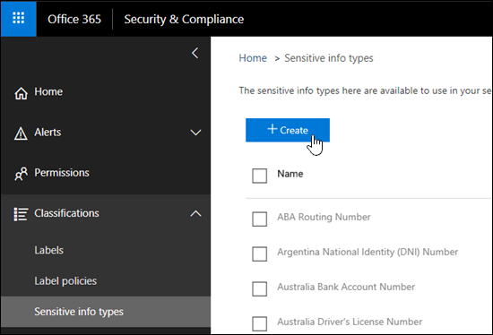
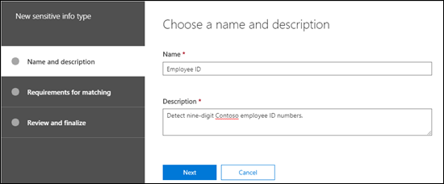
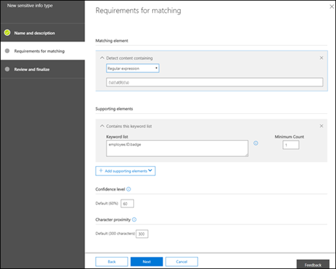
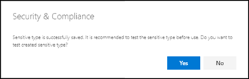
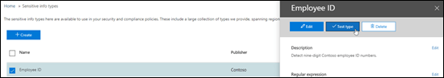
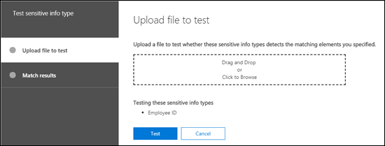
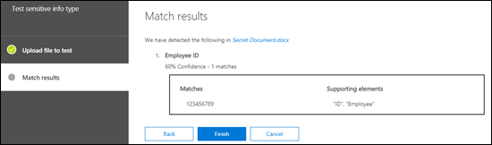

<!-- rename md file to match the display name -->
# Create a custom sensitive information type in the Security & Compliance Center

Read this article to create a custom sensitive information type in the Security & Compliance Center ([https://protection.office.com](https://protection.office.com)). The custom sensitive information types that you create by using this method are added to the rule package named `Microsoft.SCCManaged.CustomRulePack`.

You can also create custom sensitive information types by using PowerShell and Exact Data Match capabilities. To learn more about those methods, see:
- [Create a custom sensitive information type in Security & Compliance Center PowerShell](create-a-custom-sensitive-information-type-in-scc-powershell.md)
- [Create a custom sensitive information type for DLP with Exact Data Match (EDM)](create-custom-sensitive-information-types-with-exact-data-match-based-classification.md)

> [!NOTE]
> Microsoft 365 Information Protection now  supports in preview double byte character set languages for:
> - Chinese (simplified)
> - Chinese (traditional)
> - Korean
> - Japanese
>
>This support is available for sensitive information types. See, [Information protection support for double byte character sets release notes (preview)](mip-dbcs-relnotes.md) for more information.

## Before you begin

> [!NOTE]
> You should have Global admin or Compliance admin permissions to create, test, and deploy a custom sensitive information type through the UI. See [About admin roles](https://docs.microsoft.com/office365/admin/add-users/about-admin-roles?view=o365-worldwide) in Office 365.

- Your organization must have a subscription, such as Office 365 Enterprise, that includes Data Loss Prevention (DLP). See [Messaging Policy and Compliance ServiceDescription](https://docs.microsoft.com/office365/servicedescriptions/exchange-online-protection-service-description/messaging-policy-and-compliance-servicedesc). 

- Custom sensitive information types require familiarity with regular expressions (RegEx). For more information about the Boost.RegEx (formerly known as RegEx++) engine that's used for processing the text, see [Boost.Regex 5.1.3](https://www.boost.org/doc/libs/1_68_0/libs/regex/doc/html/).

  Microsoft Customer Service & Support can't assist with creating custom classifications or regular expression patterns. Support engineers can provide limited support for the feature, such as, providing sample regular expression patterns for testing purposes, or assisting with troubleshooting an existing regular expression pattern that's not triggering as expected, but can't provide assurances that any custom content-matching development will fulfill your requirements or obligations.

- DLP uses the search crawler to identify and classify sensitive information in SharePoint Online and OneDrive for Business sites. To identify your new custom sensitive information type in existing content, the content must be re-crawled. Content is crawled based on a schedule, but you can manually re-crawl content for a site collection, list, or library. For more information, see [Manually request crawling and re-indexing of a site, a library or a list](https://docs.microsoft.com/sharepoint/crawl-site-content).

## Create custom sensitive information types in the Security & Compliance Center

In the Security & Compliance Center, go to **Classifications** \> **Sensitive info types** and click **Create**.

The settings are fairly self-evident, and are explained on the associate page of the wizard:

- **Name**

- **Description**

- **Proximity**

- **Confidence level**

- **Primary pattern element** (keywords, regular expression, or dictionary)

- Optional **Supporting pattern elements** (keywords, regular expression, or dictionary) and a corresponding **Minimum cost** value.

Here's a scenario: You want a custom sensitive information type that detects 9-digit employee numbers in content, along with the keywords "employee" "ID" and "badge". To create this custom sensitive information type, do the following steps:

1. In the Security & Compliance Center, go to **Classifications** \> **Sensitive info types** and click **Create**.

    

2. In the **Choose a name and description** page that opens, enter the following values:

  - **Name**: Employee ID.

  - **Description**: Detect nine-digit Contoso employee ID numbers.

    

    When you're finished, click **Next**.

3. In the **Requirements for matching** page that opens, click **Add an element** configure the following settings:

    - **Detect content containing**:
 
      a. Click **Any of these** and select **Regular expression**.

      b. In the regular expression box, enter `(\s)(\d{9})(\s)` (nine-digit numbers surrounded by white space).
  
    - **Supporting elements**: Click **Add supporting elements** and select **Contains this keyword list**.

    - In the **Contains this keyword list** area that appears, configure the following settings:

      - **Keyword list**: Enter the following value: employee,ID,badge.

      - **Minimum count**: Leave the default value 1.

    - Leave the default **Confidence level** value 60. 

    - Leave the default **Character proximity** value 300.

    

    When you're finished, click **Next**.

4. On the **Review and finalize** page that opens, review the settings and click **Finish**.

    

5. The next page encourages you to test the new custom sensitive information type by clicking **Yes**. For more information, see [Test custom sensitive information types in the Security & Compliance Center](#test-custom-sensitive-information-types-in-the-security--compliance-center). To test the rule later, click **No**.

    

### How do you know this worked?

To verify that you've successfully created a new sensitive information type, do any of the following steps:

  - Go to **Classifications** \> **Sensitive info types** and verify the new custom sensitive information type is listed.

  - Test the new custom sensitive information type. For more information, see [Test custom sensitive information types in the Security & Compliance Center](#test-custom-sensitive-information-types-in-the-security--compliance-center).

## Modify custom sensitive information types in the Security & Compliance Center

**Notes**:
<!-- check to see if this note contradicts the guidance in "customize a built in sensitive information type customize-a-built-in-sensitive-information-type it sure seems like it does-->
- You can only modify custom sensitive information types; you can't modify built-in sensitive information types. But you can use PowerShell to export built-in custom sensitive information types, customize them, and import them as custom sensitive information types. For more information, see [Customize a built-in sensitive information type](customize-a-built-in-sensitive-information-type.md).

- You can only modify custom sensitive information types that you created in the UI. If you used the [PowerShell procedure](create-a-custom-sensitive-information-type-in-scc-powershell.md) to import a custom sensitive information type rule package, you'll get an error.

In the Security & Compliance Center, go to **Classifications** \> **Sensitive info types**, select the custom sensitive information type that you want to modify, and then click **Edit**.

  

The same options are available here as when you created the custom sensitive information type in the Security & Compliance Center. For more information, see [Create custom sensitive information types in the Security & Compliance Center](#create-custom-sensitive-information-types-in-the-security--compliance-center).

### How do you know this worked?

To verify that you've successfully modified a sensitive information type, do any of the following steps:

  - Go to **Classifications** \> **Sensitive info types** to verify the properties of the modified custom sensitive information type. 

  - Test the modified custom sensitive information type. For more information, see [Test custom sensitive information types in the Security & Compliance Center](#test-custom-sensitive-information-types-in-the-security--compliance-center).

## Remove custom sensitive information types in the Security & Compliance Center 

**Notes**:

- You can only remove custom sensitive information types; you can't remove built-in sensitive information types.

- Before your remove a custom sensitive information type, verify that no DLP policies or Exchange mail flow rules (also known as transport rules) still reference the sensitive information type.

1. In the Security & Compliance Center, go to **Classifications** \> **Sensitive info types** and select one or more custom sensitive information types that you want to remove.

2. In the fly-out that opens, click **Delete** (or **Delete sensitive info types** if you selected more than one).

    

3. In the warning message that appears, click **Yes**.

### How do you know this worked?

To verify that you've successfully removed a custom sensitive information type, go to **Classifications** \> **Sensitive info types** to verify the custom sensitive information type is no longer listed.

## Test custom sensitive information types in the Security & Compliance Center

1. In the Security & Compliance Center, go to **Classifications** \> **Sensitive info types**.

2. Select one or more custom sensitive information types to test. In the fly-out that opens, click **Test type** (or **Test sensitive info types** if you selected more than one).

    

3. On the **Upload file to test** page that opens, upload a document to test by dragging and dropping a file or by clicking **Browse** and selecting a file.

    

4. Click the **Test** button to test the document for pattern matches in the file.

5. On the **Match results** page, click **Finish**.

    
