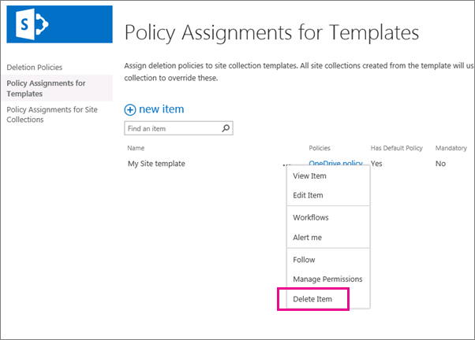
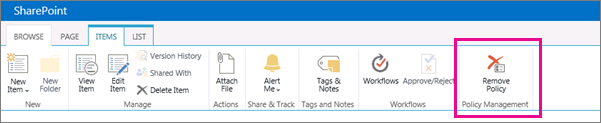

# Create a document deletion policy

> [!IMPORTANT]
> Moving forward, we recommend that you use a retention policy or retention labels created in the Microsoft 365 compliance center, Microsoft 365 security center, or Office 365 Security &amp; Compliance Center instead of a document deletion policy. Document deletion policies will continue to work side by side with retention policies, but if you need to retain or delete content anywhere in Office 365, we recommend that you use a retention policy. For more information, see [Use a retention policy instead of these features](retention-policies.md#use-a-retention-policy-instead-of-these-features). 
  
Organizations are often required to retain documents for a certain period of time due to compliance, legal, or other regulations. However, retaining documents for longer than required can expose the organization to legal risk.
  
With a document deletion policy, you can proactively reduce risk by deleting documents in a site after a specific period of time—for example, you can delete documents in users' OneDrive for Business sites five years after the documents were created. 
  
After you create a document deletion policy, you can assign it to a site collection template, so that the policy is available to all site collections created from that template. You can also assign a policy to a specific a site collection, which overrides any policies that may have been assigned to the template for that site collection.
  

  
## Policy templates

You can create a document deletion policy from scratch, or you can use one of the sample policies. The Compliance Policy Center includes sample policies that you can use as is, or you can use them as a starting point and then rename or modify them.
  

  
## Examples of how to use document deletion policies

A site collection or a site collection template can have one more policies assigned to it, and each of those policies can have one or more rules. However, there can be only one policy that's active per site, and there can be only one deletion rule that's active at any time for the libraries within the site.
  

  
In addition, you can select a policy as mandatory or default, and you can select a deletion rule as a default rule: 
  
- **Mandatory policy**When a policy is marked as mandatory, only one policy can be assigned to the site collection or template. The policy must be marked as default and will be applied to all sites. Site owners cannot opt out of the policy.
    
- **Default policy**When a policy is set as default, the policy is automatically active in all sites that it's assigned to with no action required by site owner.
    
- **Default rule**When a deletion rule is set as default, it is automatically applied to all libraries in the sites that use the policy.
    
The following examples explain when you might want to use a mandatory policy or default policies and rules.
  
### Example 1: Apply a single policy with a single rule to a site collection template

You may want to enforce a document deletion policy across a broad range of unstructured content, such as all OneDrive for Business sites or all team sites. If you want to ensure that a single document deletion policy is active in all sites created from a site collection template, you can:
  
1. Create a single policy with a single default deletion rule.
    
2. Set the policy as mandatory and default.
    
3. Assign the policy to a site collection template.
    
In this example, the default deletion rule will be applied to all libraries in all site collections created from the template, and site owners cannot opt out of the policy. This is the simplest way to broadly and rigidly enforce a document deletion policy.
  

  
### Example 2: Apply a single policy with several rules to a site collection template

Site owners often know best what type of content their site contains, so you may choose to allow site owners to select the deletion rule that best applies to their site. You may also want to allow site owners to opt out of a policy entirely.
  
At the same time, you can still centrally create and manage the policies. You can also select one policy and rule as the default, so that a policy is always in effect until the site owner chooses a different one or opts out. If you want to provide such flexibility to site owners, you can:
  
1. Create a single policy with several deletion rules, and set one rule as the default.
    
2. Set the policy as the default policy.
    
3. Assign the policy to a site collection template.
    
Site owners can select one of the alternate deletion rules, opt out of the policy, or do nothing and be subject to the default policy and rule.
  

  
### Example 3: Apply several policies with one or more rules to a site collection

This example provides the maximum flexibility to site owners because they can choose from several policies, and after selecting a policy they can often choose from several rules. One policy and rule are set as default, so that a policy is always in effect until the site owner chooses a different one or opts out. Note that if you do not set a policy and rule as the default, then no policies or rules will be active for the document libraries in the site until the site owner takes action to select and apply them.
  
Unlike the previous two examples, these policies are assigned to a specific site collection — not the site collection template. This means the policies can be more specifically tailored for the content in a specific site collection.
  
Policies and rules are inherited. Site owners can select a policy and rule for their site, and all subsites inherit the policy from the parent. However, an owner of a subsite can break inheritance by selecting a different policy and rule, which in turn applies to all subsites until inheritance is broken again.
  
To set up this scenario, you can:
  
1. Create several policies that each contains one or more rules.
    
2. Set a policy and rule as the default.
    
3. Assign the policies to a specific site collection.
    
In addition, the policies and rules are tailored to a specific site collection, where site owners can break inheritance by selecting the policy and rule that best applies to their site.
  

  
## Create a document deletion policy

1. In the Office 365Security &amp; Compliance Center, navigate to **Data management** \> **Retention**. Under **Delete**, click **Manage document deletion policies for SharePoint Online and OneDrive for Business**. The Document Deletion Policy Center opens in a new browser tab.
    
    The first time you navigate from the Security &amp; Compliance Center to the Document Deletion Policy Center, the policy center is automatically created for you. Alternatively, you can manually create the policy center by [creating the site collection](https://go.microsoft.com/fwlink/p/?LinkID=404342) and choosing **Compliance Policy Center** on the **Enterprise** tab. 
    
2. Choose **Deletion Policies**.
    
    
  
3. Choose **new item**.
    
4. Enter a policy name and description. Site owners may be selecting a policy for their site based on this name and description, so include enough information for them to choose the correct policy.
    
5. To create a rule, choose **New**.
    
6. Enter a name and choose the following options:
    
  - Choose whether the rule will permanently delete documents or delete them to the Recycle Bin. The Recycle Bin provides a second-stage safety net before an item is permanently deleted from a site. For more information about the Recycle Bin, see [Empty the Recycle Bin or restore your files](https://go.microsoft.com/fwlink/p/?LinkID=404348).
    
  - Choose whether the deletion date is calculated from the date when a document was created or last modified.
    
  - Enter a number of days, months, or years as the time period after which a document will be deleted.
    
  - Choose whether the rule is a default rule. The first rule that you create is automatically set as the default rule. A default rule is automatically applied to all libraries in the sites that use the policy.
    

  
7. Click **Save**.
    
8. Create additional rules if you want site owners to be able to choose different rules to apply to their site. The default rule, if any, will be applied if the site owner takes no action.
    
9. To remove a rule from a policy, select the rule, click **Delete**, and then click **OK**.
    
    > [!NOTE]
    > If you delete a rule, and the policy does not contain a default rule, then no rule will be in effect for that policy—in other words, no documents will be deleted. 
  

  
## Assign the document deletion policy to a site collection template

By assigning a policy to a site collection template, you make the policy available to all site collections created from that template, including both existing site collections and site collections created in the future.
  
It's important to understand that the time period specified for a document deletion policy means the time since the document was created or modified, not the time since the policy was assigned. When you assign the policy for the first time, all documents in the site are evaluated and, if they meet the criteria, they will be deleted. This applies to all existing documents, not just new documents created since the policy was assigned.
  
1. In the Security &amp; Compliance Center, navigate to **Data management** \> **Retention**. Under **Delete**, click **Manage document deletion policies for SharePoint Online and OneDrive for Business**. The Document Deletion Policy Center opens in a new browser tab.
    
2. Choose **Policy Assignments for Templates**.
    
    
  
3. Choose **new item**.
    
4. Do one of the following:
    
  - To assign the policy to a site collection template such as the Team Site template, select **Assign to site collection template**, and then select the site collection template.
    
  - To assign the policy to users' One Drive for Business, choose **Assign to OneDrive for Business Template**, highlighted below.
    
    > [!NOTE]
    > When you assign a policy to a site collection template, that policy will be available both to existing site collections created from that template and to site collections created in the future. 
  

  
5. Click **Save**.
    
    > [!NOTE]
    > Each template can have only one set of policies assigned to it. If you see an error saying that this template already has policies assigned to it, choose **Cancel** \> **Assign to Site Collection** in the left navigation \> select a site collection to view and manage the set of policies that are already assigned. 
  
6. Choose **Manage Assigned Policies**, select the policies that you want to assign, and then choose whether one policy is the default policy. When you set a default policy, all sites assigned to the policy automatically have the policy active with no action required by site owner.
    
    
  
7. Click **Save**.
    
8. If you want to enforce the policy on all sites without allowing site owners to opt out, choose **Mark Policy as Mandatory**. When you make a policy mandatory, only that single policy can be assigned to the site collection template. The policy must also be marked as default.
    
    If this option is grayed out, choose **Manage Assigned Policies** and make sure that at least one policy is assigned and set as default. 
    
9. Click **Save**.
    
## Assign the document deletion policy to a site collection

By assigning a policy to a specific site collection, you make the policy available only to that specific site collection. This means you can tailor policies more closely to the content in the site collection. Also, policies assigned to a specific site collection will override any policies that are assigned to the template for that site collection. For example, a policy assigned to the Sales Department site collection (created from the Team Site template) will override any policies assigned to the Team Site template.
  
It's important to understand that the time period specified for a document deletion policy means the time since the document was created or modified, not the time since the policy was assigned. When you assign the policy for the first time, all documents in the site are evaluated and, if they meet the criteria, they will be deleted. This applies to all existing documents, not just new documents created since the policy was assigned.
  
1. In the Security &amp; Compliance Center, navigate to **Data management** \> **Retention**. Under **Delete**, choose **Manage document deletion policies for SharePoint Online and OneDrive for Business**. The Document Deletion Policy Center opens in a new browser tab.
    
2. Choose **Policy Assignments for Site Collections**.
    
    
  
3. Choose **new item**.
    
4. Choose **Choose a site collection**. Search for the site collection by name or URL, select the site collection and click **Save**.
    
    > [!NOTE]
    > Each site collection can have only one set of policies assigned to it. If you see an error saying that this site collection already has policies assigned to it, choose **Cancel** \> **Assign to Site Collection** and select a site collection to view and manage the set of policies that are already assigned. 
  

  
5. Choose **Manage Assigned Policies**, select the policies that you want to assign, and then choose whether one policy is the default policy. When you set a default policy, all sites assigned to the policy automatically have the policy active with no action required by site owner.
    
    
  
6. Click **Save**.
    
7. If you want to enforce the policy on all sites without allowing site owners to opt out, choose **Mark Policy as Mandatory**. When you make a policy mandatory, only that single policy can be assigned to the site collection. The policy must also be marked as default.
    
    If this option is grayed out, choose **Manage Assigned Policies** and make sure that at least one policy is assigned and set as default. 
    
8. Click **Save**.
    
## Delete a policy assignment

When you delete an assignment, the assigned policies will no longer apply to any sites in the site collection or site collection template.
  
1. In the Security &amp; Compliance Center, navigate to **Data management** \> **Retention**. Under **Delete**, choose **Manage document deletion policies for SharePoint Online and OneDrive for Business**. The Document Deletion Policy Center opens in a new browser tab.
    
2. Choose either **Policy Assignments for Templates** or **Policy Assignments for Site Collections**.
    
3. Select the assignment item and click **Delete Item**.
    
    
  
## Delete a policy

You can't delete a policy that's in use. Before you can delete a policy, you first need to delete all assignments to site collections and site collection templates that include that policy—see the previous section.
  
1. In the Security &amp; Compliance Center \> choose **Data management** \> **Retention** in the left navigation \> under **Delete** \> **Manage document deletion policies for SharePoint Online and OneDrive for Business**. The Document Deletion Policy Center opens in a new browser tab.
    
2. Choose ** Deletion Policies **.
    
    
  
3. Select the policy.
    
4. On the Ribbon \> **Items** tab \> **Remove Policy**.
    
    
  
5. If the policy is in use, you'll be asked if you want to remove the policy from all of the site collections where it's being used. If you're sure, choose **OK**.
    
    
  
## See also

[Overview of document deletion policies](document-deletion-policies.md)

[Apply or remove a document deletion policy for a site](apply-or-remove-a-document-deletion-policy-for-a-site.md)
 

