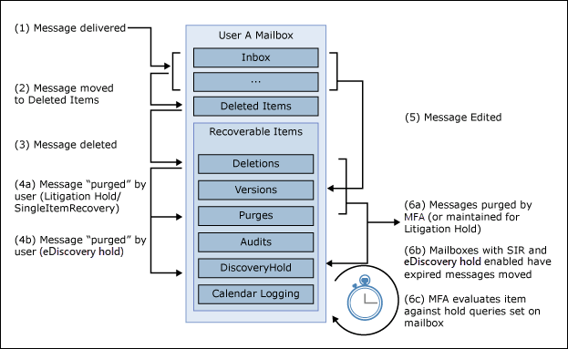

# Create a Litigation Hold

You can place a mailbox on Litigation Hold to retain all mailbox content, including deleted items and the original versions of modified items. When you place a user mailbox on Litigation Hold, content in the user's archive mailbox (if it's enabled) is also retained. When you create a hold, you can specify a hold duration (also called a *time-based hold*) so that deleted and modified items are retained for a specified period and then permanently deleted from the mailbox. Or you can just retain content indefinitely (called an *infinite hold*) or until the Litigation Hold is removed. If you do specify a hold duration period, it's calculated from the date a message is received or a mailbox item is created. 
  
Here's what happens when you create a Litigation Hold.
  
- Items that are permanently deleted by the user are retained in the Recoverable Items folder in the user's mailbox for the duration of the hold.

- Items that are purged from the Recoverable Items folder by the user are retained for the duration of the hold.

- The storage quota for the Recoverable Items folder is increased from 30 GB to 110 GB.

- Items in the user's primary and the archive mailboxes are retained

## Assign an Exchange Online Plan 2 license

To place an Exchange Online mailbox on Litigation Hold, it must be assigned an Exchange Online Plan 2 license. If a mailbox is assigned an Exchange Online Plan 1 license, you would have to assign it a separate Exchange Online Archiving license to place it on hold.

> [!NOTE]
> For Office 365 Education organizations, Litigation Hold is supported in Office 365 A1 subscriptions, which include an Exchange Online Plan 1 license with supplemental features. For more information, see the "Exchange Online features" section in the [Office 365 Education service description](/office365/servicedescriptions/office-365-platform-service-description/office-365-education#exchange-online-features).

## Place a mailbox on Litigation Hold

Here are the steps to place a mailbox on Litigation Hold using the Exchange admin center.

1. Go to [https://outlook.office.com/ecp](https://outlook.office.com/ecp) and sign in using your global administrator account.

2. Click **Recipients > Mailboxes** in the left navigation pane.

3. Select the mailbox that you want to place on Litigation Hold, and then click **Edit**.

4. On the mailbox properties page, click **Mailbox features**.
    
5. Under **Litigation hold: Disabled**, click **Enable** to place the mailbox on Litigation Hold.
    
6. On the **Litigation hold** page, enter the following optional information: 
    
    - **Litigation hold duration (days)** - Use this box to create a time-based hold and specify how long mailbox items are held when the mailbox is placed on Litigation Hold. The duration is calculated from the date a mailbox item is received or created. When the hold duration expires for a specific item, that item will no longer be preserved. If you leave this box blank, items are preserved indefinitely or until the hold is removed. Use days to specify the duration.
    
    - **Note** - Use this box to inform the user their mailbox is on Litigation Hold. The note will appear on the Account Information page in the user's mailbox if they're using Outlook 2010 or later. To access this page, users can click **File** in Outlook.
    
    - **URL** - Use this box to direct the user to a website for more information about Litigation Hold. This URL appears on the Account Information page in the user's mailbox if they are using Outlook 2010 or later. To access this page, users can click **File** in Outlook..

7. Click **Save** on the **Litigation hold** page, and then click **Save** on the mailbox properties page.

### Create a Litigation Hold using PowerShell

You can also create a Litigation Hold by running the following command in [Exchange Online PowerShell](/powershell/exchange/connect-to-exchange-online-powershell):

```powershell
Set-Mailbox <username> -LitigationHoldEnabled $true
```

The previous command preserves items indefinitely because the hold duration isn't specified. To create a time-based hold, using the following command:

```powershell
Set-Mailbox <username> -LitigationHoldEnabled $true -LitigationHoldDuration <number of days>
```

For more information, see [Set-Mailbox](/powershell/module/exchange/set-mailbox).

## How does Litigation Hold work?

In the normal deleted item workflow, a mailbox item is moved to the Deletions subfolder in the Recoverable Items folder when a user permanently deletes it (Shift + Delete) or deletes it from the Deleted Items folder. A deletion policy (which is a retention tag configured with a Delete retention action) also moves items to the Deletions subfolder when the retention period expires. When a user purges an item in the Recoverable Items folder or when the deleted item retention period expires for an item, it's moved to the Purges subfolder in the Recoverable Items folder and marked for permanent deletion. It will be purged from Exchange the next time the mailbox is processed by the Managed Folder Assistant (MFA).

When a mailbox is placed on Litigation Hold, items in the Purges subfolder are preserved for the hold duration specified by the Litigation Hold. The hold duration is calculated from the original date an item was received or created, and defines how long items in the Purges subfolder are held. When the hold duration expires for an item in the Purges subfolder, the item is marked for permanent deletion and will be purged from Exchange the next time the mailbox is processed by the MFA. If an indefinite hold is placed on a mailbox, items will never be purged from the Purges subfolder.

The following illustration shows the subfolders in the Recoverable Items folders and the hold workflow process.



> [!NOTE]
> If a hold associated with an eDiscovery case is placed on a mailbox, purged items are moved from the Deletions subfolder to the DiscoveryHolds subfolder and are preserved until the mailbox is released from the eDiscovery hold.
