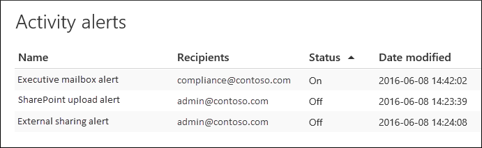

# Create activity alerts

You can create an activity alert that will send you an email notification when users perform specific activities in Office 365. Activity alerts are similar to searching for events in the audit log, except that you'll be sent an email message when an event for an activity that you've created an alert for happens.

 **Why use activity alerts instead of searching the audit log?** There might be certain kinds of activity or activity performed by specific users that you really want to know about. Instead of having to remember to search the audit log for those activities, you can use activity alerts to have Microsoft 365 send you an email message when users perform those activities. For example, you can create an activity alert to notify you when a user deletes files in SharePoint, or you can create an alert to notify you when a user permanently deletes messages from their mailbox. The email notification sent to you includes information about which activity was performed and the user who performed it.

> [!NOTE]
> Activity alerts are being deprecated. We recommend that you start using alert policies in the security and compliance center instead of creating new activity alerts. Alert policies provide additional functionality such as the ability to create an alert policy that triggers an alert when any user performs a specified activity, and displaying alerts on the **View alerts** page in the security and compliance center. For more information, see [Alert policies](alert-policies.md).

[!INCLUDE [purview-preview](../includes/purview-preview.md)]

## Confirm roles and configure audit logging

- You must be assigned the Organization Configuration role in the Microsoft Purview compliance portal to manage activity alerts. By default, this role is assigned to the Compliance Administrator and Organization Management role groups. For more information about adding members to role groups, see [Add users to a compliance role group](microsoft-365-compliance-center-permissions.md#add-users-to-a-compliance-role-group).

- You (or another admin) must first turn on audit logging for your organization before you can start using activity alerts. To do this, just click **Start recording user and admin activity** on the **Activity alerts** page. (If you don't see this link, auditing has already been turned on for your organization.) You can also turn on auditing on the **Audit log search** page in the compliance portal (go to **Audit**). You only have to do this once for your organization.

- You can create alerts for the same activities that you can search for in the audit log. See the [More information](#more-information) section for a list of common scenarios (and the specific activity to monitor) that you can create alerts for.

- You can use the **Activity alerts** page in the <a href="https://go.microsoft.com/fwlink/p/?linkid=2077149" target="_blank">compliance portal</a> to create alerts only for activity performed by users who are listed in your organization's address book. You can't use this page to create alerts for activities performed by external users who aren't listed in the address book.

## Create an activity alert

1. Go to <a href="https://go.microsoft.com/fwlink/p/?linkid=2077149" target="_blank">compliance portal</a>.

2. Sign in using your work or school account.

3. On the **Activity alerts** page, click  **New**.

   The flyout page to create an activity alert is displayed.

    

4. Complete the following fields to create an activity alert:

    1. **Name** - Type a name for the alert. Alert names must be unique within your organization.

    1. **Description** (Optional) - Describe the alert, such as the activities and users being tracked and the users that email notifications are sent to. Descriptions provide a quick and easy way to describe the purpose of the alert to other admins.

    1. **Alert type** - Make sure the **Custom** option is selected.

    1. **Send this alert when** - Click **Send this alert when** and then configure these two fields:

       - **Activities** - Click the drop-down list to display the activities that you can create an alert for. This is the same activities list that's displayed when you search the audit log. You can select one or more specific activities, or you can click the activity group name to select all activities in the group. For a description of these activities, see the "Audited activities" section in [Search the audit log](search-the-audit-log-in-security-and-compliance.md#audited-activities). When a user performs any of the activities that you've added to the alert, an email notification is sent.

       - **Users** - Click this box and then select one or more users. If the users in this box perform the activities that you added to the **Activities** box, an alert will be sent. Leave the **Users** box blank to send an alert when any user in your organization performs the activities specified by the alert.

    1. **Send this alert to** - Click **Send this alert**, and then click in the **Recipients** box and type a name to add users who will receive an email notification when a user (specified in the **Users** box) performs an activity (specified in the **Activities** box). Note that you are added to the list of recipients by default. You can remove your name from this list.

5. Click **Save** to create the alert.

    The new alert is displayed in the list on the **Activity alerts** page.

    

    The status of the alert is set to **On**. Note that the recipients who will receive an email notification when an alert is sent are also listed.

## Turn off an activity alert

You can turn off an activity alert so that an email notification isn't sent. After you turn off the activity alert, it's still displayed in the list of activity alerts for your organization, and you can still view its properties.

1. Go to <a href="https://go.microsoft.com/fwlink/p/?linkid=2077149" target="_blank">compliance portal</a>.

2. Sign in using your work or school account.

3. In the list of activity alerts for your organization, click the alert that you want to turn off.

4. On the **Edit alert** page, click the **On** toggle switch to change the status to **Off**, and then click **Save**.

    The status of the alert on the **Activity alerts** pages is set to **Off**.

To turn an activity alert back on, just repeat these steps and click the **Off** toggle switch to change the status to **On**.

## More information

- Here's an example of the email notification that is sent to the users that are specified in the Sent this alert to field (and listed under **Recipients** on the **Activity alerts** page) in the compliance portal.

    

- Here are some common document and email activities that you can create activity alerts for. The tables describe the activity, the name of the activity to create an alert for, and the name of the activity group that the activity is listed under in the **Activities** drop-down list. To see a complete list of the activities that you can create activity alerts for, see the "Audited activities" section in [Search the audit log](search-the-audit-log-in-security-and-compliance.md#audited-activities).

    > [!TIP]
    > You might want to create an activity alert for just one activity that's performed by any user. Or you might want to create an activity alert that tracks multiple activities performed by one or more users.

    The following table lists some common document-related activities in SharePoint or OneDrive for Business.

    | When a user does this... | Create an alert for this activity | Activity group |
    |:-----|:-----|:-----|
    |Views a document on a site.  |Accessed file  |File and folder activities  |
    |Edits or changes a document.  |Modified file  |File and folder activities  |
    |Shares a document with a user outside of your organization.  |Share file, folder, or site    And    Created sharing invitation    For more information, see [Use sharing auditing in the audit log](use-sharing-auditing.md).  |Sharing and access request activities  |
    |Uploads or downloads a document.  |Uploaded file    And/or    Downloaded file  |File and folder activities  |
    |Changes the access permissions to a site.  |Modified site permissions  |Site administration activities  |

    The following table lists some common email-related activities in Exchange Online.

    | When a user does this... | Create an alert for this activity | Activity group |
    |:-----|:-----|:-----|
    |Permanently deletes (purges) an email message from their mailbox.  |Purged messages from mailbox  | Exchange mailbox activities  |
    |Sends an email message from a shared mailbox.  |Sent message using Send As permissions    And    Sent message using Send On Behalf permissions  | Exchange mailbox activities  |

- You can also use the **New-ActivityAlert** and **Set-ActivityAlert** cmdlets in Security & Compliance PowerShell to create and edit activity alerts. Keep the following things in mind if you use these cmdlets to create or edit activity alerts:

  - If you use a cmdlet to add an activity to the alert that isn't listed in the **Activities** drop-down list, a message is displayed in on the property page for the alert that says, "This alert has custom operations not listed in the picker."

  - A good reason to use the cmdlets to create or edit an activity alert is to send email notifications to someone outside of your organization. This external user will be listed in the list of recipients for the alert. But if you remove this external user from the alert, that user can't be re-added to the alert by using the **Edit alert** page. You'll have to re-add the external user using the **Set-ActivityAlert** cmdlet, or use the **New-ActivityAlert** cmdlet to add the same (or different) external user to a new alert.
