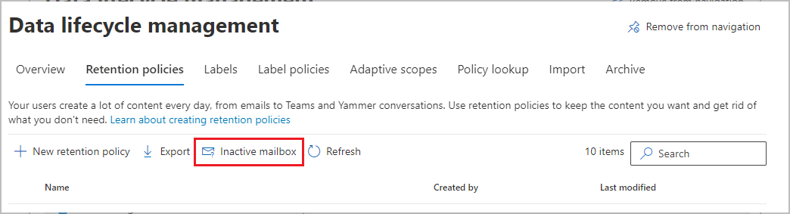

# Create and manage inactive mailboxes

>*[Microsoft 365 licensing guidance for security & compliance](/office365/servicedescriptions/microsoft-365-service-descriptions/microsoft-365-tenantlevel-services-licensing-guidance/microsoft-365-security-compliance-licensing-guidance).*

Inactive mailboxes let you retain former employees' email after they leave your organization and can be accessed by authorized people who have been granted [eDiscovery permissions](assign-ediscovery-permissions.md) for compliance or legal reasons. For example, administrators, compliance officers, and records managers who can then use Content Search to search and export the contents of an inactive mailbox. Inactive mailboxes can't receive email and aren't displayed in your organization's shared address book or other lists.

For more information about inactive mailboxes, see [Learn about inactive mailboxes](inactive-mailboxes-in-office-365.md).

## Create an inactive mailbox

Making a mailbox inactive requires a hold on the mailbox, and then deleting the mailbox or corresponding user account.

To make a mailbox inactive, it must be [licensed correctly](/office365/servicedescriptions/microsoft-365-service-descriptions/microsoft-365-tenantlevel-services-licensing-guidance/microsoft-365-security-compliance-licensing-guidance#email-archiving) so that a hold can be applied to the mailbox before it's deleted. After the user account is deleted, any Exchange Online license associated with the user account will be available to assign to a new user.

We recommend you use Microsoft 365 retention to apply the hold on the mailbox. Other methods are covered in [Learn about inactive mailboxes](inactive-mailboxes-in-office-365.md).

The best way to delete a mailbox is to delete the corresponding user account in the <a href="https://go.microsoft.com/fwlink/p/?linkid=2024339" target="_blank">Microsoft 365 admin center</a>. For information about deleting user accounts, see [Delete a user from your organization](../admin/add-users/delete-a-user.md). However, you can also delete the mailbox by using the **Remove-Mailbox** cmdlet in Exchange Online PowerShell. For more information, see [Delete or restore user mailboxes in Exchange Online](/exchange/recipients-in-exchange-online/delete-or-restore-mailboxes).

The following table summarizes the process of making an inactive mailbox for different retention scenarios.

<br/>

|To...|Do this...|Result|
|---|---|---|
|Retain mailbox content indefinitely after an employee leaves the organization|1. Apply Microsoft 365 retention settings with retain actions for the mailbox (a retention policy) or specific email items (one or more retention labels). <br /><br> 2. Wait for the retention settings to be applied. <br /><br> 3. Remove the user's Microsoft 365 account.|All content in the inactive mailbox that has retention settings applied, including items in the Recoverable Items folder, is retained indefinitely.|
|Retain all mailbox content for a specific period after an employee leaves the organization and then delete the mailbox|1. Apply a Microsoft 365 retention policy to the mailbox with retention settings that retain and then delete items when the retention period expires. <br /><br> 2. Wait for the retention settings to be applied. <br /><br> 3. Remove the user's Microsoft 365 account.|When the retention period for a mailbox item expires, the item is moved to the Recoverable Items folder and then it's permanently deleted (purged) from the inactive mailbox when the deleted item retention period (for Exchange mailboxes) expires. The retention period of the Microsoft 365 retention policy is always based on the original date a mailbox item was received or created.|


> [!NOTE]
> If Microsoft 365 retention settings that are configured to retain, or retain and then delete content, is already applied to the mailbox or mailbox items, or a Litigation hold is already placed on a mailbox, or then all you have to do to create an inactive mailbox is delete the corresponding user account.


## View a list of inactive mailboxes

To view a list of the inactive mailboxes in your organization:

1. Go to the <a href="https://go.microsoft.com/fwlink/p/?linkid=2077149" target="_blank">Microsoft Purview compliance portal</a> and sign in using the credentials for a Global administrator or a Compliance administrator account in your organization.

2. In the left navigation pane, select **Data lifecycle management** > **Microsoft 365** > **Retention policies**.

3. Select the **Inactive mailbox** option:

   

4. The **Inactive mailboxes** page displays a list of inactive mailboxes. Select one to see details about that inactive mailbox. Details include the Exchange identifier for the mailbox and whether it's on [Litigation Hold](create-a-litigation-hold.md).
    
    You won't see other types of holds in the details pane, for example a Microsoft 365 retention policy or eDiscovery hold. To find this information, see [How to identify the type of hold placed on an Exchange Online mailbox](identify-a-hold-on-an-exchange-online-mailbox.md).

If you have many inactive mailboxes, you might find it easier to search and sort a CSV file for the details you see in the list: On the **Inactive mailboxes** page, select :::image type="icon" source="../media/47205c65-babd-4b3a-bd7b-98dfd92883ba.png"::: **Export**.

Alternatively, you can run the following command in Exchange Online PowerShell to display the list of inactive mailboxes:

```powershell
 Get-Mailbox -InactiveMailboxOnly | FT DisplayName,PrimarySMTPAddress,WhenSoftDeleted
```

You can also run the following command to export the list of inactive mailboxes and other information to a CSV file. In this example, the CSV file is created in the current directory.

```powershell
Get-Mailbox -InactiveMailboxOnly | Select Displayname,PrimarySMTPAddress,DistinguishedName,ExchangeGuid,WhenSoftDeleted | Export-Csv InactiveMailboxes.csv -NoType
```

> [!NOTE]
> It's possible that an inactive mailbox might have the same SMTP address as an active user mailbox. In this case, the value of the **DistinguishedName** or **ExchangeGuid** property can be used to uniquely identify an inactive mailbox.
  
## Search and export the contents of an inactive mailbox

You can access the contents of the inactive mailbox by using the Content Search tool in the Microsoft Purview compliance portal. When you search an inactive mailbox, you can create a keyword search query to search for specific items or you can return the entire contents of the inactive mailbox. You can preview the search results or export the search results to an Outlook Data (PST) file or as individual email messages. For step-by-step procedures for searching mailboxes and exporting search results, see the following topics:
  
- [Content search](content-search.md)

- [Export search results](export-search-results.md)

Here are a few things to keep in mind when searching inactive mailboxes.
  
- If a content search includes a user mailbox and that mailbox is made inactive, the content search will continue to search the inactive mailbox when you rerun the search after it becomes inactive.

- In some cases, a user may have an active mailbox and an inactive mailbox that have the same SMTP address. In this case, only the specific mailbox that you select as a location for a content search will be searched. In other words, if you add a user's mailbox to a search, you can't assume that both their active and inactive mailboxes will be searched; only the mailbox that you explicitly add to the search will be searched.

- We strongly recommend that you avoid having an active mailbox and inactive mailbox with the same SMTP address. If you need to reuse the SMTP address that is currently assigned to an inactive mailbox, we recommend that you recover the inactive mailbox or restore the contents of an inactive mailbox to an active mailbox (or the archive of an active mailbox), and then delete the inactive mailbox.

## Change the hold duration for an inactive mailbox

After a mailbox is made inactive, you might be able to change the duration of the hold applied to the inactive mailbox.

For step-by-step procedures, see [Change the hold duration for an inactive mailbox](change-the-hold-duration-for-an-inactive-mailbox.md).
  
## Recover an inactive mailbox

If a former employee returns to your organization, or if a new employee is hired to take on the job responsibilities of the departed employee, you can recover the contents of the inactive mailbox. 

When you recover an inactive mailbox, the mailbox is converted to a new mailbox, the contents and folder structure of the inactive mailbox are retained, and the mailbox is linked to a new user account. After it's recovered, the inactive mailbox no longer exists. 

For step-by-step procedures and more information about happens when you recover an inactive mailbox, see [Recover an inactive mailbox](recover-an-inactive-mailbox.md).
  
## Restore the contents of an inactive mailbox to another mailbox

If another employee takes on the job responsibilities of a former employee, or if another person needs access to the contents of the inactive mailbox, you can restore (or merge) the contents of the inactive mailbox to an existing mailbox. 

When you restore an inactive mailbox, the contents are copied to another mailbox. The inactive mailbox is retained and remains an inactive mailbox. The inactive mailbox can still be searched using eDiscovery, its contents can be restored to another mailbox, or it can be recovered or deleted at a later date. 

For step-by-step procedures, see [Restore an inactive mailbox](restore-an-inactive-mailbox.md).
  
## Delete an inactive mailbox

If you no longer need to retain the contents of an inactive mailbox, you can permanently delete the inactive mailbox by removing the hold applied to the inactive mailbox. 
The mailbox will be retained for 183 days after you remove the hold or retention policy and be recoverable during that time. After 183 days, the mailbox will be marked for permanent deletion, and the mailbox will become non-recoverable. 

For step-by-step procedures for removing a hold or a retention policy to permanently delete an inactive mailbox, see [Delete an inactive mailbox](delete-an-inactive-mailbox.md).
